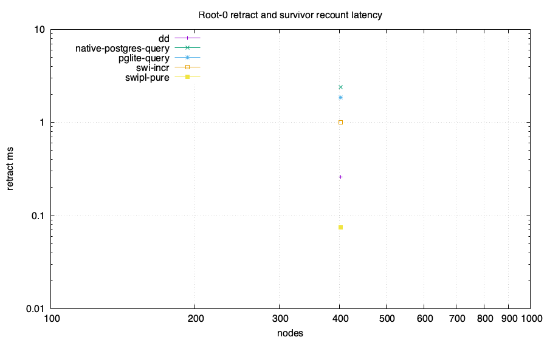
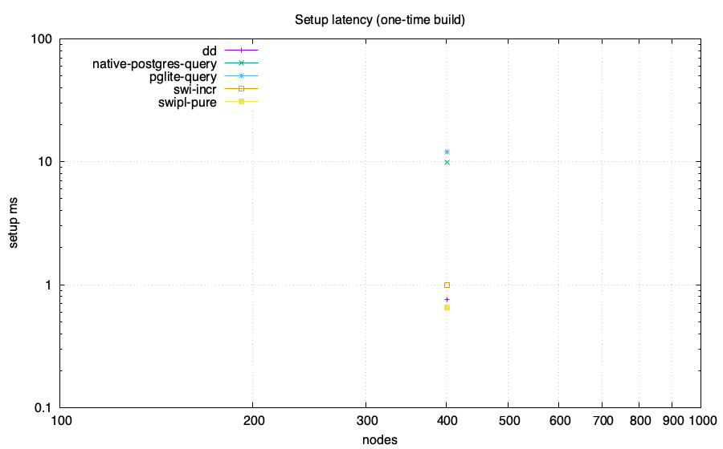
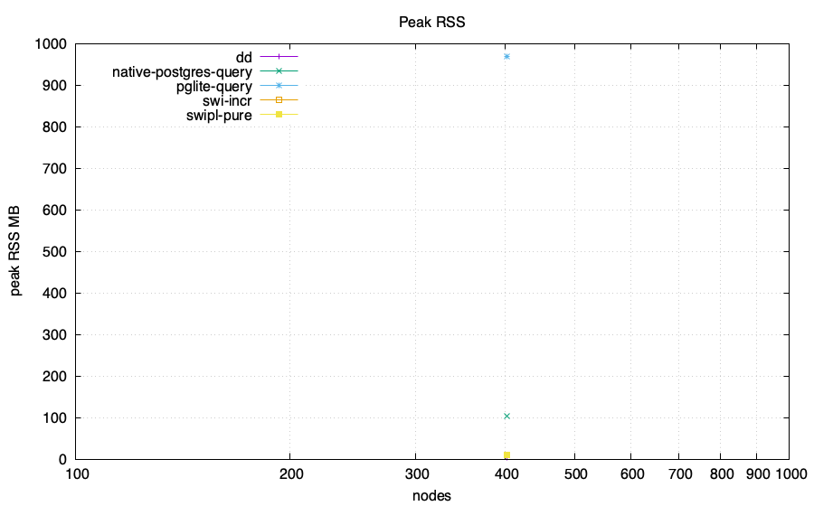
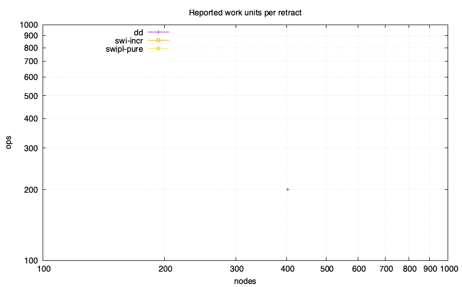

# Z-set / IVM head-to-head: feasibility lab

Same computation in every engine: reachability from roots {0,1} over a generated
DAG, then **retract root 0** and recount the survivor set. The PostgreSQL-family
numeric arms compare complete ordered results with an independent BFS oracle
before emitting CSV. Only the root retraction and survivor recount are the
measured operation; setup is reported separately. Requested memory budget:
4096 MB/run. Enforcement and accounting scope are adapter-specific and
recorded below.

Ordinary PostgreSQL and PGlite arms execute the recursive query from scratch
after the root deletion. Their timed phase ends after query materialization and
`count(*)`. Ordered full-result transfer, checksum, and exact validation are
recorded in the status receipt and excluded from `setup_ms` and
`retract_ms`. Their rows are full recomputation measurements.

The  arm is Differential Dataflow 0.25 over timely 0.31. Its setup and
retract phases end after fixed-point convergence and counting. Complete ordered
initial and survivor sets are checked against an independent BFS outside the
timed phases.

## Charts

## Data

| engine | nodes | edges | killed | setup ms | retract ms | ops | RSS MB | host peak MB | SQLite high-water MB | db MB |
|---|---:|---:|---:|---:|---:|---:|---:|---:|---:|---:|
| swi-incr | 402 | 667 | 200 | 1 | 1 | 0 | 9.91 | N/A | N/A | N/A |
| swipl-pure | 402 | 667 | 200 | 0.656000000000002 | 0.07499999999999868 | 0 | 9.5 | N/A | N/A | N/A |
| dd | 402 | 667 | 200 | 0.753 | 0.260 | 200 | 3.7 | N/A | N/A | N/A |
| pglite-query | 402 | 667 | 200 | 12.018 | 1.859 | N/A | 968.8 | N/A | N/A | 38.117 |
| native-postgres-query | 402 | 667 | 200 | 9.842 | 2.410 | N/A | 104.9 | N/A | N/A | 7.412 |

## Adapter status and measurement scope

| engine | scale | status | semantics or reason | memory scope | memory-limit scope |
|---|---|---|---|---|---|
| dd | 2x200 | ok | differential-dataflow 0.25 with timely 0.31; shared contiguous-node DAG; setup and retract end after fixed-point materialization and count; exact ordered sets match BFS oracle | process peak RSS from getrusage | DL_MEMCAP_MB=4096 requested through RLIMIT_AS; enforcement is best-effort and unverified |
| pglite-query | 2x200 | ok | ordinary recursive SQL full recomputation; timed phases end after materialization and count; exact before=ada7ea43e998e3ba1357b4270279f2976e2659c6e3dd768d0fbfc6a15cd11314 after=d290b0a93c2138767799bffe561de2bad1a45c0ffc8210a3be393f16eb7bc305; untimed transfer_ms before=0.977 after=0.474; untimed checksum_validation_ms before=0.644 after=0.091; PostgreSQL 18.3 | sampled RSS of the Node process containing PGlite WASM | DL_MEMCAP_MB=4096 limits Node old-space only; total process RSS is unenforced |
| native-postgres-query | 2x200 | ok | ordinary recursive SQL full recomputation; timed phases end after materialization and count; exact before=ada7ea43e998e3ba1357b4270279f2976e2659c6e3dd768d0fbfc6a15cd11314 after=d290b0a93c2138767799bffe561de2bad1a45c0ffc8210a3be393f16eb7bc305; untimed transfer_ms before=0.968 after=0.488; untimed checksum_validation_ms before=0.590 after=0.098; PostgreSQL 18.6 | sampled sum of Node client and disposable PostgreSQL process-tree RSS; shared mappings may be counted more than once | DL_MEMCAP_MB=4096 is unenforced for total PostgreSQL memory |
| pglite-pg_ivm | 2x200 | unsupported | pg_ivm rejects recursive WITH RECURSIVE view definitions | no process started | not applicable |
| native-postgres-pg_ivm | 2x200 | unsupported | pg_ivm rejects recursive WITH RECURSIVE view definitions | no process started | not applicable |

## Takeaways (derived)

- Largest scale reached by a numeric run: 402 nodes.
- No numeric arm emitted a WALL row at these scales.
- swi-sqlite retract statement count across all scales: {} (O(depth), not O(rows)).
