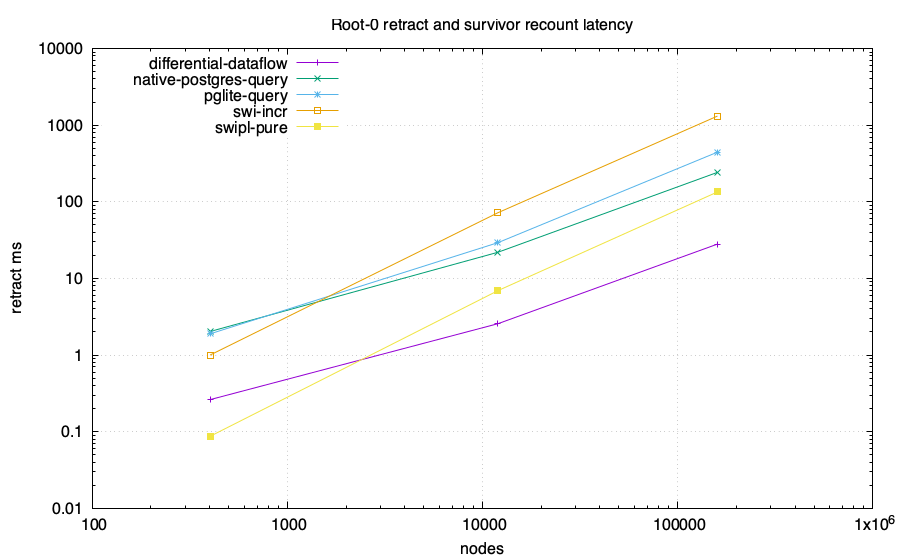
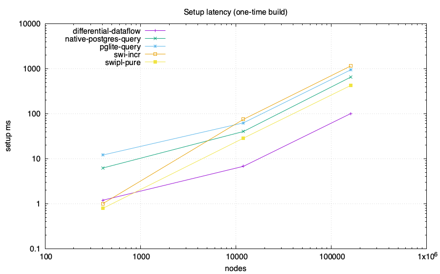
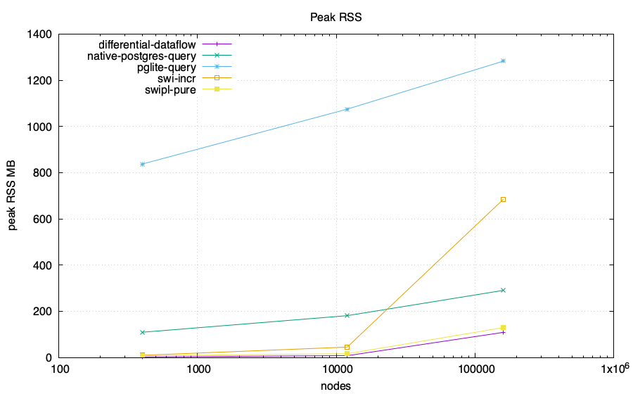
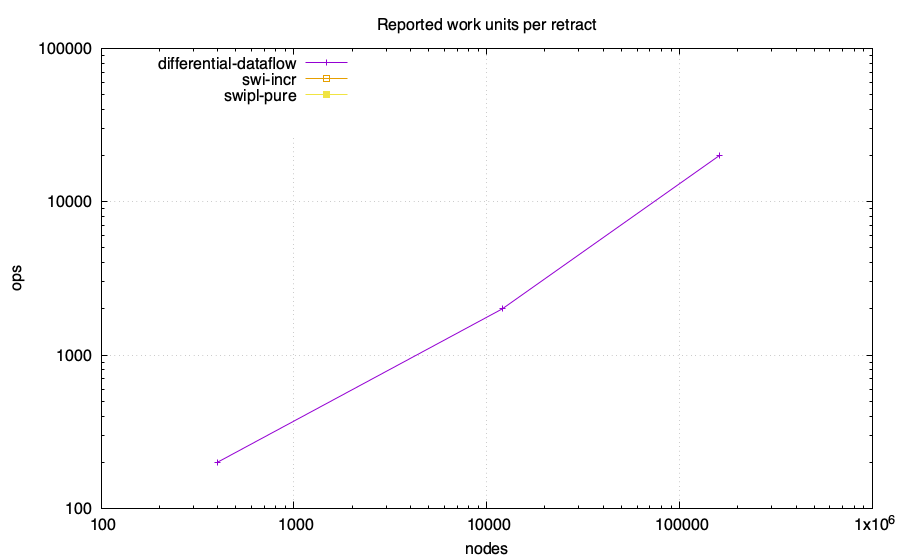

# Z-set / IVM head-to-head: feasibility lab

Same computation in every engine: reachability from roots {0,1} over a generated
DAG, then **retract root 0** and recount the survivor set. The PostgreSQL-family
numeric arms compare complete ordered results with an independent BFS oracle
before emitting CSV. Only the root retraction and survivor recount are the
measured operation; setup is reported separately. Requested memory budget:
4096 MB/run. Enforcement and accounting scope are adapter-specific and
recorded below.

Ordinary PostgreSQL and PGlite arms execute the recursive query from scratch
after the root deletion. Their timed phase ends after query materialization and
`count(*)`. Ordered full-result transfer, checksum, and exact validation are
recorded in the status receipt and excluded from `setup_ms` and
`retract_ms`. Their rows are full recomputation measurements.

The `differential-dataflow` arm is the native Differential Dataflow 0.25
library over timely 0.31. Its setup and retract phases end after fixed-point
convergence and counting. Complete ordered
initial and survivor sets are checked against an independent BFS outside the
timed phases.

## Charts

## Data

| engine | nodes | edges | killed | setup ms | retract ms | ops | RSS MB | host peak MB | SQLite high-water MB | db MB |
|---|---:|---:|---:|---:|---:|---:|---:|---:|---:|---:|
| swi-incr | 402 | 667 | 200 | 1 | 1 | 0 | 10.28 | N/A | N/A | N/A |
| swi-incr | 12002 | 22667 | 2000 | 75 | 72 | 0 | 45.61 | N/A | N/A | N/A |
| swi-incr | 160002 | 306667 | 20000 | 1153 | 1314 | 0 | 685.33 | N/A | N/A | N/A |
| swipl-pure | 402 | 667 | 200 | 0.7860000000000003 | 0.08700000000000027 | 0 | 8.5 | N/A | N/A | N/A |
| swipl-pure | 12002 | 22667 | 2000 | 28.637000000000004 | 6.931 | 0 | 16.8 | N/A | N/A | N/A |
| swipl-pure | 160002 | 306667 | 20000 | 425.51700000000005 | 134.42699999999996 | 0 | 130.1 | N/A | N/A | N/A |
| differential-dataflow | 402 | 667 | 200 | 1.195 | 0.262 | 200 | 3.2 | N/A | N/A | N/A |
| differential-dataflow | 12002 | 22667 | 2000 | 6.778 | 2.566 | 2000 | 8.5 | N/A | N/A | N/A |
| differential-dataflow | 160002 | 306667 | 20000 | 100.995 | 28.052 | 20000 | 109.4 | N/A | N/A | N/A |
| pglite-query | 402 | 667 | 200 | 12.065 | 1.891 | N/A | 838.0 | N/A | N/A | 38.117 |
| pglite-query | 12002 | 22667 | 2000 | 62.657 | 29.291 | N/A | 1075.5 | N/A | N/A | 39.274 |
| pglite-query | 160002 | 306667 | 20000 | 946.163 | 444.382 | N/A | 1283.2 | N/A | N/A | 70.274 |
| native-postgres-query | 402 | 667 | 200 | 6.206 | 2.029 | N/A | 109.9 | N/A | N/A | 7.412 |
| native-postgres-query | 12002 | 22667 | 2000 | 40.299 | 21.946 | N/A | 181.7 | N/A | N/A | 8.568 |
| native-postgres-query | 160002 | 306667 | 20000 | 652.225 | 242.209 | N/A | 291.2 | N/A | N/A | 23.568 |

## Adapter status and measurement scope

| engine | scale | status | semantics or reason | memory scope | memory-limit scope |
|---|---|---|---|---|---|
| swi-incr | 2x200 | ok | SWI incremental tabling; setup and retract end after table materialization and count; exact ordered initial set matches the generated node range and exact incremental survivor set matches cold table recomputation | process RSS sampled with ps after both phases | DL_MEMCAP_MB is passed by the harness but unenforced by this adapter |
| swi-incr | 6x2000 | ok | SWI incremental tabling; setup and retract end after table materialization and count; exact ordered initial set matches the generated node range and exact incremental survivor set matches cold table recomputation | process RSS sampled with ps after both phases | DL_MEMCAP_MB is passed by the harness but unenforced by this adapter |
| swi-incr | 8x20000 | ok | SWI incremental tabling; setup and retract end after table materialization and count; exact ordered initial set matches the generated node range and exact incremental survivor set matches cold table recomputation | process RSS sampled with ps after both phases | DL_MEMCAP_MB is passed by the harness but unenforced by this adapter |
| swipl-pure | 2x200 | ok | pure Prolog semi-naive fixed point; retract phase is full recomputation from root 1 and ends after complete sorted-set materialization and count | child-process peak RSS from /usr/bin/time -l | DL_MEMCAP_MB is passed by the harness but unenforced by this adapter |
| swipl-pure | 6x2000 | ok | pure Prolog semi-naive fixed point; retract phase is full recomputation from root 1 and ends after complete sorted-set materialization and count | child-process peak RSS from /usr/bin/time -l | DL_MEMCAP_MB is passed by the harness but unenforced by this adapter |
| swipl-pure | 8x20000 | ok | pure Prolog semi-naive fixed point; retract phase is full recomputation from root 1 and ends after complete sorted-set materialization and count | child-process peak RSS from /usr/bin/time -l | DL_MEMCAP_MB is passed by the harness but unenforced by this adapter |
| differential-dataflow | 2x200 | ok | differential-dataflow 0.25 with timely 0.31; shared contiguous-node DAG; setup and retract end after fixed-point materialization and count; exact ordered sets match BFS oracle | process peak RSS from getrusage | DL_MEMCAP_MB=4096 requested through RLIMIT_AS; enforcement is best-effort and unverified |
| differential-dataflow | 6x2000 | ok | differential-dataflow 0.25 with timely 0.31; shared contiguous-node DAG; setup and retract end after fixed-point materialization and count; exact ordered sets match BFS oracle | process peak RSS from getrusage | DL_MEMCAP_MB=4096 requested through RLIMIT_AS; enforcement is best-effort and unverified |
| differential-dataflow | 8x20000 | ok | differential-dataflow 0.25 with timely 0.31; shared contiguous-node DAG; setup and retract end after fixed-point materialization and count; exact ordered sets match BFS oracle | process peak RSS from getrusage | DL_MEMCAP_MB=4096 requested through RLIMIT_AS; enforcement is best-effort and unverified |
| pglite-query | 2x200 | ok | ordinary recursive SQL full recomputation; timed phases end after materialization and count; exact before=ada7ea43e998e3ba1357b4270279f2976e2659c6e3dd768d0fbfc6a15cd11314 after=d290b0a93c2138767799bffe561de2bad1a45c0ffc8210a3be393f16eb7bc305; untimed transfer_ms before=0.969 after=0.469; untimed checksum_validation_ms before=1.137 after=0.088; PostgreSQL 18.3 | sampled RSS of the Node process containing PGlite WASM | DL_MEMCAP_MB=4096 limits Node old-space only; total process RSS is unenforced |
| pglite-query | 6x2000 | ok | ordinary recursive SQL full recomputation; timed phases end after materialization and count; exact before=5359ff08f251a47ab81d104beeff9633f95d50c30ea2ff1db9d40617983ca17b after=e640e84f06cd3d340d290625432f23bf9cf4b9df50d6e4ae1ab7a73f216df46b; untimed transfer_ms before=15.947 after=11.821; untimed checksum_validation_ms before=3.807 after=1.976; PostgreSQL 18.3 | sampled RSS of the Node process containing PGlite WASM | DL_MEMCAP_MB=4096 limits Node old-space only; total process RSS is unenforced |
| pglite-query | 8x20000 | ok | ordinary recursive SQL full recomputation; timed phases end after materialization and count; exact before=d5b111c00b9de6c6acc308845af36202735166f81b10ef25547078a8e03fcd77 after=ba46515280fa0525997e4d27a81f4d2dfdb3f4445c1e54d0cc969e59cb068bf2; untimed transfer_ms before=212.501 after=172.610; untimed checksum_validation_ms before=27.746 after=24.941; PostgreSQL 18.3 | sampled RSS of the Node process containing PGlite WASM | DL_MEMCAP_MB=4096 limits Node old-space only; total process RSS is unenforced |
| native-postgres-query | 2x200 | ok | ordinary recursive SQL full recomputation; timed phases end after materialization and count; exact before=ada7ea43e998e3ba1357b4270279f2976e2659c6e3dd768d0fbfc6a15cd11314 after=d290b0a93c2138767799bffe561de2bad1a45c0ffc8210a3be393f16eb7bc305; untimed transfer_ms before=0.825 after=0.342; untimed checksum_validation_ms before=0.551 after=0.092; PostgreSQL 18.6 | sampled sum of Node client and disposable PostgreSQL process-tree RSS; shared mappings may be counted more than once | DL_MEMCAP_MB=4096 is unenforced for total PostgreSQL memory |
| native-postgres-query | 6x2000 | ok | ordinary recursive SQL full recomputation; timed phases end after materialization and count; exact before=5359ff08f251a47ab81d104beeff9633f95d50c30ea2ff1db9d40617983ca17b after=e640e84f06cd3d340d290625432f23bf9cf4b9df50d6e4ae1ab7a73f216df46b; untimed transfer_ms before=6.660 after=2.880; untimed checksum_validation_ms before=4.096 after=2.058; PostgreSQL 18.6 | sampled sum of Node client and disposable PostgreSQL process-tree RSS; shared mappings may be counted more than once | DL_MEMCAP_MB=4096 is unenforced for total PostgreSQL memory |
| native-postgres-query | 8x20000 | ok | ordinary recursive SQL full recomputation; timed phases end after materialization and count; exact before=d5b111c00b9de6c6acc308845af36202735166f81b10ef25547078a8e03fcd77 after=ba46515280fa0525997e4d27a81f4d2dfdb3f4445c1e54d0cc969e59cb068bf2; untimed transfer_ms before=54.342 after=41.346; untimed checksum_validation_ms before=28.012 after=27.323; PostgreSQL 18.6 | sampled sum of Node client and disposable PostgreSQL process-tree RSS; shared mappings may be counted more than once | DL_MEMCAP_MB=4096 is unenforced for total PostgreSQL memory |
| pglite-pg_ivm | 2x200 | unsupported | pg_ivm rejects recursive WITH RECURSIVE view definitions | no process started | not applicable |
| pglite-pg_ivm | 6x2000 | unsupported | pg_ivm rejects recursive WITH RECURSIVE view definitions | no process started | not applicable |
| pglite-pg_ivm | 8x20000 | unsupported | pg_ivm rejects recursive WITH RECURSIVE view definitions | no process started | not applicable |
| native-postgres-pg_ivm | 2x200 | unsupported | pg_ivm rejects recursive WITH RECURSIVE view definitions | no process started | not applicable |
| native-postgres-pg_ivm | 6x2000 | unsupported | pg_ivm rejects recursive WITH RECURSIVE view definitions | no process started | not applicable |
| native-postgres-pg_ivm | 8x20000 | unsupported | pg_ivm rejects recursive WITH RECURSIVE view definitions | no process started | not applicable |

## Takeaways (derived)

- Largest scale reached by a numeric run: 160002 nodes.
- No numeric arm emitted a WALL row at these scales.
