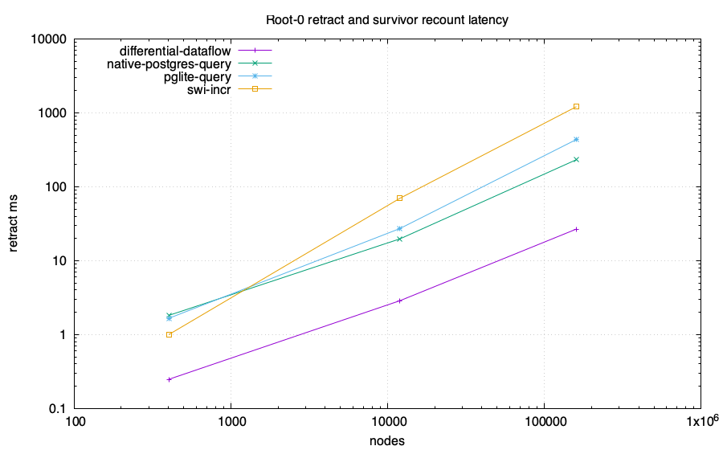
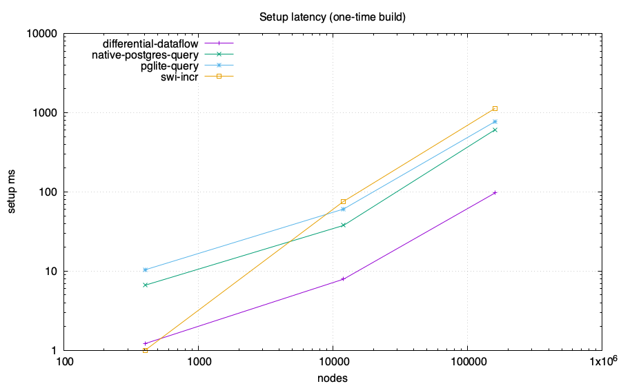
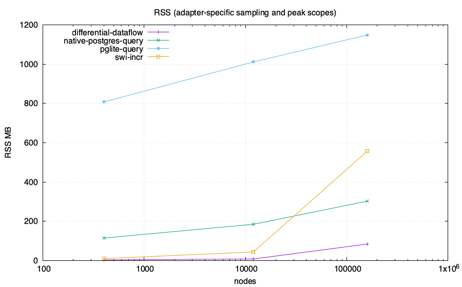
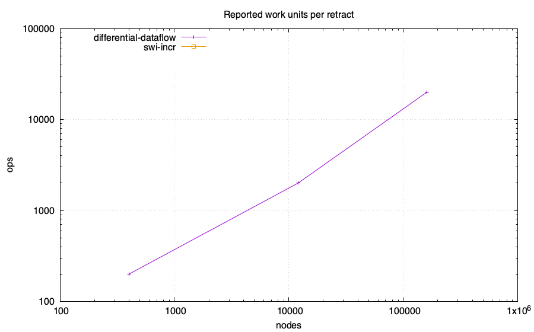

# Z-set / IVM head-to-head: feasibility lab

Same computation in every engine: reachability from roots {0,1} over a generated
DAG, then **retract root 0** and recount the survivor set. The PostgreSQL-family
numeric arms compare complete ordered results with an independent BFS oracle
before emitting CSV. Only the root retraction and survivor recount are the
measured operation; setup is reported separately. Requested memory budget:
4096 MB/run. Enforcement and accounting scope are adapter-specific and
recorded below.

Ordinary PostgreSQL and PGlite arms execute the recursive query from scratch
after the root deletion. Their timed phase ends after query materialization and
`count(*)`. Ordered full-result transfer, checksum, and exact validation are
recorded in the status receipt and excluded from `setup_ms` and
`retract_ms`. Their rows are full recomputation measurements.

The `differential-dataflow` arm is the native Differential Dataflow 0.25
library over timely 0.31. Its setup and retract phases end after fixed-point
convergence and counting. Complete ordered
initial and survivor sets are checked against an independent BFS outside the
timed phases.

The `swi-incr` arm uses SWI incremental tabling and wall time. Its clock is
reset after initial validation and immediately before root deletion. Both
phases end after table materialization and counting; exact initial-range and
incremental-versus-cold survivor checks run outside the clocks.

The optional `swipl-pure` reference uses CPU time and does not perform an
exact-set oracle check. Keep it outside a wall-time comparison. RSS combines
adapter-specific samples and process peaks, including untimed validation;
the scope receipts describe which processes and limits are included.

Per-cell output and exit codes are retained in `logs/`. Failed processes and
error/timeout/OOM status rows do not contribute numeric measurements. A run
refuses to overwrite existing CSV/status receipts.

## Charts

## Data

| engine | nodes | edges | killed | setup ms | retract ms | ops | RSS MB | host peak MB | SQLite high-water MB | db MB |
|---|---:|---:|---:|---:|---:|---:|---:|---:|---:|---:|
| swi-incr | 402 | 667 | 200 | 1 | 1 | 0 | 9.81 | N/A | N/A | N/A |
| swi-incr | 12002 | 22667 | 2000 | 76 | 70 | 0 | 43.59 | N/A | N/A | N/A |
| swi-incr | 160002 | 306667 | 20000 | 1133 | 1213 | 0 | 557.34 | N/A | N/A | N/A |
| differential-dataflow | 402 | 667 | 200 | 1.216 | 0.248 | 200 | 3.2 | N/A | N/A | N/A |
| differential-dataflow | 12002 | 22667 | 2000 | 7.925 | 2.877 | 2000 | 7.8 | N/A | N/A | N/A |
| differential-dataflow | 160002 | 306667 | 20000 | 97.055 | 26.772 | 20000 | 84.2 | N/A | N/A | N/A |
| pglite-query | 402 | 667 | 200 | 10.385 | 1.660 | N/A | 807.6 | N/A | N/A | 38.117 |
| pglite-query | 12002 | 22667 | 2000 | 60.782 | 27.263 | N/A | 1011.3 | N/A | N/A | 39.274 |
| pglite-query | 160002 | 306667 | 20000 | 771.782 | 436.257 | N/A | 1148.7 | N/A | N/A | 70.274 |
| native-postgres-query | 402 | 667 | 200 | 6.634 | 1.817 | N/A | 114.5 | N/A | N/A | 7.412 |
| native-postgres-query | 12002 | 22667 | 2000 | 37.785 | 19.754 | N/A | 184.5 | N/A | N/A | 8.568 |
| native-postgres-query | 160002 | 306667 | 20000 | 609.518 | 232.599 | N/A | 302.3 | N/A | N/A | 23.568 |

## Adapter status and measurement scope

| engine | scale | status | semantics or reason | memory scope | memory-limit scope |
|---|---|---|---|---|---|
| swi-incr | 2x200 | ok | SWI incremental tabling; setup and retract end after table materialization and count; exact ordered initial set matches the generated node range and exact incremental survivor set matches cold table recomputation | process RSS sampled with ps after both phases | DL_MEMCAP_MB is passed by the harness but unenforced by this adapter |
| swi-incr | 6x2000 | ok | SWI incremental tabling; setup and retract end after table materialization and count; exact ordered initial set matches the generated node range and exact incremental survivor set matches cold table recomputation | process RSS sampled with ps after both phases | DL_MEMCAP_MB is passed by the harness but unenforced by this adapter |
| swi-incr | 8x20000 | ok | SWI incremental tabling; setup and retract end after table materialization and count; exact ordered initial set matches the generated node range and exact incremental survivor set matches cold table recomputation | process RSS sampled with ps after both phases | DL_MEMCAP_MB is passed by the harness but unenforced by this adapter |
| differential-dataflow | 2x200 | ok | differential-dataflow 0.25 with timely 0.31; shared contiguous-node DAG; setup and retract end after fixed-point materialization and count; exact ordered sets match BFS oracle | process peak RSS from getrusage including untimed oracle allocations | DL_MEMCAP_MB=4096 caps live Rust allocations through CappedAlloc (0 disables); RLIMIT_AS and RLIMIT_DATA are also requested best-effort; total process RSS is not capped |
| differential-dataflow | 6x2000 | ok | differential-dataflow 0.25 with timely 0.31; shared contiguous-node DAG; setup and retract end after fixed-point materialization and count; exact ordered sets match BFS oracle | process peak RSS from getrusage including untimed oracle allocations | DL_MEMCAP_MB=4096 caps live Rust allocations through CappedAlloc (0 disables); RLIMIT_AS and RLIMIT_DATA are also requested best-effort; total process RSS is not capped |
| differential-dataflow | 8x20000 | ok | differential-dataflow 0.25 with timely 0.31; shared contiguous-node DAG; setup and retract end after fixed-point materialization and count; exact ordered sets match BFS oracle | process peak RSS from getrusage including untimed oracle allocations | DL_MEMCAP_MB=4096 caps live Rust allocations through CappedAlloc (0 disables); RLIMIT_AS and RLIMIT_DATA are also requested best-effort; total process RSS is not capped |
| pglite-query | 2x200 | ok | ordinary recursive SQL full recomputation; timed phases end after materialization and count; exact before=ada7ea43e998e3ba1357b4270279f2976e2659c6e3dd768d0fbfc6a15cd11314 after=d290b0a93c2138767799bffe561de2bad1a45c0ffc8210a3be393f16eb7bc305; untimed transfer_ms before=0.952 after=0.478; untimed checksum_validation_ms before=0.867 after=0.081; PostgreSQL 18.3 | sampled RSS of the Node process containing PGlite WASM | DL_MEMCAP_MB=4096 limits Node old-space only; total process RSS is unenforced |
| pglite-query | 6x2000 | ok | ordinary recursive SQL full recomputation; timed phases end after materialization and count; exact before=5359ff08f251a47ab81d104beeff9633f95d50c30ea2ff1db9d40617983ca17b after=e640e84f06cd3d340d290625432f23bf9cf4b9df50d6e4ae1ab7a73f216df46b; untimed transfer_ms before=15.257 after=11.447; untimed checksum_validation_ms before=3.858 after=1.871; PostgreSQL 18.3 | sampled RSS of the Node process containing PGlite WASM | DL_MEMCAP_MB=4096 limits Node old-space only; total process RSS is unenforced |
| pglite-query | 8x20000 | ok | ordinary recursive SQL full recomputation; timed phases end after materialization and count; exact before=d5b111c00b9de6c6acc308845af36202735166f81b10ef25547078a8e03fcd77 after=ba46515280fa0525997e4d27a81f4d2dfdb3f4445c1e54d0cc969e59cb068bf2; untimed transfer_ms before=202.508 after=166.879; untimed checksum_validation_ms before=28.201 after=24.081; PostgreSQL 18.3 | sampled RSS of the Node process containing PGlite WASM | DL_MEMCAP_MB=4096 limits Node old-space only; total process RSS is unenforced |
| native-postgres-query | 2x200 | ok | ordinary recursive SQL full recomputation; timed phases end after materialization and count; exact before=ada7ea43e998e3ba1357b4270279f2976e2659c6e3dd768d0fbfc6a15cd11314 after=d290b0a93c2138767799bffe561de2bad1a45c0ffc8210a3be393f16eb7bc305; untimed transfer_ms before=0.743 after=0.355; untimed checksum_validation_ms before=0.533 after=0.092; PostgreSQL 18.6 | sampled sum of Node client and disposable PostgreSQL process-tree RSS; shared mappings may be counted more than once | DL_MEMCAP_MB=4096 is unenforced for total PostgreSQL memory |
| native-postgres-query | 6x2000 | ok | ordinary recursive SQL full recomputation; timed phases end after materialization and count; exact before=5359ff08f251a47ab81d104beeff9633f95d50c30ea2ff1db9d40617983ca17b after=e640e84f06cd3d340d290625432f23bf9cf4b9df50d6e4ae1ab7a73f216df46b; untimed transfer_ms before=5.962 after=3.128; untimed checksum_validation_ms before=3.575 after=1.777; PostgreSQL 18.6 | sampled sum of Node client and disposable PostgreSQL process-tree RSS; shared mappings may be counted more than once | DL_MEMCAP_MB=4096 is unenforced for total PostgreSQL memory |
| native-postgres-query | 8x20000 | ok | ordinary recursive SQL full recomputation; timed phases end after materialization and count; exact before=d5b111c00b9de6c6acc308845af36202735166f81b10ef25547078a8e03fcd77 after=ba46515280fa0525997e4d27a81f4d2dfdb3f4445c1e54d0cc969e59cb068bf2; untimed transfer_ms before=49.675 after=38.473; untimed checksum_validation_ms before=28.108 after=25.638; PostgreSQL 18.6 | sampled sum of Node client and disposable PostgreSQL process-tree RSS; shared mappings may be counted more than once | DL_MEMCAP_MB=4096 is unenforced for total PostgreSQL memory |
| pglite-pg_ivm | 2x200 | unsupported | pg_ivm rejects recursive WITH RECURSIVE view definitions | no process started | not applicable |
| pglite-pg_ivm | 6x2000 | unsupported | pg_ivm rejects recursive WITH RECURSIVE view definitions | no process started | not applicable |
| pglite-pg_ivm | 8x20000 | unsupported | pg_ivm rejects recursive WITH RECURSIVE view definitions | no process started | not applicable |
| native-postgres-pg_ivm | 2x200 | unsupported | pg_ivm rejects recursive WITH RECURSIVE view definitions | no process started | not applicable |
| native-postgres-pg_ivm | 6x2000 | unsupported | pg_ivm rejects recursive WITH RECURSIVE view definitions | no process started | not applicable |
| native-postgres-pg_ivm | 8x20000 | unsupported | pg_ivm rejects recursive WITH RECURSIVE view definitions | no process started | not applicable |

## Takeaways (derived)

- Largest scale reached by a numeric run: 160002 nodes.
- No numeric arm emitted a WALL row at these scales.
