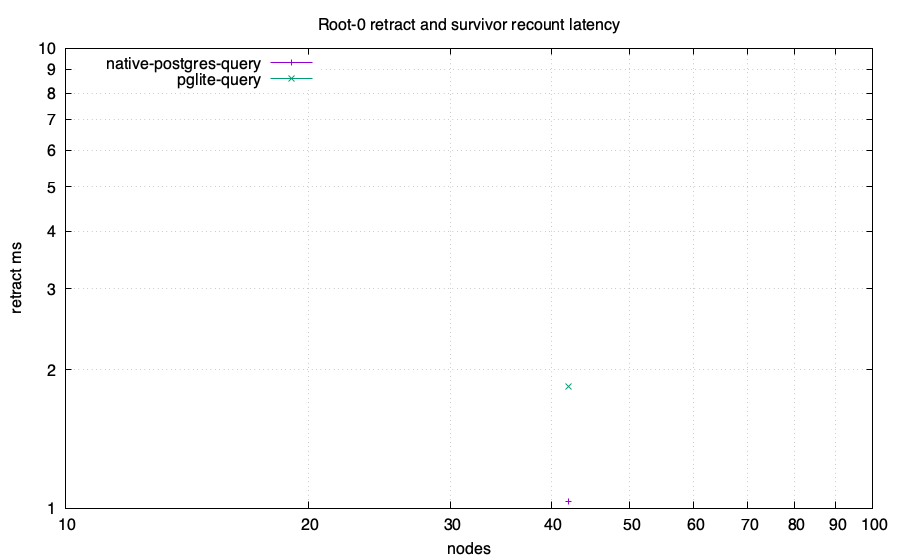
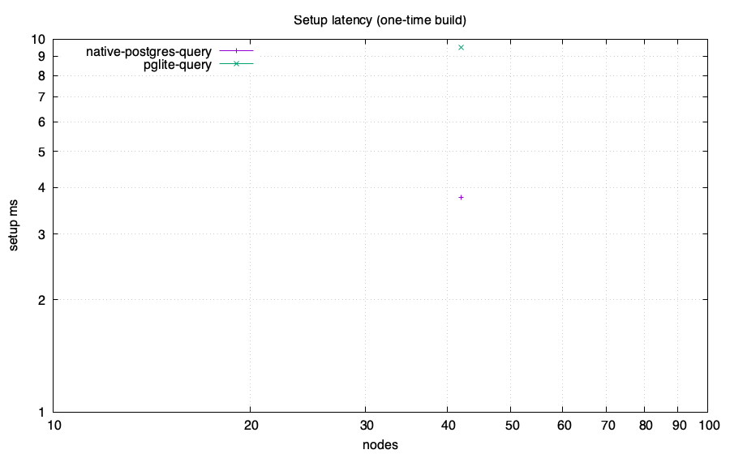
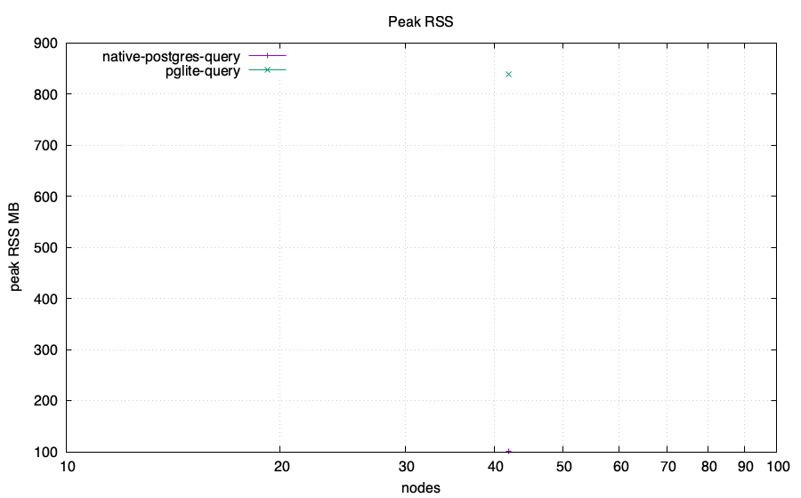

# Z-set / IVM head-to-head: feasibility lab

Same computation in every engine: reachability from roots {0,1} over a generated
DAG, then **retract root 0** and recount the survivor set. The PostgreSQL-family
numeric arms compare complete ordered results with an independent BFS oracle
before emitting CSV. Only the root retraction and survivor recount are the
measured operation; setup is reported separately. Requested memory budget:
4096 MB/run. Enforcement and accounting scope are adapter-specific and
recorded below.

Ordinary PostgreSQL and PGlite arms execute the recursive query from scratch
after the root deletion. Their timed phase ends after query materialization and
`count(*)`. Ordered full-result transfer, checksum, and exact validation are
recorded in the status receipt and excluded from `setup_ms` and
`retract_ms`. Their rows are full recomputation measurements.

## Charts

## Data

| engine | nodes | edges | killed | setup ms | retract ms | ops | RSS MB | host peak MB | SQLite high-water MB | db MB |
|---|---:|---:|---:|---:|---:|---:|---:|---:|---:|---:|
| pglite-query | 42 | 67 | 20 | 9.503 | 1.843 | N/A | 838.4 | N/A | N/A | 38.063 |
| native-postgres-query | 42 | 67 | 20 | 3.765 | 1.034 | N/A | 101.3 | N/A | N/A | 7.357 |

## Adapter status and measurement scope

| engine | scale | status | semantics or reason | memory scope | memory-limit scope |
|---|---|---|---|---|---|
| pglite-query | 2x20 | ok | ordinary recursive SQL full recomputation; timed phases end after materialization and count; exact before=da93734e93ce56d772ff68daf973ee1fb87cd8c4b1c52cdb3f59cc621f38d316 after=03341116f274a33f3e3417b09b21c9eea092fef5a70ad9d80e6917f65fb9c22a; untimed transfer_ms before=0.368 after=0.227; untimed checksum_validation_ms before=0.864 after=0.027; PostgreSQL 18.3 | sampled RSS of the Node process containing PGlite WASM | DL_MEMCAP_MB=4096 limits Node old-space only; total process RSS is unenforced |
| native-postgres-query | 2x20 | ok | ordinary recursive SQL full recomputation; timed phases end after materialization and count; exact before=da93734e93ce56d772ff68daf973ee1fb87cd8c4b1c52cdb3f59cc621f38d316 after=03341116f274a33f3e3417b09b21c9eea092fef5a70ad9d80e6917f65fb9c22a; untimed transfer_ms before=0.183 after=0.134; untimed checksum_validation_ms before=0.321 after=0.022; PostgreSQL 18.6 | sampled sum of Node client and disposable PostgreSQL process-tree RSS; shared mappings may be counted more than once | DL_MEMCAP_MB=4096 is unenforced for total PostgreSQL memory |
| pglite-pg_ivm | 2x20 | unsupported | pg_ivm rejects recursive WITH RECURSIVE view definitions | no process started | not applicable |
| native-postgres-pg_ivm | 2x20 | unsupported | pg_ivm rejects recursive WITH RECURSIVE view definitions | no process started | not applicable |

## Takeaways (derived)

- Largest scale reached by a numeric run: 42 nodes.
- No numeric arm emitted a WALL row at these scales.
- swi-sqlite retract statement count across all scales: {} (O(depth), not O(rows)).
