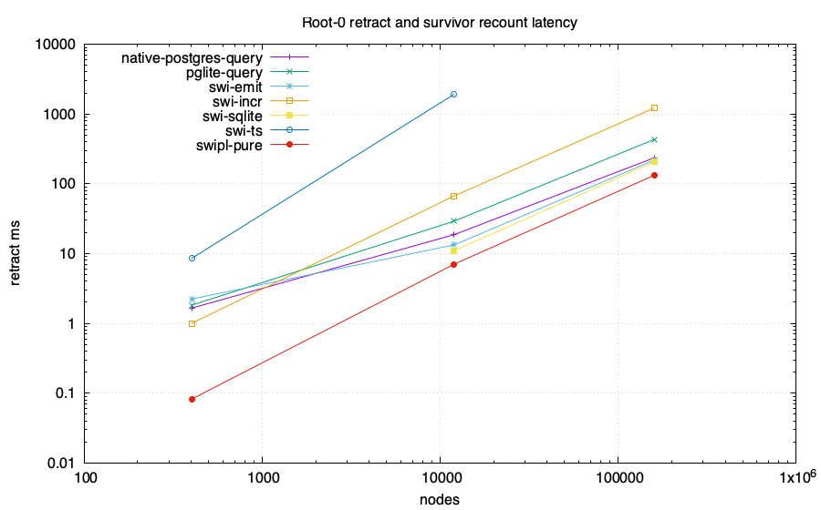
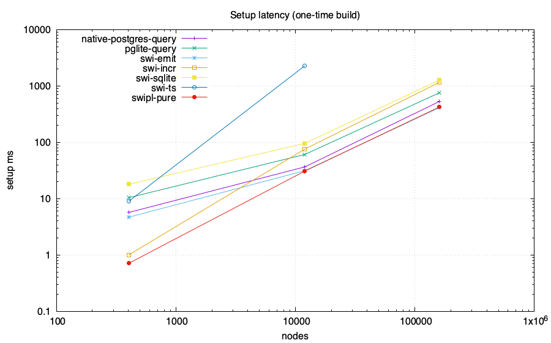
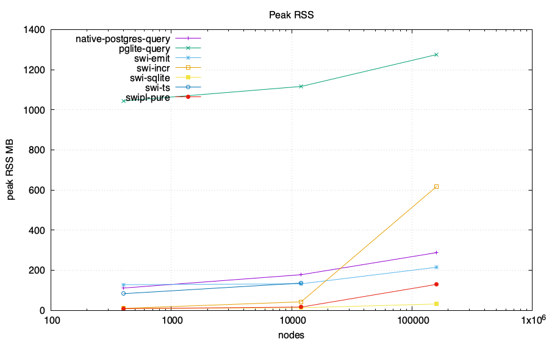

# Z-set / IVM head-to-head: feasibility lab

Same computation in every engine: reachability from roots {0,1} over a generated
DAG, then **retract root 0** and recount the survivor set. The PostgreSQL-family
numeric arms compare complete ordered results with an independent BFS oracle
before emitting CSV. Only the root retraction and survivor recount are the
measured operation; setup is reported separately. Requested memory budget:
4096 MB/run. Enforcement and accounting scope are adapter-specific and
recorded below.

Ordinary PostgreSQL and PGlite arms execute the recursive query from scratch
after the root deletion. Their timed phase ends after query materialization and
`count(*)`. Ordered full-result transfer, checksum, and exact validation are
recorded in the status receipt and excluded from `setup_ms` and
`retract_ms`. Their rows are full recomputation measurements.

## Charts

## Data

| engine | nodes | edges | killed | setup ms | retract ms | ops | RSS MB | host peak MB | SQLite high-water MB | db MB |
|---|---:|---:|---:|---:|---:|---:|---:|---:|---:|---:|
| swi-incr | 402 | 667 | 200 | 1 | 1 | 0 | 10.47 | N/A | N/A | N/A |
| swi-incr | 12002 | 22667 | 2000 | 76 | 67 | 0 | 42.86 | N/A | N/A | N/A |
| swi-incr | 160002 | 306667 | 20000 | 1159 | 1219 | 0 | 617.80 | N/A | N/A | N/A |
| swipl-pure | 402 | 667 | 200 | 0.7109999999999999 | 0.08200000000000048 | 0 | 8.9 | N/A | N/A | N/A |
| swipl-pure | 12002 | 22667 | 2000 | 30.928000000000004 | 7.053999999999998 | 0 | 16.7 | N/A | N/A | N/A |
| swipl-pure | 160002 | 306667 | 20000 | 423.759 | 132.86599999999999 | 0 | 129.9 | N/A | N/A | N/A |
| swi-sqlite | 402 | 667 | 200 | 18 | 0 | 15 | 9.17 | N/A | N/A | N/A |
| swi-sqlite | 12002 | 22667 | 2000 | 96 | 11 | 78 | 13.44 | N/A | N/A | N/A |
| swi-sqlite | 160002 | 306667 | 20000 | 1275 | 207 | 792 | 32.09 | N/A | N/A | N/A |
| swi-ts | 402 | 667 | 200 | 8.943 | 8.520 | 0 | 83.6 | N/A | N/A | N/A |
| swi-ts | 12002 | 22667 | 2000 | 2294.714 | 1920.332 | 0 | 136.5 | N/A | N/A | N/A |
| swi-emit | 402 | 667 | 200 | 4.684 | 2.228 | 0 | 128.3 | N/A | N/A | N/A |
| swi-emit | 12002 | 22667 | 2000 | 31.441 | 13.328 | 0 | 132.7 | N/A | N/A | N/A |
| swi-emit | 160002 | 306667 | 20000 | 411.799 | 218.643 | 0 | 215.2 | N/A | N/A | N/A |
| pglite-query | 402 | 667 | 200 | 10.412 | 1.821 | N/A | 1044.5 | N/A | N/A | 38.117 |
| pglite-query | 12002 | 22667 | 2000 | 61.083 | 29.161 | N/A | 1116.8 | N/A | N/A | 39.274 |
| pglite-query | 160002 | 306667 | 20000 | 757.523 | 432.853 | N/A | 1275.5 | N/A | N/A | 70.274 |
| native-postgres-query | 402 | 667 | 200 | 5.688 | 1.652 | N/A | 111.7 | N/A | N/A | 7.412 |
| native-postgres-query | 12002 | 22667 | 2000 | 36.706 | 18.659 | N/A | 178.1 | N/A | N/A | 8.568 |
| native-postgres-query | 160002 | 306667 | 20000 | 530.764 | 236.449 | N/A | 288.2 | N/A | N/A | 23.568 |

## Adapter status and measurement scope

| engine | scale | status | semantics or reason | memory scope | memory-limit scope |
|---|---|---|---|---|---|
| swi-ts | 8x20000 | skipped | prior same-settings run timed out at enforced 120-second bound; receipt: bench/results/postgres-shared/adapter-status.tsv | no process started | process-time bound not entered |
| pglite-query | 2x200 | ok | ordinary recursive SQL full recomputation; timed phases end after materialization and count; exact before=ada7ea43e998e3ba1357b4270279f2976e2659c6e3dd768d0fbfc6a15cd11314 after=d290b0a93c2138767799bffe561de2bad1a45c0ffc8210a3be393f16eb7bc305; untimed transfer_ms before=0.960 after=0.456; untimed checksum_validation_ms before=0.618 after=0.094; PostgreSQL 18.3 | sampled RSS of the Node process containing PGlite WASM | DL_MEMCAP_MB=4096 limits Node old-space only; total process RSS is unenforced |
| pglite-query | 6x2000 | ok | ordinary recursive SQL full recomputation; timed phases end after materialization and count; exact before=5359ff08f251a47ab81d104beeff9633f95d50c30ea2ff1db9d40617983ca17b after=e640e84f06cd3d340d290625432f23bf9cf4b9df50d6e4ae1ab7a73f216df46b; untimed transfer_ms before=15.832 after=11.953; untimed checksum_validation_ms before=4.078 after=1.893; PostgreSQL 18.3 | sampled RSS of the Node process containing PGlite WASM | DL_MEMCAP_MB=4096 limits Node old-space only; total process RSS is unenforced |
| pglite-query | 8x20000 | ok | ordinary recursive SQL full recomputation; timed phases end after materialization and count; exact before=d5b111c00b9de6c6acc308845af36202735166f81b10ef25547078a8e03fcd77 after=ba46515280fa0525997e4d27a81f4d2dfdb3f4445c1e54d0cc969e59cb068bf2; untimed transfer_ms before=202.209 after=166.760; untimed checksum_validation_ms before=26.668 after=22.187; PostgreSQL 18.3 | sampled RSS of the Node process containing PGlite WASM | DL_MEMCAP_MB=4096 limits Node old-space only; total process RSS is unenforced |
| native-postgres-query | 2x200 | ok | ordinary recursive SQL full recomputation; timed phases end after materialization and count; exact before=ada7ea43e998e3ba1357b4270279f2976e2659c6e3dd768d0fbfc6a15cd11314 after=d290b0a93c2138767799bffe561de2bad1a45c0ffc8210a3be393f16eb7bc305; untimed transfer_ms before=0.682 after=0.335; untimed checksum_validation_ms before=0.491 after=0.086; PostgreSQL 18.6 | sampled sum of Node client and disposable PostgreSQL process-tree RSS; shared mappings may be counted more than once | DL_MEMCAP_MB=4096 is unenforced for total PostgreSQL memory |
| native-postgres-query | 6x2000 | ok | ordinary recursive SQL full recomputation; timed phases end after materialization and count; exact before=5359ff08f251a47ab81d104beeff9633f95d50c30ea2ff1db9d40617983ca17b after=e640e84f06cd3d340d290625432f23bf9cf4b9df50d6e4ae1ab7a73f216df46b; untimed transfer_ms before=6.554 after=3.099; untimed checksum_validation_ms before=3.661 after=1.639; PostgreSQL 18.6 | sampled sum of Node client and disposable PostgreSQL process-tree RSS; shared mappings may be counted more than once | DL_MEMCAP_MB=4096 is unenforced for total PostgreSQL memory |
| native-postgres-query | 8x20000 | ok | ordinary recursive SQL full recomputation; timed phases end after materialization and count; exact before=d5b111c00b9de6c6acc308845af36202735166f81b10ef25547078a8e03fcd77 after=ba46515280fa0525997e4d27a81f4d2dfdb3f4445c1e54d0cc969e59cb068bf2; untimed transfer_ms before=52.469 after=42.391; untimed checksum_validation_ms before=27.958 after=26.969; PostgreSQL 18.6 | sampled sum of Node client and disposable PostgreSQL process-tree RSS; shared mappings may be counted more than once | DL_MEMCAP_MB=4096 is unenforced for total PostgreSQL memory |
| pglite-pg_ivm | 2x200 | unsupported | pg_ivm rejects recursive WITH RECURSIVE view definitions | no process started | not applicable |
| pglite-pg_ivm | 6x2000 | unsupported | pg_ivm rejects recursive WITH RECURSIVE view definitions | no process started | not applicable |
| pglite-pg_ivm | 8x20000 | unsupported | pg_ivm rejects recursive WITH RECURSIVE view definitions | no process started | not applicable |
| native-postgres-pg_ivm | 2x200 | unsupported | pg_ivm rejects recursive WITH RECURSIVE view definitions | no process started | not applicable |
| native-postgres-pg_ivm | 6x2000 | unsupported | pg_ivm rejects recursive WITH RECURSIVE view definitions | no process started | not applicable |
| native-postgres-pg_ivm | 8x20000 | unsupported | pg_ivm rejects recursive WITH RECURSIVE view definitions | no process started | not applicable |

## Takeaways (derived)

- Largest scale reached by a numeric run: 160002 nodes.
- No numeric arm emitted a WALL row at these scales.
- swi-sqlite retract statement count across all scales: {15,78,792} (O(depth), not O(rows)).
