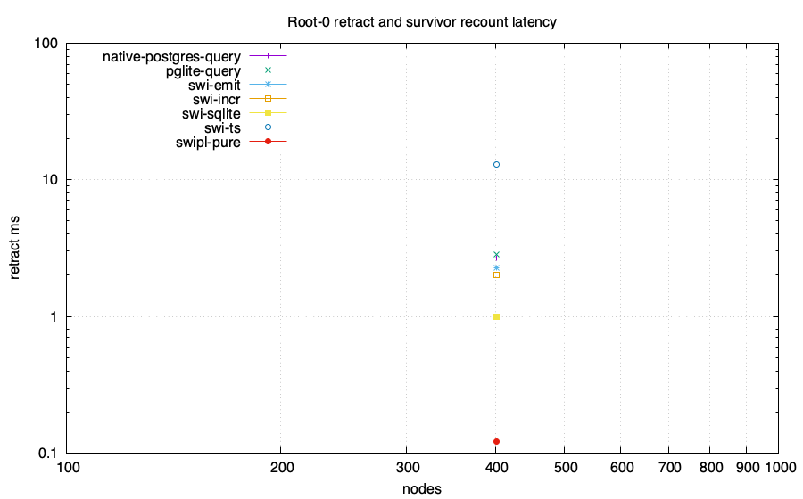
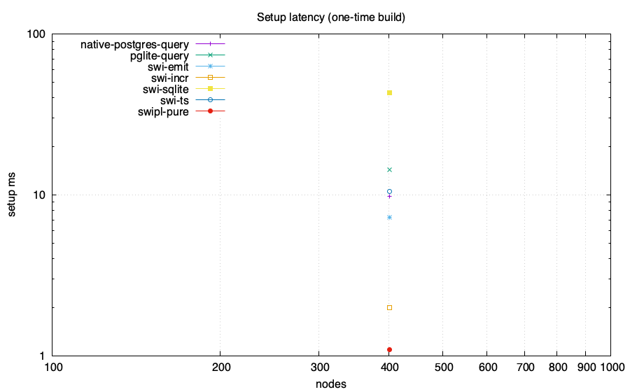
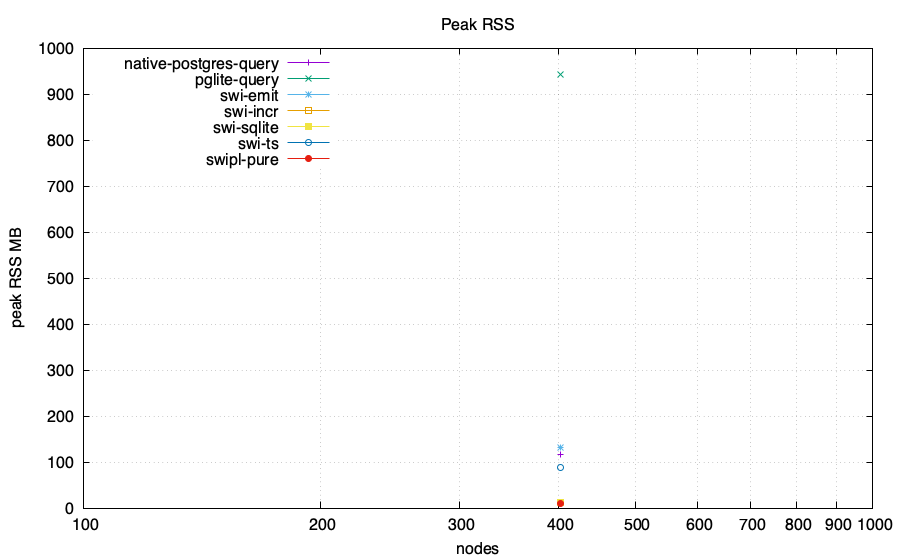
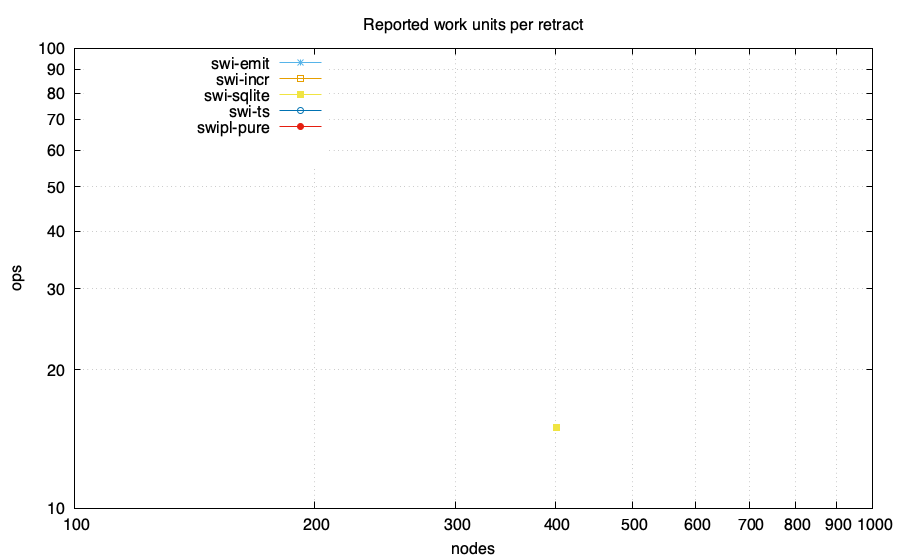

# Z-set / IVM head-to-head: feasibility lab

Same computation in every engine: reachability from roots {0,1} over a generated
DAG, then **retract root 0** and recount the survivor set. The PostgreSQL-family
numeric arms compare complete ordered results with an independent BFS oracle
before emitting CSV. Only the root retraction and survivor recount are the
measured operation; setup is reported separately. Requested memory budget:
4096 MB/run. Enforcement and accounting scope are adapter-specific and
recorded below.

Ordinary PostgreSQL and PGlite arms execute the recursive query from scratch
after the root deletion. Their rows are full recomputation measurements.

## Charts

## Data

| engine | nodes | edges | killed | setup ms | retract ms | ops | RSS MB | host peak MB | SQLite high-water MB | db MB |
|---|---:|---:|---:|---:|---:|---:|---:|---:|---:|---:|
| swi-incr | 402 | 667 | 200 | 2 | 2 | 0 | 12.05 | N/A | N/A | N/A |
| swipl-pure | 402 | 667 | 200 | 1.0889999999999997 | 0.12099999999999958 | 0 | 10.8 | N/A | N/A | N/A |
| swi-sqlite | 402 | 667 | 200 | 43 | 1 | 15 | 11.62 | N/A | N/A | N/A |
| swi-ts | 402 | 667 | 200 | 10.467 | 13.033 | 0 | 88.4 | N/A | N/A | N/A |
| swi-emit | 402 | 667 | 200 | 7.225 | 2.270 | 0 | 132.2 | N/A | N/A | N/A |
| pglite-query | 402 | 667 | 200 | 14.377 | 2.833 | N/A | 944.2 | N/A | N/A | 38.117 |
| native-postgres-query | 402 | 667 | 200 | 9.836 | 2.690 | N/A | 117.0 | N/A | N/A | 7.412 |

## Adapter status and measurement scope

| engine | scale | status | semantics or reason | memory scope | memory-limit scope |
|---|---|---|---|---|---|
| pglite-query | 2x200 | ok | ordinary recursive SQL full recomputation; exact before=ada7ea43e998e3ba1357b4270279f2976e2659c6e3dd768d0fbfc6a15cd11314 after=d290b0a93c2138767799bffe561de2bad1a45c0ffc8210a3be393f16eb7bc305; PostgreSQL 18.3 | sampled RSS of the Node process containing PGlite WASM | DL_MEMCAP_MB=4096 limits Node old-space only; total process RSS is unenforced |
| native-postgres-query | 2x200 | ok | ordinary recursive SQL full recomputation; exact before=ada7ea43e998e3ba1357b4270279f2976e2659c6e3dd768d0fbfc6a15cd11314 after=d290b0a93c2138767799bffe561de2bad1a45c0ffc8210a3be393f16eb7bc305; PostgreSQL 18.6 | sampled sum of Node client and disposable PostgreSQL process-tree RSS; shared mappings may be counted more than once | DL_MEMCAP_MB=4096 is unenforced for total PostgreSQL memory |
| pglite-pg_ivm | 2x200 | unsupported | pg_ivm rejects recursive WITH RECURSIVE view definitions | no process started | not applicable |
| native-postgres-pg_ivm | 2x200 | unsupported | pg_ivm rejects recursive WITH RECURSIVE view definitions | no process started | not applicable |

## Takeaways (derived)

- Largest scale reached by a numeric run: 402 nodes.
- No numeric arm emitted a WALL row at these scales.
- swi-sqlite retract statement count across all scales: {15} (O(depth), not O(rows)).
