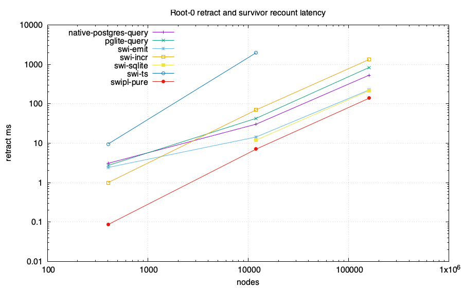
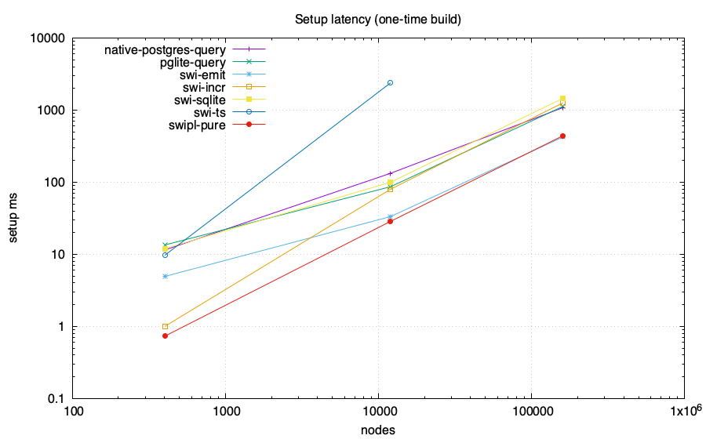
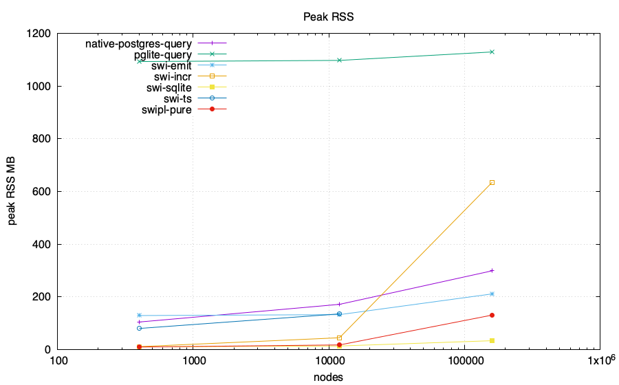
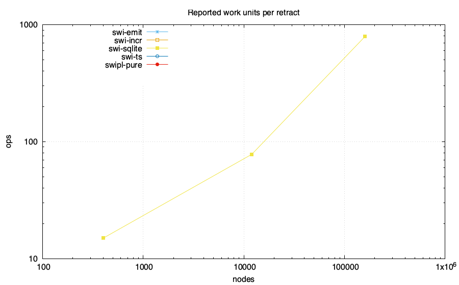

# Z-set / IVM head-to-head: feasibility lab

Same computation in every engine: reachability from roots {0,1} over a generated
DAG, then **retract root 0** and recount the survivor set. The PostgreSQL-family
numeric arms compare complete ordered results with an independent BFS oracle
before emitting CSV. Only the root retraction and survivor recount are the
measured operation; setup is reported separately. Requested memory budget:
4096 MB/run. Enforcement and accounting scope are adapter-specific and
recorded below.

Ordinary PostgreSQL and PGlite arms execute the recursive query from scratch
after the root deletion. Their rows are full recomputation measurements.

## Charts

## Data

| engine | nodes | edges | killed | setup ms | retract ms | ops | RSS MB | host peak MB | SQLite high-water MB | db MB |
|---|---:|---:|---:|---:|---:|---:|---:|---:|---:|---:|
| swi-incr | 402 | 667 | 200 | 1 | 1 | 0 | 10.75 | N/A | N/A | N/A |
| swi-incr | 12002 | 22667 | 2000 | 80 | 70 | 0 | 44.47 | N/A | N/A | N/A |
| swi-incr | 160002 | 306667 | 20000 | 1260 | 1330 | 0 | 634.83 | N/A | N/A | N/A |
| swipl-pure | 402 | 667 | 200 | 0.7320000000000018 | 0.08599999999999927 | 0 | 9.2 | N/A | N/A | N/A |
| swipl-pure | 12002 | 22667 | 2000 | 28.651999999999997 | 7.077 | 0 | 17.2 | N/A | N/A | N/A |
| swipl-pure | 160002 | 306667 | 20000 | 440.621 | 138.33100000000005 | 0 | 130.6 | N/A | N/A | N/A |
| swi-sqlite | 402 | 667 | 200 | 12 | 0 | 15 | 9.69 | N/A | N/A | N/A |
| swi-sqlite | 12002 | 22667 | 2000 | 100 | 12 | 78 | 13.19 | N/A | N/A | N/A |
| swi-sqlite | 160002 | 306667 | 20000 | 1458 | 215 | 792 | 33.28 | N/A | N/A | N/A |
| swi-ts | 402 | 667 | 200 | 9.699 | 9.528 | 0 | 79.8 | N/A | N/A | N/A |
| swi-ts | 12002 | 22667 | 2000 | 2391.333 | 1975.606 | 0 | 135.1 | N/A | N/A | N/A |
| swi-emit | 402 | 667 | 200 | 4.935 | 2.421 | 0 | 128.7 | N/A | N/A | N/A |
| swi-emit | 12002 | 22667 | 2000 | 33.388 | 14.362 | 0 | 132.2 | N/A | N/A | N/A |
| swi-emit | 160002 | 306667 | 20000 | 423.009 | 224.399 | 0 | 211.0 | N/A | N/A | N/A |
| pglite-query | 402 | 667 | 200 | 13.469 | 2.723 | N/A | 1092.9 | N/A | N/A | 38.117 |
| pglite-query | 12002 | 22667 | 2000 | 86.681 | 42.767 | N/A | 1097.3 | N/A | N/A | 39.274 |
| pglite-query | 160002 | 306667 | 20000 | 1123.806 | 834.435 | N/A | 1129.4 | N/A | N/A | 70.274 |
| native-postgres-query | 402 | 667 | 200 | 11.481 | 3.087 | N/A | 104.2 | N/A | N/A | 7.412 |
| native-postgres-query | 12002 | 22667 | 2000 | 133.029 | 30.386 | N/A | 171.3 | N/A | N/A | 8.568 |
| native-postgres-query | 160002 | 306667 | 20000 | 1082.350 | 532.112 | N/A | 298.7 | N/A | N/A | 23.568 |

## Adapter status and measurement scope

| engine | scale | status | semantics or reason | memory scope | memory-limit scope |
|---|---|---|---|---|---|
| swi-ts | 8x20000 | timeout | case exceeded 120 seconds | unavailable | process-time bound only |
| pglite-query | 2x200 | ok | ordinary recursive SQL full recomputation; exact before=ada7ea43e998e3ba1357b4270279f2976e2659c6e3dd768d0fbfc6a15cd11314 after=d290b0a93c2138767799bffe561de2bad1a45c0ffc8210a3be393f16eb7bc305; PostgreSQL 18.3 | sampled RSS of the Node process containing PGlite WASM | DL_MEMCAP_MB=4096 limits Node old-space only; total process RSS is unenforced |
| pglite-query | 6x2000 | ok | ordinary recursive SQL full recomputation; exact before=5359ff08f251a47ab81d104beeff9633f95d50c30ea2ff1db9d40617983ca17b after=e640e84f06cd3d340d290625432f23bf9cf4b9df50d6e4ae1ab7a73f216df46b; PostgreSQL 18.3 | sampled RSS of the Node process containing PGlite WASM | DL_MEMCAP_MB=4096 limits Node old-space only; total process RSS is unenforced |
| pglite-query | 8x20000 | ok | ordinary recursive SQL full recomputation; exact before=d5b111c00b9de6c6acc308845af36202735166f81b10ef25547078a8e03fcd77 after=ba46515280fa0525997e4d27a81f4d2dfdb3f4445c1e54d0cc969e59cb068bf2; PostgreSQL 18.3 | sampled RSS of the Node process containing PGlite WASM | DL_MEMCAP_MB=4096 limits Node old-space only; total process RSS is unenforced |
| native-postgres-query | 2x200 | ok | ordinary recursive SQL full recomputation; exact before=ada7ea43e998e3ba1357b4270279f2976e2659c6e3dd768d0fbfc6a15cd11314 after=d290b0a93c2138767799bffe561de2bad1a45c0ffc8210a3be393f16eb7bc305; PostgreSQL 18.6 | sampled sum of Node client and disposable PostgreSQL process-tree RSS; shared mappings may be counted more than once | DL_MEMCAP_MB=4096 is unenforced for total PostgreSQL memory |
| native-postgres-query | 6x2000 | ok | ordinary recursive SQL full recomputation; exact before=5359ff08f251a47ab81d104beeff9633f95d50c30ea2ff1db9d40617983ca17b after=e640e84f06cd3d340d290625432f23bf9cf4b9df50d6e4ae1ab7a73f216df46b; PostgreSQL 18.6 | sampled sum of Node client and disposable PostgreSQL process-tree RSS; shared mappings may be counted more than once | DL_MEMCAP_MB=4096 is unenforced for total PostgreSQL memory |
| native-postgres-query | 8x20000 | ok | ordinary recursive SQL full recomputation; exact before=d5b111c00b9de6c6acc308845af36202735166f81b10ef25547078a8e03fcd77 after=ba46515280fa0525997e4d27a81f4d2dfdb3f4445c1e54d0cc969e59cb068bf2; PostgreSQL 18.6 | sampled sum of Node client and disposable PostgreSQL process-tree RSS; shared mappings may be counted more than once | DL_MEMCAP_MB=4096 is unenforced for total PostgreSQL memory |
| pglite-pg_ivm | 2x200 | unsupported | pg_ivm rejects recursive WITH RECURSIVE view definitions | no process started | not applicable |
| pglite-pg_ivm | 6x2000 | unsupported | pg_ivm rejects recursive WITH RECURSIVE view definitions | no process started | not applicable |
| pglite-pg_ivm | 8x20000 | unsupported | pg_ivm rejects recursive WITH RECURSIVE view definitions | no process started | not applicable |
| native-postgres-pg_ivm | 2x200 | unsupported | pg_ivm rejects recursive WITH RECURSIVE view definitions | no process started | not applicable |
| native-postgres-pg_ivm | 6x2000 | unsupported | pg_ivm rejects recursive WITH RECURSIVE view definitions | no process started | not applicable |
| native-postgres-pg_ivm | 8x20000 | unsupported | pg_ivm rejects recursive WITH RECURSIVE view definitions | no process started | not applicable |

## Takeaways (derived)

- Largest scale reached by a numeric run: 160002 nodes.
- No numeric arm emitted a WALL row at these scales.
- swi-sqlite retract statement count across all scales: {15,78,792} (O(depth), not O(rows)).
