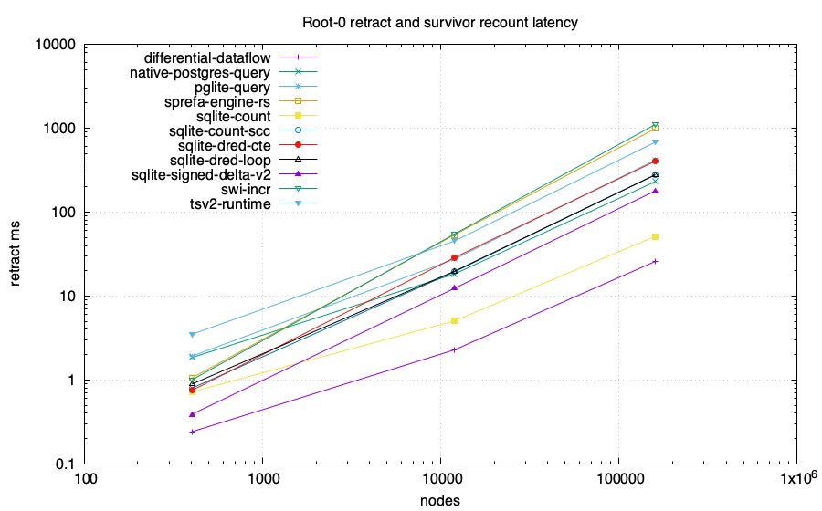
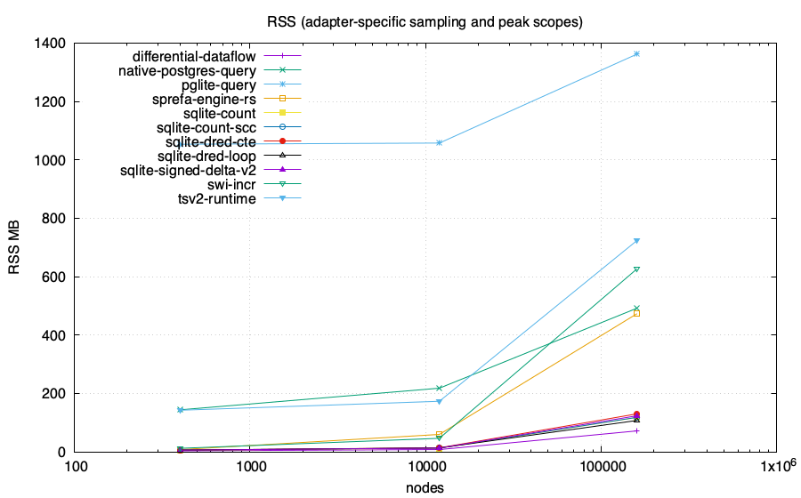

# Repeated shared root-retraction comparison

The warmup run is retained and excluded from all summaries. Each measured run
uses fresh engine processes and a fresh task-local PostgreSQL cluster. Engine
order rotates by three positions per run. Tables report medians and full ranges,
with no confidence or significance claim. Only groups present in all measured
runs, with at least five samples, enter the median charts.

Deletion, maintenance or recomputation/materialization, and count are timed.
Exact input and result validation is outside the clocks. PostgreSQL includes
durable commit and client round trips. SQLite runtime stores are in memory;
specialized cascade stores use their existing on-disk configuration. RSS and
memory-cap scopes differ by adapter and are recorded in the raw reports.
OS available-memory samples and engine order are retained in each raw directory.
The sqlite-signed-delta-v2 name currently runs full recursive recomputation with
implicit zero-indegree roots and only the current deletion excluded. Its single
deletion measurements pass, but repeated-deletion sequence checks fail.

| Engine | Nodes | Samples | Median retract ms | Min–max ms | Median RSS MB |
|---|---:|---:|---:|---:|---:|
| differential-dataflow | 402 | 5/5 | 0.241 | 0.240–0.249 | 4.0 |
| differential-dataflow | 12002 | 5/5 | 2.291 | 2.244–2.305 | 8.5 |
| differential-dataflow | 160002 | 5/5 | 25.825 | 25.742–26.150 | 72.4 |
| native-postgres-query | 402 | 5/5 | 1.847 | 1.796–1.928 | 144.6 |
| native-postgres-query | 12002 | 5/5 | 18.345 | 18.000–19.145 | 218.6 |
| native-postgres-query | 160002 | 5/5 | 231.033 | 226.245–237.739 | 492.5 |
| pglite-query | 402 | 5/5 | 1.921 | 1.727–2.335 | 1053.9 |
| pglite-query | 12002 | 5/5 | 27.588 | 27.194–27.925 | 1057.9 |
| pglite-query | 160002 | 5/5 | 416.780 | 413.859–418.595 | 1362.5 |
| sprefa-engine-rs | 402 | 5/5 | 1.054 | 1.046–1.070 | 8.4 |
| sprefa-engine-rs | 12002 | 5/5 | 53.833 | 53.565–55.288 | 60.3 |
| sprefa-engine-rs | 160002 | 5/5 | 990.015 | 985.323–994.254 | 473.7 |
| sqlite-count-scc | 402 | 5/5 | 0.798 | 0.795–0.808 | 6.7 |
| sqlite-count-scc | 12002 | 5/5 | 19.490 | 18.731–19.936 | 13.6 |
| sqlite-count-scc | 160002 | 5/5 | 278.879 | 277.066–282.548 | 118.9 |
| sqlite-count | 402 | 5/5 | 0.718 | 0.586–0.731 | 6.1 |
| sqlite-count | 12002 | 5/5 | 5.059 | 5.039–5.141 | 12.8 |
| sqlite-count | 160002 | 5/5 | 51.399 | 51.252–51.996 | 118.5 |
| sqlite-dred-cte | 402 | 5/5 | 0.750 | 0.719–0.784 | 6.5 |
| sqlite-dred-cte | 12002 | 5/5 | 28.783 | 28.019–29.173 | 14.4 |
| sqlite-dred-cte | 160002 | 5/5 | 404.716 | 402.393–408.825 | 130.8 |
| sqlite-dred-loop | 402 | 5/5 | 0.891 | 0.793–0.926 | 6.5 |
| sqlite-dred-loop | 12002 | 5/5 | 19.796 | 19.249–19.899 | 14.0 |
| sqlite-dred-loop | 160002 | 5/5 | 278.194 | 277.508–281.952 | 108.1 |
| sqlite-signed-delta-v2 | 402 | 5/5 | 0.389 | 0.370–0.454 | 6.4 |
| sqlite-signed-delta-v2 | 12002 | 5/5 | 12.393 | 12.205–12.716 | 13.5 |
| sqlite-signed-delta-v2 | 160002 | 5/5 | 179.158 | 177.069–184.093 | 124.2 |
| swi-incr | 402 | 5/5 | 1.000 | 1.000–1.000 | 12.7 |
| swi-incr | 12002 | 5/5 | 55.000 | 55.000–64.000 | 47.0 |
| swi-incr | 160002 | 5/5 | 1105.000 | 1078.000–1136.000 | 627.1 |
| tsv2-runtime | 402 | 5/5 | 3.494 | 3.425–3.670 | 143.1 |
| tsv2-runtime | 12002 | 5/5 | 45.392 | 44.508–47.203 | 173.8 |
| tsv2-runtime | 160002 | 5/5 | 681.254 | 678.385–695.309 | 724.2 |

[Machine-readable ranges](repeat-ranges.csv), [median chart input](results.csv).

## Raw run status

| Phase | Iteration | Rotation | Exit | Receipts |
|---|---:|---:|---:|---|
| warmup | 0 | 0 | 0 | [raw report](warmup-0/REPORT.md) |
| measured | 1 | 3 | 0 | [raw report](measured-1/REPORT.md) |
| measured | 2 | 6 | 0 | [raw report](measured-2/REPORT.md) |
| measured | 3 | 9 | 0 | [raw report](measured-3/REPORT.md) |
| measured | 4 | 12 | 0 | [raw report](measured-4/REPORT.md) |
| measured | 5 | 15 | 0 | [raw report](measured-5/REPORT.md) |
