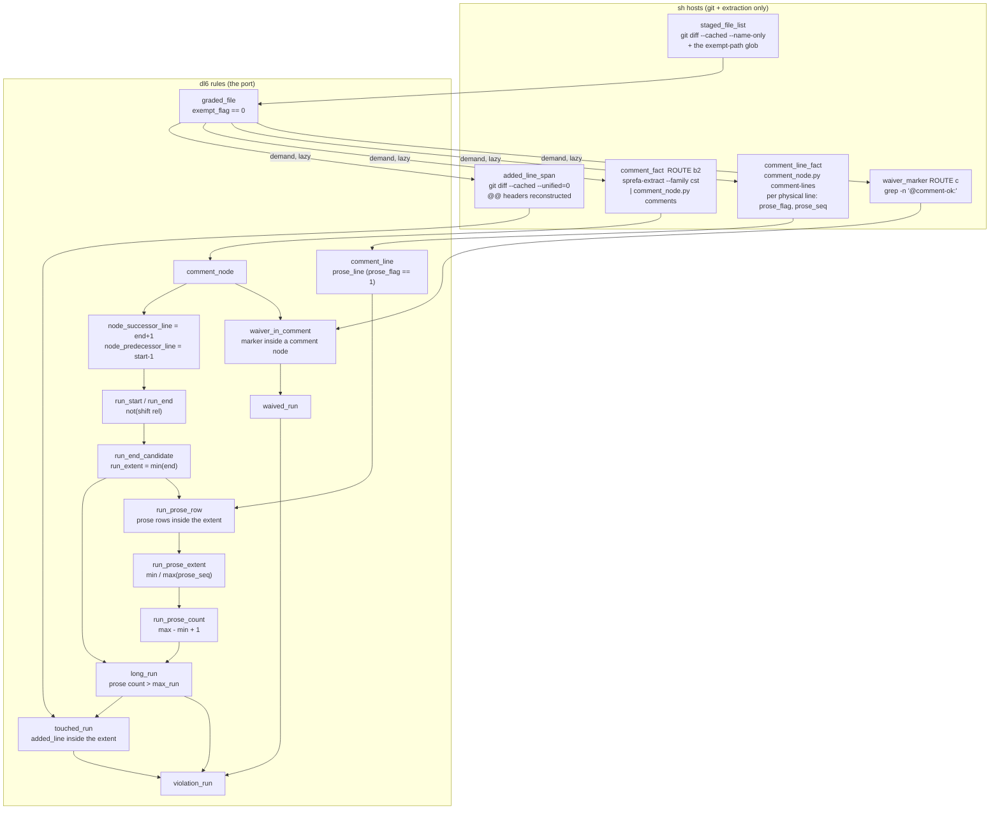

# Comment-budget rail golden

The repo's comment-budget pre-commit check, expressed as a dl6 program. The
bash original is `claude-research/bin/comment-prod`; this is the same contract
with comments read as AST nodes instead of leading characters.

## Contents

| # | file | what it is |
|---|---|---|
| 0 | `0_comment_rail_golden.dl6` | the program: 5 `sh` hosts, 24 rels, no new construct |
| 1 | `1_schedule.json` | the hermetic fixture, 5 ticks, 8 staged files |
| 2 | `2_expected.tick.jsonl` | the pinned tick log |
| 3 | `3_expected.final.jsonl` | the pinned final relation envelope |
| 4 | `4_oracle.pl` | the prolog reference-engine driver |
| 5 | `5_gen_schedules.py` | writes 1 and `5_schedule.scale.json` (the 20x line-scale twin) |
| 6 | `6_gate.sh` | **the gate** |
| 7 | `7_assert.py` | the gate's semantics, laziness, cardinality and query-plan legs |
| 8 | `8_parity.sh` | behavior parity vs the bash tool over 7 synthetic staged diffs |
| 9 | `9_failfirst.sh` | the fail-first receipt, executable |

## The pipeline



## The check, restated

| step | rule | spelling |
|---|---|---|
| coalesce | `run_start` / `run_end` | a node no other node ends one line above starts a run |
| extent | `run_extent` | `min(end_line)` at or after the start |
| prose | `prose_line` | per physical line, `prose_flag == 1` (delimiters/divider/shebang are 0) |
| intersect | `run_prose_row` | prose rows inside the extent (SEARCH-pinned) |
| measure | `run_prose_extent` / `run_prose_count` | `max(prose_seq) - min(prose_seq) + 1` |
| threshold | `long_run` | prose count > `max_run`; a run with no prose rows is never long |
| intersect | `touched_run` | an added line inside the extent |
| waive | `waived_run` | a `@comment-ok:` hit the grammar agrees is inside a comment |
| verdict | `violation_run` | `long_run` and `touched_run` and `not(waived_run)` |

## The ground

| receipt | what it decided here |
|---|---|
| `plans/2026-07-29-comment-node-verdict.md` | route **(b2)+(c)**: host-side pre-filter to comment nodes (5,939 boundary rows, not 230,096 -- 38.7x avoided) joined in-language with a cheap marker scanner. `comment_fact` and `waiver_marker` are that pair. The verdict also measured 9 real scanner false positives in 8,193 flagged lines of this repository, which is why `waiver_in_comment` exists rather than the marker waiving on its own |
| `plans/2026-08-02-cst-query-rulings.md` | matching is BOUGHT; `sprefa-extract` is the matching executor (ast-grep-core / -language 0.38); the external ast-grep CLI is a compatibility door. Extraction demand is LAZY, so only `graded_file` raises demand |
| `v6/prolog/ARCH.pl` `language_parsing`, `doc_format_extraction` | the cst family covers ts/tsx/js/rust/go plus ast-grep's wider registry (prolog, bash). **Markdown is the known hole** (SLOT-EXTRACTOR-WAIVER). It costs nothing here only because `*.md` is already exempt; a language with no grammar answers zero comment nodes, which is a SILENT PASS |

## The prose ruling

The budget measures PROSE lines, not physical comment lines. A comment line
counts only if its text, after token stripping, contains a letter
(`[A-Za-z]`). A `/*` or `*/` delimiter alone, a `// ----` divider, and a
`#!` shebang (physical line 1) never count, even when the shebang's stripped
text carries letters. Non-counting lines are GLUE: they keep a run contiguous
but add nothing to its measure. `prose_seq` renumbers only the prose lines, so
a run's prose count is `max(prose_seq) - min(prose_seq) + 1`, and a run with no
prose rows is never long.

## The fixture

Twelve staged files, each pinning one behavior.

| file | added lines | comment nodes | verdict | what it pins |
|---|---|---|---|---|
| `src/violation.ts` | 10-12 | (10,10) (11,11) (12,12) | **VIOLATION 10-12** | three sibling prose line nodes coalesce |
| `src/block.ts` | 20-22 | (20,22) block | clean | ONE block node spanning 3 lines = 1 prose, so the delimiters are glue |
| `src/block3.ts` | 10-14 | (10,14) block | **VIOLATION 10-14** | 3 interior prose lines in one block |
| `src/waived.ts` | 5-7 | (5,5) (6,6) (7,7) | clean | marker on line 6 waives |
| `src/fake-waiver.ts` | 1-4 | (2,2) (3,3) (4,4) | **VIOLATION 2-4** | marker on line 1 is in no comment node, so it waives nothing |
| `src/untouched.ts` | 50 | (30,30)..(33,33) | clean | a 4-prose run the diff never touched |
| `src/pair.ts` | 3-4 | (3,3) (4,4) | clean | the prose threshold boundary (2 prose) |
| `src/gapped.ts` | 1-8 | (1,1) (2,2) (5,5) (6,6) (7,7) | **VIOLATION 5-7** | a gap splits the runs; `min/1` pairs the NEAREST end |
| `src/shebang2.ts` | 1-3 | (1,1) (2,2) (3,3) | clean | the shebang never counts: 2 prose lines stay under the threshold |
| `src/shebang3.ts` | 1-4 | (1,1) (2,2) (3,3) (4,4) | **VIOLATION 1-4** | 3 prose lines past the shebang still violate |
| `src/divider.ts` | 10-14 | (10,10)..(14,14) | **VIOLATION 10-14** | a divider is glue: it joins 2+2 prose lines, so 4 prose |
| `tests/exempt.test.ts` | - | - | clean | exempt: **zero demand rows, zero extractor processes** |

Tick 4 admits `src/waived.ts` as a violation and tick 5 retracts it when the
marker lands. That retraction is asserted, not incidental: it is what makes the
waiver a live IVM subtraction rather than a filter applied once.

## Linearity, as counts rather than end-state equality

`5_schedule.scale.json` is the same twelve files with **20x the added lines**
and identical comment content. `7_assert.py` requires:

| rel | fixture | 20x | claim |
|---|---|---|---|
| `added_line` | 41 | 820 | the input really grew |
| `comment_node` | 34 | 34 | nodes untouched |
| `comment_line` | 40 | 40 | per-line prose rows track comments, not added lines |
| `prose_line` | 33 | 33 | prose rows scale with comment lines, never with added lines |
| `run_start` / `run_end` | 12 / 12 | 12 / 12 | boundaries are per node, not per line |
| `run_end_candidate` | 13 | 13 | **the pairing join never sees a line row** |
| `run_prose_row` | 33 | 33 | the prose intersection is one row per in-run prose line |
| `run_prose_extent` / `run_prose_count` | 12 / 12 | 12 / 12 | one aggregate row per run |
| `long_run` / `touched_run` / `violation_run` | 8 / 7 / 6 | 8 / 7 / 6 | the verdict is stable |

and pins the emitted `EXPLAIN QUERY PLAN` for all five inequality joins:

```text
run_end_candidate  SCAN b0 | SEARCH b1 USING PRIMARY KEY (file_path=? AND end_line>?)
run_prose_row      SCAN b0 | SEARCH b1 USING PRIMARY KEY (file_path=? AND line_number>? AND line_number<?)
touched_run        SCAN b0 | SEARCH b1 USING PRIMARY KEY (file_path=? AND line_number>? AND line_number<?)
waived_run         SCAN b0 | SEARCH b1 USING PRIMARY KEY (file_path=? AND marker_line>? AND marker_line<?)
waiver_in_comment  SCAN b1 | SEARCH b0 USING PRIMARY KEY (file_path=? AND marker_line>? AND marker_line<?)
```

One SCAN over the driver, one index SEARCH with the range pushed into the key
on every inner side. The remaining quadratic term is runs-per-file squared
(`run_end_candidate` = 13 for 12 runs across 11 files), stated rather than
hidden; lines, which are what actually grows, are outside it.

## Fail-first receipt

`9_failfirst.sh`, run 2026-08-04. Two commits of one file in a throwaway
repository, three comment lines then two, plus a one-prose block:

```text
── RED leg (3 comment lines), exit 2 ──
COMMENT BUDGET VIOLATION (max 2 consecutive comment lines in new code):
src/subject.ts:2-4 (3 comment lines)
Repo law: comments state only constraints the code cannot show.
Fix: delete the narrative, keep at most 2 lines, or carry '@comment-ok: <reason>' if a scanner-backed waiver truly applies.
── GREEN leg (2 comment lines), exit 0 ──
── BLOCK leg (1 prose line in a 3-line block), exit 0 ──
COMMENT_RAIL_FAIL_FIRST HOLDS red=2 green=0 block=0
```

The block leg is what the prose ruling buys: before this lane the same
`/*` + one prose line + `*/` file violated as a 3-line run; now its single
prose line is clean. Those five violation stderr lines are byte-identical to
`comment-prod --hook`'s, which is what lets the pre-commit leg swap without any
consumer noticing.

## Behavior parity vs the bash tool

`8_parity.sh` grades nine synthetic staged diffs with both tools. Five agree;
four diverge, in three different directions, and the rail is right in each.

| case | bash | dl6 rail | why |
|---|---|---|---|
| 3-line `//` run | VIOLATION | VIOLATION | agree |
| the same run with `@comment-ok:` | CLEAN | CLEAN | agree |
| the same run under `tests/` | CLEAN | CLEAN | agree |
| 3 `//` lines inside a template literal | **VIOLATION** | **CLEAN** | the regex counts comments that the grammar calls one string |
| `@comment-ok:` in a string beside a real run | VIOLATION | VIOLATION | agree, but the rail's reason is the grammar gate |
| a 3-line `/* ... */` block | **CLEAN** | **VIOLATION** | the regex matches only the opening line; the node spans all three prose lines |
| exactly 2 comment lines | CLEAN | CLEAN | agree |
| three `//` divider lines, no prose | **VIOLATION** | **CLEAN** | prose ruling: delimiters never count, so a divider run is glue, not prose |
| a shebang + three `#` lines | **VIOLATION** | **CLEAN** | the shebang is forced non-prose and `#` is not a comment node, so nothing counts |

## Run it

```bash
bash v6/tsv2/goldens/comment_rail_golden/6_gate.sh
bash v6/tsv2/goldens/comment_rail_golden/9_failfirst.sh
bash v6/tsv2/goldens/comment_rail_golden/8_parity.sh
```

Success is:

```text
COMMENT_RAIL_ASSERTIONS HOLD
COMMENT_RAIL_GOLDEN_HOLDS ticks=5 final=1 wall_ms=1046
COMMENT_RAIL_FAIL_FIRST HOLDS red=2 green=0 block=0
COMMENT_RAIL_PARITY HOLDS cases=9
```

The live leg, against whatever is staged in the current repository:

```bash
bash v6/tsv2/scripts/comment-budget-rail.sh   # exit 0 clean, 2 with findings
SPREFA_COMMENT_RAIL_DL6=1 git commit -m ...   # the same, from the hook
```
