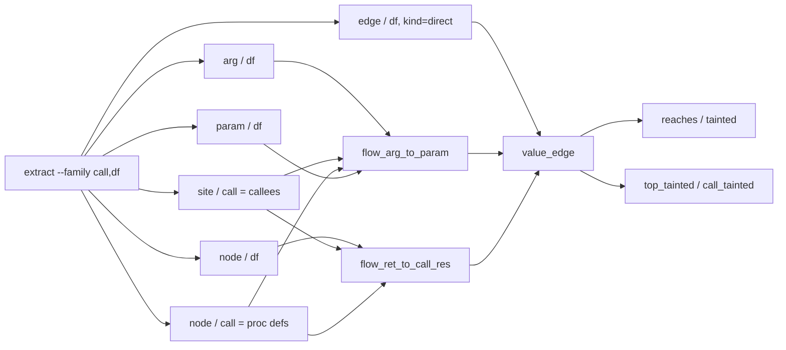

# cpg_taint_walk_golden

"Can a source value reach a sink" answered as recursive `.dl6` rules over the
edge facts `sprefa-extract` emits, graded byte-for-byte.

Run: `cd v6 && just cpg-taint-walk`

## TOC

1. The files
2. The corpus, one arm per file
3. What the walk consumes, and what it does not
4. The two walks
5. The rows this grades

## 1. The files

| file | what it is |
|---|---|
| `0_cpg_taint_walk.dl6` | the program: planes, hops, both walks |
| `1_schedule.json` | the single `want` arrival naming the corpus glob |
| `2_expected.walk.tsv` | the pinned answer, `rel` in column 1, sorted |
| `3_gate.sh` | the rig: rust door, tick-log fold, byte diff, five assertions |
| `corpus/*.rs` | four Rust files, never compiled, read only as bytes |

## 2. The corpus, one arm per file

Every arm exists so a specific way of being wrong shows up as a row.

| file | shape | must |
|---|---|---|
| `tainted_handler.rs` | source, one function boundary, sink | TAINT on both walks |
| `sanitized_handler.rs` | the same shape with `escape_sql` on the path | NOT taint |
| `unrelated_handler.rs` | a source and a sink with no path joining them | NOT taint |
| `two_site_handler.rs` | one helper called from two sites, one tainted | taint NAIVELY, NOT under the site index |

`unrelated_handler.rs` is the control a rig that taints every sink fails.
`two_site_handler.rs` is the control a rig with no call-site index fails.

Byte offsets are in `2_expected.walk.tsv`, so editing any corpus file moves them
and the gate goes red. The corpus is a pinned input, not a sample.

## 3. What the walk consumes, and what it does not

**`--family flow` does not exist.** `parse_mask` accepts exactly
cst/type/call/df (`v6/sprefa-extract/src/bin/extract.rs:487-501`) and errors on
any other name, so the arg-to-param and ret-to-call-res edges cannot be asked
for. The library *can* compute them: `flow_edges`
(`v6/sprefa-extract/src/types.rs:700-768`) is real code producing `ArgToParam`
and `RetToCallRes`, and `flatten_flow` (`src/wire.rs:256-268`) puts them on the
wire. Nothing in `src/bin/extract.rs` or `src/project.rs` calls either;
`tests/13_flow_join.rs:3-5` names the CLI dispatch as the follow-up.

So this program derives both hops from facts the CLI does emit, performing the
same join. Follow-up named **`extract-flow-cli-dispatch`** (not filed here; this
lane owns only this directory): dispatch `flow_edges` inside `resolve_project`
and give `parse_mask` a `flow` name, after which the two `flow_*` rels here
collapse into a direct read of the wire.

**The join key is the call START, never the whole span.** A `site` span covers
the callee name (`execute_sql` = 286..297); the `arg` record's `call` span
covers the whole call expression (`execute_sql(query_text)` = 286..309). They
agree on `start` and nothing else. Sabotage 3 in `3_gate.sh` is that mistake and
the receipt it prints.

## 4. The two walks

| walk | rule shape | answer on `two_site_handler.rs` |
|---|---|---|
| `reaches` / `tainted` | the anchor's context-insensitive closure over `value_edge`, `not(sanitizer_node(Mid))` on the extension | TAINTED, and it is a false path |
| `top_tainted` / `call_tainted` | the walk rel is indexed on the call site it descended through; the ascent rule reads that column | not tainted |

`cfl_blocked` is the difference. A row there is a false path the CFL call-return
discipline removed, and the gate grades it non-empty: an empty `cfl_blocked`
means the corpus stopped exercising the discipline.

Both walks are mutual pairs (`reaches`/`reach_hop`, `top_tainted`/`top_step`,
`call_tainted`/`call_step`), so no head reads itself directly, matching
`conformance/fixtures/24_mutual_recursion.pl` and `v6/dl/dataflow/report_extract.dl6`.

Termination is stated in the program header: monotone closure over a finite
product of extracted spans, kinds and call-site starts, with stratified negation
(`sanitizer_node` never depends on a walk rel).

## 5. The rows this grades

Eight rels are byte-diffed: `source_node`, `sink_node`, `sanitizer_node`,
`flow_arg_to_param`, `flow_ret_to_call_res`, `tainted`, `site_tainted`,
`cfl_blocked`.

Five assertion groups ride on top, and every emptiness claim is paired with the
population it was made over, because a rel that never arrived and a rel that
arrived empty read the same in a diff.
