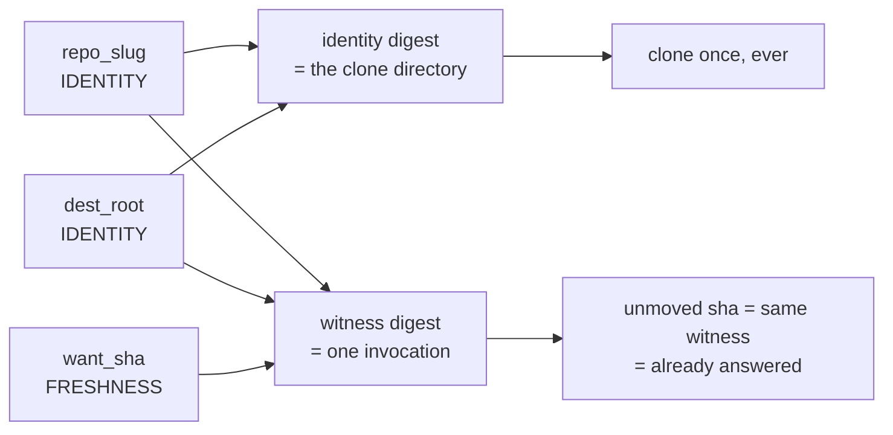
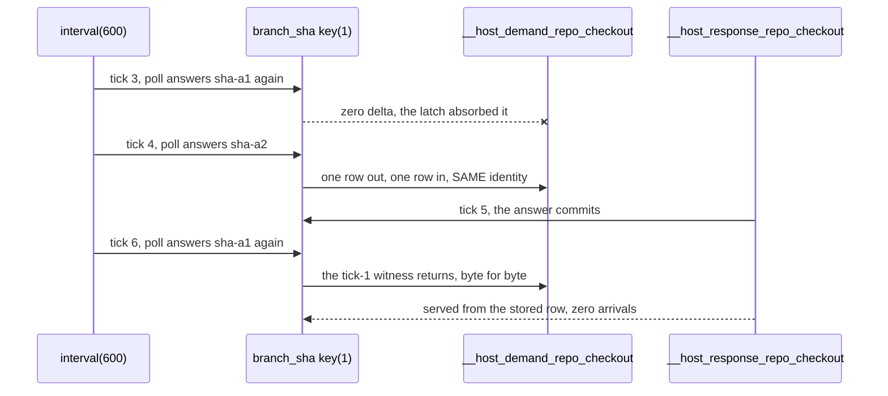
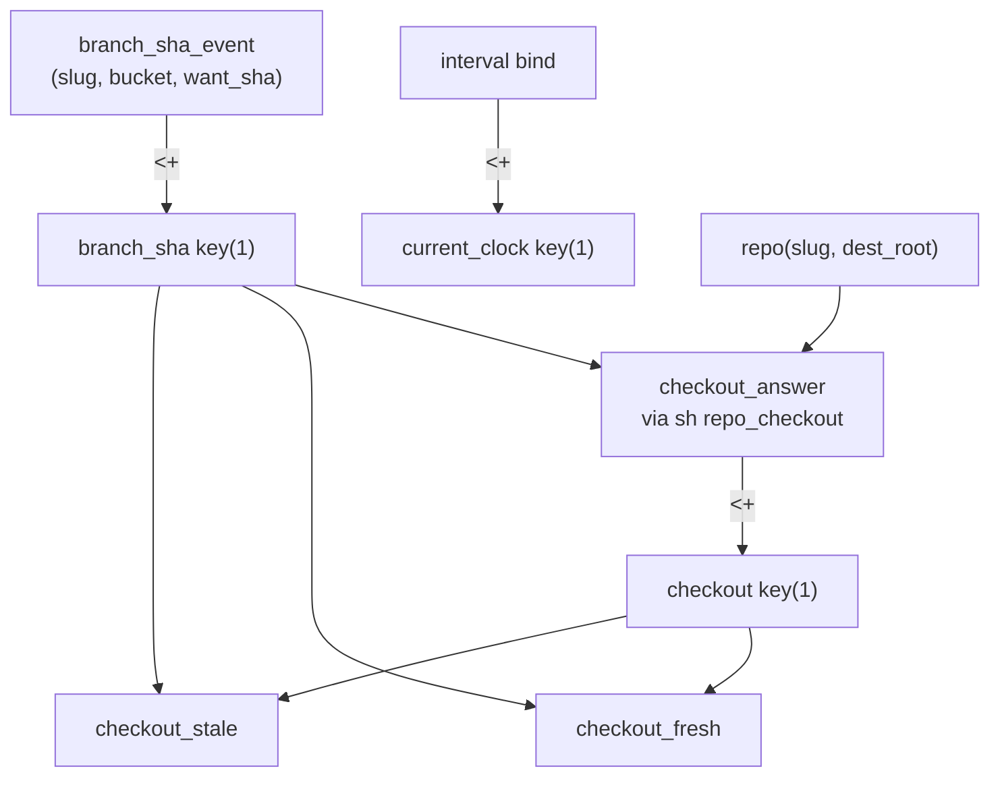

# Ghcacher clone/checkout golden

## TOC

1. [What holds](#1-what-holds)
2. [The sha gate, drawn](#2-the-sha-gate-drawn)
3. [The program](#3-the-program)
4. [Tick by tick](#4-tick-by-tick)
5. [The counts leg](#5-the-counts-leg)
6. [Fail-first receipts](#6-fail-first-receipts)
7. [Running it](#7-running-it)

---

## 1. What holds

| leg | what it grades | success text |
|---|---|---|
| byte diff, oracle door | the Prolog reference engine's exact tick log and final envelope | (silent `diff -u`) |
| byte diff, emitted door | the same for the SQLite runtime compiled from the same `.dl6` | (silent `diff -u`) |
| door vs door | oracle and emitted agree byte for byte | (silent `diff -u`) |
| counts, each door separately | the sha gate as named numbers | `SHA_GATE_COUNTS_HOLD door=oracle` / `door=emitted` |
| the gate | all of the above | `GHCACHER_CHECKOUT_GOLDEN_HOLDS ticks=8 final=1` |

Hermetic: the interval rows, the branch-sha answers, and the host response rows
all arrive through the schedule seam. No git, no `gh`, no network, no shell, no
wall clock.

Debt-mode constraint carried from `registry.pl`: host invocations stay serial
(`concatMap`, concurrency 1), so neither the contract nor this golden carries a
concurrency column.

## 2. The sha gate, drawn



Caption: `want_sha` salts the witness and stays out of the identity, so the
directory a repository lands in is a pure function of the two identity columns
while each distinct sha is one invocation. That single word in `registry.pl` is
the whole gate; there is no comparison code to get wrong.



Caption: three shapes, one per graded expectation. The clock advances on every
one of them.

## 3. The program



Caption: `checkout_fresh` and `checkout_stale` are the derived pair that reads
the gate out loud. Stale means the branch moved and the working copy has not
caught up; it exists only between the sha moving and the answer landing.

`current_clock` deliberately reaches no rule. It stands in the tick log as the
proof that the clock advanced on every tick while
`__host_demand_repo_checkout` stood still.

## 4. Tick by tick

| tick | committed batch | graded boundary result |
|---:|---|---|
| 1 | two `repo` rows, `interval(600,1)`, both branch shas | one `__host_demand_repo_checkout` row per repository, first appearance |
| 2 | both host responses | `checkout_answer`, the `checkout` latch, and `checkout_fresh` for both |
| 3 | `interval(600,2)`, both polls answer the SAME shas | `branch_sha` absorbs both to zero delta; `__host_demand_repo_checkout` has no key in this tick at all |
| 4 | `interval(600,3)`, `cli/cli` moves to `sha-a2`, `gh/gh` unmoved | exactly one row in and one out, same identity digest; `checkout_fresh` drops and `checkout_stale` appears for `cli/cli` only |
| 5 | the `sha-a2` host response | the `checkout` latch replaces its row, `checkout_stale` clears |
| 6 | `interval(600,4)`, `cli/cli` returns to `sha-a1` | the tick-1 witness returns byte for byte and `checkout_answer` comes back in the SAME tick with ZERO new arrivals: the stored response row already answers it |
| 7 | (drain) | the `checkout` latch catches up |
| 8 | (drain) | empty, quiescence |

Ticks 7 and 8 are the runner draining past the six scheduled batches. Measured,
not assumed: the `checkout` edge rule fires in-tick at ticks 2 and 5, where its
body moved because a host response ARRIVED, and one tick later at 7, where its
body moved because `branch_sha` (itself an edge-rule head) moved inside tick 6.
A second-order edge lands at the next boundary.

Final public state, both doors:

```text
checkout(cli/cli, /clones/cli/cli, sha-a1)
checkout(gh/gh,   /clones/gh/gh,   sha-b1)
checkout_fresh both, checkout_stale empty
```

`__host_response_repo_checkout` keeps all three answered witnesses. That is the
cache, and it is why tick 6 costs nothing.

## 5. The counts leg

`5_counts.ts` runs over each door's tick log separately, so neither inherits the
other's answer. Byte diffs prove the log did not move; these numbers say why the
log has the shape it has.

```text
tick  repo_slug  add  del  reading
   1  cli/cli      1    0  first appearance, cloned once
   1  gh/gh        1    0  first appearance, cloned once
   3  cli/cli      0    0  clock moved, sha did not
   3  gh/gh        0    0  clock moved, sha did not
   4  cli/cli      1    1  sha moved, exactly one witness
   4  gh/gh        0    0  neighbour sha did not move
   6  cli/cli      1    1  sha returned, witness already answered
   6  gh/gh        0    0  neighbour sha did not move
tick 2  rows=2  both first clones answer
tick 3  rows=0  nothing was asked
tick 6  rows=0  the returning sha is served from the stored answer
cli/cli    identities=1
gh/gh      identities=1
tick 6 witness equals tick 1 witness: true
   witness|repo_checkout|repo_slug:text=cli/cli|dest_root:text=/clones|want_sha=sha-a1
```

`identities=1` per repository is the clone-once property stated as a number: a
repository whose branch moved twice still presents one identity digest, so one
directory.

## 6. Fail-first receipts

Three ways of breaking the freshness role, each run against a scratch edit of
`v6/prolog/compile/registry.pl` (`freshness` to `identity` on `repo_checkout`)
and restored with `git checkout` afterwards.

### A. Role flipped, template untouched

The compiler refuses the program before any tick runs, because an identity
input must be named by the shell template:

```text
{"code":"template_mismatch/1","message":"rule-index unavailable: unsupported_construct: compiler refused rule 'template_mismatch' (template_mismatch)","range": {"end": {"character":0,"line":0},"start": {"character":0,"line":0}},"severity":1,"source":"dl6","uri":"file:///Users/chrishafley/projects/sprefa-lab-ghclone/v6/tsv2/goldens/ghcacher_checkout_golden/0_ghcacher_checkout_golden.dl6"}
ERROR: [Thread main] -g compile_dl6(...): rule-index unavailable: unsupported_construct: compiler refused rule 'template_mismatch' (template_mismatch)
```

Gate exit 2.

### B. Role flipped, template names `{want_sha}`

It compiles, and the emitted door dies at the arrival boundary: the response
table grew a `want_sha` column, so the schedule's response rows no longer fit.

```text
Error: arrival shape mismatch for __host_response_repo_checkout
    at validateArrivals (.../ghcacher_checkout_golden.ts:94:19)
    at Object.runTick (.../ghcacher_checkout_golden.ts:568:14)
```

Gate exit 1.

### C. Same break, oracle door alone

The pure signal. Byte diff red at tick 1, and the counts leg names the property
that died:

```text
-{"tick":1,...["identity|repo_checkout|repo_slug:text=cli/cli|dest_root:text=/clones","witness|...|want_sha=sha-a1",...]
+{"tick":1,...["identity|repo_checkout|repo_slug:text=cli/cli|dest_root:text=/clones|want_sha:text=sha-a1","witness|...|want_sha:text=sha-a1",...]
diff exit=1
```

```text
-- oracle: distinct identity digests per repo --
cli/cli    identities=2  <-- MISMATCH
gh/gh      identities=1
COUNT FAIL cli/cli: expected 1 identity digest, measured 2
counts exit=1
```

Reading: with `want_sha` in the identity digest, `cli/cli` presents a second
identity, which in production is a second clone directory for the same
repository. `freshness` is the one word standing between one clone and a clone
per commit.

## 7. Running it

```bash
bash v6/tsv2/goldens/ghcacher_checkout_golden/6_gate.sh
```

Measured wall: 1.0s. No `just` recipe is registered here; the justfile was out
of this lab's ownership.

Success is:

```text
SHA_GATE_COUNTS_HOLD door=oracle
SHA_GATE_COUNTS_HOLD door=emitted
GHCACHER_CHECKOUT_GOLDEN_HOLDS ticks=8 final=1
```

The mirror host `repo_mirror_pr_heads` carries the identical contract shape and
is not exercised here; a second golden over the same seam would grade it.
