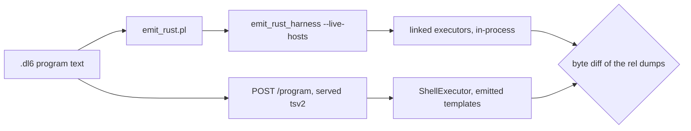

# scip_combo -- the diet-SCIP × soopy combination stress

Seven authored `.dl6` programs combining the hosted `sprefa-extract` and soopy
surfaces, each run on BOTH v6 doors over one pinned corpus and judged by byte
diff. One combination compiles and answers differently on the two doors; it is
pinned as its own minimal program.

```
cd v6 && just scip-combo
```

## Contents

1. [The two doors](#the-two-doors)
2. [The corpus](#the-corpus)
3. [The combination table](#the-combination-table)
4. [Findings](#findings)
5. [The failure table](#the-failure-table)
6. [Files](#files)

## The two doors



| host family | Rust door | TS door |
|---|---|---|
| `files`, `files_at`, `repo_files`, `repo_files_at` | SoopyFilesExecutor, `hosts.rs:52-60` | the template's `git` pipeline |
| `sprefa_extract`, `sprefa_extract_repo` | SprefaExtractExecutor, in-process | spawn of `$DL_EXTRACT_BIN` |
| `dep_crawl_repo/visited/edge/unresolved` | DEP_CRAWL, in-process | no arm; the templates `exit 3` |

Nothing else in the tree compares a linked twin against the template it claims
to be equivalent to.

## The corpus

`0_corpus.sh` calls `../multirepo_crawl/1_corpus.sh` byte-unmodified for commit
A, then adds commit B. `just multirepo-golden` keeps its own corpus digest; no
`go.mod` is touched.

| repo | commit A | commit B | why |
|---|---|---|---|
| alpha | go.mod, main.go | + `src/core.ts`, main.go REWRITTEN | defines `shared_helper`, `alpha_only`; the rewrite arm |
| beta | go.mod, main.go | + `src/use.ts`, then left DIRTY | calls `shared_helper`; the uncommitted-bytes arm |
| gamma | go.mod, main.go | + `src/use.ts`, main.go DELETED | calls `alpha_only` and `ghost_call`; the deletion arm |
| shared | go.mod, main.go | + `NOTES.md` | reached by every seed, holds no `.ts`; the zero-extraction arm |

`ghost_call` is defined in no repository and `golang.org/x/sync` is required by
one. Both are negative controls: a rig that resolves every name, or calls every
module skewed, passes a corpus that cannot contradict it.

## The combination table

| # | program | combination | doors | verdict |
|---|---|---|---|---|
| 1 | `1_rev_file_skew` | `repo_files_at` rev A ⋈ rev B, three set differences | both | agree; the rev-A feed is now verified |
| 2 | `2_extract_rev_skew` | rev-pinned file set fed to `repo_extract` vs the worktree set | both | agree; the pin does not reach the extraction |
| 3 | `3_span_in_file` | def spans ⋈ `--file-fact` extents, containment both ways | both | agree; 0 escaping spans, 0 orphans |
| 4 | `4_crawl_extract` | `dep_crawl` visits → file feed → extraction, per family | Rust only | 4 barren rows, 0 rootless visits |
| 5 | `5_cross_repo_ref` | call sites in X ⋈ defs in Y, name level | both | agree; 2 cross, 1 local, 2 dangling |
| 6 | `6_door_skew_files_at` | ONE rev-pinned feed, shrunk | both | agree; the phantom row is gone |
| 7 | `7_door_skew_family` | ONE extract host, `--family diet_scip` | both | **PINNED disagreement** |

Every program compiles through `emit_rust.pl`; nothing in this directory is in a
refusal bucket of `v6/prolog/compile/out/manifest.json`.

## Findings

### F1 -- a rev-pinned file feed over-answered on the TS door (FIXED)

`6_door_skew_files_at.dl6`, and `1_rev_file_skew.dl6` is what it cost a real
query. One repository, one revision, one glob, before the fix:

| door | rows | the extra row |
|---|---|---|
| Rust | 2 | -- |
| TS | 3 | `src/core.ts` with digest `<rev>:src/core.ts` |

Measured mechanism, both halves:

| step | command | behaviour |
|---|---|---|
| enumerate | `git ls-files --with-tree=<rev>` | answers the UNION of index and tree |
| resolve | `git rev-parse <rev>:<absent>` | exits 128, `fatal:` to stderr, ECHOES ITS ARGUMENT to stdout |
| guard | `[ -n "$oid" ]` | passes on the echo, prints the row |

So absence became a row carrying the argument string in a `text` digest column,
which no type check can catch. The consequence in `1_rev_file_skew`, before the
fix:

| rel | Rust | TS |
|---|--:|--:|
| `base_file` | 8 | 12 |
| `added_path` | 4 | **0** |
| `rewritten_path` | 1 | 5 |

"Which files are new since a base revision" answered NOTHING on the TS door.

The declaration's own header claims the opposite, in these words at
`v6/dl/fixtures/files-hosts.dl6:62-64` and again at
`v6/dl/fixtures/v5-git-diags.dl6:77-79`: "`rev-parse` fails, the guard drops it,
and it is no row". The guard tests whether git PRINTED, not whether it
SUCCEEDED.

Seven authored declarations carry it:

| file:line | host |
|---|---|
| `v6/dl/fixtures/files-hosts.dl6:66` | `files_at` |
| `v6/dl/fixtures/files-hosts.dl6:102` | `repo_files_at` |
| `v6/dl/fixtures/crawl_org.dl6:100` | `repo_files_at` |
| `v6/dl/fixtures/v5-git-diags.dl6:113` | `files_at`, the `precommit-changed` rail |
| `v6/dl/fixtures/v5-git-diags.dl6:119` | `files_at_ws` |
| `v6/dl/fixtures/flagship-flow.dl6:19` | `files_at` |
| `v6/dl/fixtures/flagship-callgraph.dl6:80` | `files_at` |

The fix is BOTH halves, measured as sabotage receipt 1 in `8_gate.sh`: applying
only the first makes the TS door answer ZERO rows, because `&&` leaves the
loop's exit status at 1 when the last path is the absent one and a nonzero exit
is a host failure.

```sh
oid="$(git rev-parse --verify --quiet '{rev}':"$entry")"
if [ -n "$oid" ]; then printf '%s %s\n' "$entry" "$oid"; fi
```

APPLIED to the three goldens templates that carry the guard -- `1_rev_file_skew`,
`2_extract_rev_skew`, and `6_door_skew_files_at` -- so 6 and 1 now agree across
the doors. The seven fixture declarations above still carry the bare guard;
they are outside this lane's ownership (`v6/dl/fixtures/**`) and stay listed as
the remaining surface.

### F2 -- `--family diet_scip` answers rows on one door and silence on the other

`7_door_skew_family.dl6`. One extract host, one family name.

| door | `resolved_edge` rows |
|---|--:|
| TS | 2 |
| Rust | **0** |

`--family` carries two kinds of value and only one crosses the seam.

| kind | names | CLI | in-process twin |
|---|---|---|---|
| mask | `cst`, `type`, `call`, `df` | per-file mask | read |
| mode | `scip`, `diet_scip` | whole-project pass, `extract.rs` `family_mode/1` | DROPPED on the `_ => {}` arm |

An unknown name leaves `FamilyMask::NONE`, `dispatch` answers nothing, the host
answers zero rows, and the run succeeds. The same file refuses an unknown FLAG
by name ("flag ... is not linked in-process"); an unknown `--family` VALUE gets
the silence that arm exists to prevent. `--family scip` is the same hole over
the real SCIP index plane.

Nothing downstream can catch this: an empty response rel is a legitimate answer
(a file with no call sites), so only a both-door diff over one program makes it
a row.

### F3 -- pinning the file set does not pin the extraction

`2_extract_rev_skew.dl6`, and both doors agree about it. Two independent
reasons:

1. the extract host's template ends in `{repo}/{path}` and the executor opens
   that path on the FILESYSTEM; no revision reaches it;
2. `digest` is a FRESHNESS input (`registry.pl:402-404`), so it extends the
   witness and never returns on the response row -- two demands under two
   digests are two witnesses and ONE response identity.

Measured on the dirty-worktree arm: `pinned_digest_skew` has a row, and the
HEAD-pinned feed still extracts `beta_uncommitted`, a callable that is not at
HEAD. `worktree_only_proc` and `pinned_only_proc` are both empty over 6 rows of
`agreed_proc`.

### F4 -- a name-level ref chase over-reports method calls

`5_cross_repo_ref.dl6` reports `trim` (from `label.trim()`) as a dangling ref
alongside `ghost_call`. Accurate for what the rel says -- a `site` record whose
callee no repository under scan defines -- and the reason the program says
name-level in its header rather than calling the result a resolution.

## The failure table

Combinations this lane could not spell, each with the file:line it blocks on.
No file outside `goldens/scip_combo/**` and `v6/justfile` was edited.

| # | combination | blocks on | shape |
|---|---|---|---|
| B1 | two repo-scoped extract hosts, one per feed, each with its own response identity | `registry.pl:394-449` `host_input_contract` keyed on hardcoded host NAMES; the fallback is `identity_roles/2` at `registry.pl:526-534`; throw at `1_host_expand.pl:301` | `template_mismatch(unreferenced_input(digest))`. `repo_extract` is the ONLY repo-scoped name holding `(identity, identity, freshness)`. Already filed: `ARCH.pl:879` defect D1 |
| B2 | a repo-scoped program reading `node` AND `site` records | same as B1 | one name, one output projection, and `carriesEveryColumn` drops a row missing any declared column. Worked around in 3 and 5 by the UNSCOPED `(path, digest)` names plus a `concat`ed absolute path |
| B3 | naming a new extract host after what it does | same as B1 | `call_node_at`, `call_ref`, `extract` are used as the names the registry ALLOWS, not as descriptions. The dl6 headers say so where it reads oddly |
| B4 | `4_crawl_extract` on the TS door | `hosts.rs` DEP_CRAWL is Rust-only | not a defect: the four templates `exit 3` so a fall-through stops by name. Assertion 0 pins that |
| B5 | fixing F2 in place | `v6/sprefa-engine-rs/src/**` and `v6/sprefa-extract/src/**` are outside this lane's ownership | the fix is written out above and in the 7_door_skew_family header |

Also observed and not chased: `registry.pl:361-366` describes the repo-scoped
template test as CONTAINS, while the code at `:369-373` is
`sub_string(Template, _, 13, 0, "{repo}/{path}")`, an ENDS-WITH. The crawl-bench
template the comment cites as the reason for CONTAINS would be refused by the
code as written.

## Files

| file | role |
|---|---|
| `0_corpus.sh` | wraps `../multirepo_crawl/1_corpus.sh`, adds commit B, writes `REVS.tsv` |
| `1_rev_file_skew.dl6` .. `7_door_skew_family.dl6` | the seven programs |
| `8_gate.sh` | both doors, the diff, the shape assertions, three sabotage receipts |

Gate classes, one per program and no program in two:

| class | programs | rule |
|---|---|---|
| pinned | 7 | MUST differ; agreement fails the gate |
| agreeing | 1, 2, 3, 5, 6 | any difference is unexplained and fails |
| one-door | 4 | Rust only, proven by its own `exit 3` templates |
