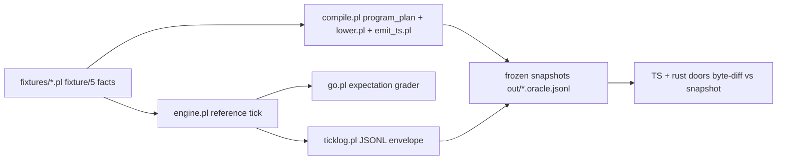

# Slice 11 audit: conformance corpus and semantic oracles

Scope read: `v6/prolog/conformance/` (rulings.pl, engine.pl, body.pl, level_eval.pl,
ticklog.pl, go.pl, FIXTURES.md, 70 fixture files / 449 `fixture/5` facts, probes/),
`v6/prolog/compile/test/` (plunit_tests.pl plus 25 focused test files, 94 test
suites / 1108 unit tests), `v6/prolog/0_program_check.pl`, `0_body_walk.pl`,
`compile/registry.pl` as direct callees.

The conformance tier is two doors over one law set:



DL7 replaces the reference engine and the compiler IR; the snapshots and the
fixture expectations are the parity contract. Per `0_SHARED.md`, fixtures and
test files are the `oracle` class; the reference engine predicates split
between `oracle` (the law statements), `adapt` (the value/goal layer), and
`drop` (DL6 surface spellings).

## 1. Semantic laws by first V7 component that must preserve them

| # | Law | Ruling / source | First V7 owner |
|---|---|---|---|
| L01 | Occurrence identity: events carry `(tick, seq)` stamps; order and multiplicity survive; folds chain per occurrence; store retains a support count as bookkeeping | `rulings.pl:14` q1 `hybrid_stamps_plus_support_count` | runtime |
| L02 | Rel kind is an explicit declaration word; set = membership dedup, log = occurrence append | q2/q3 `rulings.pl:21-25` | reader |
| L03 | Edge-written rows arrive for T+1, never same-tick, never dropped | q4 `rulings.pl:27` | runtime |
| L04 | Engine self-schedules drain ticks while carry remains nonempty, capped loudly | q5, `engine.pl:691-698` drain_cap(100) | runtime |
| L05 | Trigger marker is explicit per-atom (`only/1`); unmarked bodies keep any-atom | q6 `rulings.pl:38` | checker |
| L06 | Aggregate multiplicity is a BAG of derivations | q7 `rulings.pl:44` | lowerer |
| L07 | Aggregate heads (count/sum/min/max/json_array/json_object/group_concat) are reserved head-column forms, level rules only; edge heads refuse | q9, `engine.pl:164-173` check order | checker |
| L08 | Retention: `keep <bound>` REQUIRED on log rels; tick-prefix prune; count(N) lowers to a retracting rule | q10 + `retention_count_lowering` | lowerer |
| L09 | Boundary delta shape: multiset per new stamp on log rels, set diff (removals first) on set/level rels | r7, `engine.pl:580-611` | runtime |
| L10 | Keyed write = replace, equal-row write = no-op, one-occurrence same-key conflict throws `keyed_conflict/3`, cross-occurrence later write wins | FIXTURES.md rules; `engine.pl:493-511` | runtime |
| L11 | `pre/1` reads the EVOLVING store (T-1 first, later occurrences chain); `pre/2` adds only the no-prior seed | r6 + `pre_seed` | runtime |
| L12 | Departure: `finalize/1` is a next-tick departure trigger on set/level rels, never a read | r4, `engine.pl:317-357` | runtime |
| L13 | EDB = defined by absence: a rel no rule heads is pure subject; facts on a never-headed rel seed EDB rows | `edb_definition` `rulings.pl:301` | checker |
| L14 | `keyed_level_head` = named unsupported construct (compile error, both doors) | `keyed_level_head` `rulings.pl:350` | checker |
| L15 | Arrivals are ordered lists, duplicates meaningful for log; `-Row` into a log throws `retract_from_log/1` | FIXTURES.md; `engine.pl:383-406` | runtime |
| L16 | Level evaluation is stratified: negated and aggregated rels strictly below consumers; `not_stratified` on cycles; aggregates recompute over fixpoint alternation | `level_eval.pl:1-8`, plunit stratum_order | lowerer |
| L17 | Arithmetic is int-only, `/` truncates, `mod` int-only, non-int operand throws `arith_on_non_int/2` | `body.pl:294-302` | lowerer |
| L18 | Text scalars match SQLite exactly: ASCII-only upper/lower/initcap, space-only bare trim, substr negative-start semantics, leftmost-occurrence split | `body.pl:95-292` (probed receipts in comments) | lowerer |
| L19 | JSON canonical form: braces literal -> `obj(keysorted pairs)`, dup key throws `json_dup_key/1`, `none` IS json null inside documents but a top-level row atom `none` stays the string "none" | `body.pl:323-350`, `ticklog.pl:169-175` | emitter |
| L20 | decode/2 nondeterminism is the semantics: spread/key-capture/`**` descent fan out one solution per SQL join row; object patterns open; typed captures filter | `body.pl:402-525` | lowerer |
| L21 | RFC 7396 merge patch, with `none` merging as a value (never a deletion) | `body.pl:357-398` | lowerer |
| L22 | Capture-type table int/float/text/bool is clause-twin with lower.pl; unknown type name throws `json_capture_type_unknown/1` | `body.pl:470-491` | lowerer |
| L23 | Tick log envelope: `{"tick":N,"deltas":{...}}`, canonical JSON text, add/del sorted lexicographically by own JSON text, identical escape set clause-twin with 0_type_plane.pl | `ticklog.pl:1-220` | emitter |
| L24 | Float wire text: shortest round trip, no `.0` suffix, js_float_text rendering; `-0.0` canonical boundary | `ticklog.pl:103-130`, 5_value_plane fixtures | emitter |
| L25 | Bool = strict 2VL column type; non-boolean at a bool position = named unsupported construct (type_gate_widening) | `bool_column_type` + `type_gate_widening` `rulings.pl:399,540` | checker |
| L26 | Int beyond 2^53-1 = named unsupported `int_out_of_range` at every reach point including json capture read-back | `wide_int_fate` `rulings.pl:542` | checker |
| L27 | Decl-type arrival gate: all declared column types, all positions, all-or-nothing per rel; SQLite affinity coercion where types CAN mix (int widens at REAL column) | `type_gate_widening`; `engine.pl:121-176` check order | checker |
| L28 | World row canonicalization: decl induces field order; arrival key order insignificant; missing/unknown/wrong-type named | `struct_arrival_key_order`; `engine.pl:631-641,658-672` | reader |
| L29 | Struct storage = struct-as-rows: declared struct value is a rel row referenced by content id; parent columns store the ref | `compound_storage` `rulings.pl:370` | lowerer |
| L30 | List flavors: four named constructors; bare `list(T)` = dense+owned+sequence; `json_list(T)` is the one json spelling at every layer; content-interned list dictionary, boundary prints rendered text never ids | `list_flavor_set_v1`, `list_bare_default_dense_owned_sequence`, `json_list_one_spelling` `rulings.pl:713-725,435`; `body.pl:443-468` | lowerer |
| L31 | Content-interned list minting is monotone: first appearance wins, counter mirrors emitted `__id` autoincrement (final-state byte diff contract) | `body.pl:452-462` | emitter |
| L32 | Acyclic companion: arrival-time chain walk from a `option(rel)` self-referencing column; cycle throws `parent_cycle/2` | `acyclic_guard_spelling`; `engine.pl:408-425` | checker |
| L33 | Recursion refusals at both doors: multiple self-reads, built text in recursive head, built list in recursive head throw the same terms | `engine.pl:190-233` twin of lower.pl 5205/5260/5264 | checker |
| L34 | Oracle check-order contract: `engine_check_order/1` is fixture data; both doors report the SAME class for a program violating two classes | `engine.pl:110-176` | checker |
| L35 | Subscription cone: strict `subscribes_nothing` when no query exists; scope-coverage static check (every rel derived under a scope carries the scope key) | `zero_query_semantics`, `subscription_kernel` `rulings.pl:188,575` | checker |
| L36 | one() pick = arrival order per tick, both doors; merge semantics, never concat | `one_pick_order` `rulings.pl:584` | runtime |
| L37 | Ingress transaction: one tick dequeues one explicit list of events; no engine-manufactured coalescing | `tick_boundary` `rulings.pl:596` | runtime |
| L38 | Retention head conflict: two edge arms on a log head with keep(count(N)) refused (`retention_head_conflict_risk`), arm order is source line order for survivors | `bounded_log_arm_order` `rulings.pl:556` | checker |
| L39 | N+1 law at lowering tier: statements per tick = f(rules, strata) never f(rows); delta arms = one per positive body item (+ per coalesce goal), never 2^N | `n1_statement_budget`; plunit `delta_arm_count` | lowerer |
| L40 | Rows stay in sqlite, host sees deltas; zero full-table reads into JS in the tick path | `host_residency`, `js_never_the_row_engine` `rulings.pl:312,743` | emitter |
| L41 | Catalog is user-program rel declarations materialized into the compiled program db; oracle goes meta and mints catalog rows in ticklog | `catalog_universe`, `catalog_oracle_meta` | lowerer |
| L42 | Executor namespacing: dotted question names, registry roster = linked executors, module `use` binding; `sh`/`bind` surface words dead, arrival rel is the only spelling | `executor_namespacing`, `executor_modules_use_import`, `sh_bind_surface_removed` | reader |
| L43 | Effects: one relation, rightmost response columns, effect-ness from a bind at link time, no decl arrow | `effect_decl_no_arrow`, `arrival_arrow_spelling`, `arrival_identity_spelling` | reader |
| L44 | Cycles in `use` graph refuse with the chain named (on-stack throw); ESM sketch parked | `mount_mutual_cycles_deferred`; plunit `use_cycle_refuses_naming_the_chain` | scope resolver |
| L45 | Mount aliases additive (soft links, bare names stay); inner alias private; re-export spelled `pub use` | `mount_alias_additive`, `mount_inner_alias_private`, `export_signifier_pub` | scope resolver |
| L46 | Expression fusion: comparisons/arithmetic/string expressions fuse into emitted SQL deltas; TS deopt only where sqlite lacks the function | `expression_residency`, `udf_residency` | emitter |
| L47 | Null design: absence stays row absence; `get_else/2` at use site; `option(T)` = per-instance some/none ids, one mints enum per element type | `null_design`, `option_surface` `rulings.pl:484,638` | lowerer |
| L48 | Template bounds: bounds inside parameter parens; unsatisfied bound names the path; one minted instance per ground parameter combination | `template_bound_spelling`; 21_template_bounds fixtures | type/comptime closure |
| L49 | seq column sugar = one expansion stamping a cursor rel + four rules (M2 wire); latest over a log rel refuses naming max(Ordinal) | `seq_sugar`, `latest_over_log` | lowerer |
| L50 | Wide-int / arrival-gate / type-cycle checks run at the load boundary (before any tick applies), never half-applied | `engine.pl:658-672` | checker |

### Component assignment summary

| Component | Laws | Sharpest receipts |
|---|---|---|
| reader | L02, L28, L42, L43 | canonicalize_world_rows; arrival arrow desugar to sh_decl/4 |
| scope resolver | L44, L45 | use_cycle throw; alias soft-link |
| type/comptime closure | L48 | template bound path naming |
| checker | L05, L07, L13, L14, L25, L26, L27, L32, L33, L34, L35, L38, L50 | engine_check_order/1 (the shared order is the contract) |
| lowerer | L06, L08, L16, L17, L18, L20, L21, L22, L29, L30, L39, L41, L47, L49 | delta_arm_count; level_closure stratification |
| emitter | L19, L23, L24, L31, L40, L46 | ticklog envelope byte diff |
| runtime | L01, L03, L04, L09, L10, L11, L12, L15, L36, L37 | tick/7 is the whole law statement |

## 2. Oracle predicate blocks

```prolog
% File: v6/prolog/conformance/engine.pl:537
% Existing comment: THE TICK, state(Tick, Store, PrevLevel, PrevAll)
% Signature: tick(+Prog, +state(T,S0,PL,PA), +CarryIn, +Arrivals, -state, -CarryOut, -Deltas)
% Called by: run_ticks/7 (engine.pl:687,696)
% Calls: absorb_arrivals/7, level_closure/6, process_occurrences/5, apply_retention/3,
%        boundary_deltas/6, stamp_extra/4, listened_departure_refs/2
% Tests: every fixture via go.pl; FIXTURES.md rules section
% V7 class: oracle
% Parser coupling: none (operates on prog(Decls,Rules) term post-expansion)
% Preserved law: L01,L03,L04,L09,L10,L11,L12,L15 in one stated order (header engine.pl:5-33)
% DL7 seam: in: expanded prog + store + carry + ordered arrivals; out: new store,
%   carry list, boundary delta multiset. DL7 keeps the tick phase order as the spec.
```

```prolog
% File: v6/prolog/conformance/engine.pl:178
% Existing comment: load-time program checks; this door's ORDER and exception vocabulary
% Signature: check_program(+Program)
% Called by: run_program/5; plunit_tests.pl units
% Calls: first_violation/3 (shared 0_program_check), clock_violation/2, recursion_refusal/2
% Tests: plunit_tests.pl aggregate/pre/finalize/level units; door_split_trigger_literal.pl
% V7 class: oracle
% Parser coupling: none
% Preserved law: L34 (same class for a two-class program at both doors); order is fixture data
% DL7 seam: in: expanded program; out: throw(Term) with bare-term vocabulary; V7 checker
%   must reproduce the ORDER list or restate it as its own fixture-visible contract.
```

```prolog
% File: v6/prolog/conformance/body.pl:40
% Existing comment: expressions; evaluation is the default, goals left to right
% Signature: eval_expr(+Expr, -Value), solve(+Body, +ctx(Visible,PreState,Tick))
% Called by: engine.pl solve sites, level_eval.pl, ticklog.pl (json_canon)
% Calls: expression_for_term/5 (compile/registry), json_canon/2, json_decode/2, solve_comparison/1
% Tests: expressions.pl, operators.pl, 10_text_scalars.pl, 12_string_substr_instr.pl,
%        13_initcap.pl, 15_string_split.pl, 16_string_affix_tests.pl, 8_json_flex.pl,
%        json_patch_fold.pl, plunit json units
% V7 class: adapt
% Parser coupling: term-shape (braces literals, := op, comparison ops as terms)
% Preserved law: L17,L18,L19,L20,L21,L22; evaluation is the default (value/goal duality)
% DL7 seam: DL7 is Lisp-shaped cons trees with `:` binder; the entire value-layer
%   term vocabulary ({}(Fields), :=, comparison functors) must re-enter through the
%   reader's new term shapes. The SEMANTIC tables (substr semantics, patch algebra,
%   capture types, ascii-only folds) port clause-for-clause.
```

```prolog
% File: v6/prolog/conformance/level_eval.pl:56
% Existing comment: level closure with aggregates; stratified, q7 bag, q9 reserved forms
% Signature: level_closure(+Decls, +PlainLevel, +AggRules, +Base, +Tick, -Level)
% Called by: tick/7 (twice: mid and final), run_program/5
% Calls: aggregate_head/3 (registry surface dispatch), rows_index/2, canonical_json_text/2
% Tests: 9_ordered_aggregates.pl, ordered_level_fixpoint.pl, json_arm.pl, one_vs_any.pl
% V7 class: oracle
% Parser coupling: term-shape (aggregate head functors)
% Preserved law: L06,L16 (bag multiplicity; plain/aggregate fixpoint alternation; strata)
% DL7 seam: same shapes, head template re-spelled in DL7 terms.
```

```prolog
% File: v6/prolog/conformance/ticklog.pl:97
% Existing comment: envelope formatting; canonical JSON, clause-twin escape set with 0_type_plane
% Signature: value_json(+Value, -Json), tick_line(+Tick, +Deltas, -Line)
% Called by: emit/1,2, emit_perturbed/1 (snapshot minting)
% Calls: run_program/5, json_canon/2, js_float_text/2, escape_json_codes/2
% Tests: out/*.oracle.jsonl snapshots; byte-diff grading vs TS + rust doors
% V7 class: oracle
% Parser coupling: none (term->text only)
% Preserved law: L19,L23,L24 (canonical JSON text is a cross-target contract graded by byte diff)
% DL7 seam: keep verbatim as the minter; it depends only on run_program's delta shape.
```

```prolog
% File: v6/prolog/conformance/rulings.pl:1
% Existing comment: the ruling queue as facts; a later override is one fact flip + regrade
% Signature: ruling(Id, Choice, Source, Receipt)
% Called by: engine.pl (documentation), human review
% Calls: none (facts)
% Tests: none directly; each ruling names its receipt
% V7 class: extract
% Parser coupling: none
% Preserved law: every law above cites its ruling id; the queue is the normative record
% DL7 seam: port verbatim; V7 language rulings append rows, never rewrite.
```

```prolog
% File: v6/prolog/conformance/go.pl:24
% Existing comment: check/2 expectation grader, auto-loads every fixture file
% Signature: fixture_expectations_hold(+Name, +Expectations)
% Called by: go/0
% Calls: engine:fixture_expectations_hold/2
% Tests: the 449 fixture/5 facts themselves
% V7 class: oracle
% Parser coupling: op declarations <- <+ :=
% Preserved law: expectation vocabulary final/deltas/ticks/throws is the fixture contract
% DL7 seam: unchanged; DL7 fixtures keep the same five-argument fixture/5 shape.
```

Not blocked per-predicate (support code): `go.pl:13` load_fixture_files/0
(extract), `engine.pl:304-360` store views (extract, plain term store),
`engine.pl:449-515` occurrence processing (oracle; carries L10/L12),
`body.pl:568-585` rows_index/2 (performance only, drop in V7 oracle, keep
behavior), `level_eval.pl` list_boundary_rows/4 (oracle; L31's boundary print).

## 3. Minimal V7 parity corpus

70 fixture files / 449 fixtures do not mean 70 ports. The corpus collapses into
12 law clusters; within a cluster, fixtures are near-duplicates. Proposed
minimal corpus (file -> laws -> fixtures to carry forward):

| Cluster | Laws | Keep (files) | Drop |
|---|---|---|---|
| tick/occurrence core | L01,L03,L04,L09,L11,L15 | temporal_pipe.pl, occurrence_identity.pl, check_eventing.pl, merge_family.pl, engine_core.pl, seq_wire.pl | resident_coroutine.pl, one_rel_with_arrivals_probe.dl6 (probes/ cover it) |
| keyed/set writes | L10 | switch_as_keyed_replace fixtures (in merge_family.pl, engine_core.pl), one_vs_any.pl | order_by_read.pl (redundant with deltas grading) |
| level/stratification | L16,L06 | ordered_level_fixpoint.pl, 9_ordered_aggregates.pl, 9_pr_size.pl | 5_compiler_quality.pl (keep 2 fixtures, drop rest) |
| value plane | L17,L18,L25,L26 | 5_value_plane.pl, 10_text_scalars.pl, expressions.pl, operators.pl | 12_string_substr_instr.pl, 13_initcap.pl, 16_string_affix_tests.pl (SQL-identical behaviors; keep one) |
| json arm | L19,L20,L21,L22 | 8_json_flex.pl, json_arm.pl, json_patch_fold.pl, 1_match_block.pl | body_words.pl (checker unit covers), door_split_trigger_literal.pl |
| types/structs | L28,L29,L30 | 4_struct_values.pl, 0_option_type.pl, 13_option_list_columns.pl, 17_recursive_enum.pl, 0_enum_variants.pl | 11_variant_field_types.pl, 25_parameterized_enum.pl (keep 1 of 2), 18_recursive_list_arg.pl, 21_list_mint_order.pl, 19_list_value_position.pl, 0_list_text_door.pl, 14_option_wrapper_walk.pl |
| recursion/refusal | L33 | 3_flagship_callgraph.pl, 23_diverging_recursion.pl, 24_mutual_recursion.pl, recursion_throw_pins.pl | 6_relation_depth.pl |
| modules/scopes | L44,L45,L42 | 7_module_path.pl, 7_module_path_element.pl, 7_module_path_wrapper.pl, scopes.pl | spine_semantics.pl, shell_stream.pl (sh/bind surface dead per sh_bind_surface_removed) |
| effects/arrival | L43,L36,L37 | 2_hosts_wiring.pl, 5_flow_value_plane.pl, 4_flagship_flow.pl | shell_stream.pl, 20_parent_chain.pl (acyclic covered by unit) |
| templates | L48 | 21_template_bounds.pl | 0_generic_expand.pl (golden only), 0_decl_order.pl (unit-pinned) |
| retention/stream | L08,L38,L49,L47 | 7_coalesce.pl, 10_list_elements.pl, affinity_drop.pl | timeless_rail.pl (632 lines, mostly spine residency; keep 2 fixtures), state_machine.pl |
| cross-door contracts | L23,L24,L31,L34,L39,L40 | 5_value_plane.pl (float wire), 0_generic_expand.golden, 0_list_flavors.golden | dd_panel.json / dd_panel_export.pl (UI artifact, not a language oracle) |

Count: 70 files -> 12 clusters, 38 files carried, of which 8 are load-bearing
(temporal_pipe, occurrence_identity, engine_core, 5_value_plane, 8_json_flex,
3_flagship_callgraph, 7_module_path, 21_template_bounds). Everything else in a
cluster is a variant over the same engine code path.

Plunit side: the 1108 units are cheap (no fixtures to port); port by module
dependency, not by file. The plunit_tests.pl suites that travel FIRST with
their modules: stratum_order, column_naming, rel_record, delta_arm_count
(L39's count receipts), sql_text_snapshots, relplan_reference_targets, audit_scan_index_ddl. Focused test files map 1:1 to components (scope resolver:
use_resolve via 2_subscribe.plt + use-cycle unit; type closure: type_relation_ir,
typegen_golden; checker: 0_graph, annotation_surface, anonymous_*; emitter:
emit_type_renderers, 0_storage_projection, emit_rust; lowerer:
query_order_tail, shared_frontier, compiler_relations).

## 4. Canonical term shapes

Entering the oracle slice (post-expansion, both doors):

- `prog(Decls, Rules)`; decls: `kind(Ref, set|log)`, `keyed(Ref, Positions)`,
  `keep(Ref, all|count(N))`, `col_type(Ref, Name, Type)`, `type_decl(Name, Cols)`,
  `enum_decl(Name, Variants)`, `sh_decl(N, Ins, Outs, Template)` (arrival arrow
  desugar target), `query(N, Atom, _)`.
- Rules: `(Head <- Body)` level, `(Head <+ Body)` edge; body goals per
  FIXTURES.md vocabulary; store rows `srow(Row)` / `lrow(st(Tick,Seq), Row)`;
  occurrences `occ(Stamp, Row)` / `dep(Row)`; json values `obj(SortedPairs)`,
  lists, `bool_lit(B)`, `json_null` -> `none`.

Leaving:

- `fixture/5` expectations: `final(Ref, SortedRows)`, `deltas(Ref, PerTick)`,
  `ticks(N)`, `throws(Term)`.
- Tick log line: `{"tick":N,"deltas":{"rel":{"add":[[...]],"del":[[...]]}}}`.
- Compiled door: `plan(...)` -> `lowered(Ddl, ArrivalStmts, EdgeStmts,
  LevelStmts, Boot, Catalog, Intern, _)` with `edgestmt/8`, `arrivalstmt/6`,
  `levelstmt/8`, `arrivalstmt/6` terms; snapshots as JSONL.

## 5. Hidden state and ordering dependencies

- `body.pl:447` `nb_setval(list_mint, ...)` non-backtrackable global: list id
  minting is deliberately monotone across backtracking (`list_mint_reset/0`
  at every `run_program/5` entry). Any V7 value layer must preserve
  monotone minting or the final-state byte diff breaks.
- `engine.pl:90` `:- multifile user:fixture/5` + `:- discontiguous`: the
  fixture namespace is the user module; load order is `msort`ed filename order
  (go.pl:17).
- `engine_check_order/1` (engine.pl:121) is asserted ORDER, load-bearing: two
  violating classes report the FIRST in this list at both doors; the
  compiler's analyze.pl gate list must stay positionally aligned.
- `engine.pl:545-546` stamp_extra sequence bands (1000 level, 2000 carry) fix
  occurrence numbering INSIDE a tick; arrival seq starts at 1. The three-band
  layout is observable in occurrence order downstream.
- `drain_cap(100)` (engine.pl:93): self-feeding chains must fail loudly at
  cap 100, a graded term.
- Cuts: `charset_codes(space_only, ...)` cut (body.pl:254) keeps the oracle
  deterministic; `store_view/4` cut (engine.pl:459) is a pure cache guard.
  No tabling, no global flags besides the list_mint value.
- ticklog.pl is a SCRIPT (not a module): escape_json_codes is a
  clause-for-clause duplicate of 0_type_plane.pl:json_escaped_codes/2 by
  design; the byte-diff gate depends on the twin staying identical.

## 6. Smallest extraction boundary

The oracle tier splits at exactly two seams:

1. `run_program/5` (engine.pl:618) minus `ticklog.pl`: engine + body +
   level_eval + shared checks (0_program_check, 0_body_walk, 2_subscribe,
   1_host_expand, 0_type_plane) is self-contained. Its only compiler-side
   imports are the shared modules already both doors call.
2. `check_program/1` -> `0_program_check.pl:first_violation/3`: the class
   vocabulary and the order list. This module is already shared with the
   compiler; it extracts first and carries L34 alone.

The first dependency that forces adaptation instead of extraction:
`body.pl`'s expression layer against `compile/registry.pl`
(`expression_for_term/5`, `surface_for_term/6`). The value layer dispatches
text/typed/json scalars off the compiler's own surface registry, so DL7's new
term shapes require the registry projections redefined first; eval_expr is
`adapt`, never `extract`.

## 7. Unresolved questions requiring a V7 ruling

1. `engine_check_order/1` names DL6 classes (regexp_*, cst_*, keyed_level_head).
   Which classes survive DL7 syntax and in what order? The order contract is
   fixture-visible; a re-ordered list re-grades every throws fixture.
2. `clock_violation/2` is pinned OFF the compile path
   (`clock_path_check_pinned_off`); does V7 keep the stub as the seed calculus
   or drop the module with the DL6 surface?
3. Expectation vocabulary `deltas(...)`/`ticks(N)` bakes in next-tick carry
   (L03) and engine-owned drains (L04). If V7's runtime revises drain
   scheduling, the fixture contract changes with it; is `ticks(N)` still a
   graded expectation or does it become a derived count?
4. Snapshot authority: under `oracle_demoted_to_snapshots` +
   `oracle_off_by_default`, the DL7 reference mints snapshots only on semantic
   change. Does V7 keep the committed-snapshot path (out/*.oracle.jsonl) as
   the cross-door truth, or re-mint from the DL7 oracle at migration time?
   (Recommended: re-mint once per fixture, diff old vs new snapshots as the
   parity receipt.)
5. `list_mint` id assignment order (first appearance wins, counter mirrors
   emitted `__id`) is a runtime-visible number in final-state diffs. V7 must
   rule whether interned-id stability across implementations is a graded
   contract (it currently is, via final-state hash) or relaxed to
   content-addressed comparison.
6. `perturbed_schedule/2` exists for exactly one fixture
   (demand_laziness_effect_rows); keep the perturbed-run hook in the V7
   harness or drop with the fixture?

## 7. Closing counts and shape

Predicate counts (exported surfaces of the audited modules):

| Class | Count | Notes |
|---|---|---|
| oracle | 31 | engine tick/store/boundary, grader, ticklog, rulings facts |
| adapt | 18 | body.pl value layer (expressions, json, decode, capture types) |
| extract | 5 | load_fixture_files, rows_index, store_rows family, list_boundary helpers |
| drop | 4 | ops/spellings tied to DL6 surface (brace pairs as decl syntax, `:=` op form, `now/1` phantom tick read spelling, sh_decl desugar target) |

Smallest self-contained extraction boundary: `0_program_check.pl` +
`engine.pl` + `body.pl` + `level_eval.pl` + `go.pl` with `compile/registry`
read-only imports; first forced-adaptation dependency is the registry
expression surface (above).