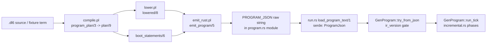

# Slice 12: canonical program to engine contract

The engine contract is a JSON document: `emit_rust.pl` serializes one
`plan/9`-derived dict as `ProgramJson`, the Rust runtime deserializes it into
`GenProgram` under an `ir_version` gate, and every SQL statement the tick fold
executes is a field inside that document. V7 keeps `sprefa-engine-rs` in place,
so the serialized field set and the tick-phase semantics below are what V7's
compiler must continue emitting.

## TOC

1. [Pipeline shape](#1-pipeline-shape)
2. [Report blocks: Prolog compiler side](#2-report-blocks-prolog-compiler-side)
3. [Report blocks: emitter](#3-report-blocks-emitter)
4. [Report blocks: Rust engine side](#4-report-blocks-rust-engine-side)
5. [Serialized field inventory (the V7 must-emit set)](#5-serialized-field-inventory-the-v7-must-emit-set)
6. [Semantic assumptions the tick fold embeds](#6-semantic-assumptions-the-tick-fold-embeds)
7. [`.dl6` filename and compiler-invocation coupling (separate concern)](#7-dl6-filename-and-compiler-invocation-coupling-separate-concern)
8. [Counts by class](#8-counts-by-class)
9. [Canonical term shapes entering and leaving](#9-canonical-term-shapes-entering-and-leaving)
10. [Hidden state](#10-hidden-state)
11. [Smallest extraction boundary](#11-smallest-extraction-boundary)
12. [First adaptation force](#12-first-adaptation-force)
13. [Unresolved questions for a V7 ruling](#13-unresolved-questions-for-a-v7-ruling)

## 1. Pipeline shape



Caption: the schedule JSON (`batches of {rel, sign, row}`) is a separate wire
contract read by `serve.rs:ArrivalDto`, `compile.pl:read_schedule_file/4`, and
`dl6.rs:read_schedule/1`; it feeds arrivals, never the program document.

## 2. Report blocks: Prolog compiler side

```prolog
% File: v6/prolog/compile.pl:204-206
% Existing comment: plan/9 field contract, the record's single documentation site
% Signature: program_plan(Term, Plan) ; program_plan(Term, Options, Plan)
% Called by: compile_program_phases_moded/8, isolated_compiler_dd, bop_check.pl
% Calls: default_intern_mode/1, check_reserved_namespace/1, preserve_compiler_type_rules/4,
%        prepare_program_for_compiler/2, expand_program_with_bindings/4,
%        type_definitions/2, check_supported_subset_expanded/1, check_clock_program/1,
%        check_world_shapes/3, program_refs/2, declared_refs/2, seeded_refs/2,
%        derived_refs/2, rel_columns/5, program_column_types/8, relation_shapes/5,
%        relation_storage_names/6, rel_cols/4, derive_storage_rows/3,
%        sql_rule_order/2, include/3, subscribed_rels/4
% Tests: v6/prolog/conformance fixtures via compile_fixture; sweep.pl; tests/dl6_build.rs
% V7 class: adapt
% Parser coupling: term-shape (fixture(Name, Prog, Initial, Schedule, _) record;
%                  prog(Decls, Rules) cons-tree input)
% Preserved law: one program-wide typing fixpoint settles every rel's columns and
%   column types before lowering; arrival targets exclude the compiler-owned
%   catalog and every derived ref.
% DL7 seam: input `prog(Decls, Rules)` cons trees with `?Variable` spellings;
%   output plan/9 or its V7 successor carrying Types, RelPlans, ArrivalTargets,
%   RuleOrder, EdgeRules, SubscribedRels, InternMode.
```

```prolog
% File: v6/prolog/compile.pl:85-107
% Existing comment: none (header at 1-6 covers phase B entry)
% Signature: read_fixture_term(File, Name, Term, Bindings) ; find_fixture/4
% Called by: compile_fixture/5
% Calls: read_term/3 (variable_names/1), directive replay via call/1
% Tests: fixture-reading paths across conformance sweep
% V7 class: drop
% Parser coupling: term-shape (fixture/5 wrapper record; `:- op` replay)
% Preserved law: a directive term inside the file is CALLED mid-scan so the
%   file's own operator declarations apply to later terms.
% DL7 seam: DL7 reads cons-tree source from its own reader; the fixture/5
%   wrapper and variable_names/1 identity are DL6 test-harness shapes.
```

```prolog
% File: v6/prolog/compile.pl:143-151
% Existing comment: every compiler unsupported construct is unsupported_construct/1
% Signature: prepare_program_for_compiler(SugaredProg, HostProg)
% Calls: prepare_program/5 (1_host_expand), throw_as_compiler_unsupported/1
% Tests: text_door_receipt.pl:classify_term_door_error/3 classification
% V7 class: adapt
% Parser coupling: none
% Preserved law: host-unsupported constructs surface as named
%   unsupported_construct/1 terms, classified by the door, never as harness errors.
% DL7 seam: same refusal vocabulary over DL7's host-decl expansion.
```

```prolog
% File: v6/prolog/compile.pl:153-174
% Existing comment: none
% Signature: preserve_compiler_type_rules/5 ; partition_compiler_type_rules/4 ;
%            compiler_type_rule/2
% Called by: program_plan/3
% Calls: copy_term/2, col_type/4 memberchk
% Tests: conformance type-rule fixtures
% V7 class: extract
% Parser coupling: term-shape (`Head <- Body` rules)
% Preserved law: compiler-only col_type(return, type) rules ride along with the
%   bindings but stay out of the runtime rule set.
% DL7 seam: same partition over DL7 decl/rule cons trees.
```

```prolog
% File: v6/prolog/compile.pl:377-414
% Existing comment: the compiler-owned `__` namespace / reading a contract rel is
%   allowed and writing one is not
% Signature: check_reserved_namespace/1, reserved_namespace_violation/4,
%            reserved_namespace_name/1, option_enum_generated_name/1,
%            compiler_owned_contract/1, reserved_relation_value_violation/2
% Called by: program_plan/3 (first check before expansion)
% Calls: declared_refs/2, derived_refs/2, program_refs/2, catalog_ddl_contract/2
% Tests: namespace refusal fixtures (reserved_rel_namespace)
% V7 class: extract
% Parser coupling: none
% Preserved law: user programs never declare or head-write rels in the compiler's
%   `__` namespace; obj/1 is refused as a declared ref (reserved relation value carrier).
% DL7 seam: same namespace check over DL7 decls; `__`-prefix ownership carries.
```

```prolog
% File: v6/prolog/compile.pl:430-450
% Existing comment: STRUCT-AS-ROWS, the compiler's half of SLOT-ARRIVAL-MALFORMED
% Signature: check_world_shapes(Prog, Initial, Schedule) ; check_single_arity_per_name/1
% Called by: program_plan/3
% Calls: 0_type_plane.pl:world_row_shape_violation/3
% Tests: type arrival mismatch fixtures (type_arrival_shape_mismatch, int_out_of_range)
% V7 class: extract
% Parser coupling: none
% Preserved law: every seed and schedule row is type-checked against the declared
%   column shapes at PLAN time, before emission; two arities of one name refuse.
% DL7 seam: same row-shape check; row terms become DL7 cons rows.
```

```prolog
% File: v6/prolog/compile.pl:457-658
% Existing comment: shape identity : docs/storage-name-hash.md ; THE DERIVED SEAM
% Signature: relation_storage_names/6, relation_storage_candidate/6,
%            relation_declaring_module/5, relation_shapes/5, storage_shape_suffix/4,
%            storage_shape_digest/3, shape_closure/4, storage_identifier/2,
%            sqlite_ascii_fold/2, allocate_storage_names/3, unique_storage_name/4
% Called by: program_plan/3
% Calls: rel_module_hashes/4, module_storage_decl/2, entry_module_decl/1,
%        use_resolve:short_hash/2, decl_key/3
% Tests: text_door_receipt.pl byte-compare (term path == text path), storage-name tests
% V7 class: extract
% Parser coupling: none
% Preserved law: a stored rel's physical table name = module stem + relation stem,
%   ASCII-folded, plus a 12-char digest of the storage shape closure for stored
%   (non-derived, non-`__`) rels; collisions get `_2`-style suffixes; derived rels
%   keep the bare prefixed spelling. The .dl6 entry-stem path and the fixture-term
%   path must produce identical spellings.
% DL7 seam: shape/3 terms and the digest recipe are pure; only the `prog/2`
%   decl vocabulary (rel_module_decl/2, module_storage_decl/2) must survive.
```

```prolog
% File: v6/prolog/compile.pl:660-697
% Existing comment: none (dl6c wraps the same compile_dl6/3 call)
% Signature: compile_dl6(File, OutFile) ; compile_dl6(File, OutFile, Options)
% Called by: dl6c.pl, sprefa-engine-rs/src/bin/dl6.rs (swipl goal text)
% Calls: expand_uses/8, dl6_seeded_form/3, schedule_option/4, compile_program_phases/8,
%        throw_text_door_error/2, emit_diag_file/2
% Tests: tests/dl6_build.rs, tests/dl6_run.rs (via the dl6 binary seam)
% V7 class: drop
% Parser coupling: token/CST (expand_uses reads .dl6 text; parse findings become
%   surface_findings/1 refusals)
% Preserved law: parse findings are refusals with a line, phases run
%   parse->plan->lower->boot->emit->write, and every phase failure carries a
%   COMPILE-TRACE line on stderr.
% DL7 seam: DL7 compiles `.dl7` with its own reader; the phase/trace skeleton can
%   be reused, the .dl6 loader cannot.
```

```prolog
% File: v6/prolog/compile.pl:709-737
% Existing comment: a .dl6 TEXT program has no spelling for an arrival schedule ...
%   same external JSON shape sweep.pl writes and the http client posts
% Signature: schedule_option/4, read_schedule_file/4, schedule_batch_terms/4,
%            arrival_term/4
% Called by: compile_dl6/3
% Calls: json_read_dict/3, 'compile/scripts/0_json_arrival':arrival_column_types/4,
%        schedule_value/5
% Tests: ghcache.schedule.json-shaped schedules through dl6 run --schedule; sweep.pl
% V7 class: adapt
% Parser coupling: none
% Preserved law: one schedule JSON shape — a list of batches, each batch a list of
%   {rel, sign, row} objects, sign in {"add","del"} — decodes to +/-Atom terms
%   with per-column type coercion driven by the program's declared column types.
% DL7 seam: keep the {rel, sign, row} wire shape and the type-coercion law; the
%   output side becomes DL7 row cons terms instead of +/-functor atoms.
```

```prolog
% File: v6/prolog/compile.pl:741-813
% Existing comment: shared by the two text-door callers that parse .dl6 themselves
% Signature: dl6_seeded_form/3, partition_dl6_facts/4, dl6_fact_in_decls/3,
%            dl6_fact/2, dotted_relation_head/1, compiler_type_fact/2,
%            fact_args_atomic/1, throw_text_door_error/2
% Called by: compile_dl6/3, scripts/bop_check.pl
% Calls: resolve_relation_paths/3, parse_dl_line_for_reason/2, emit_diag_file/2
% Tests: dl6 seed-partition conformance fixtures
% V7 class: drop
% Parser coupling: token/CST (ground bodiless .dl6 clauses become seed rows;
%   dotted relation heads resolve through rel_path)
% Preserved law: a ground atomic-argument fact in the source becomes a seed row,
%   never a rule; a structurally identical clause over a compiler type rule stays
%   compiler-owned.
% DL7 seam: DL7 has "no implicit declaration"; whether bodiless cons forms are
%   facts or errors needs a ruling (see section 13).
```

```prolog
% File: v6/prolog/compile.pl:815-901
% Existing comment: frontier(shared) consolidates transient frontier state ...
%   the dd emitter reads Initial and Schedule out of band
% Signature: compile_program/7, compile_program_phases/8,
%            compile_program_phases_moded/8, frontier_option/2,
%            with_emit_context/2, run_compile_phase/4, write_compiled_output/2
% Called by: compile_fixture/5, compile_dl6/3, scripts/bop_check.pl
% Calls: program_plan/3, lower_program/2, boot_statements/6, Emitter call,
%        with_frontier_mode/2
% Tests: shared_frontier gate scripts in sprefa-engine-rs; emit_rust/emit_ts parity
% V7 class: adapt
% Parser coupling: none
% Preserved law: phases are plan -> lower -> boot -> emit -> write; the emitter is
%   a Module:Pred substitutable for emit_ts:emit_program/5 with the same
%   lowered/8 destructure; frontier mode selects per_rel (default, byte-identical)
%   or shared (adds shared_frontier + support_count_sql fields).
% DL7 seam: same phase skeleton; the seam call signature
%   `Emitter(Name, Plan, Lowered, BootStatements, Text)` is the contract V7's
%   emitter must honor or replace wholesale.
```

## 3. Report blocks: emitter

```prolog
% File: v6/prolog/emit_rust.pl:40
% Existing comment: emit_ts.pl carries the same number under the same spelling
% Signature: ir_version(1)
% Called by: emit_program/5
% Calls: none
% Tests: program.rs IR_VERSION gate; IrVersionMismatch message
% V7 class: oracle
% Parser coupling: none
% Preserved law: both doors carry one number under `ir_version`; a runtime
%   refuses a program document whose value differs from the one it interprets.
% DL7 seam: bump to the V7 IR version only if any field's meaning moves; the
%   Rust gate compares equality with its compiled-in constant.
```

```prolog
% File: v6/prolog/emit_rust.pl:598-706
% Existing comment: emit_program/5 is substitutable for emit_ts:emit_program/5
%   with no call-site special case
% Signature: emit_program(Name, Plan, Lowered, BootStatements, Text)
% Called by: compile_program_phases_moded/8 (seam call); dl6.rs Dl6Compiler::program
% Calls: program_uses_tick/2, listened_departure_refs/2, reconcile_every_tick/2,
%        cyclic_head_groups/2, program_text_intern_plan/3, struct_type_plans/4,
%        enum_type_plans/4, enum_ref_columns_map/4, host_plan_dict/2,
%        bind_plan_dict/3, enum_identity_ddls/2, query_order_by_map/3,
%        json_write_string/2, raw_string_hashes/2
% Tests: type_annotation_ci.rs, query_order_tail.rs, tick_trace.rs (extract
%   r#"..."# ProgramJson), dl6_build.rs tick-log parity
% V7 class: adapt
% Parser coupling: none (input is lowered/8 + plan/9 terms)
% Preserved law: the Text is a Rust module whose PROGRAM_JSON raw string carries
%   every field in section 5, one JSON object; program JSON whitespace is
%   irrelevant, only the tick log is byte-diffed.
% DL7 seam: V7 rewrites this emitter against its own IR; the emitted JSON field
%   names and shapes stay frozen where section 5 marks them pinned.
```

```prolog
% File: v6/prolog/emit_rust.pl:150-216
% Existing comment: arrival_trigger_kind/4 reaches these two exactly when the
%   body reads the store this tick is still writing
% Signature: relation_dict/5, edge_dict/6, arm_schedule/2, ordered_trigger_kind/2,
%            head_to_key_indices/3, intern_field/2
% Called by: emit_program/5 via relations_list/4, edges_list/4
% Calls: relplan_storage_name/3, relplan_shape/5, frontier_mode/0,
%        shared_frontier_relation_id/3, level_body_pre_ref/2
% Tests: one_tick_path.rs (ArmSchedule::Sequenced filter), shared_frontier.rs
% V7 class: adapt
% Parser coupling: none
% Preserved law: an edge whose body reads store-being-written (pre/1 or negation
%   over an edge head) is schedule=sequenced with occurrence_project_sql present;
%   otherwise set_at_once with null occurrence fields; heads read by some pre/1
%   body get evolves_pre=true and land in pre_snapshot_rels.
% DL7 seam: same per-edge JSON fields; the lowered edgestmt/9 vocabulary feeds it.
```

```prolog
% File: v6/prolog/emit_rust.pl:244-297
% Existing comment: the mirror of emit_ts.pl:recursion_group_field/3, spelled as
%   the dict this door serializes
% Signature: level_dict/6, recursion_group_field/3, select_sql_text/3
% Called by: emit_program/5 via levels_list/5
% Calls: fixpoint_round_cap/1, strat:cyclic_head_groups/2
% Tests: diverging_recursion.rs (DivergingMeasureRecursion round cap), shared_frontier.rs
% V7 class: adapt
% Parser coupling: none
% Preserved law: a cyclic head carries recursion_group {group, round_cap, heads};
%   recompute_sql is recompute_delete_sql + recompute_insert_sqls joined by ";\n";
%   select_sql is `SELECT "cols" FROM "table"`.
% DL7 seam: same level JSON fields; round_cap semantics (hops vs group passes)
%   are interpreted by incremental.rs ExpandPlan/RecursionGroupPlan.
```

```prolog
% File: v6/prolog/emit_rust.pl:496-594
% Existing comment: enum values keep their endpoint INTEGER in the physical
%   relation; keyed enum-only rows intern canonical tagged JSON in __enum_identity_N
% Signature: enum_type_plans/4, enum_variant_plan/7, enum_identity_plan/2,
%            enum_identity_ddls/2, enum_ref_columns_map/4
% Called by: emit_program/5
% Calls: option_enum_name/2, relplan_parts/6
% Tests: enum fixtures through bytes_runtime.rs / conformance tick logs
% V7 class: extract
% Parser coupling: none
% Preserved law: an enum column's stored value is one INTEGER endpoint; the
%   variant payload relations (`<enum>_<tag>`) and the identity table
%   (`__enum_identity_<enum>`, key = canonical tagged JSON) are the sole
%   translation authority at the boundary.
% DL7 seam: the DDL strings and variant field types move as emitted constants.
```

```prolog
% File: v6/prolog/emit_rust.pl:400-481
% Existing comment: the same rows emit_ts.pl renders as host_plans, so the two
%   runtimes read one executor contract
% Signature: host_plan_dict/2, host_contract_is_structured/3, host_type_descriptor_dict/2,
%            bind_plan_dict/3, bind_read_literals/4
% Called by: emit_program/5
% Calls: 'compile/registry':host_execution/3, 1_host_expand:host_plan_contract/2
% Tests: live_hosts.rs, crosswalk_executors.rs, executors.rs
% V7 class: extract
% Parser coupling: none
% Preserved law: host_plans rows carry name/inputs/outputs/template/demand_rel/
%   response_rel/execution, plus request_type/response_type exactly when a field
%   type is not one of text|int|float|bool. NOTE: emit_rust also emits a
%   `bind_plans` key that Rust ProgramJson does not declare — serde silently
%   drops it (no deny_unknown_fields); the bind surface is TS-door only.
% DL7 seam: host_plans is pinned (engine reads it); bind_plans needs a ruling.
```

## 4. Report blocks: Rust engine side

```rust
// File: v6/sprefa-engine-rs/src/types.rs:717-764
// Existing comment: the serde mirror of the emitted program: one JSON object per fixture
// Signature: struct ProgramJson
// Called by: run.rs load_program_text/1, emit_rust.pl (writer), build_template tests
// Calls: serde derive
// Tests: every tests/*.rs that extracts r#"..."# and parses ProgramJson
//   (type_annotation_ci.rs, query_order_tail.rs, tick_trace.rs, tick_transaction.rs,
//   live_hosts.rs, diverging_recursion.rs)
// V7 class: oracle
// Parser coupling: none
// Preserved law: every field in section 5 deserializes; defaults exist for the
//   fields added after IR v1 shipped, so pre-field documents still load (then fail
//   the ir_version check with a named error).
// DL7 seam: this struct IS the engine contract; V7 may add fields but must keep
//   these names and shapes.
```

```rust
// File: v6/sprefa-engine-rs/src/program.rs:18-55
// Existing comment: the five pinned fields are emitter-stable ("extend by adding
//   fields, never renaming")
// Signature: struct GenProgram ; const IR_VERSION: u32 = 1
// Called by: run.rs LoadedProgram, driver.rs, every test harness
// Calls: incremental::recursive_heads, incremental::level_sources
// Tests: whole test suite
// V7 class: oracle
// Parser coupling: none
// Preserved law: try_from_json refuses a document whose ir_version differs from
//   IR_VERSION with a named IrVersionMismatch value; from_json panics on it
//   (in-tree harness convenience only).
// DL7 seam: unchanged; V7 bumps IR_VERSION iff a field's meaning moves.
```

```rust
// File: v6/sprefa-engine-rs/src/program.rs:183-278
// Existing comment: Before the level phase: a `pre/1` body over a level head reads
//   that head as the previous tick settled it
// Signature: GenProgram::run_tick(&seam, arrivals) -> BoundaryResult<TickDeltas>
// Called by: GenProgram::tick (stream wrapper), driver.rs, run.rs, serve.rs
// Calls: incremental::{TickWork::probe, prepare_tick, advance_tick, apply_arrivals,
//        snapshot_pre, apply_levels_before_edges, recompute_levels_before_edges,
//        apply_edges, merge_next_into_current, apply_levels_after_edges,
//        apply_retention, recompute_levels_after_edges, read_boundary,
//        stage_departures}, enum_plane/text_plane/struct_plane::intern,
//        enum_plane::decode_deltas, promote_frontiers
// Tests: one_tick_path.rs, tick_transaction.rs, empty_delta_skip.rs,
//   statement_budget.rs, ordered_statement_count.rs, tick_trace.rs, shared_frontier.rs
// V7 class: oracle
// Parser coupling: none
// Preserved law: one tick's phase ORDER is fixed: intern planes -> arrivals ->
//   pre-snapshot -> levels-before-edges -> (edges: recompute, edges, merge,
//   levels-after) -> retention -> recompute-after-edges -> boundary read ->
//   departures -> decode -> promote frontiers. Statement TEXT is fixed ahead of
//   the fold (stable_sql_count), so a row-count-shaped VALUES list is not among
//   the cache-stable statements.
// DL7 seam: V7 emits the same statement families; this order and the TickWork
//   gating (moved/shrank/grew clocks) are the semantics V7 must not disturb.
```

```rust
// File: v6/sprefa-engine-rs/src/types.rs:1-37, 160-330
// Existing comment: mirrors the values IRowValue holds at boundary time
// Signature: enum Value { Integer, Real, Bool, Text, List(Vec<serde_json::Value>), Bytes }
//            enum ScalarValue ; enum RowColumnType { text,int,float,bool,json,ref,
//            relation_id,list,bytes } ; enum InternMode { dict, direct }
// Called by: sql.rs, incremental.rs, serve.rs, ticklog.rs, planes
// Calls: serde custom impls ($bytes base64 tag)
// Tests: bytes_runtime.rs, list_boundary.rs, 0_relation_id_access.rs
// V7 class: oracle
// Parser coupling: none
// Preserved law: boundary values are integers/floats/bools/text/element-lists/
//   base64-tagged bytes; list columns ride as their interned entity id across
//   scalar seams and raise ListAtScalarSeam otherwise; `relation_id` is
//   endpoint-identity distinct from `ref` at the ProgramJson seam.
// DL7 seam: column-type vocabulary in ProgramJson.relations[].column_types and
//   rel_column_types must keep these exact spellings.
```

```rust
// File: v6/sprefa-engine-rs/src/types.rs:458-475
// Existing comment: one IIncrementalRelationPlan: the per-relation table names and
//   statement text the tick engine stages events through
// Signature: struct IncrementalRelationPlan ; enum RelationKind { set, log }
// Called by: incremental.rs everywhere (TickWork::probe builds 5-column EXISTS probes)
// Tests: probe behavior in empty_delta_skip.rs, n_plus_one.rs
// V7 class: oracle
// Parser coupling: none
// Preserved law: each rel has table_name / delta_table_name (__delta_) /
//   frontier_table_name (__frontier_) / next_frontier_table_name (__next_frontier_)
//   / optional departure_frontier_table_name (__departure_frontier_) / optional
//   shared_frontier{relation_id}; PROBE_COLUMNS=5 per rel in that order; the
//   chunked probe width is 800 columns.
// DL7 seam: table-name prefixes `__frontier_`, `__next_frontier_`, `__delta_`,
//   `__departure_frontier_` are emitted by the compiler and read by hand-written
//   probe SQL in the engine; renaming breaks the engine, not just the emitter.
```

```rust
// File: v6/sprefa-engine-rs/src/types.rs:601-628
// Existing comment: set-at-once projection: the whole trigger frontier in one statement
// Signature: struct IncrementalEdgeStatement ; enum ArmSchedule { set_at_once,
//            sequenced } ; enum TriggerKind { arrival, departure }
// Called by: incremental::apply_edges
// Tests: one_tick_path.rs, 0_wrapper_composition.rs
// V7 class: oracle
// Parser coupling: none
// Preserved law: sequenced arms carry occurrence_project_sql (one trigger row
//   bound to ?1..?n) and run per-occurrence; set_at_once arms run one project_sql
//   over the whole frontier; evolves_pre=true copies each write into __pre_<head>.
// DL7 seam: same field set; trigger_rel/trigger_kind/schedule spellings pinned.
```

```rust
// File: v6/sprefa-engine-rs/src/types.rs:512-581
// Existing comment: SQL statements for one expand wavefront plan / the stratum SCC
//   a level head sits on (lower.pl:fixpoint_round_cap/1, strat.pl:cyclic_head_groups/2)
// Signature: struct ExpandPlan{round_cap: hops}, RecursionGroupPlan{round_cap:
//            group passes, heads: "[a,b]"}, DredPlan, AggregateLevelPlan,
//            IncrementalLevelStatement, WriteSupportCountPlan
// Called by: incremental::apply_levels_*, recompute_levels_*, program.rs stable_sql_count
// Tests: diverging_recursion.rs, recount_gate.rs, shared_frontier.rs
// V7 class: oracle
// Parser coupling: none
// Preserved law: two round-cap units exist and must not be conflated: ExpandPlan
//   counts HOPS, RecursionGroupPlan counts GROUP PASSES; both default from
//   lower.pl's fixpoint_round_cap/1. A tripped cap raises
//   DivergingMeasureRecursion{rel, round_cap} naming the group's head list.
// DL7 seam: DredPlan's 25 SQL fields, ExpandPlan's 7, and the aggregate plan's
//   5 are emitted verbatim by the compiler; the engine only runs them.
```

```rust
// File: v6/sprefa-engine-rs/src/types.rs:636-694
// Existing comment: one host column as the emitter spells it / mirrors emit_ts.pl's
//   IHostPlanData row; the two runtimes read one executor contract
// Signature: struct HostPlanData{name,inputs,outputs,template,demand_rel,
//            response_rel,execution,request_type?,response_type?}
//            struct HostAdapterRow{adapter,demand_rel,response_rel}
// Called by: run.rs stays_resident, run.rs host routing, load_program_host_adapter_rows
// Tests: live_hosts.rs, executors.rs, crosswalk_executors.rs, 15_source_mutation_hosts.rs
// V7 class: oracle
// Parser coupling: none
// Preserved law: omission of request_type/response_type is the legacy scalar
//   shell-host shape; host answers cross as keyed JSON maps (HostRow), never as
//   text; adapters sidecar is `<prog>.adapters.json` under DL_ADAPTERS_DIR.
// DL7 seam: pinned; demand/response rel names must match relations[].rel.
```

```rust
// File: v6/sprefa-engine-rs/src/types.rs:353-475 (BootStatement, ArrivalTemplate,
//            TextInternPlan, StructTypePlan, EnumTypePlan, EnumVariantPlan,
//            EnumIdentityPlan, EnumRefColumns, SharedFrontierPlan)
// Existing comment: rel_columns carries one flag per relation column, true where
//   the stored column holds a dictionary id
// Signature: see struct declarations
// Called by: program.rs run_tick (intern planes), write_verbs.rs, sql.rs
// Tests: list_boundary.rs, bytes_runtime.rs, data_family.rs, shared_frontier.rs
// V7 class: oracle
// Parser coupling: none
// Preserved law: boot statements with empty params run as possibly
//   multi-statement text, others bind through the seam; arrival_templates carry
//   kind + add_sql + optional del_sql; TextInternPlan.rel_columns mirrors
//   rel_columns with dict-id flags; StructTypePlan carries conflict/intern/lookup
//   SQL; enum identity intern/lookup SQL is generated against __enum_identity_N.
// DL7 seam: all emitted SQL strings are opaque to the engine; V7 regenerates them
//   from its own IR as long as the surrounding field names hold.
```

```rust
// File: v6/sprefa-engine-rs/src/serve.rs:41-48
// Existing comment: the arrival batch as it crosses the wire: the schedule.json
//   line shape the harness already reads
// Signature: struct ArrivalDto { rel: String, sign: String, row: Vec<Value> }
// Called by: dl6.rs read_schedule, serve.rs arrival_batch, tests' schedule loaders
// Calls: arrival_batch (sign "add"/"del" -> ArrivalSign)
// Tests: tick_transaction.rs, tick_trace.rs, dl6_build.rs (ghcache.schedule.json)
// V7 class: oracle
// Parser coupling: none
// Preserved law: one schedule JSON shape everywhere: Vec<Vec<ArrivalDto>> — a
//   list of tick batches, each a list of {rel, sign, row}; unknown sign is
//   UnknownSign, unknown rel is NoSuchRel.
// DL7 seam: keep verbatim; it is runtime-side, not compiler-side.
```

```rust
// File: v6/sprefa-engine-rs/src/run.rs:31-63
// Existing comment: run.rs carries the module-text shape emit_rust_harness prints
//   for the same program and schedule (line 2 header; 426: binary and
//   emit_rust_harness render one program identically)
// Signature: load_program_text(&str) -> Result<LoadedProgram>, load_program(&Path),
//            program_json_text (extracts r#"..."#)
// Called by: dl6.rs prepare, emit_rust_harness.rs, tests
// Calls: GenProgram::try_from_json
// Tests: all tests that compile .dl6 in-process then load the module text
// V7 class: oracle
// Parser coupling: none
// Preserved law: the compiled artifact is a Rust MODULE carrying one
//   `pub const PROGRAM_JSON: &str = r#"..."#;` raw string; the loader extracts
//   between `r#"` and `"#;` and serde-parses it.
// DL7 seam: V7 can keep this seam unchanged — it never sees Prolog.
```

## 5. Serialized field inventory (the V7 must-emit set)

`ProgramJson` top-level (types.rs:718-764; writer emit_rust.pl:656-684):

| Field | Type | V7 status |
|---|---|---|
| `name` | string | pinned |
| `ir_version` | u32 (default 0 -> gate) | pinned gate |
| `intern_mode` | `"dict"` \| `"direct"` (default `dict`) | pinned |
| `ddl` | string[] (includes `__enum_identity_*` CREATE TABLE) | pinned |
| `rel_columns` | map rel -> string[] | pinned |
| `rel_column_types` | map rel -> RowColumnType[] | pinned spellings |
| `arrival_targets` | string[] | pinned |
| `boot` | {rel, sql, params: ScalarValue[]}[] | pinned |
| `final_select` | map rel -> SQL (query_order_by appended) | pinned |
| `queries` | string[] (the `?` names, declared order) | pinned |
| `arrival_templates` | map rel -> {kind, add_sql, del_sql?} | pinned |
| `text_intern_plan` | {intern_sql, lookup_sql, rel_columns: map->bool[]}? | pinned |
| `struct_types` | {name, columns, refs, key_indices, conflict_sql, intern_sql, lookup_sql}[] | pinned |
| `struct_ref_columns` | map rel -> (structname\|null)[] | pinned |
| `enum_types` | {name, variants: {tag, rel, fields, field_types, field_enums, select_sql}[], identity?}[] | pinned |
| `enum_ref_columns` | map rel -> ({name, endpoint_index}\|null)[] | pinned |
| `pre_snapshot_rels` | string[] (the rels a pre/1 body reads) | pinned |
| `relations` | IncrementalRelationPlan[] | pinned (section 4) |
| `edges` | IncrementalEdgeStatement[] | pinned (section 4) |
| `levels` | IncrementalLevelStatement[] | pinned (section 4) |
| `retentions` | {rel, delete_sql}[] | pinned |
| `uses_tick` | bool | pinned |
| `reconcile_every_tick` | bool (true iff any body uses negation) | pinned |
| `incremental_safe` | bool, constant true, NOTHING reads it | keep emitting; do not remove (serde default + engine copies it) |
| `host_plans` | HostPlanData[] | pinned |
| `bind_plans` | emitted by emit_rust, ABSENT from ProgramJson — silently dropped by serde | DL6/TS-door only; V7 ruling needed |

Field-shape laws V7 must hold:

1. Pinned five at program.rs:1-3: "extend by adding fields, never renaming".
2. `serde(default)` fields (text_intern_plan, struct_types, struct_ref_columns,
   enum_types, enum_ref_columns, pre_snapshot_rels, shared_frontier,
   support_count_sql, intern_sql, schedule, trigger_rel, trigger_kind,
   occurrence_*, evolves_pre, recursion_group, uses_tick, incremental_safe,
   ir_version, host_plans, queries) are the back-compat set; V7 documents may
   keep them absent only if ir_version semantics say so.
3. `head_delta_table_name`, `frontier_table_name`, `next_frontier_table_name`,
   `departure_frontier_table_name` prefixes are hard-coded in BOTH
   emit_rust.pl (`__delta_`/`__frontier_`/`__next_frontier_`/
   `__departure_frontier_`) and incremental.rs probe/read SQL.
4. `boundary_type_name` spellings: `ref`, `relation_id`, `json`, `list`,
   `bytes`, plus lowercase scalars — serde `rename_all = "lowercase"`.
5. `stable_sql_count` (program.rs:135-181) mirrors the emitter's statement
   inventory exactly: ddl + boot + final_select + (1 + arrival_add + arrival_del)
   per relation + (1 + intern_sqls) per edge + (3 + recompute_insert_sqls +
   intern + support + support_intern + support_count(1+write_sqls) +
   expand(7+seed_sqls) + aggregate(2+scope_seed+insert_scoped+intern)) per level
   + retentions. A V7 emitter that changes statement counts under these field
   names breaks the statement-budget tests (statement_budget.rs,
   ordered_statement_count.rs).

## 6. Semantic assumptions the tick fold embeds

- One tick = one transaction boundary (drive_tick_transacted); a failing
  statement aborts with BoundaryError naming rel + phase + index
  (AggregateStatementFailed keeps phase/index because a plan vector holds one
  statement per rule — the seam cannot name them).
- `pre/1` reads the PREVIOUS tick's settled head (snapshot_pre runs before
  level phases); each write to an evolves_pre head also lands in `__pre_<head>`
  for later occurrences in the same tick.
- Negation anywhere in any body forces `reconcile_every_tick` (emit_rust.pl:76-83)
  and selects the recount (refcount/DRed) machinery per level head.
- Cycles: strat.pl:cyclic_head_groups/2 SCCs decide recursion_group; expand
  wavefronts count hops, group closure counts passes; round_cap trips raise
  DivergingMeasureRecursion naming `[heads]`.
- Frontier rows carry `_sign` (-1 marks a shrink row in the delta table; probe
  column 5 reads it).
- InternMode `dict` (the build default, compile.pl:200-202) routes text columns
  through TextInternPlan's intern/lookup SQL; `direct` stores text verbatim.
- `queries` is the declared `?` name order; final_select keys are rel names and
  query_order_by_map appends ORDER BY text to the final_select SQL.

## 7. `.dl6` filename and compiler-invocation coupling (separate concern)

These couple the ENGINE BINARY to the DL6 toolchain; none of it is part of the
schedule semantics and all of it is replaceable in V7:

- `src/bin/dl6.rs:115-163` shells out to `swipl -q -l v6/prolog/compile.pl -l
  v6/prolog/emit_rust.pl -g "compile_dl6('<src>','<out>',[emitter(emit_rust:emit_program)])"`.
  Paths with quotes/backslashes are refused (prolog_atom, dl6.rs:166-174).
- The compile cache key (dl6.rs:322-428) = blake3(source bytes) + a size/mtime
  stamp digest of every `.pl` under `v6/prolog/` (skipping labs/, out/,
  node_modules/); cache entries land in `$XDG_CACHE_HOME/sprefa/dl6/<hash>.rs`.
  `DL6_SOURCE_DIGEST` / `DL6_COMPILER_DIGEST` env vars feed run.rs's `__meta`.
- Source extension `.dl6` is named in: dl6.rs usage text, adapters sidecar
  default (`<prog>.adapters.json` = `source.with_extension("adapters.json")`),
  dl6_build.pl, dl6c.pl, and the `.dl6` fixture corpus paths under `v6/dl/`.
- `dl6 build` generates a cargo crate from `src/build_template/` with
  `__DL6_PROGRAM_NAME__` / `__DL6_COMPILER_SHA__` / `__DL6_ENGINE_PATH__`
  placeholders and a shared target dir under `target/dl6-build/`.
- One-db law: every program folds into `$HOME/.agent/dl6.db` (DL6_DB overrides),
  tables carrying the program's name; program name = source file stem.
- `DL_ADAPTERS_DIR` points the engine's adapter sidecar loader at the source's
  directory (types.rs:702-714).

V7 classification: rename `.dl6` -> `.dl7` in the binary usage/sidecar naming,
keep the cache-key and one-db mechanics, and re-point the swipl invocation at
the V7 compiler entry. The `ir_version` gate already decouples a stale cache
entry from a changed engine.

## 8. Counts by class

| Class | Count | Items |
|---|---|---|
| oracle | 12 | ProgramJson, GenProgram+IR_VERSION, run_tick, Value/ScalarValue/RowColumnType/InternMode, IncrementalRelationPlan, IncrementalEdgeStatement, level plans (Expand/Dred/Recursion/Aggregate/Level/SupportCount), HostPlanData/HostAdapterRow, boot/template/intern/struct/enum plan structs, ArrivalDto, load_program_text |
| adapt | 7 | program_plan/3, prepare_program_for_compiler/2, preserve_compiler_type_rules/5, check_world_shapes/3, schedule_option+read_schedule_file+arrival_term, compile_program_phases_moded/8, emit_program/5, edge/level dict builders |
| extract | 5 | storage-name machinery, reserved namespace check, enum plans, host/bind plans, partition_compiler_type_rules |
| drop | 3 | read_fixture_term/find_fixture, compile_dl6/3 (.dl6 text door), dl6_seeded_form/partition_dl6_facts |

(Total 27 reported items; `drop` items are DL6-only surfaces, not engine contract.)

## 9. Canonical term shapes entering and leaving

Entering the slice (Prolog side):

- `fixture(Name, Prog, Initial, Schedule, Expectations)` + `variable_names/1` bindings
- `prog(Decls, Rules)` where Rules are `Head <- Body` / `Head <+ Body` cons trees
- `plan(Name, prog/2, Types, RelPlans(rel/6), ArrivalTargets(Name/Arity),
  RuleOrder, EdgeRules, SubscribedRels, InternMode)`
- `lowered(Name, Ddl, ArrivalStatements, EdgeStatements, LevelStatements,
  DeltaStatements, RelPlans, ArrivalTargets)` with statement functors
  `arrivalstmt/6, edgestmt/9, levelstmt/7, deltastmt/5, retentionstmt/3,
  bootstmt/3, refcountsql/16, expandplan/8, dredplan/24, aggsql/7, avgsql/7,
  textintern/3, structtype/7, enumtype/3, host_plan/7, bind_decl/2`

Leaving the slice (engine side):

- The `ProgramJson` document (section 5) as one raw-string Rust module.
- `Arrival { rel, sign, row: Vec<Value> }` from `{rel, sign, row}` DTOs.
- `TickDeltas { rels: Vec<RelDelta{rel, add, del}>, carry_pending }`.
- Per-tick SQL: the statement texts in `relations`, `edges`, `levels`,
  `retentions`, `boot`, `final_select`, plus plane intern/lookup SQL.

## 10. Hidden state

- `dd_compile_context/2` — thread_local in compile.pl:35, asserted around the
  emitter seam call for the dd emitter only; emit_ts/emit_rust never read it.
- `with_frontier_mode/2` global (lower.pl) — frontier(shared) mode changes
  emitted field set (shared_frontier, support_count_sql); default per_rel is
  byte-identical to pre-shared-frontier output.
- `reset_body_use_cache` (run_compile_step at plan entry) — the body-use table
  belongs to ONE program; compiling a second program without the reset would
  cross-contaminate types.
- `dl6_reset_checkpoint/0`, `reset_step_trace/0` at compile_dl6/compile_program
  entry — checkpoint and step-trace state are per-compile.
- `emit_rust.pl:30-31` bind_executor literals pinned outside the registry (the
  bind surface left the registry).
- Rust side: `TickWork` cell/refcell clocks are per-tick, no globals;
  `DL_ADAPTERS_DIR`, `DL6_SOURCE_DIGEST`, `DL6_COMPILER_DIGEST`, `DL6_DB`,
  `DL6_BUILD_TARGET_DIR`, `DL_CACHE_KIB` env vars cross the CLI seam.
- Cuts worth noting: `partition_compiler_type_rules` (commit to compiler-rule),
  `arm_schedule`/`ordered_trigger_kind` (first-match), storage-suffix walks —
  all local and order-driven; no tabling in this slice.

## 11. Smallest extraction boundary

The engine contract itself needs NO extraction: `sprefa-engine-rs` is retained
and its side of the seam is `ProgramJson` + `ArrivalDto` + `ir_version`. The
smallest V7 compiler-side boundary that satisfies it is:

`program_plan/3` + `lower_program/2` + `boot_statements/6` + a rewritten
emitter, connected by `plan/9` and `lowered/8`. Everything in section 5 can be
produced from those two records alone; `compile_fixture`, `compile_dl6`,
`read_fixture_term`, `dl6_seeded_form`, and the dd_compile_context are
harness/oracle accretion outside the boundary.

## 12. First adaptation force

`emit_program/5` cannot be extracted as-is: its first line destructures
`lowered/8` and every section builder reads `plan/9`-derived `RelPlans`
(`relplan_parts/6`, `relplan_storage_name/3`, `relplan_shape/5`) from lower.pl,
plus `strat:cyclic_head_groups/2` and `analyze:program_uses_tick/2`. DL7's
cons-tree IR changes the decl/rule vocabulary those helpers walk
(`col_type/4`, `rel_module_decl/2`, `sh_decl/4`, `bind_decl/2`), so the emitter
is `adapt` from its first line: the JSON field set survives while the term
shapes feeding it change.

## 13. Unresolved questions for a V7 ruling

1. `bind_plans`: emit_rust writes it, Rust ProgramJson ignores it, the TS door
   consumes it. Does V7 keep a bind surface at all (0_SHARED says no implicit
   callables; bind decls are explicit), and if so which runtime reads it?
2. `incremental_safe`: constant-true dead field kept only for engine
   deserialization. Keep emitting (cheap, engine requires) or bump ir_version
   and drop it from both doors?
3. Facts in source: `dl6_seeded_form` turns ground bodiless clauses into seed
   rows. Under "no implicit declaration", does a DL7 bodiless cons form over an
   undeclared rel refuse, and do declared-rel facts still seed boot rows?
4. `intern_mode` default is dict with a 2026-08-08 referee-ruled NO on flipping
   to direct. Does that ruling carry to DL7, or does DL7's type plane change
   the trade?
5. `queries` order: `?` names in declared order drive final printing. DL7's
   kernel binder `:` may change how a query is spelled; is declared order still
   the contract, or does ordinal/owner-edge metadata replace it?
6. Storage-name digest: table names carry a shape-closure hash that changes
   when a column type moves. With DL7 owner/name/target/ordinal edges
   representing types, does the digest input stay the projected storage shape
   (recommended, engine-visible only) or move to the edge graph?
7. `ArrivalSign` and the `+Atom/-Atom` arrival spelling: schedule JSON
   (`"add"/"del"`) is runtime-clean, but the compiler-side `arrival_term/4`
   builds +/- functors. DL7 rows are cons trees; the sign spelling at the
   compile seam needs a ruling.
