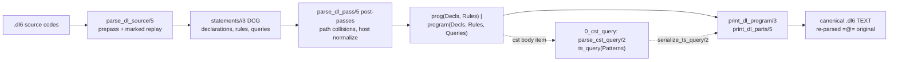

# Slice 1: reader, CST, and printer

Files audited (read-only): `v6/prolog/compile/parse_dl_dcg.pl`, `v6/prolog/print_dl.pl`,
`v6/prolog/0_cst_query.pl`, `v6/prolog/compile/scripts/text_door_receipt.pl`, and the
parser-facing tests under `v6/prolog/compile/test/` (plus direct callers
`compile.pl`, `diag.pl`, `use_resolve.pl`, `tools/self_map_facts.pl`, `0_ast_expand.pl`,
`1_host_expand.pl`).

## TOC

1. [Term flow](#term-flow)
2. [Report blocks](#report-blocks)
3. [Reusable vs DL6-specific grammar](#reusable-vs-dl6-specific-grammar)
4. [Finishing sections](#finishing-sections)

## Term flow



The **first semantic term produced after parsing** is the program term returned by
`parse_dl_pass/5` (parse_dl_dcg.pl:149-175):

- `prog(Decls, Rules)` when `Queries == []` and no `sh_decl/4` is present.
- `program(Decls, Rules, Queries)` otherwise.

`Decls` is one FLAT list of declaration terms: `col_type/3`, `kind/2`, `keyed/2`,
`keep/2`, `enum_decl/2`, `rel_template/3`, `rel_template_enum/3`, `type_decl/2`,
`sh_decl/4`, `arrival_identity/2`, `return_alias/2`, `rel_path_decl/2`,
`interface_decl/2`, `import_decl/5`. All nested-brace and dotted-path surface
punctuation is consumed inside `rel_stmt_in//4` + `rel_decl_end//3` before any
later phase sees the program. `Rules` are `(Head <- Body)` / `(Head <+ Body)` /
`match(Source, Arms)` terms whose bodies are `','`-trees of goals.

The **exact term the printer accepts** is the same shape: `print_dl_program/3`
(print_dl.pl:55-58) matches `prog(Decls, Rules)` or `program(Decls, Rules, Queries)`
with the same `Bindings` list (`Name=Var` pairs) the parser produced in
`parse_dl_pass/5` (`maplist([Name-Var, Name=Var]>>true, ...)`, parse_dl_dcg.pl:168).
The printer's contract is a `=@=` (variant, list-structure-preserving) round trip:
printed text re-parses to a variant of the original term (G1 grade).

The `cst(...)` body item is the one sub-term that carries a second parser: the raw
brace-block codes are handed to `parse_cst_query/2` and stored as `ts_query(Patterns)`
inside `cst(Path, Digest, Language, Query[, cst_bindings(...)])`; the printer calls
`serialize_ts_query/2` on exactly that term.

## Report blocks

```prolog
% File: v6/prolog/compile/parse_dl_dcg.pl:113-117
% Existing comment: none (module header exports; header note covers operators and sigils)
% Signature: parse_dl_dcg_entry(Source, Codes, Prog, Bindings, Findings) / parse_dl/4 / parse_dl_file/4
% Called by: compile.pl (text door), use_resolve.pl, diag.pl, tools/self_map_facts.pl, tests
% Calls: parse_dl_source/5
% Tests: v6/prolog/compile/test/compiler_relations.test.pl, dl6c.test.pl, 4_braced_nested_relations.test.pl
% V7 class: adapt
% Parser coupling: term-shape
% Preserved law: one entry point, one parser; the text door and term door share this module.
% DL7 seam: text (.dl7 cons-tree source) -> program term + Bindings + Findings.
```

```prolog
% File: v6/prolog/compile/parse_dl_dcg.pl:125-132
% Existing comment: "Named and punned arguments resolve against a rel's declared column order,
%   and a rule may precede the declaration it reads, so a first pass records every
%   declaration's column order and the real pass starts from that set."
% Signature: parse_dl_source(Source, Codes, Prog, Bindings, Findings)
% Called by: parse_dl_dcg_entry/5, parse_dl/4, parse_dl_file/4
% Calls: parse_dl_pass/5, parse_dl_marked_failure/3, nb_setval(dl_prepass_columns)
% Tests: diag.test.pl:82-105, compiler_relations.test.pl
% V7 class: adapt
% Parser coupling: term-shape
% Preserved law: a two-pass protocol (throwaway prepass to learn column orders) makes
%   forward references and named args resolvable regardless of statement order.
% DL7 seam: expected: Lisp-shaped source -> program term; the prepass/known-columns
%   side table is the part to re-derive in a cons-tree grammar (likely unnecessary).
```

```prolog
% File: v6/prolog/compile/parse_dl_dcg.pl:137-147
% Existing comment: "mark/1 walks the whole remaining input at every token and
%   parse_failure/1 is the only reader of what it records, so the first pass runs
%   with marks off and a throwing parse is replayed once with them on."
% Signature: parse_dl_marked_failure(Source, Codes, Reason)
% Called by: parse_dl_source/5
% Calls: setup_call_cleanup, parse_dl_pass/5
% Tests: diag.test.pl (error-position cases)
% V7 class: oracle
% Parser coupling: token/CST
% Preserved law: dl_parse_error(Reason, position(L,C)) positions come from the
%   furthest-reached suffix, replayed once with marks on.
% DL7 seam: error objects carrying line/column; the furthest-suffix replay may be
%   kept as an oracle or replaced by structured reader errors.
```

```prolog
% File: v6/prolog/compile/parse_dl_dcg.pl:149-175
% Existing comment: none (pre-pass note above parse_dl_source covers the column-order side table)
% Signature: parse_dl_pass(Source, Codes, Prog, Bindings, Findings)
% Called by: parse_dl_source/5, parse_dl_marked_failure/3
% Calls: statements//3, resolve_module_path_collisions/2, normalize_relation_value_decls/2,
%        flatten_host_paths/3, normalize_host_calls/3, b_getval(dl_vars)
% Tests: all parser-facing tests (every test parses through this)
% V7 class: adapt
% Parser coupling: term-shape
% Preserved law: parser output is already canonical: flat decl list, comma-tree
%   rule bodies, host calls already probed, dotted paths already rel_path/2.
% DL7 seam: this is where the program term shape is minted; DL7 keeps
%   program/3-style aggregate (or its cons-tree equivalent) as the seam.
```

```prolog
% File: v6/prolog/compile/parse_dl_dcg.pl:177-210
% Existing comment: "mark/1 records the furthest-reached suffix; error positions derive from it"
% Signature: parse_failure(Reason), mark(S), remaining_line_column/3, line_containing/5,
%            build_line_starts/1
% Called by: every DCG production (via ws//0, mark/1, parse_failure/1)
% Calls: nb_getval/nb_setval globals: parse_input_length, parse_furthest_remaining,
%        parse_line_starts, parse_line_count
% Tests: diag.test.pl, 4_braced_nested_relations.test.pl:162
% V7 class: extract
% Parser coupling: token/CST
% Preserved law: line/column positions are computed by binary search over a
%   prebuilt newline-offset record, keyed by the furthest-reached remaining suffix.
% DL7 seam: reusable location machinery: reader errors -> {line, col}.
```

```prolog
% File: v6/prolog/compile/parse_dl_dcg.pl:351-376
% Existing comment: none (ws note below covers comments)
% Signature: statements(Decls, Rules, Queries) (DCG), attach/7, record_statement_sites/4
% Called by: parse_dl_pass/5
% Calls: ws//0, statement//3, record_statement/3
% Tests: every parser-facing test
% V7 class: adapt
% Parser coupling: term-shape
% Preserved law: statement classification is decided at dispatch (decl_list/rule/
%   query) and attach/7 appends preserving source order; declarations nest via
%   decl_list flattening, never in a tree.
% DL7 seam: replace with cons-tree form reader; keep the flat ordered output lists.
```

```prolog
% File: v6/prolog/compile/parse_dl_dcg.pl:379-396
% Existing comment: "ws//0 eats comments before any consumer sees them; an editor
%   keeps them" / cst_extra(comment, '#.*')
% Signature: ws//0, ws_skip/2, skip_to_eol/2
% Called by: every production
% Calls: code_type(space), mark/1
% Tests: all parser tests (comment handling exercised throughout)
% V7 class: extract
% Parser coupling: token/CST
% Preserved law: `#` starts a line comment and comments are ERASED from the term
%   (only positions survive); no CST node keeps them.
% DL7 seam: reusable reader: whitespace + comment skipping.
```

```prolog
% File: v6/prolog/compile/parse_dl_dcg.pl:22,28,398-417
% Existing comment: "Terminal sigils: a module-local prefix-operator DSL. @Codes matches
%   the literal right here, ~Codes adds a word boundary, #Codes skips ws then @Codes."
% Signature: @(Codes)//1, ~(Codes)//2, peek/3, kw/1, here//1, back/1, #Cs --> ws, @Cs
% Called by: all productions
% Calls: id_code/1, mark/1
% Tests: all parser tests (implicitly)
% V7 class: extract
% Parser coupling: token/CST
% Preserved law: word terminals require an id-boundary (~), literal matchers do not (@),
%   and # sequences fold ws into the match.
% DL7 seam: generic terminal toolkit for a cons-tree reader; extract verbatim.
```

```prolog
% File: v6/prolog/compile/parse_dl_dcg.pl:420-500
% Existing comment: "quoted//4 decodes escapes; an editor wants the raw span these
%   patterns match" / lex_token rows "sit beside the escape decoders they mirror"
% Signature: ident//1, int_lit//1, float_lit//1, atom_lit//1, string_lit//1,
%            quoted//4, quoted_chars//4, escape/4, template_lit//1
% Called by: productions (expr//1, decl columns, strings in decls, brace keys)
% Calls: code_type, number_codes, mark/1
% Tests: compiler_relations.test.pl, anonymous_type_syntax.test.pl (literals round-trip)
% V7 class: extract
% Parser coupling: token/CST
% Preserved law: five recognized escapes (\n \t \r \\ quote) plus doubled-quote
%   literals; unknown escapes survive as literal backslash+char; floats must be
%   finite (normal/subnormal/zero); bare identifiers are ALWAYS variables, so
%   atoms only exist quoted (printer quotes every atom).
% DL7 seam: reusable lexer; DL7 Lisp shape reuses ident/quoted/template verbatim.
```

```prolog
% File: v6/prolog/compile/parse_dl_dcg.pl:505-513
% Existing comment: "dl_vars: b_setval backtrackable global replaces the old V0/V
%   accumulator threading; the trail unwinds it exactly as the threaded pair used to."
% Signature: get_or_make_var/2, hole_var/2, variable_source_name/2
% Called by: dollar_var//1, brace_key//1, wildcard_var, compound_or_var//1,
%            resolve_named_args/4
% Calls: b_getval/b_setval(dl_vars)
% Tests: compiler_relations.test.pl (binding round trips)
% V7 class: adapt
% Parser coupling: term-shape
% Preserved law: variable identity is by name throughout one parse; `_` is a fresh
%   hole; the b_setval global is unwound by the trail so backtracking keeps identity
%   consistent.
% DL7 seam: DL7 has explicit `?Variable` spelling, so implicit name->var interning
%   shrinks to reading the `?` spelling; drop pun machinery with it.
```

```prolog
% File: v6/prolog/compile/parse_dl_dcg.pl:548-563
% Existing comment: none
% Signature: statement(Kind, Item, Sites)
% Called by: statements//3
% Calls: removed_world_decl_stmt, interface_stmt, rel_stmt, import_stmt, query_stmt,
%        match_stmt, rule_stmt, annotate_cst_item/3
% Tests: compiler_relations.test.pl, dl6c.test.pl
% V7 class: drop
% Parser coupling: surface-policy
% Preserved law: statement kind dispatch is by leading keyword; removed `sh`/`bind`
%   words consume the whole statement respecting quotes (removed_world_decl_stmt,
%   parse_dl_dcg.pl:1136-1153) and report unsupported_word findings.
% DL7 seam: DL7 replaces the keyword dispatcher with cons-form reading.
```

```prolog
% File: v6/prolog/compile/parse_dl_dcg.pl:574-1002
% Existing comment: "A block is declaration path scope. It emits the same flat
%   declaration list as the dotted spelling, and its punctuation is consumed before
%   any later compiler phase sees the program." (rel_decl_end); "Relation arrows are
%   declaration-only sugar. The output is represented by the same ordinary final
%   column as the explicit spelling" (relation_arrow_output)
% Signature: rel_stmt//2-4, rel_stmt_in//4, rel_decl_end//3, nested_rel_stmts//3,
%            relation_arrow_output//4, arrival_decl_tail//3, decl_b_tail//2,
%            interface_stmt//1, import_stmt//1, use_item//1, rel_modifiers//2,
%            keep_clause//1, key_clause//1, decl_a_column//1, generic_parameters//1,
%            type_expr//1, type_base//1, anonymous_type//1, enum_variants//1
% Called by: statement//3
% Calls: dotted_path//1, args//1, generic_parameter//1, decl_a_column//1, record_cols/2,
%        module_path_name/2, typed_decl_entries/3, module_path_decls/3,
%        arrival_identity_decls//2, keep_clause, key_clause
% Tests: 4_braced_nested_relations.test.pl, compiler_relations.test.pl,
%        21_template_bounds.pl (fixture), typed_host_contracts.test.pl,
%        anonymous_type_syntax.test.pl, annotation_surface.test.pl, query_order_tail.test.pl
% V7 class: drop
% Parser coupling: surface-policy
% Preserved law: ALL declaration surface sugar (dotted paths, nested `{}` blocks,
%   `->` output arrows, arrival `-> (...)`, generic parameter groups, enum sugar,
%   `log/keep/key` modifiers, decl-B bare spelling) lowers to ONE flat canonical
%   decl list before any later phase; the arrow's output is an ordinary final column
%   (`column(return, _)`), templates mint a single rel_template/3 record, and
%   arrival rels become sh_decl/4 with template("").
% DL7 seam: drop entirely - DL7 has no DL6 declaration surface; sugar like products
%   and sums (product_type/sum_type from anonymous groups, parse_dl_dcg.pl:880-926)
%   becomes explicit forms in cons trees.
```

```prolog
% File: v6/prolog/compile/parse_dl_dcg.pl:1217-1248
% Existing comment: none
% Signature: match_stmt//1, match_arms//1, match_arm//1, rule_stmt//1, head_atom//1,
%            query_stmt//1, order_tail//3, order_col//4
% Called by: statement//3
% Calls: dotted_path//1, head_args//1, path_atom/4, body//1
% Tests: query_order_tail.test.pl, 0_trace.test.pl
% V7 class: drop
% Parser coupling: term-shape
% Preserved law: rule heads are dotted-path atoms; `order by` columns resolve to
%   positions against the query's own argument names at parse time so emitters
%   never repeat the lookup; `?` queries keep the query/1-2 term shape byte-stable.
% DL7 seam: drop the SQL `order by` surface; keep positional resolution as a law
%   if DL7 keeps a query form at all.
```

```prolog
% File: v6/prolog/compile/parse_dl_dcg.pl:1272-1391
% Existing comment: "A SHORT all-positional body call puns by name when EVERY argument
%   is a capitalized variable naming a declared column (user 2026-08-22 ...)"; "In mixed
%   calls, `Name` puns `name: Name` when lowercasing its first letter names a column."
% Signature: resolve_named_args/4, activate_keyword_puns/3, capitalized_keyword_pun/2,
%            snake_tail/3, resolve_mixed_args/5, validate_named_columns/3,
%            place_named/3, fill_partial_slots/5, finish_omitted_slots/4
% Called by: path_atom/4 (head and body atoms), relatom_item//1
% Calls: lookup_column_order/2 (rel_column_order_fact), b_getval(dl_vars)
% Tests: compiler_relations.test.pl (pun spellings), 4_braced_nested_relations.test.pl
% V7 class: drop
% Parser coupling: surface-policy
% Preserved law: keyword puns activate only when EVERY argument puns with a
%   matching capitalized variable naming a declared column; named args require a
%   pre-pass-recorded column order; partial heads are refused; camelCase puns
%   snake_case columns.
% DL7 seam: drop: DL7 named/binding forms are explicit (`:` binder, `?Variable`),
%   no inference.
```

```prolog
% File: v6/prolog/compile/parse_dl_dcg.pl:283-348, 1021-1131
% Existing comment: "A dotted host goal is a NAME with segments, never a nested rel...
%   normalize_host_leaf/3 below reads the goal's FUNCTOR against the sh declarations"
% Signature: flatten_host_paths/3, flatten_host_path_rule/3, flatten_host_path_leaf/3,
%            normalize_host_calls/3, map_tree/4, normalize_host_leaf/3,
%            resolve_module_path_collisions/2, reserved_rel_names/3, minted_rel_name/2,
%            normalize_relation_value_decls/2, relation_schema/4,
%            declared_column_type_name/2, split_probe_values/4, partition_hiv/5
% Called by: parse_dl_pass/5
% Calls: surface/6 (registry), module_path_name/2, record_cols/2, host_input_roles/2
% Tests: 4_braced_nested_relations.test.pl, typed_host_contracts.test.pl, compiler_relations.test.pl
% V7 class: drop
% Parser coupling: surface-policy
% Preserved law: dotted host goals flatten to their `__`-joined atom, arrival
%   calls desugar to probe/4 with identity/freshness roles, dotted paths
%   colliding with declared names get a sha1-digest mangle, and rel-valued
%   columns gain a mirrored type_decl before option expansion.
% DL7 seam: all of this is DL6 punctuation/desugaring; DL7 represents namespaces
%   through owner/name/target/ordinal edges instead.
```

```prolog
% File: v6/prolog/compile/parse_dl_dcg.pl:1394-1591
% Existing comment: "A SHORT all-positional body call puns by name..." (resolve_named_args);
%   "infix_item//2: the operator nonterminal arrives partially applied via call//2"
% Signature: body//1, body_item//1, relatom_item//1, infix_item//2, cmp_op//1,
%            infix_op//2, op_codes//1, body//1 (paren reuse)
% Called by: rule_stmt//1, body//1, match_arm//1
% Calls: registry surface/6, wrapper_lower_role/3, expression_path_application/3,
%        balanced//1, parse_surface_wrapper/3
% Tests: 5_remove_rel_is.test.pl, 4_braced_nested_relations.test.pl, annotation_surface.test.pl
% V7 class: drop
% Parser coupling: surface-policy
% Preserved law: the registry (surface/6 + wrapper_lower_role/3 + expression/5)
%   is the source of truth for which words claim body syntax and at what infix
%   precedence (longest-first operator matching); `!` negation and `!mut` both
%   resolve through path_atom/4. Removed-word surfaces (latest/pre/decode/...) are
%   dispatched by `surface/6` data, not by productions.
% DL7 seam: the body tree of goals and cmp/bind infix terms survive; the
%   registry-driven word dispatch and `:=`/`is` spellings are DL6 surface.
```

```prolog
% File: v6/prolog/compile/parse_dl_dcg.pl:1594-1776
% Existing comment: "Native JSON keeps a separate AST from object patterns and
%   relation-value braces. A JSON object is selected by its required double-quoted key..."
% Signature: expr//1, tier_expr//3, tier_rest//4, tier_op//2, factor//1,
%            dollar_var//1, braces_term//1, brace_pairs//1, brace_pair//1, brace_key//1,
%            list_term//1, json_literal//1, json_value//1, dotted_path//1, dot_chain//2,
%            compound_or_var//1, expression_path_application/3
% Called by: expr positions everywhere (atom_arg, decl columns, braces, lists)
% Calls: registry expression/5 + surface/6 (arithmetic_tiers, wrapper_lower_role),
%        arithmetic_tiers/1, no_tagged_brace/1, dollar_var//1
% Tests: anonymous_product_values.test.pl, anonymous_sum_values.test.pl,
%        4_struct_values.pl fixture, dl6c.test.pl
% V7 class: adapt
% Parser coupling: term-shape
% Preserved law: arithmetic is tiered by registry.pl expression/5 precedence
%   (longest-first operator match); a tagged brace `Ident{` is REFUSED
%   (tagged_brace_reserved); JSON literals require a double-quoted first key;
%   `{}` empty object is the ATOM '{}'; spread is `[... E]` -> spread/1;
%   dot chains nest dot_get/2 (cst_origin dot_chain/2-dot_get);
%   `Rel`/`sub` slash and dot paths both join to `__`.
% DL7 seam: keep the tiered-infix idea only if DL7 keeps infix; the cons-tree
%   target replaces Name(Args) compounds with parenthesized application forms.
```

```prolog
% File: v6/prolog/compile/parse_dl_dcg.pl:1426-1485
% Existing comment: "the caller already derived InNames from (Path, Digest), and
%   append(L, L, LL) then sort/2 is sort/2, so the exclusion set is just the sorted InNames."
% Signature: cst_item//1, parse_cst_query_or_error/3, cst_block//1, cst_block_string//2,
%            annotate_cst_item/3, annotate_cst_leaf/4, cst_body_variable_names/4,
%            cst_variable_names/3
% Called by: body_item//1 (parse), annotate_cst_item/3 (rule annotation pass)
% Calls: parse_cst_query/2 (0_cst_query), ts_query_capture_names/2, mark/parse_failure
% Tests: compiler_relations.test.pl (cst body items), 0_trace.test.pl
% V7 class: adapt
% Parser coupling: term-shape
% Preserved law: an unquoted `cst(Path, Digest, Lang) { ... }` body item parses its
%   raw brace block into a ts_query(Patterns) term; at rule-annotation time the
%   parser attaches cst_bindings(Captures, Candidates, RuleNames) computed from
%   the query's capture names and the rule's variable identity (input vars from
%   Path/Digest, output names from head minus inputs, minus line/end_line).
% DL7 seam: the ts_query vocabulary and cst_bindings attachment are the reusable
%   part; the unquoted `cst(...){...}` surface is DL6 syntax to adapt or drop.
```

```prolog
% File: v6/prolog/0_cst_query.pl:7-9
% Existing comment: none (module header is export-only)
% Signature: parse_cst_query(Codes, ts_query(Patterns))
% Called by: parse_dl_dcg.pl:parse_cst_query_or_error/3
% Calls: query_terms//2, normalize_query_terms/2
% Tests: conformance fixture native_ts_query_term (2_hosts_wiring.pl:200),
%        0_trace.test.pl (cst body items), dl6c.test.pl
% V7 class: extract
% Parser coupling: term-shape
% Preserved law: an s-expression tree-query parses into ts_query(Patterns) with a
%   CLOSED vocabulary: node/2, field/2, capture/2, capture_ref/1, anonymous/1,
%   string/1, quant(Kind, P), alternative/1, wildcard, named_wildcard, group/2,
%   predicate(eq|match|not_match, capture_ref, string). Unmapped forms throw
%   unmapped_feature(slot_ts_query_term | slot_ts_pattern_form), never silently drop.
% DL7 seam: vocabulary is reusable verbatim; the reader just consumes cons trees
%   instead of re-parsing character codes.
```

```prolog
% File: v6/prolog/0_cst_query.pl:205-213
% Existing comment: none (serialize arm; sg_pattern/sg_metavariable refusals above)
% Signature: serialize_ts_query(ts_query(Patterns), Text)
% Called by: print_dl.pl:662 (print_cst_body), 0_ast_expand.pl:81/85, 1_host_expand.pl:426
% Calls: ts_pattern_text/2, ts_quoted/2
% Tests: emit_type_renderers.test.pl, text door receipt (byte-identical parity)
% V7 class: extract
% Parser coupling: term-shape
% Preserved law: serialize is the inverse of parse for every mapped form; any
%   sg_pattern metavariable or unknown pattern form throws unmapped_feature,
%   so serialization can never silently lose a query.
% DL7 seam: extract as-is; it is already a pure term<->text pair.
```

```prolog
% File: v6/prolog/0_cst_query.pl:281-299
% Existing comment: none
% Signature: ts_query_capture_names(ts_query(Patterns), Names)
% Called by: parse_dl_dcg.pl:annotate_cst_leaf/4
% Calls: query_capture_names/3
% Tests: exercised via cst-binding round trips in parser tests
% V7 class: extract
% Parser coupling: term-shape
% Preserved law: capture names are collected first-seen, depth-first, from a
%   ts_query term, skipping capture_ref positions.
% DL7 seam: reusable query introspection.
```

```prolog
% File: v6/prolog/print_dl.pl:55-72
% Existing comment: module header: "phase D printer, the inverse of parse_dl.pl... renders
%   canonical .dl6 TEXT that parse_dl re-parses back to a variant of the original term
%   (G1's round-trip grade)."
% Signature: print_dl_program(Prog, Bindings, Text), print_dl_parts/5, print_dl_to_file/3
% Called by: text_door_receipt.pl, use_resolve.pl, tests, tools
% Calls: decl_ref_order/2, decl_line/5, rule_line/3, query_line/2
% Tests: v6/prolog/compile/test/anonymous_type_syntax.test.pl, type_relation_ir.test.pl,
%        annotation_surface.test.pl, 5_remove_rel_is.test.pl, 4_braced_nested_relations.test.pl,
%        query_order_tail.test.pl, dl6c.test.pl
% V7 class: adapt
% Parser coupling: term-shape
% Preserved law: the printer is the INVERSE of the parser; decl lines print ONLY
%   for refs that literally appear in Decls, in first-occurrence order, and only
%   the literal entries (never fallback-merged views), so the round trip is
%   structure-preserving (`=@=`).
% DL7 seam: same contract with the DL7 cons-tree program shape and `?Variable`
%   spelling; Bindings remain Name=Var identity pairs.
```

```prolog
% File: v6/prolog/print_dl.pl:172-198
% Existing comment: "augmented_decls/6 ... a CALLER holding the compile plan can synthesize
%   col_type/3 decl facts for exactly the EDB refs ... that the ORIGINAL surface program
%   left undeclared" (full DECL AUTHORITY + WITNESSED REFS + RESIDUAL notes above)
% Signature: augmented_decls(RawDecls, ExpandedDecls, RelPlans, ArrivalTargets, WitnessedRefs, AugmentedDecls)
% Called by: text_door_receipt.pl:grade_text_door/6, print_dl_program_with_edb_types/7
% Calls: analyze:declared_refs/2, 0_rel_record:relplan_shape/6
% Tests: compile/scripts/text_door_receipt.pl (sabotage receipt in header)
% V7 class: extract
% Parser coupling: surface-policy
% Preserved law: synthesis never duplicates or contradicts an explicit decl; only
%   witnessed, undeclared-or-untyped EDB refs get col_type facts, appended to RawDecls.
% DL7 seam: stays if a text door survives in DL7; otherwise drops with the two-door
%   conformance gate.
```

```prolog
% File: v6/prolog/print_dl.pl:211-247
% Existing comment: "A rel whose type_decl already prints must not also print from its bare
%   col_type/kind/keyed/keep ref, or the decl line doubles and the reparse drops the type."
% Signature: decl_ref_order/2, shadowed_by_type_decl/2, decl_order_item/2, dedup_preserve_order/2
% Called by: print_dl_parts/5
% Calls: decl_order_item/2, memberchk
% Tests: 4_struct_values.pl receipt (roundtrip_two_door_fix), type_relation_ir.test.pl:96-99
% V7 class: extract
% Parser coupling: term-shape
% Preserved law: decl lines print only for refs with literal Decls entries, in
%   first-occurrence order; a type_decl shadows its bare ref's line.
% DL7 seam: mining pass may retire if DL7 decls are one term per relation.
```

```prolog
% File: v6/prolog/print_dl.pl:263-505 (decl_line family, print_column_type family)
% Existing comment: "Reproduces EXACTLY the literal decl/2 entries this ref has in the
%   original Decls list, in their original relative order -- never rel_kind/3's ...
%   fallback-merged view"
% Signature: decl_line/5, decl_ref_spelling/3, print_column_type/2, print_decl_column/3,
%            print_decl_modifier/2, relation_arrow_columns/4, decl_modifiers_text/3
% Called by: print_dl_parts/5
% Calls: analyze:rel_columns/5, print_column_type/2, print_term/5
% Tests: type_relation_ir.test.pl:96-99, annotation_surface.test.pl, dl6c.test.pl
% V7 class: adapt
% Parser coupling: term-shape
% Preserved law: the printer mines column names from the Decls+Rules+Bindings
%   (analyze.pl rel_columns/5) and re-spells dotted paths via rel_path_decl so a
%   reparse lands on the same rel; quoting is always explicit (atoms single-quoted,
%   strings double-quoted) because bare identifiers are variables in this grammar.
% DL7 seam: decl rendering is DL6 surface; DL7 keeps only the law "printed text
%   reparses to a structurally equal term".
```

```prolog
% File: v6/prolog/print_dl.pl:725-771
% Existing comment: "general term printer : var (via Bindings) | int | atom (single-quoted)
%   | string (double-quoted) | '{}'(Pairs) braces | list | arithmetic (infix,
%   precedence-safe) | generic compound Name(Args...)"
% Signature: print_term/5
% Called by: exported for expression_inventory unit (rank R5); decl_line, rule_line,
%            print_body_item, print_brace_pair
% Calls: print_var/3, arith_op/2 (registry expression/5), needs_parens/3,
%        print_dot_chain/3, quote_value/2
% Tests: v6/prolog/compile/test/emit_type_renderers.test.pl; expression_inventory unit
% V7 class: extract
% Parser coupling: term-shape
% Preserved law: precedence comes from registry.pl expression/5's Precedence field,
%   never a local operator list; parens added only where flattening would change
%   meaning; dot_get chains print only when every field re-reads as an identifier,
%   else fall through to the generic compound arm.
% DL7 seam: generalize to cons-tree rendering (quote/escape rules reusable as-is).
```

```prolog
% File: v6/prolog/print_dl.pl:636-719
% Existing comment: "A rel/0 atom is a GOAL and the SAME atom in an argument is a data
%   value, so the name() spelling belongs to head and goal positions alone.";
%   probe surface-input interleave mirrors host_input_contract.
% Signature: print_body_item/3, print_body/3, probe_surface_inputs/4,
%            interleave_host_inputs/7, print_cst_body/6
% Called by: print_body/3, print_match_arm/3, print_surface_body_item/4
% Calls: body_surface_for_term/6, wrapper_lower_role/3, host_input_contract/3,
%        serialize_ts_query/2
% Tests: conformance fixtures via text_door_receipt.pl (60 fixtures byte-identical)
% V7 class: adapt
% Parser coupling: surface-policy
% Preserved law: probe/4 terms interleave back to surface argument order using the
%   host input contract's identity/freshness roles; `goal(...)`-shaped registry rows
%   print as plain atoms; surface wrappers re-enter print_body_item recursively.
% DL7 seam: body rendering keyed by registry surface rows is DL6 surface-policy;
%   the law to keep is goal-vs-data distinction for arity-0 atoms.
```

```prolog
% File: v6/prolog/compile/scripts/text_door_receipt.pl:89-120,185-237
% Existing comment: "CONTRACT (dynamic, no frozen count): every fixture that compiles
%   through the TERM door must ALSO compile through the TEXT door and produce
%   byte-identical emitted TypeScript."
% Signature: run/0, grade_one/6, grade_text_door/6, witnessed_refs/3
% Called by: run by hand (receipt gate); used by roundtrip.sh callers
% Calls: compile_fixture/3, program_plan/2, print_dl_program/3, augmented_decls/6,
%        compile_dl6/2, witnessed_refs/3
% Tests: self (is the conformance gate); fixtures under v6/prolog/conformance/fixtures/
% V7 class: oracle
% Parser coupling: surface-policy
% Preserved law: every term-door-compilable fixture compiles byte-identically through
%   printed text; both sides build from decls+rules alone with the SAME augmented
%   decl list; witnessed-only synthesis; dynamic failure rows never vanish from findall.
% DL7 seam: the parity-gate SHAPE (term door vs text door over one corpus) is the
%   oracle; re-aim it at DL7 reader + printer.
```

## Reusable vs DL6-specific machinery

| Machinery | Reusable in DL7? | Evidence |
|---|---|---|
| ws//0 comment skip (`#.*` line comments) | extract | parse_dl_dcg.pl:379-396; cst_extra(comment, '#.*') |
| Terminal sigils `@`/`~`/`#` + kw//1 | extract | parse_dl_dcg.pl:26-28, 398-410 |
| here//1, back//1, mark/1, parse_failure/1, furthest-remaining error positions | extract | parse_dl_dcg.pl:177-217 |
| line/column machinery (build_line_starts, remaining_line_column, binary line search) | extract | parse_dl_dcg.pl:191-217 |
| ident//1, id_code/1 | extract | parse_dl_dcg.pl:420-428 |
| int_lit/float_lit (finite-only), atom_lit/string_lit, quoted//4, escape/4, template_lit | extract | parse_dl_dcg.pl:431-500, 1164-1174 |
| balanced//1 (balanced group with quotes/comments), whitespace_tail//0, balanced_group_tail | extract | parse_dl_dcg.pl:1488-1504, 744-783 |
| dotted_path//1 (dot + slash spellings), dot_chain//2, map_tree/4, tree_leaf/3 | adapt | parse_dl_dcg.pl:1714-1739, 313-318, 954-958 |
| dl_vars b_setval variable table, get_or_make_var/2 | adapt (DL7 spells `?Var` explicitly) | parse_dl_dcg.pl:503-513 |
| statement dispatch, rel/enum/template/interface/arrival decl grammar, `<-`/`<+`/match, keep/log/key modifiers, order-by query tail, decl_b retention markers | drop | DL6 punctuation/arrows/declarations (parse_dl_dcg.pl:548-1002, 1178-1248) |
| resolve_named_args/keyword-pun machinery, arrival probes, sh_decl/4, host paths | drop | parse_dl_dcg.pl:287-348, 1263-1391 |
| braces_term/'{}'(Pairs), list_term, JSON literals, dollar vars, spread | drop (re-express in cons trees) | parse_dl_dcg.pl:1643-1776 |
| ts_query vocabulary (node/field/capture/quant/predicate) | extract | 0_cst_query.pl:7-299 |
| Printer: print_term/5, quote_value/2, needs_parens, dot-chain printer | adapt | print_dl.pl:725-905 |
| Printer decl synthesis (augmented_decls/6) + receipt | oracle | print_dl.pl:172-198, text_door_receipt.pl |

## Finishing sections

### 1. Predicate counts by class

Counted over predicates that materially participate in this slice (parser entry +
grammar + lexer + positions + variable table + CST query pair + printer + receipt):

| class | count | notes |
|---|---|---|
| extract | 9 | terminal toolkit (`@`,`~`,`#`,kw,ident,here/back), quoted/escape, numeric literals, template_lit, balanced//1, whitespace_tail, dotted_path, ts_query parse/serialize/capture-names, augmented_decls/6 |
| adapt | 14 | parse_dl_source/5, parse_dl_pass/5, parse_failure/mark position machinery, statements//3, cst_item//1 + annotation, braces/list/JSON terms, body_item/infix tiers, printer decl/rule/query lines, print_term/5, print_body_item/3, parse_dl_entry points |
| oracle | 3 | text_door_receipt:run/0 + grade pipeline (contract preserved while the corpus changes), dl_parse_error message formatting, G1 `=@=` round-trip contract in tests |
| drop | 9+ | rel_stmt_in//4 and every DL6 declaration/arm/arrow/pun production (rel_stmt, decl_b_tail, keep/key, interface, import, use_item, query order tail, match arms, resolve_named_args punning, generic parameters, arrival tails, removed sh/bind/spellings) |

### 2. Canonical term shapes entering and leaving the slice

Entering the printer (leaving the parser):

```
prog(Decls, Rules)
program(Decls, Rules, Queries)

Decls  := [col_type(R,C,T) | kind(R,log) | kind(R,set) | keyed(R,[Int]) | keep(R,Policy)
         | enum_decl(Name,Variants) | rel_template(Segs,Params,Specs)
         | rel_template_enum(Segs,Params,Variants) | type_decl(Name,[col(C,T)])
         | sh_decl(Name,Ins,Outs,template("")) | arrival_identity(R,Positions)
         | return_alias(R,Position) | rel_path_decl(R,Segments)
         | interface_decl(Name,Params) | import_decl(F,Line,Col,EndL,EndCol)]  % flat, source order
Rules  := [(Head <- Body) | (Head <+ Body) | match(Source, Arms)]
Head   := Name(Args...) | rel_path(Segments, PosArgs)
Body   := ','-tree of: relation atoms | probe/4 | cst(4-5 args) | not(Atom)
          | infix ops | registry surface words/wrappers | '(' goals ')'
Queries: [query(Atom) | query(Atom, order([order_col(Pos,Dir),...]))]

Bindings := [Name = Var, ...]   % reverse parse order, preserved by printer
```

The printer accepts exactly those two aggregates plus `Bindings`; it renders
canonical `.dl6` text whose only freedom is layout (indented body lines, `match`
arm block). Round trip target is `=@=` (variant + same list structure).

Leaving the printer: `.dl6` text (blocks: decls `\n` rules `? queries`). The
`cst(...){ ... }` body item is serialized back through `serialize_ts_query/2`.

### 3. Hidden state

- **thread_local** (parse_dl_dcg.pl:30-33): `finding_fact/1`, `rel_column_order_fact/2`,
  `host_signature_fact/3`, `host_path_fact/2`, `source_statement_fact/3`,
  `parse_marks_on/0`. Thread-local on purpose: parallel plunit workers each parse.
- **nb_setval globals**: `dl_prepass_columns`, `parse_input_length`,
  `parse_furthest_remaining`, `parse_line_starts`, `parse_line_count`;
  **b_setval** (backtrackable): `dl_vars` (the variable table; the trail unwinds it,
  replacing the old threaded accumulator pair).
- **discontiguous** `lex_token/2`, `type_base/3` (editor CST span rows).
- **Operators declared per module**: `<-` `<+` (1150), `:=` (700), `# @ ~` (200 fy).
  Fixture files and print_dl.pl re-declare them; use_resolve merges per module.
- **Assertion order matters**: `rel_column_order_fact` retract-then-assertz
  (record_cols/2), the two-pass prepass re-asserts known column orders into the real
  pass (parse_dl_pass:154-155); `dedup_preserve_order` in the printer depends on
  first-occurrence order; `source_statement_fact` keyed by last statement.
- **Cuts**: `once/1`-style cuts in longest_first operator matching (cmp_op, tier_op),
  `once` in relation_schema/4, first-clause cuts in escape/4 and decl_line family.
  Tabling: none in this slice. Thread-local findings are retracted per pass; the
  marked-failure replay (parse_dl_marked_failure) replays a throwing parse once.

### 4. Smallest self-contained extraction boundary

`0_cst_query.pl` + the literal/position layer of `parse_dl_dcg.pl`:
`ws//0`, `@/~/#//`, `kw//1`, `ident//1`, `int_lit//1`, `float_lit//1`, `quoted//4`
+ `escape//4`, `template_lit//1`, `here//1`/`back//1`, `balanced//1`,
`whitespace_tail/2`, `dotted_path//1`, `build_line_starts/1` +
`remaining_line_column/3` + `mark/1` + `parse_failure/1`. That set has zero
dependencies on registry.pl, analyze.pl, or any DL6 declaration grammar and forms
a complete reader core: terminals, comments, spans, error positions, and a
balanced-group scanner.

### 5. First dependency that forces adaptation instead of extraction

`parse_dl_pass/5`'s use of `b_setval(dl_vars, ...)` and the thread_local
finding/rel_column_order side tables: the DCG productions thread variable identity
through `get_or_make_var/2` and named-arg resolution reads `rel_column_order_fact/2`
seeded by a full pre-pass. A DL7 reader cannot extract those productions without
changing how variable identity and declaration lookups thread (explicit
`?Variable` spelling removes most of the need), so the first forced adaptation is
`path_atom/4` -> `resolve_named_args/4` -> the rel_column_order_fact global.

### 6. Unresolved questions requiring a V7 language ruling

1. Does DL7 keep a printer at all, and if so, does the printer's contract remain a
   `=@=` round trip (list-structure preserving) or only meaning-preserving? The
   printer's decl-mining law (print only literal Decls entries) exists for that grade.
2. Do `cst(...)` body items survive in DL7, and with which surface spelling? The
   ts_query term vocabulary is reusable; the `cst(path, digest, lang) { ... }`
   punctuation is DL6.
3. Where do comments/locations live? DL6 erases comments in `ws//0` and keeps
   positions only in globals (`dl6_span/6` side table via diag.pl). DL7 cons trees
   with owner/name/target/ordinal edges need an explicit home for spans.
4. `order by` in queries names the argument AS PRINTED (print_dl.pl:576-584). DL7
   cons-tree queries have no `order by` surface; is ordering a term position?
5. Punning (`Ident` -> `name: Name`, camelCase -> snake) is a user-ruled DL6 surface
   policy; DL7's explicit `?Variable` spelling makes it moot, but the
   declared-column-order resolution (short calls punning by name) is an observable
   law of the current corpus - confirm it dies with the surface.
