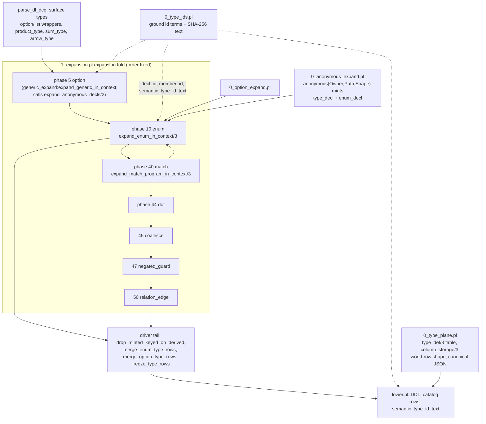

# Slice 5 audit: type identity and structural type forms

DL6 files audited: `v6/prolog/0_type_ids.pl`, `v6/prolog/0_type_plane.pl`,
`v6/prolog/0_anonymous_expand.pl`, `v6/prolog/0_enum_expand.pl`,
`v6/prolog/0_option_expand.pl`, `v6/prolog/0_match_expand.pl`, plus the
expansion driver (`1_expansion.pl`), their direct callers, and the anonymous /
enum / option / match / type-relation test files.

TOC:

1. [Slice map](#1-slice-map)
2. [Report blocks: 0_type_ids.pl](#2-0_type_idspl)
3. [Report blocks: 0_type_plane.pl](#3-0_type_planepl)
4. [Report blocks: 0_anonymous_expand.pl](#4-0_anonymous_expandpl)
5. [Report blocks: 0_enum_expand.pl](#5-0_enum_expandpl)
6. [Report blocks: 0_option_expand.pl](#6-0_option_expandpl)
7. [Report blocks: 0_match_expand.pl](#7-0_match_expandpl)
8. [Closing findings](#8-closing-findings)

---

## 1. Slice map



One caption: anonymous products/sums mint an
`anonymous(OwnerSemanticTypeId, SitePath, SpecializedShape)` identity plus an
ordinary generated `type_decl`/`enum_decl`, and everything downstream
(option/enum lowering, emitters, storage) sees only generated named
declarations; nominal identity is `(ModuleHash, Kind, Name)` and structural
identity is the ground term itself until `semantic_type_id_text/2` hashes it at
an artifact boundary.

---

## 2. `0_type_ids.pl`

```prolog
% File: v6/prolog/0_type_ids.pl:3
% Existing comment: "Semantic type identities are compiler values.  They remain
%   ground Prolog terms until an artifact boundary asks for their SHA-256 text
%   form."
% Signature: module type_ids exports decl_id/4, primitive_id/2, app_id/3,
%   param_id/4, member_id/4, constraint_id/3, arg_id/3, id_kind_name/3,
%   semantic_type_id_text/2
% Called by: 0_anonymous_expand (decl_id, id_kind_name, semantic_type_id_text),
%   0_enum_expand (decl_id, member_id), lower.pl:190 (id_kind_name,
%   semantic_type_id_text), compile/typegen_export.pl:37
%   (semantic_type_id_text), 0_generic_expand.pl:37, plunit_tests.pl:62
%   (catalog_type_ids, type_id_rail, semantic_type_identity suites)
% Calls: library(crypto) crypto_data_hash/3, string_bytes/3
% Tests: v6/prolog/compile/test/plunit_tests.pl (begin_tests(catalog_type_ids)
%   :2254, type_id_rail :2362, semantic_type_identity :2399)
% V7 class: extract
% Parser coupling: none
% Preserved law: a semantic id is a pure ground term built from
%   (ModuleHash, Kind, Name) / primitive name / (constructor, args) with no
%   global state, so two compilations of the same declaration yield the same
%   id, and the SHA-256 text is a deterministic function of that term.
% DL7 seam: in: module-hash atom, kind atom, name atom, list of ids; out:
%   named(M,K,N) | primitive(N) | application(C,[A...]) | parameter(O,#,N) |
%   member(O,#,N) | constraint(S,I) | argument(A,#) | anonymous(O,Path,Shape) |
%   anonymous_placeholder(T); out (artifact boundary only): hex SHA-256 atom.
```

```prolog
% File: v6/prolog/0_type_ids.pl:48-151
% Existing comment: "The encoding carries each atom's UTF-8 byte length and
%   each list's element count, preserving application nesting and argument
%   order without delimiter ambiguity.  The SHA-256 input is the same UTF-8
%   byte sequence used for those lengths.  This conversion is reserved for
%   catalog and emitted artifacts."
% Signature: semantic_type_id_encoding/2, path_encoding/2,
%   path_element_encoding/2, type_term_encoding/2, atom_encoding/2,
%   append_encoding/3 (all internal)
% Called by: semantic_type_id_text/2; anonymous_type_name/4 via
%   semantic_type_id_text
% Calls: format/3 string templates, foldl/4, maplist/3
% Tests: plunit_tests.pl semantic_type_identity (collision and nesting cases
%   :2399-2459)
% V7 class: oracle
% Parser coupling: none
% Preserved law: the encoding is self-delimiting (length-prefixed atoms,
%   arity-prefixed lists) so distinct ground terms never collide in the
%   digest; `any_pattern` encodes as "W" with no arguments.
% DL7 seam: in: the id term tree; out: UTF-8 string. V7 must keep this byte
%   format if emitted artifacts are graded against DL6 outputs, or re-pin
%   every golden fixture that stores the hex text.
```

Notes:

- `any_pattern` has a text encoding (`"W"`, line 64) but no constructor
  predicate; the term is produced elsewhere and consumed here. V7 seam: keep
  the encoding table and the term constructor in one module.
- `semantic_type_id_text/2` guards `ground(Id)` and fails (not throws) on a
  non-ground id; the failure mode is silent at call sites.

---

## 3. `0_type_plane.pl`

Header law (`0_type_plane.pl:1-28`): one relation model and one checker. A rel
column naming another rel means `parent(..., target_id INTEGER, ...)`;
`type_decl/2` is a legacy compiler IR record that contributes schema metadata,
never a second type system.

```prolog
% File: v6/prolog/0_type_plane.pl:67-77
% Existing comment: "Every type_decl/2 a program declares, in declaration
%   order." (type_definitions/2, type_definition/4, declared_type_name/2)
% Signature: type_definitions(+Decls, -Types), type_definition(+Types, +Name,
%   -Columns, -ColumnTypes), declared_type_name(+Types, +Name)
% Called by: compile.pl:60, analyze.pl:37, 0_program_check.pl:24,
%   lower.pl:194, 0_dot_expand.pl:72, 0_relation_edge_expand.pl:21,
%   0_relation_pattern.pl:23, parse_dl_dcg.pl:20, conformance/engine.pl:74,
%   anonymous/option/enum expansion via semantic_owner_id,
%   canonicalize_world_rows/3
% Calls: findall/3, member/2, memberchk/2
% Tests: plunit_tests.pl column-type suites; compiler_relations/1_type_graph
% V7 class: adapt
% Parser coupling: term-shape (type_def/3, col/2, col_type/3 carriers)
% Preserved law: one declared type is one name with an ordered column list;
%   both col_type/3 and type_decl/2 spellings describe the same rel.
% DL7 seam: in: decl list carrying type_decl(Name,[col(C,T),...]) and
%   col_type(Ref,C,T); out: type_def(Name, Columns, ColumnTypes) list.
```

```prolog
% File: v6/prolog/0_type_plane.pl:82
% Existing comment: "`Revision.id` is retained as `id(Revision)` after
%   qualified-type resolution. It denotes the target relation's existing
%   SQLite endpoint, not a relation value and not a request to intern or
%   follow that row."
% Signature: relation_id_type(+Type, -Name)
% Called by: lower.pl column type dispatch (via 0_type_plane export)
% Calls: atom/1
% Tests: plunit_tests.pl relplan_reference_targets suites
% V7 class: adapt
% Parser coupling: term-shape (id(Name) wrapper)
% Preserved law: id(RelName) is a reference to the target row's integer
%   endpoint, distinct from a relation value.
% DL7 seam: in: id(atom); out: target rel name.
```

```prolog
% File: v6/prolog/0_type_plane.pl:87-151
% Existing comment: storage-kind dispatch; `json` is its own STORAGE KIND not
%   an alias for text (SLOT-JSON1-FATE); json_list(T) ruling
%   list_spelling = list_of_type; wide-int / bytes refusals.
% Signature: column_storage(+Types, +Type, -StorageKind)
% Called by: 0_program_check.pl:350, plunit_tests.pl:84 (type dispatch tests),
%   lower.pl column_def
% Calls: list_element_type/2, declared_type_name/2
% Tests: plunit_tests.pl (column-type tests); fixtures
%   conformance/fixtures/14_option_wrapper_walk.pl, 8_json_flex.pl
% V7 class: adapt
% Parser coupling: term-shape (option/1, list/1, json_list/1, id/1, acyclic/1)
% Preserved law: every declared column type reduces to one storage kind
%   (int, text, bytes, json, bool, float, ref(Name), idref(Name),
%   list(Element), json_list(Element), bool, float) or throws a named
%   unsupported_construct: column_type_unknown, list_of_relation_refs,
%   list_of_relation_refs / list_element_not_scalar, relation_id_target_unknown.
% DL7 seam: in: closed wrapper term set; out: storage kind atom or compound.
%   The four-element json_list element set (int/text/bool/float/json) is the
%   only parametric type in the system (no type variable, no unification).
```

```prolog
% File: v6/prolog/0_type_plane.pl:167-202
% Existing comment: "Where a wrapper puts a rel element" (type_wrapper/2,
%   unwrapped_column_type/2, column_element_type_name/2, type_ref_columns/3).
% Signature: type_wrapper(?Wrapper, ?Placement), unwrapped_column_type(+Type,
%   -Inner), column_element_type_name(+Type, -Name), type_ref_columns/3
% Called by: parse_dl_dcg.pl:20, 0_generic_expand.pl:33, analyze.pl:37,
%   lower.pl:194, list_flavor artifacts, companion rel lowering
% Tests: conformance/fixtures/14_option_wrapper_walk.pl,
%   7_module_path_element.pl; anonymous_product_values.test.pl
%   (list_and_option_wrappers_materialize_and_execute)
% V7 class: adapt
% Parser coupling: term-shape
% Preserved law: every type expression is a finite wrapper tree; the rel name
%   needing a type_decl mirror is the bare name or the value-storing wrapper's
%   element; descending terminates because each step is a strict subterm.
% DL7 seam: in: option(T)/list(T)/json_list(T)/id(N) nesting; out: leaf rel
%   name.
```

```prolog
% File: v6/prolog/0_type_plane.pl:318-353
% Existing comment: "Interning is post-order ... It FAILS on a cycle rather
%   than looping; type_cycle_witness/2 is what names the offender" and "Content
%   ids cannot express a cyclic reference graph -- a parent's key is computed
%   FROM its children's keys (verdict: interned_graph_is_a_dag)".
% Signature: type_topological_order(+Types, -Ordered), type_cycle_witness(+Types,
%   -Names)
% Called by: canonicalize_world_rows/3, normalize_relation_reference_rows/3,
%   DDL/intern/render statement families
% Tests: compiler_relations/1_type_graph.test.pl; fixture 6_relation_depth.pl
% V7 class: extract
% Parser coupling: none
% Preserved law: declared types are a DAG (children before parents); a cycle is
%   a named unsupported construct with the residual member set as witness.
% DL7 seam: in: type_def/3 list; out: ordered name list / cycle witness list.
```

```prolog
% File: v6/prolog/0_type_plane.pl:383-425
% Existing comment: SLOT-ARRIVAL-MALFORMED ("a world row whose value does not
%   match the declared struct shape is a NAMED unsupported construct at the
%   boundary, never a silently stored blob and never a NULL column") and
%   SLOT-ARRIVAL-CANONICAL-ORDER ruling.
% Signature: type_shape_error(+Types, +TypeName, +Value, -Reason),
%   json_object_value(+Value, -Pairs)
% Called by: column_value_shape_error/4 (world_row_shape_violation/3),
%   type_field_values/4, canonical_struct_value/4, emit_ts.pl:767 TS mirror
% Tests: conformance/fixtures/4_struct_values.pl; typed_host_contracts tests
% V7 class: adapt
% Parser coupling: term-shape (obj/1, '{}'(_), bool_lit/1, json_null)
% Preserved law: a struct arrival is a JSON object only, key-complete, with
%   per-field checks against the declared column type; both brace literals and
%   canonical obj(SortedPairs) spellings are accepted at the door.
% DL7 seam: in: world value term + declared type; out: obj(SortedPairs) or a
%   named Reason term (missing_key/unknown_key/not_an_object/field_not_*).
```

```prolog
% File: v6/prolog/0_type_plane.pl:443-563
% Existing comment: struct_arrival_key_order ruling ("arrival key order is
%   INSIGNIFICANT ... both spellings become ONE canonical term") and
%   type_gate_widening ruling ("widen yes, do what sql would do" -- REAL
%   affinity: integer in a float column widens once at the boundary).
% Signature: canonicalize_world_rows(+Decls, +Rows0, -Rows),
%   canonicalize_signed_row/4, canonicalize_row/4, canonicalize_column/5,
%   canonical_struct_value/4, canonical_field_value/5
% Called by: run_program (conformance) right after check_world_shapes;
%   emitted runtime repeats at intern time
% Tests: conformance/fixtures/4_struct_values.pl, 8_json_flex.pl
% V7 class: adapt
% Parser coupling: term-shape (signed rows +/-(Row), obj/1)
% Preserved law: every struct-typed world value reaches store/Set/tick-log as
%   one canonical obj(SortedPairs) term, and REAL-affinity widening of
%   int->float happens exactly once at the gate regardless of Types == [].
% DL7 seam: in: signed or bare row terms; out: rows with canonical obj/1
%   struct columns and widened floats.
```

```prolog
% File: v6/prolog/0_type_plane.pl:452-509 (normalize_relation_reference_rows,
%   relation_reference_target/5, ordered_target_rows, dedupe_preserving_order,
%   reference_target_wrapper, reference_target_already_arriving)
% Existing comment: "A nested relation row on ingress is shorthand for two
%   ordinary arrivals: the target row first, then the parent row carrying its
%   resolved endpoint."
% Signature: normalize_relation_reference_rows(+Decls, +Rows0, -Rows)
% Called by: conformance engine world-row ingress
% Tests: conformance/fixtures/6_relation_depth.pl, 7_module_path_element.pl
% V7 class: adapt
% Parser coupling: term-shape
% Preserved law: nested ingress normalizes to target-arrival-then-parent with
%   target membership public at that tick; targets are emitted in type
%   topological order and deduped against rows already arriving.
% DL7 seam: in/out: row term lists; identity follows key(...) columns with
%   full-row fallback.
```

```prolog
% File: v6/prolog/0_type_plane.pl:574-757
% Existing comment: world_row_shape_violation/3 wide-integer pass
%   (wide_int_fate = refuse_everywhere_with_todo, one float-column exception)
%   and declared-type pass; type_gate_widening ruling
%   (arrival_gate_all_types_all_positions); ref_column_names/4 NAMED CRACK: a
%   partially-typed rel gets no arrival shape check (silent by choice).
% Signature: world_row_shape_violation(+Decls, +Rows, -mismatch(Ref, Column,
%   TypeName, Reason)), row_column_violation/8, wide_integer_witness/2,
%   column_value_shape_error/4, ref_column_names/4
% Called by: conformance engine load; emitted runtime intern (TS mirror at
%   emit_ts.pl:767)
% Tests: fixtures 4_struct_values.pl, 8_json_flex.pl, 7_module_path_element.pl
% V7 class: adapt
% Parser coupling: term-shape
% Preserved law: two passes per row in order -- decl-independent wide-int
%   refusal (skipping float columns because REAL affinity widened before the
%   check), then declared-type shape check per column with SQLite affinity
%   semantics (int accepts lossless reals, float widens integers, bool is the
%   two literals, text refuses numbers, bytes requires bytes(Base64), list
%   checks array-ness and element shapes).
% DL7 seam: in: decl list + row terms; out: first mismatch(Ref, Column,
%   TypeName, Reason) or failure.
```

```prolog
% File: v6/prolog/0_type_plane.pl:779-798 (type_canonical_json/4,
%   type_field_json/4, type_field_values/4)
% Existing comment: "Object keys come out SORTED, never in declared column
%   order: the ruled cross-target encoding is sorted-keys-no-whitespace, and
%   declaration order is a positional-program fact that must not leak into a
%   logical value."
% Signature: type_canonical_json(+Types, +TypeName, +Value, -Text),
%   type_field_values(+Types, +TypeName, +Value, -FieldValues)
% Called by: lower.pl intern machinery; type_field_values also from
%   normalize_relation_reference_rows
% Tests: fixtures 4_struct_values.pl (byte-identical tick-log grade)
% V7 class: oracle
% Parser coupling: none
% Preserved law: a declared type's canonical JSON is sorted-key, no
%   whitespace, recursive through child declared types; the memoized parent
%   text is one concat over children's finished texts.
% DL7 seam: in: canonical obj value; out: JSON text (cross-target log
%   contract).
```

```prolog
% File: v6/prolog/0_type_plane.pl:809-1037 (canonical_json_text/2,
%   js_float_text/2 and helpers, escape_json_codes/2, json_string_text/2)
% Existing comment: "Deliberately a clause-for-clause mirror of
%   conformance/ticklog.pl:value_json/2 rather than a call into it --
%   ticklog.pl is a SCRIPT, not a module"; THE ESCAPE SET IS
%   JSON.stringify's, exactly (byte-diff graded); js_float_text rewrites SWI's
%   shortest round-trip digits into ECMAScript Number::toString's fixed range
%   [1e-6, 1e21).
% Signature: canonical_json_text(+Value, -Text), js_float_text(+Value, -Text),
%   escape_json_codes(+Codes, -Escaped)
% Called by: conformance/ticklog.pl:29 (js_float_text only), level_eval.pl,
%   sweep.pl, metamorphic_rename.pl; type_field_json/3
% Tests: json_string_control_escapes_are_are fixture (fail-first receipt);
%   float_shortest_round_trip_wire dl_view + oracle fixtures
% V7 class: oracle
% Parser coupling: none
% Preserved law: the escape set, float formatting range, and sorted-key
%   object form are byte-graded contracts shared with every emitted door.
% DL7 seam: in: canonical value terms; out: JSON text atoms.
```

```prolog
% File: v6/prolog/0_type_plane.pl:209-311 (relation_columns_and_types/5,
%   relation_value_shape/3, relation_value_term/4, relation_object_fields/5,
%   relation_value_object/4, relation_field_object/4)
% Existing comment: "`file(repo(Name), fpath(Path))` ... is the SURFACE
%   spelling of a relation value; the stored/graded spelling is the canonical
%   obj(...) ... every door turns the term into the object, and no door stores
%   the term." "This is deliberately exact: a partial or extra object cannot
%   be assigned to a product owner by field resemblance."
% Signature: relation_columns_and_types(+Decls, +Types, +Name/Arity, -Columns,
%   -ColumnTypes), relation_value_shape/3, relation_value_term/4,
%   relation_value_object/4
% Called by: 0_dot_expand.pl:72, 0_relation_edge_expand.pl:21,
%   0_relation_pattern.pl:23, analyze.pl:37, compile.pl, anonymous product
%   canonicalization (canonical_struct_value/4), tests
% Tests: compile/test/anonymous_product_values.test.pl:11 (relation_value_object),
%   4_braced_nested_relations.test.pl, type_relation_ir.test.pl
% V7 class: adapt
% Parser coupling: term-shape (positional term / obj(Pairs) / '{}'(conj) /
%   Name(Args) spelling)
% Preserved law: a relation value has exactly one canonical spelling
%   (obj(SortedPairs), keys sorted, recursive); unbound arguments pass through
%   so a pattern becomes a pattern object; a wrong-arity or unknown-name term
%   is a named refusal (relation_pattern_not_a_relation_value), never a
%   quiet store.
% DL7 seam: in: surface term + declared type; out: obj(SortedPairs) canonical
%   value or a positional term with variables preserved.
```

```prolog
% File: v6/prolog/0_type_plane.pl:809-843 note: none/1 and json_null
% Existing comment: none (spelling carriers in canonical_json_text)
% V7 class: adapt
% Preserved law: `none` (the option literal) and json_null both render JSON
%   `null`; this is the only place option-none and json-null agree on bytes.
```

---

## 3. `0_anonymous_expand.pl`

Runs inside generic expansion (phase 5, `0_generic_expand.pl:34`), after
concrete generic substitution and before option/enum lowering. The generated
decl lands as `type_decl` (product/arrow) or `enum_decl` (sum) so option and
enum expansion lower it unchanged.

```prolog
% File: v6/prolog/0_anonymous_expand.pl:37-40
% Existing comment: entry point, no comment above the predicate itself beyond
%   the module header identity law.
% Signature: expand_anonymous_decls(+Decls0, -Decls)
% Called by: 0_generic_expand.pl:34 (expand_generic_program), tests
%   anonymous_type_syntax.test.pl:15
% Calls: mint_all/3, merge_anonymous_type_rows/3, rewrite_anonymous_semantic_rows/2
% Tests: compile/test/anonymous_type_syntax.test.pl (whole suite)
% V7 class: adapt
% Parser coupling: term-shape (product_type/sum_type/arrow_type/annotated_type,
%   col_type/3, type_decl/2, semantic_decl_module/3)
% Preserved law: an anonymous type in col_type/3 or type_decl/2 position mints
%   exactly one owner-scoped identity anonymous(Owner, Path, Shape) plus one
%   generated declaration; re-minting the same site is idempotent and
%   duplicates collapse on sort.
% DL7 seam: in: decl list; out: decl list with generated decls, col_type
%   rewrites, and a semantic_type_rows/1 carrier.
```

```prolog
% File: v6/prolog/0_anonymous_expand.pl:125-198 (anonymous_mint/7,
%   anonymous_mint_product/7, mint_arguments/8, mint_fields/6, mint_variants/6)
% Existing comment: "Type0 is the specialized literal type; Type is the
%   materialized type with anonymous sub-terms replaced by their generated
%   names.  Owner is the root owning relation's semantic id and stays fixed
%   throughout the descent; Path grows with member names and
%   wrapper/application ordinals."
% Signature: anonymous_mint(+Decls, +Owner, +Path, +Type0, -Type, -ExtraDecls,
%   -Rows)
% Called by: mint_col_type/4, mint_type_decl_specs_/7, mint_arguments/7,
%   mint_fields/6, itself (recursion)
% Calls: check_anonymous_cycle/3, anonymous_type_name/4, semantic_decl_id_anon/4,
%   owner_module_hash/2, cols_from_fields/2, mint_variants/6, mint_fields/6
% Tests: anonymous_type_syntax.test.pl tests product_mints_owner_scoped_
%   identity_and_materializes_type_decl, sum_mints_identity_and_enum_context_
%   sees_it, nested_product_mints_recursive_site_path, guarded/unguarded cycle
% V7 class: adapt
% Parser coupling: term-shape
% Preserved law: the identity is (Owner, Path, Shape) where Path is member
%   names plus wrapper/application ordinals from the owner root; arrow types
%   materialize as products with a `return` field; sums materialize as
%   enum_decls consumed by enum expansion; annotated types descend unwrapped.
% DL7 seam: in: type term with owner id; out: materialized name + decl/row
%   lists.
```

```prolog
% File: v6/prolog/0_anonymous_expand.pl:259-275 (anonymous_type_name/4,
%   path_stem/2, path_component_stem/2)
% Existing comment: "Deterministic diagnostic name: owner stem + path stem + a
%   16-hex digest of the canonical identity encoding.  Unrelated declarations
%   cannot change the identity, so they cannot change the name either."
% Signature: anonymous_type_name(+Owner, +Path, +Shape, -Name)
% Called by: anonymous_mint_product/8, anonymous_mint (sum arm),
%   materialized_sum_path_decls/6
% Calls: semantic_type_id_text/2, id_kind_name/3
% Tests: anonymous_type_syntax.test.pl identity_is_stable_under_unrelated_
%   declaration_insertion, generated_decl_is_deterministic_across_two_mints
% V7 class: extract
% Parser coupling: none
% Preserved law: the generated name derives only from (Owner, Path, Shape) via
%   the SHA-256 identity text; it is diagnostic-only and never identity.
% DL7 seam: in/out: `__anon_<owner>_<path-stem>_<16hex>` atom.
```

```prolog
% File: v6/prolog/0_anonymous_expand.pl:277-298 (materialized_sum_path_decls/6)
% Existing comment: "A member-owned sum has one source path and ordinary
%   generated declarations.  The path resolver needs aliases before the later
%   anonymous minting pass, so this predicate computes the same generated
%   names from the same semantic identity without changing the declaration or
%   storage representation."
% Signature: materialized_sum_path_decls(+Decls, +OwnerName, +OwnerPath,
%   +SitePath, +sum_type(Variants), -PathDecls)
% Called by: 0_dot_expand.pl:76
% Tests: compiler_relations/4_anonymous_sum_dot_projection.test.pl (all five
%   tests), 4_braced_nested_relations.test.pl deep_rule_head_body_match
% V7 class: adapt
% Parser coupling: term-shape (type_path_alias/2)
% Preserved law: dot paths through a materialized anonymous sum resolve to the
%   same generated variant relations that minting produces, derived only from
%   the semantic identity.
% DL7 seam: in: decls + owner path; out: type_path_alias(GeneratedName/0,
%   SumPath) plus per-variant aliases.
```

```prolog
% File: v6/prolog/0_anonymous_expand.pl:284-298 depends on 0_enum_expand
%   variant_rel_name/3 -- noted cross-file seam: anonymous expansion needs the
%   enum naming rule, so the two files are one extraction unit.
```

```prolog
% File: v6/prolog/0_anonymous_expand.pl:302-335 (type_contains_anonymous/1,
%   check_anonymous_cycle/3, unguarded_shape_references_name/3)
% Existing comment: "An unguarded cycle is refused. `option(T)` and `list(T)`
%   provide an existing storage boundary, so an owner reference below either
%   wrapper is accepted."
% Signature: type_contains_anonymous(+Term), check_anonymous_cycle(+Owner,
%   +Path, +Shape)
% Called by: anonymous_mint/7 variants, mint_col_type/4, mint_type_decl_specs_/6
% Tests: anonymous_type_syntax.test.pl unguarded_anonymous_cycle_is_named,
%   guarded_anonymous_cycle_materializes
% V7 class: adapt
% Parser coupling: term-shape
% Preserved law: a sum/product/arrow whose shape mentions its owner outside
%   option/list wrappers is a named unsupported_construct(anonymous_type_cycle);
%   option and list wrappers are the accepted cycle guards.
% DL7 seam: in: type term + owner name; out: throw or pass.
```

```prolog
% File: v6/prolog/0_anonymous_expand.pl:337-366 (semantic_owner_id/3,
%   owner_module_hash/2, semantic_decl_id_anon/4, merge_anonymous_type_rows/3,
%   merge_one_anonymous_type_rows/3)
% Existing comment: none (helpers)
% Signature: semantic_owner_id(+Decls, +OwnerName, -Owner)
% Called by: mint_col_type, mint_type_decl, materialized_sum_path_decls,
%   tests
% Calls: decl_id/4, member/2 over semantic_decl_module/3 and
%   semantic_type_rows/1
% V7 class: adapt
% Parser coupling: term-shape
% Preserved law: owner identity resolution has a three-rung fallback
%   (semantic_decl_module marker, then semantic_type_rows declaration, then
%   ModuleHash = local with kind inferred from enum_decl presence); a module
%   hash fallback of `local` is a DL6 single-module artifact.
% DL7 seam: V7 modules must supply the owner's module hash explicitly or the
%   `local` rung becomes a hidden ambient dependency.
```

```prolog
% File: v6/prolog/0_anonymous_expand.pl:370-429 (rewrite_anonymous_semantic_rows,
%   rewrite_anonymous_semantic_term/3, anonymous_generated_id/3)
% Existing comment: "Generic validation rows retain source shapes only in
%   anonymous/3 identity witnesses; all generic argument references use
%   materialized declaration ids."
% Signature: rewrite_anonymous_semantic_rows(+Decls0, -Decls)
% Called by: expand_anonymous_decls/2 only
% Calls: setof/4 over semantic_type_rows, derived_from, declaration
% Tests: anonymous_type_syntax.test.pl generic_semantic_rows_use_materialized_
%   anonymous_identity, anonymous_generated_id determinism
% V7 class: adapt
% Parser coupling: term-shape (anonymous_placeholder/1, type_named/1,
%   type_ref(named(_)) spellings)
% Preserved law: every structural shape inside a semantic row resolves to the
%   declaration id derived_from the anonymous/3 identity; anonymous/3
%   witness rows themselves pass through untouched.
% DL7 seam: in: semantic_type_rows list; out: same list with structural shapes
%   replaced by generated declaration ids.
```

```prolog
% File: v6/prolog/0_anonymous_expand.pl:433-435
% Signature: anonymous_owner_path(+anonymous(_, Path, _), -Path)
% Called by: schema_member_roles (compile plane)
% V7 class: extract
% Parser coupling: term-shape
% Preserved law: a member whose authored type is an anonymous product/sum
%   carries the anonymous_owner role with the minted site path.
% DL7 seam: in: anonymous/3 term; out: path list.
```

Notes:

- `:- op(1150, xfx, <-).` at module level (line 33): module-local op, re-declared
  by each expansion file. V7's cons-tree syntax drops `<-`; the term-shape the
  walkers actually inspect here is only type terms, so the op is incidental.
- Cuts: `mint_col_type/4` and `anonymous_mint/7` use once-commit (`!`) on the
  product/sum/arrow arms; a shape matching two arms is first-match, by order.

---

## 4. `0_enum_expand.pl`

```prolog
% File: v6/prolog/0_enum_expand.pl:12-17,44-56
% Existing comment: "enum_context/2 exists because expansion ERASES its own
%   input: expand_enum_program/2 removes every enum_decl/2 entry. Anything
%   that has to reason about enums AFTER that point (match exhaustiveness is
%   the live case) must be handed the metadata rather than re-reading
%   declarations that are gone. It is computed from the SURFACE declarations,
%   before any phase runs."
% Signature: enum_context(+SurfaceDecls, -Enums) with Enums = [EnumName-
%   [GeneratedRef-VariantName ...]]
% Called by: 1_expansion.pl:16,100 (context built BEFORE phase 5),
%   0_match_expand.pl (coverage validation), drop_minted_keyed_on_derived
% Calls: enum_variant/2, variant_spec/3, variant_rel_name/3
% Tests: plunit_tests.pl expansion_order, match_block suites;
%   anonymous_type_syntax.test.pl sum_mints_identity_and_enum_context_sees_it
% V7 class: adapt
% Parser coupling: term-shape (enum_decl/2 semicolon variant terms)
% Preserved law: the context is derived with the same variant_rel_name/3
%   expansion uses, so it cannot drift from what expansion produces; arity is
%   content arity + 1 (the id column).
% DL7 seam: in: surface decls; out: enum name -> ordered variant-ref list.
```

```prolog
% File: v6/prolog/0_enum_expand.pl:64-70 (expand_enum_program/2,
%   expand_enum_in_context/3)
% Existing comment: "The expansion-driver arity. Enum runs first, so it needs
%   nothing from the context; the argument is there because 1_expansion.pl
%   calls every wired phase the same way."
% Signature: expand_enum_program(+prog(Decls, Rules), -prog(Decls, Rules))
% Called by: 1_expansion.pl phase 10, 0_match_expand.pl:28
%   (expand_match_program one-shot), plunit_tests.pl:56
% Calls: validate_enum_names/2, expand_enum_decls/3, enum_tag_names/2,
%   retarget_enum_column_types/3
% Tests: plunit_tests.pl enum_decl_expansion; fixtures
%   conformance/fixtures/0_enum_variants.pl
% V7 class: adapt
% Parser coupling: term-shape (enum_decl(Name, (V1 ; V2)), field `Name:Type`
%   variant columns, `<-` tag rules)
% Preserved law: every enum_decl becomes one variant relation per variant plus
%   a `<Enum>_tag` rel of (id:int, tag:text) with tag rules; enum columns
%   retarget to int and leave an enum_column/3 marker; expansion erases its
%   own input.
% DL7 seam: in: prog with enum_decl/2; out: prog with col_type/keyed/rel
%   decls + tag rules, no enum_decl.
```

```prolog
% File: v6/prolog/0_enum_expand.pl:261-299 (validate_enum_names/2,
%   plain_decl_names/2, plain_decl_ref/2, validate_generated_names/2)
% Existing comment: none above
% Signature: validate_enum_names(+Decls)
% Called by: expand_enum_program/2
% Tests: plunit_tests.pl enum_decl_expansion collision tests
% V7 class: extract
% Parser coupling: term-shape
% Preserved law: a variant name colliding with a plain rel name, a generated
%   `Enum_Variant` rel colliding with a plain rel, or two variants generating
%   the same rel are named unsupported_constructs
%   (enum_variant_name_collision / enum_variant_rel_collision).
% DL7 seam: unchanged; pure name-collision oracle over decl lists.
```

```prolog
% File: v6/prolog/0_enum_expand.pl:301-375 (expand_enum_decls/3, enum_variant/2,
%   variant_spec/3, variant_column/2, expand_variant/4, variant_col_type/3,
%   content_key_positions/2)
% Existing comment: "Identity is the CONTENT, so the key skips position 1. A
%   fieldless variant has no content, and `PRIMARY KEY ()` is a syntax error,
%   so its id carries it."
% Signature: expand_variant(+RelName, +VariantTerm, -Decls, -Rule)
% Called by: expand_enum_decls/3
% Tests: plunit_tests.pl enum_decl_expansion; fixture 0_enum_variants.pl
%   (keyed-on-derived drop interplay)
% V7 class: adapt
% Parser coupling: term-shape
% Preserved law: a variant rel is keyed on its content columns (positions
%   2..n), or on id alone for a fieldless variant; each variant rel emits a
%   tag rule `Enum_tag(Id, Variant) <- VariantRel(Id, ...)`.
% DL7 seam: in: enum_decl term; out: col_type/keyed decls + one `<-` rule per
%   variant (DL7: `:` binder form / application form).
```

```prolog
% File: v6/prolog/0_enum_expand.pl:177-229 (enum_type_rows/2,
%   enum_variant_position/6, semantic_decl_id/4, enum_generated_module/4)
% Existing comment: "An enum's members are its variants; each variant rel edges
%   back to the enum."
% Signature: enum_type_rows(+SurfaceDecls, -Rows)
% Called by: merge_enum_type_rows/3, 0_generic_expand.pl:32,
%   option_type_rows/2
% Calls: decl_id/4, member_id/4 (0_type_ids)
% Tests: plunit_tests.pl catalog_type_ids; anonymous_type_syntax.test.pl
%   sum_mints_identity_and_enum_context_sees_it
% V7 class: extract
% Parser coupling: none (rows are semantic rows)
% Preserved law: the semantic type graph gets declaration(EnumId, root, Name,
%   enum, compile_time), declaration(VariantRelId, ..., materialized),
%   derived_from(VariantRelId, EnumId), and member(MemberId, EnumId, Ordinal,
%   VariantName, type_ref(declaration(VariantRelId))) rows in declaration
%   order.
% DL7 seam: in/out: semantic_type_rows row terms (declaration/5, derived_from/2,
%   member/5).
```

```prolog
% File: v6/prolog/0_enum_expand.pl:74-89 (drop_minted_keyed_on_derived/3) and
%   241-259 (retarget_enum_column_types/3, enum_columns/3)
% Existing comment: "Runs after every rule-producing phase in either door: a
%   minted keyed on a derived rel is dropped; author keyed stays under the
%   keyed_level_head guard." and "An enum column holds the instance id, so
%   reading a variant is an ordinary join on the tag rel. A ref would make the
%   DERIVED tag rel an arrival target too."
% Signature: drop_minted_keyed_on_derived(+EnumContext, +prog, -prog),
%   retarget_enum_column_types(+EnumToTag, +Decls0, -Decls)
% Called by: 1_expansion.pl:118, 0_match_expand.pl:30
% Tests: fixture 0_enum_variants.pl (restore-the-unconditional-mint comment),
%   plunit_tests.pl enum_import_identity_targets
% V7 class: adapt
% Parser coupling: term-shape
% Preserved law: an enum-typed column becomes int storage plus an enum_column/
%   3 marker (so catalog emitters recover the declared type); a minted variant
%   rel that turned out to be derived loses its keyed decl.
% DL7 seam: unchanged decl stream + markers.
```

```prolog
% File: v6/prolog/0_enum_expand.pl:93-166 (merge_enum_type_rows/3,
%   merge_option_type_rows/2, option_type_rows/2, option_type_row/3,
%   option_catalog_value_element/2, option_enum_type_rows/2,
%   option_enum_type_decls/2, merge_one_enum_type_rows/3)
% Existing comment: "Runs on the completed program in either door, from the
%   SURFACE declarations expansion erased. The rows are additive; nothing
%   above reads them back." and "enum expansion has erased enum_decl/2 by the
%   time merge_option_type_rows/2 runs. Its semantic declaration row is
%   therefore the post-expansion witness that an atom is an enum value rather
%   than a relation reference."
% Signature: merge_enum_type_rows(+SurfaceDecls, +prog, -prog),
%   merge_option_type_rows(+prog, -prog)
% Called by: 1_expansion.pl:121,124; 0_match_expand.pl:31
% Tests: anonymous_sum_values.test.pl; compiler_relations/0_value_domains.
%   test.pl
% V7 class: adapt
% Parser coupling: term-shape (semantic_type_rows single carrier)
% Preserved law: enum/option semantic rows are merged into the single
%   semantic_type_rows slot of the completed program, sorted; option rows
%   distinguish scalar/nested-option payloads (origin rows with an
%   option_column origin) from companion-rel payloads (declaration +
%   derived_from + origin rows).
% DL7 seam: additive rows only; the merge collapses to a set union in V7.
```

---

## 5. `0_option_expand.pl`

```prolog
% File: v6/prolog/0_option_expand.pl:22-28 (expand_option_program/2,
%   expand_option_in_context/3, expand_option_decls/2)
% Existing comment: "Rules untouched: authors write bodies against the
%   desugared rels, the same consumption shape enums already have."
% Signature: expand_option_program(+prog(Decls0, Rules), -prog(Decls, Rules))
% Called by: 1_expansion.pl phase 5 (via generic_expand:expand_generic_in_
%   context), plunit_tests.pl:57
% Calls: strip_acyclic_wrappers/2, desugar_enum_payload_options/2,
%   desugar_option_columns/2
% Tests: plunit_tests.pl expansion_order; fixtures
%   14_option_wrapper_walk.pl; typed_host_contracts.test.pl
%   nested_list_option_and_enum_spelling_survives_ir
% V7 class: adapt
% Parser coupling: term-shape (option/1 wrapper, acyclic/1 wrapper)
% Preserved law: option(T) desugars by element kind -- value (scalar, enum,
%   nested option) to a minted `__opt_<t>` none/some(value:T) enum id column;
%   rel reference to a companion split rel `Parent__Column`; keyed options stay
%   in the owner row (enum ids, so key equality never sees NULL/3VL);
%   acyclic(...) is stripped to an acyclic_column/2 marker and must wrap
%   option(own rel).
% DL7 seam: in: col_type(_, _, option(E)) decls; out: retargeted col_type/3 +
%   minted enum_decl/companion rel decls + option_column/3 markers.
```

```prolog
% File: v6/prolog/0_option_expand.pl:130-152 (desugar_option_column/5,
%   option_column_position/4)
% Existing comment: "A keyed option must stay in its owner row: `none` and
%   `some(Target)` are enum ids, so SQLite key equality never observes
%   NULL/3VL." (in-body comment); wrapper composition contract comment at 120.
% Signature: desugar_option_column(+Decls0, +Ref, +Column, +Element, -Decls)
% Called by: desugar_option_columns/2 (recursive driver)
% Tests: plunit_tests.pl wrapped_relplan_reference_targets;
%   fixtures 14_option_wrapper_walk.pl
% V7 class: adapt
% Parser coupling: term-shape
% Preserved law: the three-way dispatch is option_value_element (value) ->
%   keyed+declared-rel (value storage in-row) -> declared_rel_element
%   (companion rel) -> named refusal option_element_type_unknown; positions
%   are meaningful only for fully-typed refs (length check).
% DL7 seam: unchanged term shapes, re-ordered dispatch preserved.
```

```prolog
% File: v6/prolog/0_option_expand.pl:190-218 (ensure_option_enum_decls/4,
%   option_enum_payload/4, option_enum_name/2, option_type_stem/2,
%   option_enum_decl/2)
% Existing comment: "The one spelling of the minted enum, shared with the row
%   merge so the graph cannot drift from what expansion mints."
% Signature: ensure_option_enum_decls(+Decls0, +Element, -EnumName, -Decls)
% Called by: desugar_value_option/5, desugar_enum_payload_options/2 (via
%   ensure_option_enum_decls/3), option_enum_payload/4
% Tests: anonymous_sum_values.test.pl option_sum_emits_both_runtime_plans;
%   plunit_tests.pl enum_import_identity_targets
% V7 class: extract
% Parser coupling: term-shape
% Preserved law: option(option(T)) mints a chain `__opt_T`,
%   `__opt_option_T`, ..., each `enum_decl(Name, (none ; some(value:Inner)))`
%   where the outer some payload is the inner option's enum id; the enum name
%   is the pure function `__opt_` + underscored stem.
% DL7 seam: in: surface element term; out: enum_decl with the one ruled
%   spelling.
```

```prolog
% File: v6/prolog/0_option_expand.pl:220-303 (desugar_reference_option/6,
%   shrink_parent_ref/5, renumber_key_position/3, companion_rel_name/3,
%   companion_rel_decls/5, companion_element_type/3, companion_element_column/4,
%   check_companion_name_free/3, option_column_entry/3, declared_rel_element/2)
% Existing comment: "The companion split rel lands in the author namespace,
%   the hazard validate_generated_name_collisions/3 covers for the minted
%   generic names." and "Default-on: a column typed option(<its own rel>) is a
%   parent chain and its companion split rel carries the guard whether or not
%   acyclic was spelled."
% Signature: desugar_reference_option(+Decls0, +ParentRef, +Column, +Element,
%   +Position, -Decls)
% Called by: desugar_option_column/5
% Tests: fixture 14_option_wrapper_walk.pl; 0_storage_projection.test.pl
%   (option endpoint projection)
% V7 class: adapt
% Parser coupling: term-shape (col_type/keyed/kind/keep/rel_path_decl ref
%   rewrites)
% Preserved law: the option column leaves the parent row (arity shrinks, key
%   positions renumber, path carrier follows), and a `Parent__Column`
%   companion rel carries (parent_id:int, element_id) keyed on parent_id;
%   self-typed companions qualify the element column name with the column.
% DL7 seam: in: decls with option(ref) columns; out: shrunk parent + companion
%   rel decls.
```

```prolog
% File: v6/prolog/0_option_expand.pl:272-277
% Signature: acyclic_companion(+Decls, +CompanionName/2, -declared_at(P,C),
%   -OwnerColumn, -TargetColumn)
% Called by: lower.pl:191, conformance/engine.pl:80
% Tests: fixtures exercising self-option chains
% V7 class: extract
% Parser coupling: term-shape (option_column marker)
% Preserved law: the guard walks the chain the column itself forms; the
%   owner column is `<Parent>_id` and the target column `<column>_<parent>_id`
%   for self-typed companions.
% DL7 seam: in: decls + companion ref; out: column name pair.
```

Hidden detail: `desugar_option_columns/2` loops one column per iteration
(option_column markers accumulate via append after desugar), so declaration
order of minted enums follows encounter order of col_type entries, and
`ensure_option_enum_decls` prepends minted enum_decls (order-sensitive merge).

---

## 6. `0_match_expand.pl`

```prolog
% File: v6/prolog/0_match_expand.pl:25-35 (expand_match_program/2)
% Existing comment: "One-shot entry that expands match arms before enum
%   declarations."
% Signature: expand_match_program(+prog(SugaredDecls, SugaredRules), -Program)
% Called by: plunit_tests.pl:61 (one-shot path); 1_expansion.pl uses the
%   in-context variant instead
% Calls: enum_context/2, expand_match_rules/3, expand_enum_program/2,
%   drop_minted_keyed_on_derived/3, merge_enum_type_rows/3,
%   merge_option_type_rows/2, freeze_type_rows/2
% Tests: plunit_tests.pl match_block, expansion_order suites
% V7 class: adapt
% Parser coupling: term-shape (match/2, `<-`, `<+`)
% Preserved law: the one-shot entry is a full pipeline replica (match -> enum
% -> drop minted keyed -> merge enum rows -> merge option rows -> freeze) that
% must stay step-for-step equal to the driver's tail; DL7 should keep ONE
% pipeline and delete the replica.
% DL7 seam: in/out: prog(Decls, Rules) with match/2 rules erased.
```

```prolog
% File: v6/prolog/0_match_expand.pl:41-56 (expand_match_program_in_context/3,
%   expand_match_rules/3)
% Existing comment: "Driver entry: arms only, no enum pass, coverage checked
%   against a context built from the SURFACE declarations. Enum expansion has
%   already run and erased the enum_decl/2 entries by the time this is called,
%   which is exactly why the context is a parameter and not something to
%   re-derive here."
% Signature: expand_match_program_in_context(+Enums, +prog, -prog)
% Called by: 1_expansion.pl:39 (phase 40)
% Tests: plunit_tests.pl match_block; compiler_relations/0_value_domains.test.pl
% V7 class: extract
% Parser coupling: term-shape (match(SourceAtom, Arms) with ; arm lists and
%   `<-`/`<+` arm heads)
% Preserved law: each arm becomes `ArmHead <- SourceAtom, Guards` (or `<+`),
%   source and arm heads must be positive rel atoms outside the language-form
%   list, and if every arm head names one enum's variants the arm set must be
%   exhaustive or a named match_nonexhaustive fires.
% DL7 seam: in: match form with cons-tree arms; out: ordinary rules per arm.
```

```prolog
% File: v6/prolog/0_match_expand.pl:58-92 (validate_match_source/1,
%   positive_rel_atom/1, match_language_form/1)
% Existing comment: none (the language-form list is uncommented)
% Signature: match_language_form(?Name/?Arity)
% Called by: positive_rel_atom/1
% Tests: plunit_tests.pl match_block refusals
% V7 class: oracle
% Parser coupling: token/CST (the list is a spelling-level ban)
% Preserved law: a match source or arm head may not be a language form
%   (`,`, `;`, `<-`, `<+`, `:=`, is, comparisons, not/1, temporal probes,
%   decode/2, json_each/2, match/2, true/0); the list is closed and copied
%   nowhere else.
% DL7 seam: re-derive the list from DL7's reserved forms; this is the one
%   place DL6's surface op set is hardcoded in this slice.
```

```prolog
% File: v6/prolog/0_match_expand.pl:121-142 (validate_match_coverage/2,
%   arm_head_ref/2, rel_ref_local/2)
% Existing comment: trailing comment documents that the duplicate
%   enum_variant/2 walker and variant_name_arity/3 were deleted in favor of
%   the context parameter.
% Signature: validate_match_coverage(+EnumVariants, +Arms)
% Called by: expand_match_rules/3
% Tests: plunit_tests.pl match_block (match_nonexhaustive, pinned at
%   plunit_tests.pl:2432 per ARCH.pl:689); anonymous_type_syntax.test.pl
%   sum_mints_identity_and_enum_context_sees_it (anonymous sums flow into
%   enum_context before match)
% V7 class: oracle
% Parser coupling: term-shape (Ref = Name/Arity, GeneratedRef-VariantName
%   pairs)
% Preserved law: coverage is checked only when ALL arm heads resolve into a
%   single enum's variant refs; then every variant must have an arm, else
%   unsupported_construct(match_nonexhaustive(Enum, Variant)).
% DL7 seam: in: enum context (name -> ordered generated refs) + arm head refs.
```

---

## 7. Cross-cutting contracts

### 7.1 Nominal identity

`named(ModuleHash, Kind, Name)` from `decl_id/4` (`0_type_ids.pl:18`).
`ModuleHash` resolution has three rungs (semantic_decl_module marker, then
semantic_type_rows declaration, then `local` fallback in
`0_anonymous_expand.pl:337-346` and `0_enum_expand.pl:209-216`). The `local`
rung is a DL6 single-module fallback; V7 module rulings must replace it or it
becomes invisible cross-module id aliasing.

### 7.2 Structural identity

`anonymous(OwnerSemanticTypeId, SitePath, Shape)` where SitePath is
member-name atoms plus wrapper/application ordinals from the owner root
(`0_anonymous_expand.pl:1-19`). Identity is stable under unrelated
declaration insertion (tested: anonymous_type_syntax.test.pl:323). The
generated diagnostic name embeds a 16-hex SHA-256 prefix of the identity
encoding (`anonymous_type_name/4`), so it is deterministic and idempotent.

Products materialize as `type_decl` + `col_type` + `semantic_decl_module(
relation, ...)`, sums as `enum_decl` + `semantic_decl_module(enum, ...)`;
both link `derived_from(GeneratedId, anonymous(...))` and differ in
lifetime tag: `materialized` for products, `compile_time` for enums.

### 7.3 Primitive handling

`primitive(Name)` ids exist in `0_type_ids.pl:21` with encoding `"P"+name`
(`primitive_id/2`), tested in plunit_tests.pl catalog_type_ids and
semantic_type_identity. Storage-side primitives are the closed set in
`column_storage/3` (int, text, bytes, json, json_list(Element), list(Element),
bool, float, id(Name), ref(Name)) with `unsupported_construct` for anything
else (`column_type_unknown/1`, `list_of_relation_refs/1`,
`list_element_not_scalar/1`, `relation_id_target_unknown/1`).

### 7.4 Relation-as-type handling

Two doors read one rel's shape: `type_decl/2` (column position) and
`col_type/3` (ordinary relation), unified by `relation_columns_and_types/5`
(`0_type_plane.pl:209-215`). `relation_id_type/2` keeps `id(Rel)` as an
endpoint reference, never a value. A DERIVED rel wired as a reference target
is a known silent-wrong-answer defect (ARCH.pl:938, duplicates); V7 inherits
it unless the type plane gains a derived-rel gate.

### 7.5 Pattern matching contracts

- Source and arm heads must be positive rel atoms outside the 22-form
  `match_language_form/1` list.
- Arm expansion conjoins the source atom into the body
  (`conjoin_match_body/3`); `<-` and `<+` both supported.
- Exhaustiveness only fires when every arm head resolves into ONE enum's
  variant set (`validate_match_coverage/2`); partial-enum arm sets skip the
  check silently.
- Anonymous sums are visible to match coverage because
  `materialized_sum_path_decls/6` and anonymous minting emit
  `type_path_alias`/variant refs before enum context freezes.

---

## 8. Closing findings

### 8.1 Predicate counts by class

| Class | Count | Predicates |
|---|---|---|
| extract | 14 | decl_id/4, primitive_id/2, app_id/3, param_id/4, member_id/4, constraint_id/3, arg_id/3, id_kind_name/3, variant_rel_name/3, tag_rel_name/2, companion_rel_name/3, option_enum_name/2, option_enum_decl/2, scalar_element/1 |
| adapt | 30 | type_definitions/2, type_definition/4, declared_type_name/2, relation_id_type/2, column_storage/3, type_wrapper/2, unwrapped_column_type/2, column_element_type_name/2, type_ref_columns/3, relation_columns_and_types/5, type_shape_error/4, world_row_shape_violation/3, canonicalize_world_rows/3, normalize_relation_reference_rows/3, type_field_values/4, relation_value_shape/3, relation_value_term/4, expand_anonymous_decls/2, anonymous_owner_path/2, materialized_sum_path_decls/6, expand_enum_program/2, expand_enum_in_context/3, drop_minted_keyed_on_derived/3, expand_option_program/2, expand_option_in_context/3, expand_option_decls/2, option_value_element/2, acyclic_companion/5, expand_match_program/2, expand_match_program_in_context/3 |
| oracle | 8 | semantic_type_id_text/2 (+encoding helpers), type_topological_order/2, type_cycle_witness/2, type_canonical_json/4, canonical_json_text/2, js_float_text/2, escape_json_codes/2, relation_value_object/4 |
| drop | 0 | (no predicate is DL6-syntax-only; the `<-`/`<+` op declarations and the surface `Name(field:type)` variant spelling become parser seams, not code drops) |

Internal helpers were counted with their parents (roughly 60 further
predicates across the six files inherit the parent's class).

### 8.2 Canonical term shapes entering and leaving the slice

Entering:

- Surface decls: `col_type(Ref, Column, Type)` with wrapper terms
  `option(T)`, `list(T)`, `json_list(T)`, `id(Name)`, `acyclic(Inner)`,
  `annotated_type(T, Apps)`, `product_type([field(N,T)...])`,
  `sum_type([variant(N, ...)...])`, `arrow_type(Inputs, Output)`;
  `enum_decl(Name, (V1 ; V2))` with `Name(field: type)` variants;
  `type_decl(Name, [col(C,T), ...])`; `match(SourceAtom, Arms)`.
- World rows: signed `+(Row)` / `-(Row)` / bare terms, struct values as
  `{...}` braces, `obj(Pairs)`, or positional compounds.

Leaving:

- Identity terms: `named(M,K,N)`, `primitive(N)`, `application(C,Args)`,
  `parameter(O,#,N)`, `member(O,#,N)`, `constraint(S,I)`, `argument(A,#)`,
  `anonymous(Owner, Path, Shape)`, `anonymous_placeholder(T)`.
- Semantic rows: `declaration(Id, root, Name, Kind, materialized|compile_time)`,
  `derived_from(ChildId, ParentId)`, `member(MemberId, OwnerId, Ordinal, Name,
  type_ref(declaration(Id)))`, `origin(Id, option_column(P, C, E))`,
  `anonymous(Owner, Path, Shape)`, `type_path_alias(Ref, Path)`.
- Expanded decls: `col_type(Ref, Column, int|EnumName)`, `enum_decl` erased,
  `enum_column`/`option_column`/`acyclic_column` markers, companion
  `col_type(Companion/2, parent_id|int, ...)` + `keyed(Companion/2, [1])`,
  tag rel `col_type(<Enum>_tag/2, id, int)` + `col_type(<Enum>_tag/2, tag, text)`
  + tag rules, variant rels `col_type(Enum_Variant/Arity, ...)` + `keyed`.
- Rules: `Head <- (SourceAtom, Guards)` per match arm; `<Enum>_tag(Id, Tag)
  <- <Enum>_<Variant>(Id, ...)`.
- Artifact boundary: hex SHA-256 of the self-delimiting encoding.

### 8.3 Hidden state and control dependencies

- No dynamic predicates, tabling, or global flags in any of the six files.
- `:- op(1150, xfx, <-)` in 0_anonymous/0_enum/0_match_expand and `<+` in
  0_match_expand: module-local surface ops, re-declared per module.
- `library(crypto)` (SHA-256) is the only library dependency of 0_type_ids.
- Sort-order contracts: minted decl dedupe, semantic row merge, and
  `dedupe_preserving_order` all depend on `sort/2` and `keysort/2` ordering;
  generated-name ordering convention ("materialized declarations follow author
  declarations") is load-bearing for downstream DDL ordering.
- Cuts are used for clause commitment (`mint_col_type/4`, `column_storage/3`,
  `type_shape_error/4` dispatch, `expand_enum_decls/3` enum arm,
  `retarget_enum_column_type/3`, `topological_rounds/4`), and
  `expand_match_program_in_context` relies on first-clause selection of
  `match(SourceAtom, Arms)` via `!` in `expand_match_rules/3`.
- Module-hash fallback `local` (0_anonymous_expand.pl:344,
  0_enum_expand.pl:214) is implicit module state resolved from decl content.
- `reset_type_row_memo/0` (generic_expand) is the only cross-phase mutable
  state adjacent to this slice, called from `expand_program_run`
  (1_expansion.pl:84).
- The enum context is computed BEFORE phase 5 because enum expansion erases
  its own input; `drop_minted_keyed_on_derived`, `merge_enum_type_rows`,
  `merge_option_type_rows`, and `freeze_type_rows` run AFTER all phases in the
  driver tail. `0_match_expand.pl:expand_match_program/2` duplicates that tail
  (lines 28-35); the two orderings must stay identical or the doors diverge.
- `semantic_type_rows/1` is a SINGLE carrier decl: `merge_*` use
  `memberchk(semantic_type_rows(_), Decls0)` and fail to add rows when absent
  only if rows are empty; multiple carriers would silently drop merges.
- NAMED CRACK (`0_type_plane.pl:749-754`): a partially-typed rel gets no
  arrival shape check at load; caught at intern time in the emitted runtime.
- NAMED CRACK (defect, ARCH.pl:938): a derived rel as a reference target makes
  it an arrival target; silent duplicate arrivals.

### 8.4 Smallest self-contained extraction boundary

`0_type_ids.pl` alone: zero in-repo dependencies beyond `library(crypto)`,
all predicates det/semidet over ground terms, tests already pin the encoding
(plunit_tests.pl semantic_type_identity + type_id_rail rail test at
plunit_tests.pl:2362-2395 which forbids other files building ids).

### 8.5 First dependency that forces adaptation instead of extraction

`0_anonymous_expand.pl` cannot extract alone: `anonymous_mint/7` calls
`0_enum_expand.pl:variant_rel_name/3` for sum variant naming and emits
`enum_decl`s that enum expansion then lowers, while `0_enum_expand.pl`
imports `0_option_expand.pl` naming and `0_type_ids.decl_id/4` in the other
direction. The first forced adaptation is `semantic_owner_id/3`
(`0_anonymous_expand.pl:337`): it reads three different decl carriers
(`semantic_decl_module/3`, `semantic_type_rows/1`, `enum_decl/2` fallback) and
defaults `ModuleHash = local`, which changes shape under V7's owner/name/target
edge representation. Option expansion's `shrink_parent_ref/5` (rewrites five
decl kinds on arity shrink) is the second forced adaptation: it enumerates
DL6 decl shapes that V7 replaces with owner/name/target edges.

### 8.6 Unresolved questions requiring a V7 language ruling

1. Anonymous type identity: V7 represents type nodes through
   owner/name/target/ordinal edges. `anonymous(Owner, SitePath, Shape)` keeps
   the full structural Shape term inside the identity. Ruling needed: does the
   V7 type plane keep `anonymous/3` as an identity term (with `type_term_encoding`
   as its artifact form), or decompose the shape into edges?
2. Option payload in a keyed option column (`desugar_option_column` branch 2):
   value storage for a keyed option of a declared rel is admitted today via
   the keyed escape hatch. Keep, or force companion-rel for keyed options too?
3. `json_list(T)` survives as its own kind only if it reaches `lower.pl`
   column_def (the array-ness CHECK is emitted today only as a named gap).
   Does DL7 make array-ness a declared CHECK or a checker obligation?
4. Partially-typed rels get no load-time arrival shape check (NAMED CRACK).
   DL7 requires full column typing per the no-implicit-declaration assumption;
   confirm the partial case is refused outright rather than silently skipped.
5. Derived rels as reference targets are a known silent-wrong-answer defect.
   V7's no-implicit-declaration rule suggests refusing a derived rel in
   reference-target position; needs an explicit ruling since DL6 accepts it.
6. Match exhaustiveness scope: the check fires only when all arms resolve into
   one enum. Is DL7's contract single-enum-exhaustive, or exhaustive across
   any closed sum (including anonymous sums whose variants are materialized)?
7. `any_pattern` has an encoding ("W") but no constructor in this slice; where
   is `any_pattern` minted in DL7, and is it a type or a wildcard marker?
8. The `local` module-hash rung: DL7 module semantics must state whether a
   declaration with no module declaration gets a hash, an error, or a
   distinguished local identity that never joins with other modules' ids.
