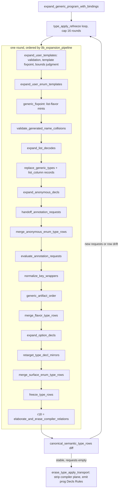

# Slice 6 audit: generics, application, and user compiler rules

## TOC

1. Slice map
2. Pipeline and strata (diagram)
3. Predicate report blocks
4. Finisher: counts, canonical shapes, hidden state, extraction boundary, first forced adaptation, unresolved questions

## 1. Slice map

| File | Role |
|---|---|
| `v6/prolog/0_generic_expand.pl` | Module head: exports, op decls, `include/1` of every sub-file |
| `0_generic_expand/0_expand.pl` | Refreeze driver: rounds of expansion until `type_apply` requests drain |
| `0_generic_expand/0a_type_apply_requests.pl` | Request extraction, arity checks, derived-relation carriers, transport erasure |
| `0_generic_expand/0b_expansion_pipeline.pl` | One expansion round: the 19-step pipeline + unwired raw twin |
| `0_generic_expand/1_annotations.pl` | Annotation requests, evaluation, rewrite, key bridge, list decode, semantic type terms |
| `0_generic_expand/2_compiler_plane.pl` | Compiler-relation elaboration, closure evaluation, metadata/erase, type graph source rows |
| `0_generic_expand/3_enum_templates.pl` | Parameterized enum templates (`rel_template_enum`) |
| `0_generic_expand/4_type_views.pl` | Normalized semantic rows, `schema_member/7`, `type_relation/5`, evidence rows, row memo |
| `0_generic_expand/5_type_freeze.pl` | Freeze boundary: identity validation, merge, application closure, graph projection input |
| `0_generic_expand/5b_type_graph.pl` | `type__node` / `type__edge` / `type__path` projections from canonical rows |
| `0_generic_expand/6_type_conformance.pl` | `type_plane`, `conforms/2` structural conformance, interface validation, id interning |
| `0_generic_expand/7_generic_instances.pl` | User templates, bounds judgment, list-flavor artifacts, minting fixpoint, name collisions |
| `0_generic_expand/8_type_rewrite.pl` | Substitution of generic applications, `canonical_type_name/2` (SHA-256 mangled names), mirror retarget |
| `0_generic_expand/8a_key_wrappers.pl` | `key(T)` wrapper normalization into `keyed/2` |

Tests:

- `v6/prolog/compile/test/plunit_tests.pl` — `semantic_type_identity`, `type_id_rail`, `expansion_order`, `rel_template_and_interface_bounds`, `list_type_plane`, `list_mint_order`, `list_column_spelling`, `wrapper_composition`, `type_wrapper_walk` (and the permutation/canonicalization tests at 5795-5880)
- `v6/prolog/compile/test/compiler_relations/1_type_graph.test.pl`
- `v6/prolog/compile/test/compiler_relations/2_userland_type_operators.test.pl`
- `v6/prolog/compile/test/compiler_relations/3_userland_type_projection.test.pl`
- `v6/prolog/compile/test/compiler_relations.test.pl`
- `v6/prolog/conformance/fixtures/0_generic_expand.pl` + `.golden`
- `v6/prolog/conformance/fixtures/21_template_bounds.pl`
- `v6/prolog/conformance/fixtures/25_parameterized_enum.pl`
- `v6/dl/fixtures/0_userland-type-operators.dl6`, `1_userland-type-operators-conflict.dl6`, `v6/dl/type/0_operators.dl6`
- `v6/prolog/compile/test/typegen_golden/generic_expansion_end_to_end.*`, `shape_generic_rel.*`

## 2. Pipeline and strata



Termination and strata checks currently enforced:

| Check | Location | Law |
|---|---|---|
| refreeze round cap 16 | `0_expand.pl:20` | `type_apply_round_limit_exhausted(16)` thrown |
| refreeze convergence test | `0_expand.pl:28-31` | new request set empty AND canonical rows byte-equal previous round |
| request dedup by `list_to_set` order | `0a:29` | positional carrier order preserved; duplicates dropped |
| arity match on every application | `0a:43-46,109-112,117-119` + `2_compiler_plane.pl:241-251,418-424` | `type_apply_arity_mismatch` |
| unknown constructor refused | `0a:127` | `type_apply_unknown_constructor` |
| template fixpoint (templates) | `7:93-104` | monotone `subtract(Found, Seen)`; terminates because instances are ground and finite |
| generic fixpoint (list flavors) | `7:316-347` | same subtract fixpoint, no round cap |
| recursive `type_apply` construction | `0_compiler_relations.pl:369-377` | `type_apply_recursive_construction` via rule dependency cycle check |
| compiler strata | `0_compiler_relations/1_aggregates.pl:21-40` + `strat.pl:stratum_groups/2` | rules grouped into strata mirroring `level_eval.pl` relax_strata; negation/aggregate read completed lower strata only; each stratum closes under tabled SLG (`tabled_compiler_closure/4`, per-round gensym namespace) |
| functional dependency validation | `0_compiler_relations.pl:366` | `validate_functional_rows/3` |
| recursion guard on conformance | `6_type_conformance.pl:55-99` | `Seen` list; json_encodable structural closure |
| nested key / target / wildcard rejections | `8a`, `6`, `1` | `key_wrapper_repeated|nested`, `annotation_key_nested_site`, `interface_nested_wildcard`, `interface_multiple_wildcards`, `repeated_subject_interface_bound` |
| name collisions | `7:299-308,487-494` | `generic_generated_name_collision` against author decls and rule heads |
| duplicate canonical rows | `5:61-88`, `5:277-294` | `canonical_type_row_duplicate` (exact-duplicate rows collapse, divergent reject) |
| application closure | `5:103-168` | constructor resolves, argument rows match expected arity/ids |
| ambiguous nested projection | `5b:18-40` | `ambiguous_type_projection` |

## 3. Predicate report blocks

Helpers that only throw diagnostics or reshape lists are covered by their
caller's block. File paths relative to `v6/prolog/`.

```prolog
% File: 0_generic_expand.pl:6-52
% Existing comment: generic expansion closes schema templates before enum expansion; lower_artifacts/2 is the boundary where schema records become Decl terms; round one emits declarations only
% Signature: module exports (expand_generic_in_context/3, expand_generic_program/2, expand_generic_program_raw/2, canonical_type_name/2, generic_type_ir/2, freeze_type_rows/2, type_relation_rows/2, ...)
% Called by: expansion:expand_program_run, 0_match_expand, conformance/level_eval, lower.pl, compile tests
% Calls: the 13 include files below
% Tests: compile/test/plunit_tests.pl (expansion_order, rel_template_and_interface_bounds, list_type_plane, list_mint_order), conformance/fixtures/0_generic_expand.pl
% V7 class: adapt
% Parser coupling: term-shape
% Preserved law: the artifact table uses typed records and lower_artifacts/2 is the only boundary where template schema records become program Decl terms; round one emits declarations only and rules stay author-written.
% DL7 seam: input `prog(Decls, Rules)` in DL7 cons-tree form; output same shape with all generics lowered to concrete relation schemas plus `semantic_type_rows/1`.
```

### 0_expand.pl

```prolog
% File: 0_generic_expand/0_expand.pl:1-5
% Existing comment: none
% Signature: expand_generic_in_context(?Context, +Program, -Expanded)
% Called by: expansion:expansion_phase(5, option, ...)
% Calls: expand_generic_program_with_bindings/3, expand_generic_program/2
% Tests: compile/test/plunit_tests.pl expansion_order suite
% V7 class: adapt
% Parser coupling: none
% Preserved law: an expansion_context with bindings routes to the bound expansion, everything else to the binding-free one.
% DL7 seam: in: expansion context + prog(Decls, Rules); out: prog(Decls, Rules).
```

```prolog
% File: 0_generic_expand/0_expand.pl:10-16
% Existing comment: none (module header comment above)
% Signature: expand_generic_program_with_bindings(+prog(Decls,Rules), +Bindings, -Expanded)
% Called by: expand_generic_in_context/3, compile/test/compiler_relations/1_type_graph.test.pl
% Calls: compiler_builtin_path_decls/1, resolve_relation_paths/3, type_apply_refreeze/7
% Tests: compile/test/compiler_relations/1_type_graph.test.pl, plunit_tests.pl rel_template_and_interface_bounds
% V7 class: extract
% Parser coupling: none
% Preserved law: builtin path decls join the resolution decls before relation path resolution; expansion is deterministic and idempotent for the rewritten declaration form.
% DL7 seam: in: prog with Decls + Bindings (source variable name bindings); out: prog(Decls, Rules) with all compiler planes erased.
```

```prolog
% File: 0_generic_expand/0_expand.pl:18-38
% Existing comment: none
% Signature: type_apply_refreeze(+Decls0, +Rules0, +Bindings, +Seen0, +PreviousRows, +Round, -prog(Decls,Rules))
% Called by: expand_generic_program_with_bindings/3 (self-recursive)
% Calls: expand_generic_program_round/3, canonical_semantic_type_rows/2, type_apply_requests/3, erase_type_apply_transport/2
% Tests: plunit_tests.pl:2320, 2342, 5381, 5471 (nested template fixpoints)
% V7 class: adapt
% Parser coupling: none
% Preserved law: expansion repeats until no new ground type_apply request appears and the canonical semantic row set stops drifting; 16 rounds is a hard cap that throws type_apply_round_limit_exhausted(16).
% DL7 seam: termination oracle; in: decl list + rules, out: prog with request transport erased.
```

### 0a_type_apply_requests.pl

```prolog
% File: 0_generic_expand/0a_type_apply_requests.pl:11-29
% Existing comment: shape members arrive in declared position order; preserve order while removing duplicate carrier rows so concat-like derivations stay positional
% Signature: type_apply_requests(+SourceDecls, +Decls, -Requests)
% Called by: type_apply_refreeze/7
% Calls: request_rows/2, frozen_type_application/3, type_apply_request_decl/4, derived_relation_shape_carrier/3
% Tests: compile/test/compiler_relations/2_userland_type_operators.test.pl
% V7 class: adapt
% Parser coupling: term-shape
% Preserved law: a fully ground, not-yet-frozen type_apply application becomes one compiler_derived_type_demand or compiler_type_apply_request carrier; derived relation shapes carry their instantiation as concrete decls; duplicates collapse via list_to_set preserving first-occurrence positional order.
% DL7 seam: in: source decls + current round decls; out: list of ground request/carrier terms appended to Decls for the next refreeze round.
```

```prolog
% File: 0_generic_expand/0a_type_apply_requests.pl:36-49
% Existing comment: none
% Signature: type_apply_request_decl(+Decls, +Constructor, +Application, -Request)
% Called by: type_apply_requests/3
% Calls: semantic_type_constructor_term/3, compiler_derived_constructor/3, type_apply_request_type/4
% Tests: plunit_tests.pl template arity tests
% V7 class: adapt
% Parser coupling: none
% Preserved law: an arity mismatch on a compiler-derived constructor or rel template throws type_apply_arity_mismatch(Constructor, Expected, Found); rel templates and enum templates take their declared parameter count, builtin constructors take exactly 1.
% DL7 seam: arity diagnostic contract preserved; request term shape follows the DL7 application encoding.
```

```prolog
% File: 0_generic_expand/0a_type_apply_requests.pl:1-9
% Existing comment: none
% Signature: erase_type_apply_transport/2 + type_apply_transport_decl/1
% Called by: type_apply_refreeze/7
% Calls: exclude/3
% Tests: 1_type_graph.test.pl (no compiler plane rows survive to Decls)
% V7 class: adapt
% Parser coupling: term-shape
% Preserved law: the six compiler-transport decl kinds (compiler_type_apply_request_rows, compiler_type_apply_request, compiler_derived_type_demand, compiler_derived_type_application, compiler_derived_relation_request_rows, compiler_derived_member_role) are stripped from the emitted program once the refreeze converges.
% DL7 seam: drop-list of transport decl functors; V7 renames if request IR changes.
```

```prolog
% File: 0_generic_expand/0a_type_apply_requests.pl:51-98
% Existing comment: none (shape carriers)
% Signature: derived_relation_shape_carrier(+Decls, +Shape, -Carrier)
% Called by: type_apply_requests/3
% Calls: semantic_type_term/3, canonical_type_name/2
% Tests: 2_userland_type_operators.test.pl (concat/Partial minted rels)
% V7 class: adapt
% Parser coupling: term-shape
% Preserved law: a validated derived relation shape lowers into the concrete type_decl/col_type/keyed/member-role rows of the generated relation, preserving member position order.
% DL7 seam: in: derived_relation_shape(Application, Constructor, Args, Count, Members, Roles); out: Decl terms of the minted relation.
```

```prolog
% File: 0_generic_expand/0a_type_apply_requests.pl:100-102
% Existing comment: none
% Signature: frozen_type_application(+Decls, +Application, +Constructor)
% Called by: type_apply_requests/3
% Tests: indirectly via all expand_generic_program tests
% V7 class: extract
% Parser coupling: none
% Preserved law: an application already present as a row in semantic_type_rows is frozen and generates no new request.
% DL7 seam: identity check over semantic rows.
```

### 0b_expansion_pipeline.pl

```prolog
% File: 0_generic_expand/0b_expansion_pipeline.pl:1-44
% Existing comment: none (step names inline)
% Signature: expand_generic_program_round(+prog,+Bindings,-prog)
% Called by: type_apply_refreeze/7
% Calls: expand_user_templates, expand_user_enum_templates, generic_fixpoint, validate_generated_name_collisions, expand_list_decodes, replace_generic_types, expand_anonymous_decls, handoff_annotation_requests, merge_anonymous_enum_type_rows, evaluate_annotation_requests, normalize_key_wrappers, generic_artifact_order, merge_flavor_type_rows, expand_option_decls, retarget_type_decl_mirrors, merge_surface_enum_type_rows, freeze_type_rows, elaborate_and_erase_compiler_relations — each wrapped in run_compile_step(plan, generic:..., _, _)
% Tests: plunit_tests.pl expansion_order
% V7 class: adapt
% Parser coupling: none
% Preserved law: the 19-step round order is the contract; every step runs inside a compile-step trace named generic:<step>.
% DL7 seam: the ordered step list is the pipeline contract; DL7 keeps the names and order while the step IR changes.
```

```prolog
% File: 0_generic_expand/0b_expansion_pipeline.pl:48-69
% Existing comment: executable comparison arm, written as a second path so the template and replacement logic cannot drift apart from the wired entry above
% Signature: expand_generic_program_raw(+prog, -prog)
% Called by: compile/test/plunit_tests.pl (raw arm comparisons)
% Tests: plunit_tests.pl:5461 (Typed vs Raw equivalence)
% V7 class: oracle
% Parser coupling: none
% Preserved law: the raw arm produces identical output to the traced pipeline with empty bindings; it exists to prove the two cannot drift.
% DL7 seam: keep as the oracle arm for any V7 pipeline rewrite.
```

### 1_annotations.pl

```prolog
% File: 0_generic_expand/1_annotations.pl:1-5,6-29
% Existing comment: anonymous sums materialize after the source enum row pass has already been planned; their declaration row exists from anonymous expansion; variant rows are added here before enum lowering erases the source enum_decl/2 term
% Signature: merge_anonymous_enum_type_rows(+Decls0, -Decls)
% Called by: expand_generic_program_round (step)
% Calls: enum_type_rows/2
% Tests: plunit_tests.pl enum_decl_expansion
% V7 class: adapt
% Parser coupling: term-shape
% Preserved law: anonymous generated enums contribute their declaration and member rows into the single semantic_type_rows list before enum lowering.
% DL7 seam: in/out: decl lists; input depends on anonymous_generated_decl/1 marker terms.
```

```prolog
% File: 0_generic_expand/1_annotations.pl:31-60
% Existing comment: the annotation carrier survives generic substitution and anonymous minting; this is the first point where owner/member identity and the concrete underlying type are both available
% Signature: handoff_annotation_requests(+Decls0, -Decls)
% Called by: expand_generic_program_round
% Calls: annotation_member_request/2, sub_term/2
% Tests: plunit_tests.pl phase5_value_plane, annotation tests
% V7 class: adapt
% Parser coupling: term-shape
% Preserved law: annotation carriers survive generic substitution; requests are deduplicated typed IR with the authored carrier intact; execution stays in the next phase.
% DL7 seam: out: compiler_annotation_requests(Requests) appended to Decls.
```

```prolog
% File: 0_generic_expand/1_annotations.pl:62-74, 76-91
% Existing comment: annotation calls are ordinary compiler-relation queries; this phase only supplies the implicit Target and enforces the annotation-specific signature; closure construction remains evaluate_compiler_relations/3
% Signature: evaluate_annotation_requests(+Decls0, +Rules, +Bindings, -Decls)
% Called by: expand_generic_program_round
% Calls: partition_compiler_program/5, elaborate_compiler_rules/6, evaluate_compiler_relations/3, rewrite_annotation_declarations/3, bridge_key_annotation_evidence/3, ensure_annotation_relation_mirrors/3, rewrite_annotation_semantic_rows/3
% Tests: compile/test/annotation_surface.test.pl, 2_userland_type_operators.test.pl
% V7 class: adapt
% Parser coupling: term-shape
% Preserved law: annotation execution is a compiler-relation query closure; the phase only supplies the implicit Target argument, enforces the `target, ..., return: type` signature shape, and requires exactly one result per request (annotation_zero_results / annotation_multiple_results).
% DL7 seam: in: requests IR + compiler relations; out: rewritten decls + compiler_annotation_evidence/1.
```

```prolog
% File: 0_generic_expand/1_annotations.pl:489-545, 547-561
% Existing comment: anonymous declarations are materialized type-expression children, not new authored relation members; their types are reached from the canonical col_type/3 row; a compiler relation ending in `return: type` is callable directly in type position, nested calls elaborate inside-out
% Signature: annotation_member_request(+Decls, -Request) / annotation_type_request/6 / direct_type_application_steps/4
% Called by: handoff_annotation_requests/2
% Calls: semantic_decl_id/4, member_id/4, elaborate_annotation/3
% Tests: annotation_surface.test.pl
% V7 class: adapt
% Parser coupling: term-shape
% Preserved law: requests are built per authored member site (anonymous and `__gen__list_` members excluded); direct `rel f(x: type) -> type` applications elaborate inside-out into the same request IR; sites are path+ordinal lists.
% DL7 seam: request term annotation_request(OwnerId, MemberId, Site, Carrier, annotation_steps(Input, Steps)).
```

```prolog
% File: 0_generic_expand/1_annotations.pl:595-653
% Existing comment: `decode(Parts, [... Part])` over a list(T) source is a keyed read of the minted member rel and becomes that atom for BOTH doors; an untouched body keeps its ORIGINAL term so byte-identity holds; variable IDENTITY resolves the source, never findall
% Signature: expand_list_decodes(+Decls, +Rules0, -Rules)
% Called by: expand_generic_program_round (step expand_list_decodes)
% Tests: list_column_spelling, list_value_position test groups
% V7 class: extract
% Parser coupling: term-shape
% Preserved law: decode(spread) on a list-flavored member column rewrites to the minted `__gen_...__member` atom keyed read; programs without a list decode emit byte-identical modules.
% DL7 seam: body-level rewrite; keeps source-term identity law.
```

```prolog
% File: 0_generic_expand/1_annotations.pl:446-461
% Existing comment: none
% Signature: semantic_type_term(+Decls, +TypeId, -Term) / semantic_type_constructor_term/3
% Called by: annotation rewriting, derived_relation_shape_carrier, canonical_member_type_term, type ids
% Tests: plunit_tests.pl semantic_type_identity, type_id_rail
% V7 class: extract
% Parser coupling: none
% Preserved law: semantic ids decode back into surface type terms: primitive/1, named(_, relation|enum, _), application(Constructor, Args) reconstructs the compound term.
% DL7 seam: the id-to-term decoder for the semantic type id space; shared with lower.pl consumers.
```

### 2_compiler_plane.pl

```prolog
% File: 0_generic_expand/2_compiler_plane.pl:1-32
% Existing comment: the compiler plane closes before enum, storage, and runtime planning; its declarations/rules disappear from the executable program while the semantic member/type-relation rows remain available to catalog and typegen consumers
% Signature: elaborate_and_erase_compiler_relations(+Decls0, +Rules0, +Bindings, -Decls, -Rules)
% Called by: expand_generic_program_round (last step), expand_generic_program_raw
% Calls: partition_compiler_program/5, type_relation_rows/2, elaborate_compiler_rules/5, compiler_type_source_rows/3, compiler_annotation_site_rows/3, evaluate_compiler_relations/3, compiler_type_apply_requests/3, compiler_derived_relation_shapes/2, erase_annotation_transport/3
% Tests: compile/test/compiler_relations.test.pl, compiler_relations/*.test.pl
% V7 class: adapt
% Parser coupling: none
% Preserved law: compiler relations close to a fixpoint; the executable program keeps only runtime rules while metadata (compiler_type_metadata), type_apply request rows, and derived relation shapes ride beside the runtime decls; empty relations erase annotation transport unchanged.
% DL7 seam: in: frozen decls + compiler rules + bindings; out: runtime decls + metadata terms (compiler_type_metadata/2 or /3).
```

```prolog
% File: 0_generic_expand/2_compiler_plane.pl:175-232, 429-466
% Existing comment: fact variables may be source type names captured by the parser bindings; rule variables remain evaluator joins
% Signature: elaborate_compiler_rules/5 (+ head/body/fact argument elaborators)
% Called by: elaborate_and_erase_compiler_relations/5, evaluate_annotation_requests_with_relations/6
% Calls: compiler_relation_signature/3, structural_type_pattern/1, ground_structural_type_id/4, semantic_type_id/3, source_variable_name/3
% Tests: compile/test/compiler_relations/*.test.pl
% V7 class: adapt
% Parser coupling: term-shape (type domains on declared compiler relations)
% Preserved law: compiler-plane rule heads elaborate compound type arguments into type_apply/3 demand goals, bodies into type_requested/3 + type__edge/node goals; negation may not carry structural patterns; fact type patterns must be ground.
% DL7 seam: elaborated rules with explicit type_requested/type_apply goal atoms.
```

```prolog
% File: 0_generic_expand/2_compiler_plane.pl:508-547
% Existing comment: signatures for compiler source relations (a fixed table)
% Signature: compiler_relation_signature/3 + compiler_type_source_signature/2
% Called by: elaborate_compiler_* and evaluate_compiler_relations
% Tests: compile/test/compiler_relations.test.pl, compiler_relations/0_value_domains.test.pl
% V7 class: extract
% Parser coupling: term-shape
% Preserved law: the compiler source vocabulary (type_decl/4 ... type__path/2) is a closed signature table; each entry names its column domains (semantic, text, int, type, semantic_type_ids, relation_value).
% DL7 seam: the closed domain vocabulary for compiler relations; DL7 extends the table rather than changing the mechanism.
```

```prolog
% File: 0_generic_expand/2_compiler_plane.pl:653-753
% Existing comment: project only referenced compiler-source views from the frozen canonical graph; these rows enter the compiler evaluator as seeds and never enter runtime declarations or storage
% Signature: compiler_type_source_rows/3 (+ helpers compiler_type_source_row, compiler_type_transport_source_row, compiler_annotation_site_rows, compiler_member_role_parts)
% Called by: elaborate_and_erase_compiler_relations/5
% Tests: compile/test/compiler_relations/1_type_graph.test.pl, 3_userland_type_projection.test.pl
% V7 class: extract
% Parser coupling: none
% Preserved law: only compiler relations a program actually declares are projected; canonical rows, transport rows (compiler_derived_type_demand), and type graph rows are the three sources; all sorted.
% DL7 seam: in: semantic_type_rows + declared compiler_relations; out: seed rows.
```

```prolog
% File: 0_generic_expand/2_compiler_plane.pl:754-828
% Existing comment: (none above compiler_declared_type_term; key(type) comment at 648-651: a compiler relation receives the same semantic type value as an unwrapped type column)
% Signature: compiler_declared_type_term/2, compiler_type_constructor/3, compiler_derived_constructor/3, compiler_type_source_term/4, source_variable_name/3
% Called by: elaborators, type_apply request typing, schema_member_rows
% Tests: compiler_relations tests
% V7 class: adapt
% Parser coupling: term-shape
% Preserved law: a declared type is a primitive, builtin constructor, rel_template (name = segments joined by '__'), enum template, compiler-derived `return: type` relation, or compile_time relation declaration; compound terms recurse; key(type) unwraps to type at the compiler relation boundary.
% DL7 seam: name-resolution law; the '__' join spelling is DL6 surface-policy (candidate for V7 ruling).
```

### 3_enum_templates.pl

```prolog
% File: 0_generic_expand/3_enum_templates.pl:5-26
% Existing comment: a parameterized enum template mints one concrete enum_decl per ground application with variant payload types substituted; enum lowering then lowers each concrete enum_decl into its tag relation and one relation per variant
% Signature: expand_user_enum_templates(+Decls0, -Instances, -Decls)
% Called by: expand_generic_program_round (step 2)
% Calls: enum_template_definitions/2, check_enum_template_application_arities/2, enum_template_instances/3, instantiate_enum_template/3, enum_payload_type_mirrors/3, enum_template_module_rows/3, enum_template_type_rows/3, enum_template_derived_rows/4, rewrite_user_template_decl/3, merge_enum_template_rows/3
% Tests: conformance/fixtures/25_parameterized_enum.pl, plunit_tests.pl:7637-7657
% V7 class: adapt
% Parser coupling: term-shape
% Preserved law: one concrete enum per ground application with substituted payload types; malformed arity rides generic_template_arity; minted enums carry derived_from and inherited module rows.
% DL7 seam: in: rel_template_enum decls; out: enum_decl + semantic rows + derived_from.
```

```prolog
% File: 0_generic_expand/3_enum_templates.pl:28-32,33-46
% Existing comment: a minted enum's variant payload may name a relation; the parse-time mirror only covers surface enum payloads, so a payload rel reached only through a minted enum gets its type_decl mirror minted here
% Signature: enum_payload_type_mirrors/3
% Tests: 25_parameterized_enum fixture
% V7 class: extract
% Parser coupling: none
% Preserved law: every relation reachable only through a minted enum payload still gets a type_decl mirror from its col_type rows.
% DL7 seam: mirror-minting rule preserved under owner/name/target edges.
```

```prolog
% File: 0_generic_expand/3_enum_templates.pl:146-151
% Existing comment: surface enum rows must be present before compiler-plane evaluation so the generic graph exposes variant edges during the same immutable round; the later enum phase merges the same canonical rows idempotently
% Signature: merge_surface_enum_type_rows/3
% Tests: 1_type_graph.test.pl variant edge test
% V7 class: adapt
% Parser coupling: none
% Preserved law: enum rows merge into the generic round so variant edges exist during compiler evaluation, and later merging is idempotent.
% DL7 seam: freeze input precondition.
```

### 4_type_views.pl

```prolog
% File: 0_generic_expand/4_type_views.pl:1-4
% Existing comment: source terms are accepted here, but normalized rows are the only output; ids derive from labels and ordinals, not source order
% Signature: generic_type_ir(+Decls, -Rows)
% Called by: expand_user_templates, compiler_type_source_rows, module export
% Tests: plunit_tests.pl semantic_type_identity, catalog tests
% V7 class: extract
% Parser coupling: none
% Preserved law: normalized_type_rows is the single id-derivation law (labels + ordinals).
% DL7 seam: in: Decls; out: sorted canonical semantic rows.
```

```prolog
% File: 0_generic_expand/4_type_views.pl:6-24
% Existing comment: this is a parallel compiler metadata view; it deliberately stays out of semantic_type_rows/1 so the runtime declaration term and ordinary type artifacts remain byte-stable
% Signature: schema_member_rows(+Decls, -Rows)
% Called by: type_relation_rows/2
% Tests: type_relation_ir.test.pl
% V7 class: extract
% Parser coupling: none
% Preserved law: schema_member/7 is a catalog-only view; runtime declarations stay untouched.
% DL7 seam: out: schema_member(MemberId, OwnerId, Position, Name, AuthoredType, ValueTypeId, Roles).
```

```prolog
% File: 0_generic_expand/4_type_views.pl:42-53, 112-143
% Existing comment: rows is the concatenation of schema_member/7 and type_relation/5; a relation without a Self member remains an ordinary relation row; transport rows carry no Prolog list-valued columns
% Signature: type_relation_rows/2, schema_member_transport_rows/3
% Called by: lower.pl catalog_type_relation_rows, compile/9_emit_type_artifact.pl, typegen_export.pl
% Tests: compile/test/typegen_golden/*.jsonl
% V7 class: adapt
% Parser coupling: none
% Preserved law: the typed child rows (schema_member_column, schema_member_role, type_relation_input, type_relation_key, type_relation_owner) are the artifact-boundary transport; evidence rows join compiler closure facts to owners when the owner name is module-unambiguous.
% DL7 seam: export boundary consumed by typegen/Rust emitters; keep row names stable.
```

```prolog
% File: 0_generic_expand/4_type_views.pl:380-416
% Existing comment: one compile asks for the same rows five times; keyed by variant so an entry is only reused for a Decls list that would rebuild the same rows
% Signature: normalized_type_rows/2 + thread_local type_row_memo/3 + reset_type_row_memo/0
% Called by: generic_type_ir/2, freeze_type_rows/2
% Tests: module usage in 1_expansion.pl:84 (reset per compile)
% V7 class: adapt
% Parser coupling: none
% Preserved law: row memo keyed by SHA-1 of the decls plus a @= structural match; non-ground rows are never memoized (they would lose variable identity to assertz).
% DL7 seam: thread-local memo with explicit reset at compile start.
```

```prolog
% File: 0_generic_expand/4_type_views.pl:164-332
% Existing comment: carrier lookups and role synthesis (Self => self_subject, keyed position => key, return column => return, anonymous owner path, compiler-derived roles); owner_member_carrier cache assumes one Decls list per scope like semantic_decl_id/4
% Signature: owner_member_carrier/3, owner_carrier_index/2, schema_member_roles/5, normalized_member_role_row/2
% Tests: type_relation_ir.test.pl
% V7 class: adapt
% Parser coupling: term-shape
% Preserved law: roles come from semantic rows when present, else from carrier syntax (Self name, keyed positions, return column, anonymous owner path, compiler_derived_member_role); keysort stability preserves declaration order per owner.
% DL7 seam: role synthesis moves to owner/name/target edge attributes.
```

### 5_type_freeze.pl

```prolog
% File: 0_generic_expand/5_type_freeze.pl:1-13
% Existing comment: merge generated carriers into the existing semantic identity graph without replacing source-level wrapper members by physical storage endpoints
% Signature: freeze_type_rows(+ExpandedDecls, -FrozenDecls)
% Called by: expand_generic_program_round, 1_expansion.pl:128, 0_match_expand.pl:34
% Calls: normalized_type_rows/2, validate_type_row_identities/1, merge_frozen_type_rows/3, validate_type_application_closure/1, validate_nested_type_path_targets/2, replace_semantic_type_rows/3
% Tests: plunit_tests.pl list_type_plane, semantic_type_identity; lower.pl, 0_match_expand.pl
% V7 class: adapt
% Parser coupling: none
% Preserved law: existing semantic rows are the authority; rebuilt rows merge additively by canonical identity; identity collisions are rejected unless rows are term-identical; every application member resolves to a declaration of the right kind and argument rows must match the application's expected argument ids.
% DL7 seam: in: expanded decls; out: decls with exactly one semantic_type_rows/1 holding the merged canonical row set.
```

```prolog
% File: 0_generic_expand/5_type_freeze.pl:170-512 (normalized_* family)
% Existing comment: ids derive from labels and ordinals; two syntactic routes to one member identity collapse exact duplicates and reject divergent descriptions; grouping pass replaces per-owner scans (measured 17.5 ms of a 500 ms compile on pokeapi)
% Signature: normalized_declaration_row/2, normalized_parameter_row/2, normalized_member_row/5, normalized_constraint_row/3-4, normalized_application_rows/2, normalized_type/5, semantic_type_constructor_id/3, first_member_row_per_id/2, plain_relation_specs/3
% Called by: generic_type_ir, freeze_type_rows, instance_type_rows
% Tests: plunit_tests.pl semantic_type_identity, catalog_type_ids
% V7 class: adapt
% Parser coupling: term-shape
% Preserved law: declaration/parameter/member/constraint/application/argument/derived_from rows are normalized from rel_template, type_decl, enum_decl, col_type, and interface_decl carriers; parameters keep declared ordinal order; builtin constructors are option/1, list/1, json_list/1, id/1, and the three list flavors.
% DL7 seam: the canonical graph vocabulary (declaration/parameter/member/member_role/application/argument/constraint/derived_from/origin/anonymous rows).
```

```prolog
% File: 0_generic_expand/5_type_freeze.pl:538-570
% Existing comment: (none on type_row_templates; validate_type_rows rejects unknown interface)
% Signature: type_row_templates/3, generic_template_parameters/4, validate_type_rows/2
% Called by: expand_user_templates
% Tests: conformance/fixtures/21_template_bounds.pl
% V7 class: extract
% Parser coupling: none
% Preserved law: templates are read back from normalized rows (parameters keyed by ordinal, constraints by interface application); unknown interface ids throw.
% DL7 seam: template(Name, Parameters, Specs).
```

### 5b_type_graph.pl

```prolog
% File: 0_generic_expand/5b_type_graph.pl:1-8, 42-73
% Existing comment: canonical semantic rows project into ephemeral compiler-round graph sources; specialized rows remain the authority and runtime planning sees none of these relations
% Signature: type_graph_compiler_source_rows/4, requested_type_graph_nodes/edges/paths
% Called by: compiler_type_source_rows/3
% Tests: compile/test/compiler_relations/1_type_graph.test.pl
% V7 class: adapt
% Parser coupling: none
% Preserved law: type.node/type.edge/type.path are user-queryable compiler relations projected from canonical rows only when the program declares matching compiler relations; nothing enters runtime decls or storage.
% DL7 seam: in: semantic rows; out: type__node/3, type__edge/6, type__path/2 rows.
```

```prolog
% File: 0_generic_expand/5b_type_graph.pl:75-148
% Existing comment: node/edge derivations with conflict validation (canonical_type_node_conflict / canonical_type_edge_conflict / canonical_type_edge_key_conflict)
% Signature: type_graph_nodes/3, type_graph_edges/3, type_graph_edge/8, type_graph_annotation_site/6
% Tests: 1_type_graph.test.pl
% V7 class: adapt
% Parser coupling: none
% Preserved law: one node identity has one (kind,label); one (owner,role,position,label) key has one edge; annotation sites become structural nodes and edges; nested path edges must agree with member/variant edges on target (ambiguous_type_projection).
% DL7 seam: nodes/edges/paths derive from the owner/name/target/ordinal edge representation.
```

```prolog
% File: 0_generic_expand/5b_type_graph.pl:223-252
% Existing comment: (none)
% Signature: type_graph_paths/2
% Tests: 1_type_graph.test.pl
% V7 class: extract
% Parser coupling: none
% Preserved law: a type path is the declared nested path of a declaration, or the owner path plus the anonymous site path (plus variant name for minted sums).
% DL7 seam: type__path(Id, Path).
```

### 6_type_conformance.pl

```prolog
% File: 0_generic_expand/6_type_conformance.pl:1-20
% Existing comment: the source syntax stays in the authored declaration list; this plane is a compiler-only relational view; a Plane exists from generic expansion's validation/fixpoint boundary through bound judgment and is discarded before runtime lowering
% Signature: compile_type_plane/3, validate_compile_type_plane/1
% Called by: expand_user_templates/4
% Tests: plunit_tests.pl rel_template_and_interface_bounds
% V7 class: adapt
% Parser coupling: none
% Preserved law: compile_type_query/3 is the single boundary for interface diagnostics and structural conformance; duplicate interface declarations are rejected here.
% DL7 seam: plane = (Decls, NormalizedRows); queries: duplicate_interface/1, conforms/2.
```

```prolog
% File: 0_generic_expand/6_type_conformance.pl:22-39
% Existing comment: compile-time relation declarations and source facts
% Signature: compile_type_relation/3 (interface, named_type, field, enum, enum_payload)
% Called by: compile_type_conformance/4
% Tests: 21_template_bounds.pl, json_encodable tests
% V7 class: extract
% Parser coupling: term-shape
% Preserved law: the four built-in compile-time relations (interface, named_type, field, enum, enum_payload) are read directly from source terms plus normalized rows.
% DL7 seam: source-view read; keep as declared compiler relations.
```

```prolog
% File: 0_generic_expand/6_type_conformance.pl:47-103
% Existing comment: a recursive revisit closes structural json_encodable proofs
% Signature: compile_type_conformance/4 (+ _with_seen/3)
% Called by: compile_type_query/3, judge_template_bounds
% Tests: plunit_tests.pl rel_template_and_interface_bounds (json encodable structural proofs)
% V7 class: adapt
% Parser coupling: none
% Preserved law: json_encodable is structural: scalars, option/json_list recursion, named types via all fields, enums via all payloads, and generic applications conform through their canonical concrete name; the Seen list is the termination check.
% DL7 seam: oracle for bound judging; V7 may replace with relational fixpoint while keeping the proof terms.
```

```prolog
% File: 0_generic_expand/6_type_conformance.pl:105-167
% Existing comment: checked at the source terms as well as normalized rows; interface application arguments remain visible for arity validation and conformance matching
% Signature: validate_interface_applications/1 (+ reject_* helpers, contains_any/1)
% Called by: expand_user_templates/4
% Tests: 21_template_bounds.pl
% V7 class: extract
% Parser coupling: term-shape
% Preserved law: parameter constraints must name known interfaces at the right arity; the subject parameter may not rebind itself; nested `any` inside a bound is rejected; at most one top-level `any` per bound; wildcards are banned in concrete applications.
% DL7 seam: validation laws preserved under the DL7 interface spelling.
```

```prolog
% File: 0_generic_expand/6_type_conformance.pl:192-289
% Existing comment: (id interning) semantic_decl_id/4 with nb_current cache; semantic ids derive from module hash + kind + name; application ids from constructor + argument ids; any_pattern for `any`
% Signature: semantic_decl_id/4, semantic_type_id/3, semantic_type_constructor_id/3, semantic_application_id/4, semantic_named_type_id/3
% Called by: nearly every file in the slice
% Tests: plunit_tests.pl catalog_type_ids, semantic_type_identity, type_id_rail
% V7 class: extract
% Parser coupling: none
% Preserved law: identity is canonical_type_name-independent: decl_id(ModuleHash, Kind, Name) where the module comes from semantic_decl_module/semantic rows/generated application module inheritance, defaulting to `local`; ids interning is cached per generic_semantic_id_cache frame (see hidden state).
% DL7 seam: interning module ('0_type_ids' decl_id/param_id/member_id/app_id/arg_id) stays; the module-resolution chain is the adaptation point.
```

### 7_generic_instances.pl

```prolog
% File: 0_generic_expand/7_generic_instances.pl:1-21
% Existing comment: each ground application of a compile-time rel template mints one ordinary relation schema; downstream storage machinery sees no generic construct
% Signature: expand_user_templates(+Decls0, +Rules, -Instances, -Decls)
% Called by: expand_generic_program_round (step 1)
% Calls: generic_type_ir, compile_type_plane, validate_type_rows, validate_compile_type_plane, validate_interface_applications, type_row_templates, check_template_application_arities, user_template_fixpoint, validate_user_template_collisions, judge_template_bounds, rewrite_user_template_decl, generic_catalog_decls
% Tests: plunit_tests.pl rel_template_and_interface_bounds; conformance/fixtures/21_template_bounds.pl
% V7 class: adapt
% Parser coupling: term-shape
% Preserved law: bounds are judged AFTER the fixpoint on completed declarations so a minted inner instance can discharge an outer bound; the proof plane never reaches the runtime declaration list; only TypeIr + instance rows + judgment rows leave as semantic_type_rows.
% DL7 seam: template fixpoint + obligation judgment rows (well_formed, substitution, obligation, resolved_by).
```

```prolog
% File: 0_generic_expand/7_generic_instances.pl:93-141
% Existing comment: discovery fixes over minted decls so each pass mints not-yet-lowered instances and re-scans (generic_fixpoint); flavor artifacts are typed records and lower_artifacts is the sole place coupled to Decl syntax
% Signature: user_template_fixpoint/4, user_template_instances/3, instantiate_user_template/4, substitute_template_type/3
% Tests: 2_userland_type_operators.test.pl, conformance fixtures
% V7 class: adapt
% Parser coupling: term-shape
% Preserved law: instantiation substitutes parameter bindings into template column specs, mints type_decl mirror + col_type rows under the canonical name; worklist = sorted instance list; monotone so terminates.
% DL7 seam: mint = artifact records; keep the artifact/decl vocabulary as the Decl-syntax coupling point.
```

```prolog
% File: 0_generic_expand/7_generic_instances.pl:167-241
% Existing comment: bounds are judged AFTER the fixpoint on the completed declarations
% Signature: judge_template_bounds/4 (+ obligation_judgment/6, constraint_obligation_id/5, obligation_judgment_row/8)
% Called by: expand_user_templates/4
% Tests: 21_template_bounds.pl (unresolved => generic_bound_unsatisfied with path([template, application, argument]))
% V7 class: oracle
% Parser coupling: none
% Preserved law: every parameter constraint becomes an obligation row; unresolved bounds throw with the template/application/argument path; resolution evidence (structural conformance proof) is preserved as resolved_by rows.
% DL7 seam: keep the judgment row vocabulary (obligation/judged/resolved_by/well_formed/substitution) as the compiler contract.
```

```prolog
% File: 0_generic_expand/7_generic_instances.pl:299-319, 487-524
% Existing comment: minted names are readable stem + sha256 prefix; truncated-digest collisions rejected before lowering (8_type_rewrite.pl comment); author declarations retain source order, generated follow them
% Signature: validate_generated_name_collisions/3, validate_user_template_collisions/3, throw_on_author_collision/3, generic_artifact_order/3, minted_decl/1, author_decl_or_rule_name/3
% Called by: expand_generic_program_round, expand_user_templates
% Tests: expansion_order, generated_name tests
% V7 class: extract
% Parser coupling: none
% Preserved law: a minted canonical name colliding with any author decl or rule head is a hard error; generated decls sort after author decls.
% DL7 seam: name-mangling collision check stays.
```

```prolog
% File: 0_generic_expand/7_generic_instances.pl:316-476
% Existing comment: discovery fixes over minted decls; a rel element does not belong inside the interned-set value dictionary; typed artifact vocabulary with lower_artifacts as the sole place coupled to Decl syntax
% Signature: generic_fixpoint/3, generic_type_instances/2, generic_type/1, generic_dependency/2, check_interned_set_rel_elements/1, template_artifacts/2, list_flavor_artifacts/2, flavor_ref/3, lower_artifacts/2
% Tests: conformance/fixtures/0_generic_expand.pl (list fixtures), plunit_tests list_type_plane
% V7 class: adapt
% Parser coupling: term-shape
% Preserved law: the four list flavors mint exactly the schema artifacts declared in list_flavor_artifacts/2; list_interned_set refuses rel elements; bare list columns store the entity id and stay spelled list(Element) to the relplan; option(T) mints no rows.
% DL7 seam: artifact vocabulary (artifact(decl(...))) is the schema-record seam.
```

### 8_type_rewrite.pl

```prolog
% File: 0_generic_expand/8_type_rewrite.pl:1-12, 21-26
% Existing comment: the collapsed list column keeps a record of the type it collapsed FROM, the option_column/3 precedent
% Signature: replace_generic_types/3
% Called by: expand_generic_program_round (step 6)
% Tests: list_column_spelling, expansion_order tests
% V7 class: adapt
% Parser coupling: term-shape
% Preserved law: every generic application (user templates + compiler-derived applications) rewrites to its canonical concrete name in col_type columns; collapsed list columns emit list_column(Ref, Column, Type) remembering the source type; annotation syntax survives substitution attached to the concrete type.
% DL7 seam: substitution over application terms; list_column/3 record kept.
```

```prolog
% File: 0_generic_expand/8_type_rewrite.pl:28-61
% Existing comment: the mirror states the rel's stored columns, so it is re-read whole from the expanded col_type rows: a rename and a drop land by the same read
% Signature: retarget_type_decl_mirrors/2 (+ expanded_relation_specs/3, mirror_column_type/3)
% Tests: relplan_reference_targets tests
% V7 class: adapt
% Parser coupling: term-shape
% Preserved law: type_decl mirrors are rebuilt from expanded col_type rows (enum columns read as int in the mirror); a reference target with no columns is rejected.
% DL7 seam: mirror = stored-column projection; keep re-read-whole law.
```

```prolog
% File: 0_generic_expand/8_type_rewrite.pl:99-142
% Existing comment: readable stem plus a 64-bit SHA-256 prefix; digest input is the complete length-prefixed structural encoding; validate_generated_name_collisions/3 rejects a truncated-digest collision before lowering
% Signature: canonical_type_name/2, canonical_type_encoding/2, type_encoding_codes/2, readable_stem/2, generated_generic_name/1
% Called by: everywhere (canonical names, list decode, conformance, rewrite)
% Tests: canonical name tests in expansion_order, list fixtures
% V7 class: adapt
% Parser coupling: none (term encoding)
% Preserved law: minted name = '__gen_' + readable_stem + 16-hex-char sha256 prefix of the length-prefixed structural encoding ('a<len>:<atom>' / 'c<len>:<ctor>/<arity>[args]'); determinism and collision behavior are observable.
% DL7 seam: keep the encoding as the interning function; names are DL6 spellings but the law is content-addressed identity.
```

### 8a_key_wrappers.pl

```prolog
% File: 0_generic_expand/8a_key_wrappers.pl:1-16
% Existing comment: normalize key(T) into its value type and the existing keyed/2 declaration; only an outer column wrapper is accepted
% Signature: normalize_key_wrappers(+Decls0, -Decls)
% Called by: expand_generic_program_round (step 11)
% Tests: plunit_tests.pl wrapper_composition, key_wrapper_* throws
% V7 class: extract
% Parser coupling: surface-policy (key(T) spelling)
% Preserved law: outer key(T) becomes the value type plus keyed(Ref, Positions); repeated, nested, or legacy-conflicting wrappers throw; key declarations missing keyed/2 are inserted before the first semantic_type_rows/1.
% DL7 seam: key role as member-role metadata, not a type constructor.
```

### Cross-cutting: compiler relation evaluation (the strata)

The evaluator proper lives in `0_compiler_relations.pl` and
`0_compiler_relations/1_aggregates.pl` (slice 7's subject, listed here for the
strata/termination boundary this slice depends on):

- `evaluate_compiler_relations/3` (0_compiler_relations.pl:~330): validates seeds
  and rules, rejects recursive `type_apply` construction
  (`validate_type_apply_recursive_construction`, 0_compiler_relations.pl:369),
  then `evaluate_compiler_strata/3` (`0_compiler_relations/1_aggregates.pl:21`).
- Strata come from `strat.pl:stratum_groups/2`, mirroring
  `level_eval.pl:relax_strata`: negated and aggregated relations read strictly
  lower strata; indirect positive cycles form cyclic stratum groups closed by
  the tabled SLG evaluator (`tabled_compiler_closure/4`, unique per-round table
  namespace, negation consults only completed lower rows).
- Termination inputs to this slice: refreeze cap of 16 rounds
  (`type_apply_round_limit_exhausted`), template fixpoints terminate on a
  monotone ground-instance worklist, recursive `type_apply` construction is
  rejected, structural conformance terminates on the Seen list, compiler
  negation may not carry structural type patterns.

## Finisher

### 1. Predicate counts by class

Approximate over the ~150 predicates in the slice (helper/throw-only predicates
counted with their callers):

| Class | Count | Notes |
|---|---|---|
| extract | ~45 | id interning, pure row projection, role computation, canonical name encoding |
| adapt | ~45 | everything threading Decls lists and DL6 decl functors (col_type/3, rel_template/3, semantic_type_rows/1) |
| oracle | ~10 | expand_generic_program_raw, compile_type_conformance proofs, judgment rows, goldens |
| drop | ~4 | DL6-only spellings: `decode/spread` list decode, `rel_template`/`rel_template_enum` surface terms (the `__`-joined constructor naming is surface-policy) |

### 2. Canonical term shapes entering and leaving the slice

Entering: `prog(Decls, Rules)` with DL6 decl vocabulary (`type_decl/2`,
`col_type/3`, `keyed/2`, `rel_template/3`, `rel_template_enum/3`,
`enum_decl/2`, `interface_decl/2`, `col_type/3`, `semantic_decl_module/3`,
`compiler_relation/3` from partition), rule terms `(Head <- Body)` / `(Head <+
Body)`, bindings `Name-Var`.

Leaving: `prog(Decls, Rules)` where generics are fully materialized
(`col_type/3`, `keyed/2`, `list_column/3` records), one
`semantic_type_rows/1` canonical row set (row vocabulary: `declaration/5`,
`parameter/4`, `member/5`, `member_role/2`, `application/2`, `argument/4`,
`constraint/3|4`, `derived_from/2`, `origin/3`, `anonymous/3`,
`semantic_decl_module/3`, `member_role/2`, `derived_from/2`), compiler metadata
`compiler_type_metadata(MetaRows, ClosureRows[, AnnotationEvidence])`,
`compiler_type_apply_request_rows/1`,
`compiler_derived_relation_request_rows/1`, and canonical names
`'__gen_<stem>_<sha256-16>'`. Application identity:
`application(ConstructorId, [ArgId...])` with `ConstructorId =
named(ModuleHash, relation|enum, Name)`.

### 3. Hidden dynamic predicates, flags, cuts, tabling, module state

- `thread_local type_row_memo/3` in `4_type_views.pl:380` plus
  `reset_type_row_memo/0` (exported; called from `expand_program_run`,
  `1_expansion.pl:84`). Memo keyed by variant SHA-1 of Decls + `=@=` match;
  non-ground rows never memoized.
- Global nb vars: `generic_semantic_id_cache` (`cache(DeclAssoc, TypeCache,
  OwnerAssoc)`) set/deleted inside `normalized_type_rows_rebuilt/2` via
  `setup_call_cleanup`; assumed by `semantic_decl_id/4` and
  `owner_member_carrier/3`. Cache invalidation depends on "one Decls list per
  scope".
- `evaluate_compiler_relations` uses tabled SLG with asserted dynamic facts
  `compiler_eval_rule/3, compiler_eval_lower/2, compiler_eval_seed/2` keyed by a
  `gensym` eval id (`0_compiler_relations.pl:438-449`).
- Cuts are pervasive for determinism (e.g. `request_rows/2` cuts to the first
  transport rows term, `first_member_row_per_id/2` assoc dedup, `ref_name/2`,
  `semantic_type_term/3` cuts). `discontiguous` declarations for
  `replace_generic_type/3` and `generated_decl_module/4` span files — clause
  order across includes matters (`8_type_rewrite.pl:80-88` must stay after
  `7`'s includes re-emit? No: replace_generic_type clauses live only in
  8_type_rewrite.pl; `generated_decl_module` clauses span 6_type_conformance.pl).
- Module-state: `generic_expand` is a single module with 13 includes; all
  predicates share one namespace, so cross-file name capture is possible
  (e.g. `ref_name`, `parameter_parts`, `interface_application_parts` defined in
  6 but used by 5 and 7).

### 4. Smallest self-contained extraction boundary

`canonical_type_name/2` + `canonical_type_encoding/2` + `type_encoding_codes/2`
+ `readable_stem/2` + `generated_generic_name/1` (8_type_rewrite.pl:99-142)
plus `0_type_ids` (`decl_id/param_id/member_id/app_id/arg_id/constraint_id`).
This is the interning core: pure, no Decls dependency, oracle-tested by
`generated_name` fixtures and the digest-bearing golden names. The next
self-contained unit is the normalized-row builder
(`5_type_freeze.pl:170-512` + `4_type_views.pl` row synthesis) if `Decls` is
fixed as an input shape.

### 5. First dependency that forces adaptation instead of extraction

`expand_user_templates/4` calls `generic_type_ir(Decls0, TypeIr)` then both
`compile_type_plane(Decls0, ...)` (validation) and
`compile_type_plane(WithInstances, ...)` (bounds proof), and
`semantic_decl_id/4` reads module identity from `semantic_decl_module/3` terms
threaded through the same Decls list the template minting appends to. Any V7
change to the decl-list shape (cons-tree programs, owner/name/target edges)
breaks every `member(rel_template(Segments, ...), Decls)` scan and the
`'__'`-join constructor naming, so the bounds judgment, the id interning chain
(`semantic_decl_module` inheritance through `generated_decl_module/4`), and the
refreeze loop all become `adapt`, even though the fixpoint structure itself is
extractable.

### 6. Unresolved questions requiring a V7 language ruling

1. Constructor naming: `rel_template([pair], ...)` becomes `pair__T...`
   constructor names via `atomic_list_concat(Segments, '__', Name)` — the `'__'`
   join is surface-policy in DL6. What is the DL7 spelling of a generic
   constructor and its minted artifacts (`__gen__<Base>__<Suffix>` list doors)?
2. Partial application: `Partial(User)` mints a relation with `optionalized`
   member roles (test 2_userland_type_operators). Is partial application a
   V7 first-class construct or desugared to the same `compiler_derived_type_demand` IR?
3. `type_apply` round limit 16: keep the numeric cap or replace with
   demand-fixpoint semantics (no cap, guaranteed by ground monotone worklist)?
4. `type.edge` / `type.node` / `type.path` / `type.member` are user-queryable
   dotted compiler relations read from canonical rows; V7 must decide whether
   these are declared compiler relations, builtins, or namespace edges.
5. Structural `json_encodable` conformance is hardwired by name
   (`6_type_conformance.pl:55-99`); V7 needs a ruling on whether structural
   interfaces stay a special case or lower through the same compiler-relation
   rules user operators use.
6. Annotation (`annotated_type/2`) carriers survive substitution and minting;
   the annotation execution boundary (handoff vs evaluate) straddles the
   compiler plane. Keep as compiler-relation queries (current) or promote to a
   declared pass?
7. `list_column/3` "collapsed FROM" records and the `option_column/3`
   precedent: retain as retained provenance rows in V7 storage metadata, or
   re-derive from `derived_from`?
