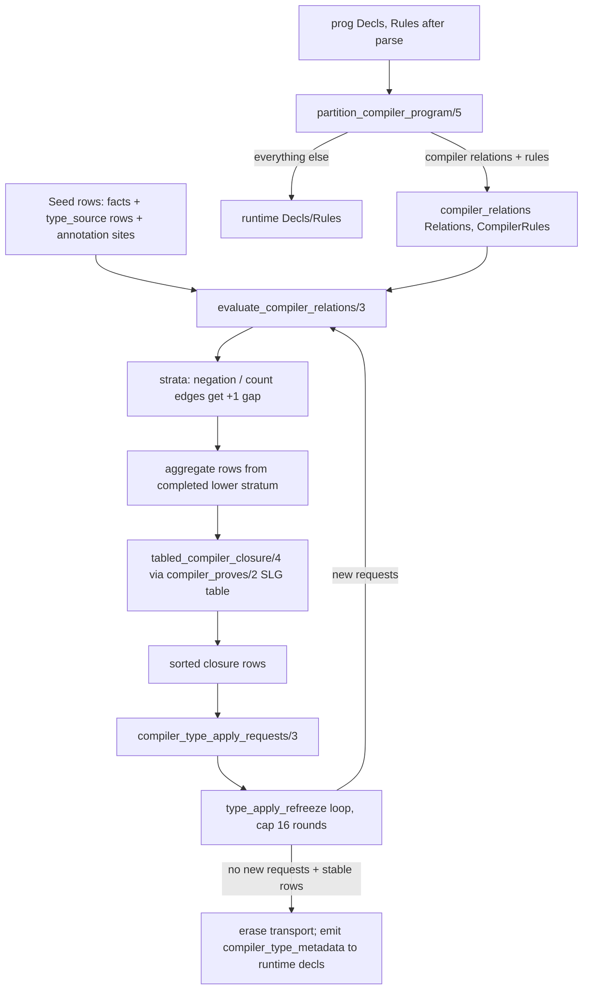

# Slice 7 audit: compiler relations and compile-time fixpoint

## TOC

1. Pipeline overview
2. Report blocks: partitioning (`0_compiler_relations.pl`)
3. Report blocks: goal safety (`0_compiler_relations/0_goals.pl`)
4. Report blocks: stratification and aggregates (`0_compiler_relations/1_aggregates.pl`)
5. Report blocks: the tabled evaluator and host boundary
6. Report blocks: expansion seam and freeze loop (`0_generic_expand`)
7. Report blocks: the DD plan twin (`compile/6_isolated_compiler_dd.pl`)
8. Report blocks: tests
9. Closing analysis (counts, term shapes, hidden state, extraction boundary)

## 1. Pipeline



Source facts enter as: (a) seed rows elaborated from compiler facts by
`elaborate_compiler_rules/5`, (b) frozen canonical graph projections
(`compiler_type_source_rows/3` from `semantic_type_rows`), (c) annotation site
rows. Generated rows leave as `compiler_type_metadata(MetadataRows, ClosureRows)`
plus `compiler_type_apply_request_rows/1` and
`compiler_derived_relation_request_rows/1` transport decls that the next
refreeze round consumes (`0a_type_apply_requests.pl`) and that
`erase_type_apply_transport/2` removes before runtime.

## 2. Partitioning (v6/prolog/0_compiler_relations.pl)

```prolog
% File: v6/prolog/0_compiler_relations.pl:36
% Existing comment: a relation is compiler-plane when a declared column has the `type` value domain; runtime-only modifiers have no compiler meaning except keyed/2
% Signature: partition_compiler_relations(+Decls, -CompilerDecls, -RuntimeDecls)
% Called by: partition_compiler_program/5, tests (partition_erases_compiler_declarations_from_runtime, mixed_scalar_domains_are_compiler_values)
% Calls: declared_relation_refs/2, classify_relation/3, compiler_only_enum_domains/3, compiler_runtime_decl/3
% Tests: v6/prolog/compile/test/compiler_relations.test.pl
% V7 class: adapt
% Parser coupling: none
% Preserved law: a relation whose columns include the `type` domain is erased from the runtime program with all its rules, facts, and dependent enums
% DL7 seam: in: declaration list (col_type/keyed/enum_decl); out: compiler_relations(Relations, []) plus residual runtime decls
```

```prolog
% File: v6/prolog/0_compiler_relations.pl:130
% Existing comment: (comment at :124-129) facts and rules headed by compiler relations become evaluator input; crossing the phase boundary in either direction has no runtime representation
% Signature: partition_compiler_program(+Decls, +Rules, -CompilerDecls, -RuntimeDecls, -RuntimeRules)
% Called by: elaborate_and_erase_compiler_relations/4 (0_generic_expand/2_compiler_plane.pl:4), annotation closure path (1_annotations.pl:67), tests
% Calls: partition_compiler_relations/3, compiler_builtin_relations/3, partition_rules/4
% Tests: v6/prolog/compile/test/compiler_relations.test.pl (many), dl/fixtures/compiler-relations.dl6, 0_compiler-stratified-negation.dl6, 0_type-reflection.dl6
% V7 class: adapt
% Parser coupling: term-shape (`<-`, `<+`, not/1, col_type/3, keyed/2)
% Preserved law: every rule is either wholly compiler-plane or wholly runtime; mixed bodies, builtin heads, and negated compiler refs in runtime rules are named refusals
% DL7 seam: unchanged on the DL7 cons-tree form once head/body accessors (rule_head/2, rule_body/2, atom_ref/2) sit behind the kernel binder `:`
```

```prolog
% File: v6/prolog/0_compiler_relations.pl:141
% Existing comment: none (implicit: compiler-source relations are activated by declared usage patterns)
% Signature: compiler_builtin_relations/3, compiler_builtin_is_used/3, compiler_pattern_rule/2, compiler_builtin_ref/1, compiler_request_ref/1, compiler_builtin_keys/2, compiler_builtin_declaration_collisions/2
% Called by: partition_compiler_program/5
% Calls: rule_contains_ref/2, compiler_rules_contain_functor/4, member/2
% Tests: v6/prolog/compile/test/compiler_relations.test.pl (type_member_is_keyed_by_canonical_member_identity, authored_relation_cannot_shadow_a_type_reflection_source, runtime_structural_terms_do_not_activate_compiler_pattern_sources)
% V7 class: adapt
% Parser coupling: term-shape (primitives like primitive/1, named/3, application/2, member/3, variant/3, application/2 column terms)
% Preserved law: the fixed reflection-source rels (type_decl/4 ... type__path/2) exist in the compiler plane only when a demand pattern appears, and an authored relation may never shadow one
% DL7 seam: a declared table of builtin reflection rels keyed by Ref with activation predicates over the DL7 source tree; keep the collision throw
```

```prolog
% File: v6/prolog/0_compiler_relations.pl:259
% Existing comment: none (partition_rules/4 walks the rule list enforcing single-plane membership)
% Signature: partition_rules/4, rule_head_ref/2, atom_ref/2, rule_contains_compiler_ref/3, body_compiler_ref/3, validate_compiler_rule_refs/2, validate_compiler_rule_plane/2, named_negation_compiler_ref/3, rule_head/2, rule_body/2, rule_contains_ref/2, relation_refs/2, atom_ref/2
% Called by: partition_compiler_program/5, validate_compiler_rule_plane_with_relations/2, compiler_rule_strata/2, tabled evaluator
% Calls: term_variables, compound_name_arguments
% Tests: compiler_relations.test.pl (mixed-domain, unsafe-rule, negation refusal tests)
% V7 class: extract
% Parser coupling: term-shape (`<-`/`<+` infix ops, not/1)
% Preserved law: compiler rules may reference only compiler relations; unsafe heads (unbound head vars) and negation of compiler refs from the runtime plane are refused by name
% DL7 seam: body/head as kernel-binder term lists; the safety checks (safety/stratification validators in 0_goals.pl) carry over unchanged
```

## 3. Goal safety (`0_compiler_relations/0_goals.pl`)

```prolog
% File: v6/prolog/0_compiler_relations/0_goals.pl:5
% Existing comment: compiler-plane goal classification, authored-order safety, and shared scalar evaluation; scalar binds and guards may only read variables bound by prior goals
% Signature: compiler_body_goals/2, validate_compiler_goal_sequence/3, validate_compiler_goal/3, variables_are_bound/2, add_term_variables/3, add_variables/3, member_variable/2, body_atoms/2, body_relation_goal/3, compiler_bind_goal/3, eval_ground_expression/2, holds_ground_comparison/1
% Called by: validate_compiler_rule_plane/2, body_atoms/2 used by rule_contains_compiler_ref/3, compiler_rule_constraint/5, satisfy_*_compiler_body/2, body_compiler_ref/3
% Calls: compile/registry:body_surface_for_term/6, conformance/body:eval_expr/2 + comparison_goal/1 + solve_comparison/1
% Tests: compiler_relations.test.pl (expression_reads_follow_authored_body_order, comparisons_require_prior_ground_bindings, negated_goal_requires_prior_bindings, scalar_bind_and_comparison_share_runtime_expression_semantics)
% V7 class: extract (validate_compiler_goal/3 is `adapt`: it must learn DL7's `:` binder and application forms)
% Parser coupling: term-shape (infix `:=` binds, infix comparisons via registry surface)
% Preserved law: authored body order is the evaluation order; a scalar bind, comparison, or negation may read only variables bound by an earlier relation goal
% DL7 seam: in: goal sequence as cons list; out: ordered bound-variable set. compiler_bind_goal/3 re-keys on the `:` binder form
```

## 4. Stratification and aggregates (`0_compiler_relations/1_aggregates.pl`)

```prolog
% File: v6/prolog/0_compiler_relations/1_aggregates.pl:25
% Existing comment: (comment at :21-24) strict dependency edge enters each count-headed rule and each negated relation goal; completed rows below a stratum feed counts and anti-joins once, then ordinary rules close under the tabled evaluator
% Signature: evaluate_compiler_strata/3, evaluate_compiler_strata_groups/3, compiler_rule_strata/2, compiler_rule_constraint/5, compiler_dependency_gap/4, validate_compiler_stratification/1, strict_dependency_cycle/2, dependency_constraint_path/4, relax_compiler_strata/4
% Called by: evaluate_compiler_relations/3
% Calls: keysort/2, group_pairs_by_key/2, tabled_compiler_closure/4, derive_compiler_aggregate_row/3
% Tests: compiler_relations.test.pl (grouped_count_reads_a_completed_lower_stratum, aggregate_dependency_cycle_has_named_diagnostic, negated_dependency_cycle_has_named_diagnostic, stratified_negation_reads_recursive_lower_fixpoint, negation_and_count_share_completed_strata)
% V7 class: extract
% Parser coupling: none (consumes compiler_head_argument/2 templates only)
% Preserved law: negation and count read only completed lower strata; a strict (gap 1) cycle through negation or aggregation is a named compile error; strata numbers come from Bellman-Ford-style relaxation with a hard cap
% DL7 seam: in: rule list + seeds; out: sorted row set per stratum. The relax loop's Cap = |derived refs| + 1 guards non-termination
```

```prolog
% File: v6/prolog/0_compiler_relations/1_aggregates.pl:121
% Existing comment: none (aggregate head template: every head argument is plain(Expr) or agg(count, Expr); count requires count/1 surface)
% Signature: validate_compiler_aggregate_heads/1, validate_compiler_aggregate_head/1, compiler_aggregate_rule/1, compiler_aggregate_head/2, compiler_head_argument/2, derive_compiler_aggregate_row/3, compiler_head_argument_value/2, compiler_aggregate_group_key/3, compiler_aggregate_arguments/3, compiler_aggregate_argument/4
% Called by: evaluate_compiler_strata_groups/3, validate_compiler_aggregate_heads/1, compiler_dependency_gap/4
% Calls: compile/registry:surface_for_term/6, satisfy_compiler_body/2, eval_ground_expression/2
% Tests: compiler_relations.test.pl (grouped_count..., aggregate_dependency_cycle...), dl/fixtures/0_compiler-derived-relation.dl6
% V7 class: adapt (only count/1 exists; DL7 may rule on more aggregates)
% Parser coupling: term-shape (count/1 head wrapper recognized via registry aggregate surface)
% Preserved law: grouped count aggregates all body derivations, groups by plain head positions, and emits one row per distinct group key, only when the body succeeds for at least one derivation
% DL7 seam: in: head term + body; out: one row per group with count as integer in the count position
```

## 5. Evaluator and host boundary (0_compiler_relations.pl, evaluator half)

```prolog
% File: v6/prolog/0_compiler_relations.pl:358
% Existing comment: (comment at :352-357) positive safe rules use ordinary Datalog joins; scalar goals execute in body order; aggregate heads and negated relation goals read completed lower strata; every row set is sorted before use
% Signature: evaluate_compiler_relations(+CompilerDecls, +SeedRows, -ClosureRows)
% Called by: elaborate_and_erase_compiler_relations/4, annotation closure (1_annotations.pl:83), tests directly
% Calls: validate_compiler_seed/2, validate_compiler_rule_plane_with_relations/2, validate_type_apply_recursive_construction/1, validate_compiler_aggregate_heads/1, evaluate_compiler_strata/3
% Tests: compiler_relations.test.pl (whole file), 0_compiler-stratified-negation.dl6 fixture, type-reflection fixture
% V7 class: adapt (entry contract stays; validation order is observable through which named error fires first)
% Parser coupling: none
% Preserved law: closure rows are ground, sorted, functional-key-checked, and closed under all strata; a non-ground seed, unsafe rule, unstratified negation/aggregate, or type_apply construction cycle is refused with a distinct unsupported_construct term
% DL7 seam: in: compiler_relations(Relations, Rules) + ground seed rows over semantic type IDs; out: sorted closure rows, same shapes
```

```prolog
% File: v6/prolog/0_compiler_relations.pl:438
% Existing comment: (comment at :433-437) one unique table namespace belongs to one compiler round; rules and seeds are immutable while SLG evaluation closes recursive positive goals; negated goals consult only LowerRows
% Signature: tabled_compiler_closure(+Rules, +LowerRows, +Seeds, -Rows) is det
% Called by: evaluate_compiler_strata_groups/3
% Calls: gensym/2, setup_call_cleanup/3, assertz/1, abolish_table_subgoals/1, retractall/1
% Tests: exercised by every recursive/stratified test in compiler_relations.test.pl
% V7 class: adapt
% Parser coupling: none
% Preserved law: per-round table namespace (gensym EvalId) plus setup_call_cleanup means no table or dynamic-fact leakage across compiler rounds; negation sees exactly the lower stratum
% DL7 seam: unchanged; SWI-specific table namespace discipline must be re-proved in any host (a Rust port replaces this with an explicit semi-naive loop)
```

```prolog
% File: v6/prolog/0_compiler_relations.pl:457
% Existing comment: none (compiler_proves/2 is the tabled closure kernel)
% Signature: compiler_proves/2, satisfy_tabled_compiler_body/2, satisfy_compiler_body/2, compiler_bind_goal/3, eval_ground_expression/2, holds_ground_comparison/1
% Called by: tabled_compiler_closure/4 (findall over compiler_proves), satisfy recursion; satisfy_compiler_body serves derive_compiler_aggregate_row/3 and compiler_type_apply_requests/3 (non-tabled twin)
% Calls: compiler_bind_goal/3, eval_expr/2, comparison_goal/1, solve_comparison/1, compiler_proves/2 (recursive)
% Tests: recursive_positive_rules_reach_a_set_fixpoint, scalar_bind_and_comparison_share_runtime_expression_semantics, expression_reads_follow_authored_body_order
% V7 class: extract
% Parser coupling: none beyond body goal shapes
% Preserved law: two interpreters (tabled and non-tabled) agree exactly on body semantics: seeds, rules, order-independent negation over completed lower rows, ground type_apply emission, `:=` binds, ground comparisons; non-ground bind/comparison inside evaluation throws
% DL7 seam: in: rule + row sets as ground cons-tree rows; out: derived ground rows. The interpreted/host boundary is exactly these four host calls (eval_expr, solve_comparison, surface_for_term, body_surface_for_term)
```

```prolog
% File: v6/prolog/0_compiler_relations.pl:520
% Existing comment: none (keyed/2 positions state functional compiler outputs)
% Signature: validate_functional_rows/2, relation_rows/3, validate_functional_relation/3, key_values/3, argument_at/3
% Called by: evaluate_compiler_relations/3
% Calls: none
% Tests: keyed_functional_conflict_is_refused
% V7 class: extract
% Parser coupling: none
% Preserved law: after closure, two rows of a keyed compiler relation sharing key-column values are a compile error naming the relation and key values
% DL7 seam: in: closure rows + Keys positions; out: unit or throw
```

```prolog
% File: v6/prolog/0_compiler_relations.pl:394
% Existing comment: none
% Signature: compiler_type_apply_requests(+Rules, +Rows, -Requests), body_contains_type_apply/1, body_type_apply_application/2, validate_type_apply_recursive_construction/1, rule_dependency_path/4, rule_dependency/3
% Called by: elaborate_and_erase_compiler_relations/4 (request rows), evaluate_compiler_relations/3 (recursion check)
% Calls: satisfy_compiler_body/2, rule_dependency_path/4
% Tests: type_apply_constructor_cycle_is_refused, type_apply_non_ground_application_is_refused, functional_type_heads_lower_to_explicit_type_apply_ir, type_apply_body_request_refreezes_and_next_round_observes_generated_type
% V7 class: extract
% Parser coupling: term-shape (type_apply/3)
% Preserved law: every ground type_apply application reached in the closed compiler plane becomes a sorted type_apply_request(Application) row; a rule whose head transitively depends on its own type_apply use is refused
% DL7 seam: in: elaborated rules + closure rows; out: sorted ground type_apply_request/1 rows
```

```prolog
% File: v6/prolog/0_compiler_relations.pl:155
% Existing comment: none (compiler_builtin_path_decls/1 + compiler_builtin_path/2 are the use-resolver path table for reflection rels)
% Signature: compiler_builtin_path_decls/1, compiler_builtin_path/2
% Called by: expand_generic_program_with_bindings/3 (0_expand.pl:12)
% Calls: findall/3
% Tests: indirectly via use_resolve in conformance tests; 0_type-reflection.dl6 fixture
% V7 class: adapt
% Parser coupling: surface-policy (dotted rel paths like type.member)
% Preserved law: reflection sources resolve as declared paths (type.node, type.member, ...) without author declarations
% DL7 seam: the same table, names pending DL7 namespace ruling
```

## 6. Expansion seam and freeze points (`0_generic_expand`)

```prolog
% File: v6/prolog/0_generic_expand/2_compiler_plane.pl:4
% Existing comment: the compiler plane closes before enum, storage, and runtime planning; its declarations/rules disappear from the executable program while the semantic rows remain available to catalog and typegen
% Signature: elaborate_and_erase_compiler_relations(+Decls0, +Rules0, +Bindings, -Decls, -Rules)
% Called by: expand_generic_program_round (0_generic_expand pipeline)
% Calls: partition_compiler_program/5, elaborate_compiler_rules/5, compiler_type_source_rows/3, compiler_annotation_site_rows/3, evaluate_compiler_relations/3, compiler_type_apply_requests/3, compiler_derived_relation_shapes/2, erase_annotation_transport/3
% Tests: compiler_relations.test.pl (bare_compiler_fact_reaches_closure, real_dl6_type_terms_elaborate_and_erase_before_runtime, generic_compiler_plane_is_erased_after_application_evaluation, compiler_and_oracle_expansion_share_compiler_closure)
% V7 class: adapt
% Parser coupling: term-shape (compiler_type_metadata/2-3 transport decl)
% Preserved law: compiler relations close once per refreeze round, emit metadata + request rows into declarations, then disappear; runtime program carries only compiler_type_metadata
% DL7 seam: in: DL7 decls/rules + parse bindings; out: runtime decls with compiler_type_metadata(semantic_rows, closure, evidence?) attached
```

```prolog
% File: v6/prolog/0_generic_expand/0_expand.pl:18
% Existing comment: none (type_apply_refreeze is the compile-time outer fixpoint)
% Signature: type_apply_refreeze(+Decls0, +Rules0, +Bindings, +Seen0, +PreviousRows, +Round, -prog/2), type_apply_requests/3 (0a_type_apply_requests.pl:11), erase_type_apply_transport/2, frozen_type_application/3
% Called by: expand_generic_program_with_bindings/3
% Calls: expand_generic_program_round/3, canonical_semantic_type_rows/2, request_rows/2, type_apply_request_decl/4, derived_relation_shape_carrier/3, list_to_set/2
% Tests: type_apply_body_request_refreezes_and_next_round_observes_generated_type, type_apply_list_request_refreezes_and_erases_transport, type_apply_existing_application_reuses_canonical_identity, type_apply_only_demand_materializes_derived_relation, repeated_and_nested_derived_applications_deduplicate
% V7 class: adapt
% Parser coupling: term-shape (compiler_type_apply_request_rows/1, compiler_derived_type_demand/1, semantic_type_rows/1)
% Preserved law: rounds repeat (cap 16) while new ground type_apply requests appear or semantic rows change; a request for an already-frozen application is dropped; exhaustion is named type_apply_round_limit_exhausted(16)
% DL7 seam: fixpoint = (closure rows, frozen semantic_type_rows) pair stabilizing; requests are (Application, Constructor) identity terms
```

```prolog
% File: v6/prolog/0_generic_expand/2_compiler_plane.pl:175
% Existing comment: none (the comment "fact variables may be source type names captured by the parser bindings; rule variables remain evaluator joins" belongs to elaborate_compiler_fact_atom at :426-428)
% Signature: elaborate_compiler_rules/5 (with its family: elaborate_compiler_rule/4, elaborate_compiler_head_atom/5, elaborate_compiler_body/4, elaborate_compiler_body_atom/5, elaborate_compiler_fact_atom/3, ground_structural_type_id/4, elaborate_compiler_argument/5), compiler_relation_signature/2, compiler_type_source_signature/2, compiler_type_source_rows/3, compiler_annotation_site_rows/3, valid_semantic_type_id/1, compiler_derived_constructor/3, compiler_argument_domain/2
% Called by: elaborate_and_erase_compiler_relations/4, compiler_relations.test.pl (functional_type_heads_lower_to_explicit_type_apply_ir)
% Calls: semantic_type_id/3, semantic_decl_id/3, compiler_declared_type_term/2, structural_type_pattern/1
% Tests: compiler_relations.test.pl (whole elaboration matrix), fixtures 0_compiler-derived-relation.dl6, 0_compiler-stratified-negation.dl6, 0_type-reflection.dl6
% V7 class: adapt
% Parser coupling: term-shape + surface-policy (type column syntax, key(type), count/1, relation_value/2, site/2)
% Preserved law: a source type term in a type column becomes a semantic type ID in the fact/rule atom and, for compound head terms, an explicit type_apply/3 goal; for compound body terms, a type_requested/3 demand goal; reflection builtins have fixed signatures in compiler_type_source_signature/2
% DL7 seam: elaboration in: source term + bindings; out: ground semantic type ID (named/3, primitive/1, application/2, member/3) plus lowered goals. This family is the largest term-shape coupling in the slice
```

```prolog
% File: v6/prolog/0_generic_expand/2_compiler_plane.pl:34
% Existing comment: none (derived-relation request validation)
% Signature: compiler_derived_relation_shapes/2, validate_compiler_derived_relation_shape/3, validate_derived_request_header/5, validate_derived_request_members/3, validate_derived_request_roles/3, valid_semantic_type_id/1, erase_annotation_transport/3
% Called by: elaborate_and_erase_compiler_relations/4
% Calls: sort/2, findall/3
% Tests: derived_relation_request_validation_matrix (11 named diagnostics), functional_type_head_builds_demanded_partial_relation, zero_member_derived_relation_materializes
% V7 class: extract (validation matrix is an oracle: every error term is pinned by test)
% Parser coupling: none (operates on closure rows)
% Preserved law: derived_relation_request rows must exactly match one type_requested demand: one header, exact member count and positions, unique names, valid type IDs, single role per position, else a named error
% DL7 seam: in: closure rows; out: derived_relation_shape(Application, Constructor, Arguments, Count, Members, Roles) sorted
```

## 7. DD plan twin (`v6/prolog/compile/6_isolated_compiler_dd.pl`)

```prolog
% File: v6/prolog/compile/6_isolated_compiler_dd.pl:56
% Existing comment: the seam entry: compile_program/5, the same shape emit_ts:emit_program uses, so the text door routes to this module with no call-site special case
% Signature: compile_program/5, dd_plan_text/2, dd_plan_term/3, dd_plan_json_dict/7, fixture_dd_plan_text/3, fixture_dd_plan_json_text/3, write_dd_plan/2, write_fixture_dd_plan_json/3
% Called by: text door (compile.pl route), dd_compile_context/2 consumers, tests
% Calls: lower_program/2, program_plan/2, json_write_dict/3, ordered_rules/3, arrangement_terms/5, rule_operators/6, rule_wires/3, tick_order/1
% Tests: v6/prolog/compile/test/6_isolated_compiler_dd.test.pl (goldens in v6/prolog/compile/test/dd/*.dd.pl, *.dd.json), fixture dd/isolated_compiler_dd_unsupported_fixture.pl
% V7 class: oracle
% Parser coupling: none (consumes plan/lowered terms)
% Preserved law: the dd plan is a deterministic target-neutral JSON twin carrying rels, arrangements, operators (map/join/filter/reduce/iterate with bindings/predicates/projection), wires, and tick_order, byte-identical across runs; join keys and reduce aggregates are carried outside SQL text
% DL7 seam: in: plan + lowered terms (execution-plan fields the engine consumes); out: dd_plan JSON dict. Golden fixtures pin the shape
```

Supporting predicates in this file (all `extract`-class, term-shape coupling to
`plan/9`, `lowered/8`, `relplan_parts/6`, `use/4`, `levelstmt/7`, `edgestmt/9`):
`dd_plan_term/3`, `ordered_rules/3`, `rel_term/2`, `arrangement_term/2`,
`arrangement_columns/5`, `rule_arrangements/4`, `join_arrangements/6`,
`join_key_columns/5`, `shared_head_positions/3`, `reduce_arrangements/5`,
`aggregate_key_columns/4`, `rule_operators/6`, `rule_operator_terms/6`,
`operator_semantics/7`, `positive_bindings/2`, `positive_occurrences/3`,
`predicates_from_occurrences/4` (variable-identity `==` matching, per comment at
:557), `head_projection/4`, `reduce_projection/5`, `operator_payload/4`,
`join_operators/7`, `filter_operators/5`, `reduce_operators/6`,
`iterate_operators/7`, `rule_wires*/4-6`, `json_*` serializers, `tick_order/1`
(fixed 12-phase order), `operator_id/3`. Predicate-count note: 6_isolated_compiler_dd.pl holds ~55 helper predicates; the laws are the two above, plus `operator_semantics` column-identity rules (shared variables fold onto first occurrence by `==`).

## 8. Tests

| path | covers |
|---|---|
| `v6/prolog/compile/test/compiler_relations.test.pl` | partition, safety, closure, aggregates, negation, keyed conflicts, elaboration, refreeze, DD/SQLite reach, oracle parity |
| `v6/prolog/compile/test/6_isolated_compiler_dd.test.pl` | dd plan text + JSON goldens |
| `v6/prolog/compile/test/dd/*.dd.pl`, `*.dd.json` | golden plan fixtures |
| `v6/prolog/conformance/fixtures/5_compiler_quality.pl` | conformance source |
| `v6/prolog/dl/fixtures/0_compiler-derived-relation.dl6`, `0_compiler-stratified-negation.dl6`, `0_type-reflection.dl6`, `compiler-relations.dl6` | authored end-to-end |

## 9. Closing items

### Predicate counts by class

Counted over 0_compiler_relations.pl (53), 0_goals.pl (15), 1_aggregates.pl (20),
2_compiler_plane.pl compiler-plane family (26), 0a_type_apply_requests.pl (8),
0_expand.pl refreeze (3), 6_isolated_compiler_dd.pl (~55):

| class | count | notes |
|---|---|---|
| extract | ~70 | goal safety, strata/relax, aggregate derivation, functional checks, DD JSON writers, operators/wires projection |
| adapt | ~55 | partition, evaluator + table namespace, elaboration family (type term -> semantic ID), refreeze loop, seed/projectors |
| oracle | ~10 | dd_plan JSON/text goldens, validation matrix error terms |
| drop | 0 | no DL6-syntax-only logic in this slice |

### Canonical term shapes

Entering the slice:

- `prog(Decls, Rules)`; declarations `col_type(Ref, Column, Type)`,
  `keyed(Ref, Positions)`, `enum_decl(Name, Variants)`, `rel_template/3`,
  `semantic_type_rows(Rows)`.
- Rules as `(Head <- Body)` / `(Head <+ Body)` over kernel-binder/conjunction
  terms with `not/1`, `:=`, infix comparisons, `type_apply/3`.
- `compiler_relations(Relations, Rules)` with
  `compiler_relation(Ref, Arity, Keys)`; `Ref = Name/Arity`.
- Seed/closure rows: ground compounds whose `type` columns hold semantic type
  IDs: `primitive(Name)`, `named(Module, Kind, Name)`, `application(C, Args)`,
  `member(Owner, Pos, Name)`, `relation_value(RelId, Row)`, `site(Site, Ordinal)`.
- Frozen canonical graph rows: `declaration/5`, `member/5`, `member_role/2`,
  `application/2`, `argument/4`, `derived_from/2`, `parameter/4`.

Leaving the slice:

- `compiler_type_metadata(TypeRelationRows, ClosureRows[, AnnotationEvidence])`
  attached to runtime decls (then erased of all transport decls).
- `compiler_type_apply_request_rows([type_apply_request(Application)])`.
- `compiler_derived_relation_request_rows([derived_relation_shape/6])` which the
  refreeze loop converts into `type_decl/2`, `col_type/3`, `keyed/2`,
  `compiler_derived_member_role/4`, `semantic_decl_module/3` carriers.
- DD side: `dd_plan(Name, rels, arrangements, operators, wires, tick_order)`
  and its JSON dict (name, ddl, rels, arrangements, rules, operators, wires,
  initial, schedule, tick_order).

### Hidden state and control

- `:- table compiler_proves/2` plus `gensym(compiler_eval_)` per round and
  `abolish_table_subgoals(compiler_proves(EvalId, _))` in cleanup: the table
  namespace is per-eval-id, and cleanup order (abolish, then retractall of
  `compiler_eval_rule/lower/seed`) is part of the law.
- `thread_local compiler_eval_seed/2, compiler_eval_rule/2,
  compiler_eval_lower/2`, asserted with `assertz` in rule/lower/seed order.
- `setup_call_cleanup/3` guarantees retraction on throw; the throw paths
  (functional conflict, non-ground application, round limit) rely on it.
- `copy_term(Rule0, Rule)` per rule firing (both interpreters) - variables are
  never shared across derivations.
- Cuts: `classify_relation/3` (once-per-ref classification), builtin head
  refusal, `compiler_dependency_gap/4`, aggregate/binding/comparison goal
  dispatch, `json_rule/2`. `compiler_builtin_keys/2` uses `!` per clause.
- Strata relaxation is a self-recursive fixpoint with a `Cap` throw
  (`compiler_stratification_internal_limit`).
- Outer refreeze loop caps at 16 rounds
  (`type_apply_round_limit_exhausted(16)`), with `Seen0` dedup and a rows-equal
  stability check.
- Global-ish module state: `dd_compile_context/2` (dynamic, in compile.pl)
  smuggles Initial/Schedule into `compile_program/5`.
- `sort/3` (standard order) everywhere rows are sets; `list_to_set/1` on request
  carriers preserves positional order (commented at 0a:27).

### Smallest self-contained extraction boundary

`compiler_relations` minus the registry surface calls: the module as written,
plus the four host predicates it already imports (`eval_expr/2`,
`comparison_goal/1`, `solve_comparison/1`, `body_surface_for_term/6` +
`surface_for_term/6`), plus `rule_head/2`/`rule_body/2`/`atom_ref/2` shape
helpers. That set is closed under the evaluator, goal safety, strata, and
aggregates, and is testable against compiler_relations.test.pl directly with
hand-built `compiler_relations/2` inputs (most tests already do exactly this).

### First dependency forcing adaptation

`compiler_bind_goal/3` in 0_goals.pl:93 reaches into
`compile/registry:body_surface_for_term/6` to classify `:=` binds from surface
syntax. Everything above the evaluator is otherwise surface-free; this single
registry call, plus `surface_for_term/6` in `validate_compiler_aggregate_head`
and `compiler_head_argument`, forces `adapt` over `extract` for the goal
classification layer. In DL7 these become matches on the kernel binder `:` and
an explicit aggregate marker, replacing the registry lookup.

### Unresolved questions for V7 rulings

1. Do compiler relations keep `type`-column partitioning as the phase marker,
   or does DL7 declare compiler-plane relations explicitly? The `type`-column
   heuristic plus builtin-ref shadowing rules are the current law.
2. The reflection builtin set (`type_decl/4` ... `type__path/2`,
   `derived_*_request/4`) is hard-coded with fixed signatures and activation
   heuristics (`compiler_builtin_is_used/3` pattern matching on `primitive/1`,
   `named/3`, `application/2`, `member/3`, `variant/3`). V7 must rule whether
   this stays a closed table or becomes declared.
3. Freeze semantics: the outer refreeze loop caps at 16 rounds and identifies
   requests by `(Application, Constructor)` after freezing. Is 16 contractual,
   and is row-set stability the termination condition, or is round count
   observable behavior to preserve?
4. Aggregate coverage: only `count/1` is accepted in compiler heads
   (`compiler_aggregate_unsupported` otherwise). Which aggregates join the
   compiler plane in DL7?
5. The `key(type)` domain collapses to `type` at elaboration
   (`compiler_argument_domain/2`), keeping key role only in metadata. Confirm
   DL7 keeps key/2 as declaration-plane-only metadata for compiler relations.
6. `type__path/2` and `type_decl/4` are declared builtin refs/paths but never
   activated by `compiler_builtin_is_used/3` (no usage trigger); confirm
   intended (dead in practice) or drop.
