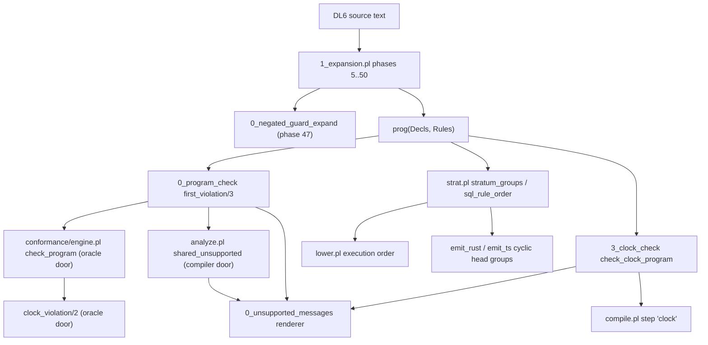

# Slice 8: validation, stratification, clock checking

Files audited:

- `v6/prolog/0_program_check.pl`
- `v6/prolog/strat.pl`
- `v6/prolog/3_clock_check.pl`
- `v6/prolog/0_negated_guard_expand.pl`
- `v6/prolog/0_unsupported_messages.pl`

## TOC

1. Slice shape and door map
2. `0_program_check.pl` report blocks
3. `strat.pl` report blocks
4. `3_clock_check.pl` report blocks
5. `0_negated_guard_expand.pl` report blocks
6. `0_unsupported_messages.pl` report blocks
7. Closing items (counts, canonical shapes, hidden state, extraction boundary, first forced adaptation, V7 rulings)

## 1. Slice shape and door map



Separation of syntax from semantics: `0_negated_guard_expand` is the only file
in this slice that rewrites terms by surface operator spelling (a source-syntax
phase). `0_program_check` and `3_clock_check` consume `prog/2` only, so their
triggers are canonical semantic checks. `strat.pl` consumes rule terms via
`analyze` projections. `0_unsupported_messages` renders thrown reason terms and
is presentation only.

## 2. `0_program_check.pl`

```prolog
% File: v6/prolog/0_program_check.pl:9-17
% Existing comment: shared implementation of invalid-program triggers checked by both doors; succeeds once per violating witness; payload is not an exception term
% Signature: program_violation(+CheckName, +Program, -Payload)
% Called by: first_violation/3 (same file), analyze.pl:1372 shared_unsupported/2, conformance/engine.pl:180 check_program/1, compile/test/plunit_tests.pl:11614 (direct)
% Calls: member/2,3, select/3, memberchk/2, functor/3, =../2, level_headed/2, declared_kind/2, relation_kind/3, body_wrapper_refs/4, body_reserved_word/4, rule_body_goal/2, rule_relation_atom/2, type_definitions/2, type_cycle_witness/2, relation_columns_and_types/5, declared_column_table/4, surface_for_term/6, surface/5, relation_value_shape/3, relation_value_term/4, column_storage/3, regexp_pattern_pcre_error/2, ast_capture_names/2
% Tests: compile/test/plunit_tests.pl (via analyze/engine doors), conformance/fixtures/*
% V7 class: oracle
% Parser coupling: term-shape (trigger bodies read `Head <- Body` / `Head <+ Body`, keyed/kind/keep/col_type decl terms, latest/pre/finalize/not wrappers)
% Preserved law: each named trigger succeeds once per violating witness over prog/2, and both doors agree on which trigger fires first because each door fixes a check order over the same trigger set
% DL7 seam: in: check name atom + prog/2 of DL7 decls and rule terms; out: a witness term per class (Ref, Name/Arity, pattern(Ref,Column,TypeName,Value), conflict/6, Ref-count(N), unimplemented/3, ...)

% File: v6/prolog/0_program_check.pl:39-42
% Existing comment: first violation in the caller's declared order, as violation(Name, Payload); fails when the program violates none of the listed classes
% Signature: first_violation(+Program, +OrderedChecks, -violation(Name, Payload))
% Called by: analyze.pl:1372, conformance/engine.pl:180
% Calls: member/2, program_violation/3, cut
% Tests: compile/test/plunit_tests.pl (door batteries), conformance/test batteries
% V7 class: extract
% Parser coupling: none
% Preserved law: the first listed check that succeeds wins; order is the caller's declaration, so cross-door diagnostic agreement is a caller invariant
% DL7 seam: unchanged; in prog/2 + list of check atoms, out violation/2

% File: v6/prolog/0_program_check.pl:52-72
% Existing comment: fallback-to-set rule has ONE statement; a relation is a Log only when declared so; keyed relation is a Set by construction; undeclared is a Set; ground refs take one memberchk, non-ground refs keep all three scans
% Signature: relation_kind(+Decls, +Ref, -Kind) ; declared_kind/3 ; declared_key(+Decls, +Ref, -Positions)
% Called by: program_violation (keep_on_non_log_rel, retention_head_conflict_risk), analyze.pl:36/55, conformance/engine.pl:72/104, 3_clock_check.pl:27 relation_plane/3
% Calls: memberchk/2, ground/1, cuts
% Tests: plunit_tests.pl, 3_clock_check.test.pl (via relation_plane)
% V7 class: extract
% Parser coupling: term-shape (decl terms kind/2, keyed/2)
% Preserved law: declared_key fails when the relation carries no key (never defaults to []); relation_kind is set for keyed and undeclared, log only for declared log
% DL7 seam: unchanged on DL7 decl terms

% File: v6/prolog/0_program_check.pl:74-94
% Existing comment: registry-driven aggregate recognition; the recognized set is exactly what both doors' local recognizers recognized
% Signature: level_headed(+Rules, +Ref) ; aggregate_head_ref/2 ; aggregate_argument/1 ; ordered_aggregate_name/1
% Called by: program_violation (keyed_level_head, log_on_level_headed_rel, aggregate_in_edge_head, aggregate_head_shape), 0_enum_expand.pl:89
% Calls: functor/3, member/2, surface_for_term/6
% Tests: plunit_tests.pl
% V7 class: extract
% Parser coupling: term-shape (rule spine `<-`/`<+`, json_object/2, registry surface rows)
% Preserved law: a level rule is `Head <- _`; an aggregate argument is a registry aggregate row or json_object/2
% DL7 seam: unchanged

% File: v6/prolog/0_program_check.pl:101-160
% Existing comment: key positions are one-based columns; duplicates produce malformed UNIQUE; keyed relation headed by a level rule accumulates instead of replacing; keyed Log is a contradiction; Log on a level head has no append; retention only on Log; latest/pre/finalize in a level rule have no occurrences and negation does not supply one (descend_not(true))
% Signature: program_violation/3 clauses: key_position_out_of_range, key_position_duplicate, keyed_level_head, keyed_log_rel, log_on_level_headed_rel, keep_on_non_log_rel, latest_in_level_rule, pre_in_level_rule, finalize_in_level_rule
% Called by: first_violation/3 via both doors' orders
% Calls: member/2,3, select/3, level_headed/2, body_wrapper_refs/4
% Tests: plunit_tests.pl, conformance fixtures
% V7 class: oracle
% Parser coupling: term-shape
% Preserved law: keyed decls are one-based unique positions on non-level, non-log relations; the three temporal wrappers are refused inside level rules through any depth of not/1
% DL7 seam: unchanged; witness terms carry Ref or Ref-Positions

% File: v6/prolog/0_program_check.pl:162-234
% Existing comment: regexp/cst regexp pattern classes: not literal, outside subset, invalid; cst capture unused / variable uncaptured
% Signature: program_violation/3 clauses: regexp_pattern_not_literal, regexp_pattern_outside_subset, regexp_pattern_invalid, cst_capture_unused, cst_variable_uncaptured, cst_regexp_pattern_not_literal, cst_regexp_pattern_outside_subset, cst_regexp_pattern_invalid ; cst_regexp_pattern/2 ; regexp_pattern_outside_subset/1 ; regexp_subset_codes/1 ; regexp_pattern_pcre_error/2
% Called by: first_violation/3 via both doors' orders
% Calls: regexp/2 (body goal), sub_term/2, string_codes/2, re_compile/3, message_to_string/2
% Tests: plunit_tests.pl, conformance fixtures
% V7 class: oracle
% Parser coupling: term-shape (regexp/2 and cst/5 body goals with cst_bindings/3)
% Preserved law: regexp patterns are literal strings over the stated subset and PCRE-compileable; cst capture names used in rules must be captured, candidate variables must be captured names
% DL7 seam: unchanged; the subset check works on the string value, not on source tokens

% File: v6/prolog/0_program_check.pl:235-309
% Existing comment: regexp operand must be text; ast query not literal, lang unknown, single quote, no named capture; capture names scanned from string codes
% Signature: program_violation/3 clauses: regexp_operand_not_text, ast_query_not_literal, ast_lang_unknown, ast_query_single_quote, ast_no_named_capture ; ast_capture_names/2 and its code-walkers
% Called by: first_violation/3 via both doors; 0_ast_expand.pl:9,164 calls ast_capture_names/2
% Calls: declared_column_table/4, rule_body_column_variable/6, sub_string/5, string_codes/2, code_type/2
% Tests: plunit_tests.pl, conformance fixtures
% V7 class: oracle
% Parser coupling: term-shape
% Preserved law: regexp operands in non-text columns are refused; ast queries are string literals in a fixed language list with at least one named capture and no single quote
% DL7 seam: unchanged

% File: v6/prolog/0_program_check.pl:342-374
% Existing comment: type_cycle (cyclic struct types have no content key, interned_graph_is_a_dag); column_type_unknown (bare identifier in type position that is no primitive, struct, json_list, list, id, anonymous or template application)
% Signature: program_violation/3 clauses: type_cycle, column_type_unknown ; anonymous_column_type/1 ; declared_template_application/2 ; declared_column_type_use/2 (3 clauses)
% Called by: first_violation/3 via both doors
% Calls: type_definitions/2, type_cycle_witness/2, member/2,3
% Tests: plunit_tests.pl
% V7 class: oracle
% Parser coupling: term-shape (col_type/3, type_decl/2, sh_decl/4 decl terms)
% Preserved law: declared struct types form a DAG; every column type name must resolve to a known primitive, struct, or template application
% DL7 seam: unchanged

% File: v6/prolog/0_program_check.pl:392-458
% Existing comment: relation_pattern_not_a_relation_value (the shape used to be caught only BY ACCIDENT, plans/2026-07-30-file-span-spine-reconciled.md 3.2); reserved_relation_value_carrier (obj/1); relation_column_type_conflict (a variable at a ref column and another column of different type is a contradiction; surrogate id is storage, never a value)
% Signature: program_violation/3 clauses: relation_pattern_not_a_relation_value, reserved_relation_value_carrier, relation_column_type_conflict ; declared_ref/2 ; relation_argument_violation/6
% Called by: first_violation/3 via both doors
% Calls: relation_columns_and_types/5, declared_type_name/2, relation_value_term/4, type_definition/4, relation_value_shape/3, rule_column_variable/6, column_type_assignable/3
% Tests: plunit_tests.pl
% V7 class: oracle
% Parser coupling: term-shape
% Preserved law: a nonvar argument in a ref-typed column is refused at the innermost leaf that holds the bad term; a variable typed two ways in one rule is refused, reported from the ref side; only declared column types take part
% DL7 seam: unchanged

% File: v6/prolog/0_program_check.pl:497-510
% Existing comment: head column type wall (ruling type_gate_widening); SQLite numeric widening int->float allowed losslessly, reverse refused; only declared types; declared column table built once per program
% Signature: program_violation(head_column_type_conflict, +Program, -conflict/6)
% Called by: first_violation/3 via both doors
% Calls: declared_column_table/4, rule_head_column_variable/6, rule_body_column_variable/6, column_type_assignable/3
% Tests: compile/test/plunit_tests.pl:11614 (direct), conformance fixtures
% V7 class: oracle
% Parser coupling: term-shape
% Preserved law: a variable flowing from a declared body column to a declared head column must be storage-assignable; assignable set: same storage, ref/idref both ways, json/json_list both ways, int->float
% DL7 seam: unchanged

% File: v6/prolog/0_program_check.pl:543-563
% Existing comment: relation value under not/1 and in an edge rule: refuse on BOTH doors rather than implement the lowering (dictionary joins inside NOT EXISTS, edge has no join seam); a door disagreement is the worse state
% Signature: program_violation/3 clauses: relation_value_under_negation, relation_value_in_edge_rule ; relation_value_in_ref_column/7 ; rule_is_edge/1
% Called by: first_violation/3 via both doors
% Calls: body_relation_atoms/4 (walk_policy(descend_not(true), splice_bare(true)), tag neg), relation_columns_and_types/5, declared_type_name/2, relation_value_shape/3
% Tests: plunit_tests.pl
% V7 class: oracle
% Parser coupling: term-shape
% Preserved law: a well-formed relation value in a ref-typed column is refused when negated or inside an edge rule; the compiler's own residue guards stay as backstop for direct lower.pl callers
% DL7 seam: unchanged

% File: v6/prolog/0_program_check.pl:592-647
% Existing comment: dynamic_relation_name (undeclared unheaded call/N goal; labs/generic_scan_instantiation named it); reserved_body_word (registry reserved words; refused rows deliberately excluded because the oracle runs them; walk does not descend not/1 nor splice)
% Signature: program_violation/3 clauses: dynamic_relation_name, reserved_body_word ; declared_relation/2 ; headed_relation/2 ; body_goal/2 ; body_relation_atom/2 ; rule_body_goal/2 ; rule_body/2
% Called by: first_violation/3 via both doors
% Calls: walk_body/3, body_reserved_word/4, relation_columns_and_types/5, functor/3
% Tests: plunit_tests.pl, conformance fixtures
% V7 class: oracle
% Parser coupling: term-shape
% Preserved law: a goal functor the program declares nowhere and no rule heads is either the relation's own name (call/2 is a legal rel name) or a registry-reserved word; edb_definition stays: an undeclared unheaded atom that is not reserved is legal input
% DL7 seam: unchanged

% File: v6/prolog/0_program_check.pl:655-690
% Existing comment: missing_retention (Log without keep/2 is unbounded by accident); retention_head_conflict_risk (bounded log head with 2+ edge arms: surviving row is the last arm's write, arm order is source order; broader than keyed sibling because the bound applies per TICK); aggregate_in_edge_head (aggregates have no bag in an edge)
% Signature: program_violation/3 clauses: missing_retention, retention_head_conflict_risk, aggregate_in_edge_head
% Called by: first_violation/3 via both doors (orders differ in position; engine order at conformance/engine.pl:140-176)
% Calls: member/2,3, relation_kind/3, findall/3, aggregate_head_ref/2
% Tests: plunit_tests.pl, conformance fixtures
% V7 class: oracle
% Parser coupling: term-shape
% Preserved law: every declared Log carries keep/2; a keep(count(N)) log with two or more edge arms is a diagnostic, not a refusal; aggregates are refused in edge heads on both doors
% DL7 seam: unchanged

% File: v6/prolog/0_program_check.pl:681-795
% Existing comment: aggregate_head_shape (ordered aggregate name with no registry row); aggregate_not_implemented (registry head(refuse(not_implemented)); payload carries the live aggregates read off the registry so the message cannot go stale; level rules only, edge case is aggregate_in_edge_head); aggregate_operand_not_number (numeric aggregate reading a non-number declared column; operand must be a bare variable; only declared types)
% Signature: program_violation/3 clauses: aggregate_head_shape, aggregate_not_implemented, aggregate_operand_not_number ; ordered_aggregate_name/1 ; numeric_aggregate_operand/3 ; number_column_type/2 ; implemented_aggregates/1 ; surface_row_is_live_aggregate/1
% Called by: first_violation/3 via both doors
% Calls: surface_for_term/6, surface/5, column_storage/3, rule_body_column_variable/6
% Tests: plunit_tests.pl
% V7 class: oracle
% Parser coupling: term-shape
% Preserved law: a registry aggregate word neither door evaluates is refused with the working list in the payload; sum/avg/min/max refuse a non-number declared operand column with the operand a bare variable
% DL7 seam: unchanged

% File: v6/prolog/0_program_check.pl:812-968
% Existing comment: rule_projection and column-table helpers; head argument participates only when bare variable or min/max wrapper (the first draft unwrapped every compound and refused nine struct fixtures); all-or-nothing table rule; storage-not-spelling assignability; column_storage/3 throws so storages land in fresh variables
% Signature: rule_relation_atom/2 ; declared_column_table/4 ; rule_head_column_variable/6 ; head_argument_variable/2 ; rule_body_column_variable/6 ; rule_head/2 ; column_type_assignable/3 ; storage_assignable/2 ; rule_column_variable/6
% Called by: the trigger classes above; head_column_type_conflict, aggregate_operand_not_number, regexp_operand_not_text, relation_column_type_conflict
% Calls: walk_body/3, body_relation_atoms/4, relation_columns_and_types/5, column_storage/3, findall/3, sort/2
% Tests: covered via trigger classes
% V7 class: extract
% Parser coupling: term-shape
% Preserved law: variable identity is the clause's own (`==`), two anonymous `_` are distinct; a ref with partially declared columns has no table entry (all-or-nothing)
% DL7 seam: unchanged on DL7 rule terms

% File: v6/prolog/0_program_check.pl:973-985
% Existing comment: one argument in a ref-typed column; a well-formed relation value is not a violation by itself, the search continues INTO it, so the reported column is the innermost one holding the bad term
% Signature: relation_argument_violation(+Types, +Ref, +Column, +TypeName, +Value, -Violation)
% Called by: relation_pattern_not_a_relation_value (recurses into values)
% Calls: relation_value_term/4, type_definition/4, declared_type_name/2, nth1/4, arg/3
% Tests: plunit_tests.pl
% V7 class: extract
% Parser coupling: term-shape
% Preserved law: bad leaf under good parent is reported at the leaf, naming the leaf's own column
% DL7 seam: unchanged
```

## 3. `strat.pl`

```prolog
% File: v6/prolog/strat.pl:19-42
% Existing comment: mirrors level_eval.pl's relax_strata exactly
% Signature: stratum_groups(+Rules, -Groups)
% Called by: sql_rule_order/2, recursive_stratum_groups/2, cyclic_head_groups/2, compile.pl:316 (via sql_rule_order), compile/test/plunit_tests.pl:264,271
% Calls: rule_is_level/1, rule_head_ref/2, body_ref_uses/2, rule_is_aggregate/1, findall/3, sort/2, keysort/2, group_pairs_by_key/2, pairs_values/2, relax_strata/4, rule_gap_of/3
% Tests: compile/test/plunit_tests.pl:259-275
% V7 class: extract
% Parser coupling: term-shape (rule spine, use/4 rows from analyze)
% Preserved law: stratum numbers are byte-identical to the oracle's: every body ref of an aggregate head is Gap=1, positive reads Gap=0, negated reads Gap=1; numbering fails with not_stratified when depth exceeds ref count
% DL7 seam: in: list of DL7 level rules; out: list of rule groups ordered by stratum

% File: v6/prolog/strat.pl:51-78
% Existing comment: aggregate heads force Gap=1 for EVERY body ref (positive or negated) because an aggregate must see its input complete before it folds; treating a positive read as Gap=0 would fold a half-built rel
% Signature: rule_gap_of(+Rule, +Sign, -Gap) ; relax_strata(+Constraints, +Cap, +Strata0, -Strata)
% Called by: stratum_groups/2
% Calls: findall/3, max_list/2, throw/1
% Tests: plunit_tests.pl:259-275
% V7 class: extract
% Parser coupling: term-shape
% Preserved law: relaxation converges to the least fixpoint of BodyStratum+Gap <= HeadStratum, capped at |DerivedRefs|+1, else not_stratified
% DL7 seam: unchanged

% File: v6/prolog/strat.pl:82-116
% Existing comment: topological sub-order within each stratum group; Kahn stops early on a cycle; ordering by HEAD keeps every rule of one head adjacent, which lower.pl:group_adjacent_by_head/2 reads
% Signature: sql_rule_order(+Rules, -Ordered) ; topo_order_group/2 ; group_head_edges/3 ; append_unplaced/3 ; dedupe_keep_order/2
% Called by: compile.pl:316 run_compile_step(plan, sql_rule_order, ...)
% Calls: stratum_groups/2, kahn_order/3, findall/3, sort/2, exclude/3, append/3
% Tests: plunit_tests.pl:276-332
% V7 class: extract
% Parser coupling: term-shape
% Preserved law: within a stratum, rules are emitted in positive-dependency order, cycle residue appended in head-source order, rules of one head kept adjacent
% DL7 seam: unchanged

% File: v6/prolog/strat.pl:118-141
% Existing comment: recursive stratum groups and cyclic head groups; direct self-recursion is absent (group_head_edges/3 drops the self edge)
% Signature: recursive_stratum_groups(+Rules, -RecursiveGroups) ; recursive_stratum_group/1 ; cyclic_head_groups(+Rules, -HeadGroups)
% Called by: 6_isolated_compiler_dd.pl:675 (recursive_stratum_groups), emit_ts.pl:2210,2722 and emit_rust.pl:629 (cyclic_head_groups)
% Calls: stratum_groups/2, group_head_edges/3, kahn_order/3, sort/2
% Tests: plunit_tests.pl:303,311,319
% V7 class: extract
% Parser coupling: term-shape
% Preserved law: a group is recursive iff Kahn places fewer refs than the group holds; cyclic_head_groups pairs each head on a positive INDIRECT stratum cycle with its group index, self edges dropped
% DL7 seam: unchanged

% File: v6/prolog/strat.pl:145-153
% Existing comment: Kahn's algorithm: emit a ref once every ref it positively depends on (within this group) has already been emitted
% Signature: kahn_order(+Refs, +Edges, -Order)
% Called by: topo_order_group/2, recursive_stratum_group/1
% Calls: select/3, member/2, reverse/2
% Tests: plunit_tests.pl
% V7 class: extract
% Parser coupling: none
% Preserved law: on a cycle Kahn emits the acyclic prefix then stops, leaving the cycle members unplaced for append_unplaced/3
% DL7 seam: unchanged
```

## 4. `3_clock_check.pl`

```prolog
% File: v6/prolog/3_clock_check.pl:36-49
% Existing comment: clock_dependency(Rule, From, To, ReadRing, WriteRing, Sign, Grade) projection over the dependency set
% Signature: clock_dependency(+Program, ?RuleId, ?From, ?To, ?ReadRing, ?WriteRing, ?Sign, ?Grade) ; clock_dependencies(+Program, -Dependencies)
% Called by: every other predicate in this module; 3_clock_check.test.pl:41-48,333,354,363,378
% Calls: edge_headed_refs/2, rule_dependencies/5, sort/2, nth1/4
% Tests: compile/test/3_clock_check.test.pl (whole battery)
% V7 class: extract
% Parser coupling: term-shape (prog/2, rule spine, latest/pre/finalize/not wrappers, registry body_surface_for_term/6 to exclude constructs)
% Preserved law: the dependency set is a sorted, duplication-collapsing function of Program alone
% DL7 seam: in: prog/2; out: dependency(RuleId, FromRef, ToRef, ReadRing, WriteRing, Sign, Grade, Role) terms

% File: v6/prolog/3_clock_check.pl:51-161
% Existing comment: (none at clause; module header states the checker reads the expanded program already used by analyze/strat/lower, introduces no source syntax and no runtime storage)
% Signature: rule_dependencies/5 ; level_goal_dependency/5 ; edge_goal_dependencies/6 ; edge_goal_dependency/7 ; dependency_from_role/6 ; relation_atom/2 ; relation_plane/3
% Called by: clock_dependencies/2
% Calls: conjunction_goals/2, clock_role/4, relation_kind/3 (program_check), rel_ref/2 (conformance/body), body_surface_for_term/6
% Tests: 3_clock_check.test.pl:41-48,248,278,424-428
% V7 class: adapt
% Parser coupling: term-shape (latest/1, pre/1, pre/2, finalize/1, not/1 spellings in the body)
% Preserved law: each body role maps to exactly one (ring, sign, grade) row from registry clock_role/4; a log plane is `n`, everything else `b`; grade 1 on the trigger arm iff FromRef is edge-headed; trigger grade resolves to source_delay
% DL7 seam: in: DL7 rule body goals; out: dependency/8 rows; wrapper spellings are the term-shape coupling V7 must re-home

% File: v6/prolog/3_clock_check.pl:169-213
% Existing comment: only trigger and level-state dependencies advance a relation's inferred occurrence clock; samples constrain an arm at its trigger clock but do not schedule it
% Signature: causal_dependency/3 ; inferred_clock(+Program, +Ref, -Origin, -Offset) ; program_nodes/3 ; clock_origin/3 ; clock_path/7
% Called by: inferred_clock/4, clock_fact/5, clock_violation/2 (clock_path_conflict), 3_clock_check.test.pl:47,68,369,386,428
% Calls: clock_dependencies/2, program_refs/2, member/2,3
% Tests: 3_clock_check.test.pl:47,50-57,68,369,386,428
% V7 class: adapt
% Parser coupling: none (consumes dependency/8 rows)
% Preserved law: offset of Ref = max/any sum of grades along a causal path from an origin with no causal in-edge; causal roles are level_read, level_absence, trigger, edge_departure, finalize_in_level
% DL7 seam: unchanged; residual known blow-up: clock_path/7 enumerates simple paths and inferred_clock/4 still uses it (ARCH.pl:901 inferred_clock_path_residual), NOT on the compile path but clock_fact/5 queries pay it on wide-route programs

% File: v6/prolog/3_clock_check.pl:180-187
% Existing comment: (none; facts are queryable Prolog terms during compilation and in deterministic receipts, per module header)
% Signature: clock_fact(+Program, +Ref, -Ring, -clock(Origin, Offset), -SccClass)
% Called by: fixtures compare clock facts against tick logs; 3_clock_check.test.pl:57
% Calls: inferred_clock/4, relation_plane/3, clock_scc/3
% Tests: 3_clock_check.test.pl:50-57
% V7 class: oracle
% Parser coupling: none
% Preserved law: clock(Origin, Offset) plus the relation's plane and SCC class are derivable, deterministic facts a receipt can compare against observed tick placement
% DL7 seam: unchanged

% File: v6/prolog/3_clock_check.pl:243-304
% Existing comment: SCC classification queryable separately from backend capability; zero-grade positive B cycle is constructive; delayed recurrence productive when every simple cycle has positive total grade; the occurrence-sensitive-edge extension is REFUTED by measurement (two order-independent zero-grade programs would have been refused); component set from 0_graph.pl since the all-pairs search cost 255 s on 42 nodes
% Signature: clock_scc(+Program, -Component, -Class) ; clock_components/3 ; classify_component/3 ; component_edges/3 ; edge_inside/2 ; component_cycle_sum/3 ; cycle_from/6
% Called by: clock_fact/5, clock_violation/2 (unconstructive_clock_cycle, pinned behind flag), delayed_recurrence_nodes/3; 3_clock_check.test.pl:95,101
% Calls: graph_from_edges/3, graph_cyclic_components/2 (0_graph), findall/3, min_list/2
% Tests: 3_clock_check.test.pl:95,101,167
% V7 class: oracle
% Parser coupling: none
% Preserved law: classes exactly { constructive_b, productive_delayed, invalid(nonpositive_cycle(Minimum)), invalid(nonconstructive_cycle) }; components arrive ordered by smallest member
% DL7 seam: unchanged

% File: v6/prolog/3_clock_check.pl:313-314
% Existing comment: PINNED OFF (rulings.pl clock_path_check_pinned_off): the clock path walk does not run on the compile path; the flag dl6_clock_path_walk brings it back; stays as the seed of a later calculus
% Signature: clock_path_walk_enabled/0 ; :- create_prolog_flag(dl6_clock_path_walk, false, ...)
% Called by: clock_violation/2 (two clauses)
% Calls: current_prolog_flag/2
% Tests: 3_clock_check.test.pl:8-9 (sets it true)
% V7 class: oracle
% Parser coupling: none
% Preserved law: clock_path_conflict and unconstructive_clock_cycle never fire on the compile path by default
% DL7 seam: flag becomes a compile option in V7; the dynamic flag is process-global state

% File: v6/prolog/3_clock_check.pl:316-361
% Existing comment: the five cross_plane violations; clock_path_conflict and unconstructive_clock_cycle are behind the flag; the recurrence node set is computed ONCE per violation because it used to call clock_scc/3 inside its own negation (58 chain rules x a whole component search each)
% Signature: clock_violation(+Program, -Violation) ; delayed_recurrence_nodes/3
% Called by: check_clock_program/1 (compile.pl:244), conformance/engine.pl:183 check_program/1
% Calls: clock_dependencies/2, clock_scc/3, setof/4, recurrence_free_clock/6, member/2,3, conjunction_goals/2, rule_is_level/1, rule_head_ref/2
% Tests: 3_clock_check.test.pl:84-91,106-167,179,248,278
% V7 class: oracle
% Parser coupling: term-shape (latest/1 inside level body, kind/2, keyed/2 decls for the two decl-backed violations)
% Preserved law: cross_plane violations fire from the dependency facts; clock_path_conflict(Origin, Ref, Left, Right) fires when two different offsets reach Ref from one origin
% DL7 seam: unchanged; note the two decl-backed clauses (log_on_level_headed_rel, keyed_level_head) duplicate 0_program_check triggers as clock terms for the oracle door

% File: v6/prolog/3_clock_check.pl:369-421
% Existing comment: multi_trigger_batch_invariance (either-source firing is intentional, the checker cannot establish batch invariance, keep it queryable and non-refusing); externally_fed; arm_absence_batch_invariance (level-headed negated rel is measured order-independent, edge-headed is measured order-DEPENDENT; json_typed_capture_folds_into_a_keyed_int_total is a live graded fixture on the shape, so the boundary is named, not refused)
% Signature: clock_boundary(+Program, -not_provable(Label))
% Called by: 3_clock_check.test.pl:133,248,341,348 (compile/test/plunit_tests.pl:240-251)
% Calls: clock_dependencies/2, declared_refs/2, edge_headed_refs/2
% Tests: compile/test/3_clock_check.test.pl:333-356, compile/test/plunit_tests.pl:240-251
% V7 class: oracle
% Parser coupling: none
% Preserved law: boundaries are named as not_provable/1 labels and never refuse; the three labels are multi_trigger_batch_invariance/2, externally_fed/1, arm_absence_batch_invariance/2
% DL7 seam: unchanged

% File: v6/prolog/3_clock_check.pl:440-585
% Existing comment: offsets without paths: the old simple-path enumeration was exponential (measured table k=4..20, 51,103 ms -> 3.5 ms; filesystem-fold compile 284.80 s -> 14.66 s, byte-identical module); replaced by Lustre-style per-node offset propagation; the walk/propagate equivalence holds exactly when every cycle weighs zero, which is CHECKED by zero_weight_cycles_only/2, never assumed; when either half fails the old enumeration runs unchanged
% Signature: recurrence_free_clock/6 ; live_causal_edges/3 ; zero_weight_cycles_only/3 ; delaying_edge/2 ; successor_index/2 ; propagated_offsets/3 ; propagate/4 ; relax/6 ; exclude_delayed/3 ; delayed_node/2
% Called by: clock_violation/2 (clock_path_conflict clause)
% Calls: list_to_assoc/2, get_assoc/3, put_assoc/4, empty_assoc/1, assoc_to_list/2, keysort/2, group_pairs_by_key/2, graph_from_edges/3, graph_cyclic_components/2
% Tests: 3_clock_check.test.pl (diamond chain battery, 106-167)
% V7 class: extract
% Parser coupling: none
% Preserved law: when all causal grades are >= 0 and no delaying (grade != 0) edge lies inside a cyclic component of the delayed-node-excluded graph, per-node offset SETS equal the simple-path offset set; otherwise fallback enumerates simple paths avoiding delayed nodes
% DL7 seam: unchanged

% File: v6/prolog/3_clock_check.pl:587-591
% Existing comment: (none)
% Signature: check_clock_program(+Program)
% Called by: compile.pl:244 run_compile_step(clock, ...)
% Calls: clock_violation/2, throw/1
% Tests: 3_clock_check.test.pl:85,91,333,354,362,377,399,407,415,423
% V7 class: oracle
% Parser coupling: none
% Preserved law: any clock violation becomes throw(unsupported_construct(Violation)) at the clock compile step; the oracle door throws the raw Violation term
% DL7 seam: unchanged
```

## 5. `0_negated_guard_expand.pl`

```prolog
% File: v6/prolog/0_negated_guard_expand.pl:15-27
% Existing comment: a not/1 over ONE guard comparison is inverted to its complement (not(X > 1) -> X =< 1); both doors run this phase
% Signature: expand_negated_guards_in_context(+EnumContext, +prog(Decls, Rules0), -prog(Decls, Rules))
% Called by: 1_expansion.pl:66-67 expansion_phase(47, negated_guard, ...)
% Calls: maplist/3, flip_negated_guards_in_rule/2, conjunction_goals/2, goals_conjunction/2
% Tests: conformance/fixtures/expressions.pl:312 (fixture exercising the flip); compile/test/plunit_tests.pl:5020 (phase order), 2785 (analyze's own negated_guard_goal refusal for wider shapes)
% V7 class: adapt
% Parser coupling: token/CST (operator spelling `<`, `=<`, `>`, `>=`, `==`, `\==`, `=:=`, `=\=` comes straight from source tokens via registry expression/5)
% Preserved law: not/1 wrapping a single ordered or identity comparison is replaced in place by the complement comparison; any other not/1 is untouched (analyze refuses those as negated_guard_goal)
% DL7 seam: in: prog/2 after phase 46 (ast); out: prog/2 with flipped guards; the EnumContext argument is threaded and unused here; DL7's `:` binder and different operator surface may change the comparison family rows consulted

% File: v6/prolog/0_negated_guard_expand.pl:36-51
% Existing comment: (none)
% Signature: comparison_guard/2 ; negate_operator/2
% Called by: flip_goal/2
% Calls: =../2, expression/5 (registry)
% Tests: via the fixture above
% V7 class: extract
% Parser coupling: token/CST (operator atoms)
% Preserved law: the eight operator complements are fixed pairs; a non-comparison under not/1 falls through unchanged
% DL7 seam: unchanged pairs unless V7 renames comparison operators

% File: v6/prolog/0_negated_guard_expand.pl:55-68
% Existing comment: (none; comment names the conjunction spine as same shape as 0_dot_expand / 0_coalesce_expand)
% Signature: conjunction_goals/2 ; goals_conjunction/2
% Called by: flip_body/2 (and re-declared in several sibling expanders)
% Calls: append/3
% Tests: via phase tests
% V7 class: extract
% Parser coupling: term-shape (`,` conjunction spine, `true`)
% Preserved law: a body is a list of goals with no nesting preserved; rebuilding is in original goal order
% DL7 seam: this helper is duplicated across expansion modules; V7 should keep one shared copy
```

## 6. `0_unsupported_messages.pl`

```prolog
% File: v6/prolog/0_unsupported_messages.pl:24-44
% Existing comment: one-line presentation for compiler unsupported constructs; text parser does not retain token positions so fallback states rule-index residue instead of manufacturing FILE:LINE; at(File,Line,Reason) arm ready for a future position wrapper; payload terms never pass through ~q; inventory members use the specific renderer, others keep the generic fallback preserving the functor
% Signature: prolog:message(unsupported_construct(WrappedReason))//1 ; unsupported_reason_text/2 ; unsupported_context/3 ; reason_name/2
% Called by: SWI message machinery wherever unsupported_construct/1 is thrown (compiler and oracle doors, tests)
% Calls: unsupported_inventory/1, specific_reason_text/3, fallback_reason_text/2
% Tests: compile/test/diag.test.pl:34 (json message equals human line), plunit_tests.pl:4899-4901
% V7 class: adapt
% Parser coupling: none (consumes thrown terms)
% Preserved law: every unsupported_construct renders as one readable line carrying the reason functor and a rule-index or file:line location
% DL7 seam: unchanged message contract; the at/3 arm becomes live if DL7 keeps positions

% File: v6/prolog/0_unsupported_messages.pl:49-132
% Existing comment: removed words render their replacement ("then what do I write"); projection type labels; relation references sorted from the reason term via sub_term/2
% Signature: specific_reason_text/3 ; projection_type_label/2 ; removed_word_replacement/2 ; fallback_reason_text/2 ; reason_subject_text/2 ; reason_relation_reference/2 ; reason_relation_text/2
% Called by: unsupported_reason_text/2
% Calls: format/3, atomic_list_concat/3, maplist/2,3, sub_term/2, findall/3
% Tests: diag.test.pl:34 (forall over inventory)
% V7 class: oracle
% Parser coupling: none
% Preserved law: removed_word rows name their replacement; registered_surface rows name the signature; every inventory reason renders specifically, everything else generically with the functor in parentheses
% DL7 seam: the removed-word table is DL6 surface vocabulary; DL7 rows replace it

% File: v6/prolog/0_unsupported_messages.pl:158-240
% Existing comment: the coverage inventory is derived from the two unsupported construct sources (registry rows refused, loaded compiler clauses that construct reasons); MEMOIZED in dynamic unsupported_inventory_memo/1, a function of loaded clause source alone; a process loading another source after a render must call unsupported_inventory_forget/0; parse_dl is a source since the json wiring arc; the reserved-word arm needs the naming clauses read directly so lifecycle_arm/1 and removed_word/1 land in the inventory
% Signature: unsupported_inventory/1 ; unsupported_inventory_forget/0 ; unsupported_inventory_scan/1 ; unsupported_inventory_example/2 ; unsupported_inventory_entry/2 ; unsupported_source_module/1 ; unsupported_reason_producer/1 ; reason_signature/2 ; unsupported_inventory_name/1 ; unsupported_inventory_signature/1
% Called by: prolog:message head, diag.test.pl:34, plunit_tests.pl:4899-4901, unsupported_renderer_counts/2
% Calls: findall/3, assertz/1, retractall/1, sort/2, clause/2, current_predicate/2, copy_term/2, sub_term/2, surface/5, clock_unsupported_reason/1
% Tests: diag.test.pl:34, plunit_tests.pl:4899
% V7 class: adapt
% Parser coupling: none (reads loaded clause bodies)
% Preserved law: the inventory is a memoized function of the loaded program: 15 source modules + registry refused rows + 4 analyze producer clauses + clock_unsupported_reason/1
% DL7 seam: the module list and the analyze producer clauses are DL6 layout; V7 re-enumerates its own sources

% File: v6/prolog/0_unsupported_messages.pl:242-260
% Existing comment: (none)
% Signature: unsupported_message_clause_count(-Count) ; unsupported_renderer_counts(-Specific, -Fallback)
% Called by: plunit_tests.pl:4899-4901 (test only)
% Calls: clause/3, strip_module/3, unsupported_inventory/1
% Tests: plunit_tests.pl:4899-4901
% V7 class: oracle
% Parser coupling: none
% Preserved law: exactly one prolog:message clause for unsupported_construct/1 lives in this module; specific-vs-fallback renderer counts stay in test-asserted proportion to the inventory
% DL7 seam: unchanged as a coverage contract
```

## 7. Closing items

### Predicate counts by class

| Class | Count |
|---|---|
| extract | 26 |
| adapt | 4 |
| oracle | 24 |
| drop | 0 |

Counted over ~54 report-block entries (multi-clause trigger families counted as
one block each where they share one law). Zero `drop`: every trigger class is
semantic over `prog/2`, and DL6 surface spellings enter only through
`0_negated_guard_expand` (adapt) and the removed-word table (oracle, rows
replaceable without dropping the renderer).

### Canonical term shapes entering and leaving the slice

In:

- `prog(Decls, Rules)` — the one input everywhere except the message renderer.
- `Decls`: `kind(Ref, log|set)`, `keyed(Ref, Positions)`, `keep(Ref, count(N)|all)`,
  `col_type(Ref, Column, TypeName)`, `type_decl(Name, Specs)`, `sh_decl(...)`,
  `rel_template(Segments, Parameters, _)`.
- `Rules`: `(Head <- Body)` / `(Head <+ Body)`, body = `,`-conjunction of
  relation atoms, `not/1`, `latest/1`, `pre/1`, `pre/2`, `finalize/1`,
  `regexp/2`, `cst/5`, `ast/4`, comparisons, `:=`.
- Refs: `Name/Arity`. Type names: atoms, `json_list(T)`, `list(T)`, `id(_)`,
  `product_type(_)`, `sum_type(_)`, `arrow_type(_, _)`, template applications.
- `dependency(RuleId, FromRef, ToRef, ReadRing, WriteRing, Sign, Grade, Role)`
  with `RuleId = rule(Index, level|edge, Ref)`, rings `n|b|z`, grades `0|1|-1|source_delay|state|previous`.
- `clock_role/4` rows from `compile/registry.pl` are the role authority.

Out:

- `violation(Name, Payload)` from `first_violation/3`; payload shapes per class:
  `Ref`, `Ref-Positions`, `Ref-count(N)`, `pattern(Ref, Column, TypeName, Value)`,
  `conflict/6`, `key_position_out_of_range(Ref, Position, Arity)`,
  `regexp_pattern_invalid(Pattern, Message)`, `reserved(Ref, LowerRole)`,
  `unimplemented(Ref, Signature, Implemented)`, `Name/Arity`, `Lang`, `Names`.
- `unsupported_construct(Violation)` thrown by `check_clock_program/1` and
  by both doors' `first_violation` mapping.
- Strata: ordered list of rule groups; rule order list; `Ref-GroupIndex` pairs.
- Clocks: `clock(Origin, Offset)` facts, `SccClass ∈ {acyclic, constructive_b,
  productive_delayed, invalid(Reason)}`, `not_provable(Label)` boundaries.
- Rendered one-line message atoms.

### Hidden dynamic predicates, flags, assertion order, cuts, tabling, module state

- `0_unsupported_messages.pl:158` `:- dynamic unsupported_inventory_memo/1` +
  `assertz` memo + `unsupported_inventory_forget/0` contract (a later-loaded
  source after a render must forget).
- `3_clock_check.pl:313` `create_prolog_flag(dl6_clock_path_walk, false)` —
  process-global flag, `keep(true)`; the checker's own test battery flips it.
- `0_program_check.pl:33` `:- discontiguous program_violation/3` — clause order
  within the file is irrelevant (dispatch is by first argument), but each
  trigger is cut-once-per-witness in ~28 clauses; several end in `!` to yield
  one witness per program (key_position_out_of_range, regexp families,
  head_column_type_conflict, aggregate families).
- `first_violation/3` cuts after the first check in the caller's order —
  order-sensitive by design; the two orders (analyze vs engine) are documented
  to agree on overlaps.
- No tabling. No setarg/recordz. The only throw sites are doors and
  `check_clock_program/1`; `relax_strata/4` throws `not_stratified`.
- Assoc library state is local to `propagated_offsets/3` (fresh per call).
- `relation_kind/3`, `declared_key/3`, `level_headed/2` are exported for both
  doors and the clock module — shared-decl law must move with them.

### Smallest self-contained extraction boundary

`0_program_check.pl` + `strat.pl` + `3_clock_check.pl` + their tests, taking
these imports as a fixed inner seam: `0_body_walk` (walker + policies),
`0_type_plane` (type queries), `0_graph` (SCC), `compile/registry`
(`surface/5`, `surface_for_term/6`, `clock_role/4`, `expression/5`),
`analyze` projections (`rule_is_level`, `rule_head_ref`, `body_ref_uses`,
`rule_is_aggregate`, `conjunction_goals`, `edge_headed_refs`, `declared_refs`,
`program_refs`), `conformance/body:rel_ref/2`. `0_negated_guard_expand.pl`
joins the boundary only if `expression/5`'s comparison-family rows travel with
it; otherwise it is a one-file extract. `0_unsupported_messages.pl` extracts
last since it enumerates module names across the compiler.

### First dependency that forces adaptation instead of extraction

`3_clock_check.pl`'s `edge_goal_dependency/7` and `level_goal_dependency/5`
read the temporal wrapper spellings `latest/1`, `pre/1`, `pre/2`,
`finalize/1`, `not/1` directly out of the expanded body and the
`prog/2` decl terms (`kind/2`, `keyed/2`) — that is `compile/registry`
`body_surface_for_term/6` plus source term shape, so the dependency-set
builder is `adapt` from the first line, and everything downstream
(`clock_violation`, `clock_boundary`, `clock_fact`) inherits it. The same
wrapper spellings force `oracle` classification on the corresponding
`0_program_check` triggers (`latest_in_level_rule` and friends).

### Unresolved questions requiring a V7 language ruling

1. Do `latest/1`, `pre/1`, `finalize/1` survive as DL7 wrapper spellings, or do
   they become kernel-level roles? The dependency-role rows
   (`registry.pl clock_role/4`) are the clean seam; the wrapper terms are not.
2. The two decl-backed `clock_violation` clauses
   (`log_on_level_headed_rel`, `keyed_level_head`, `3_clock_check.pl:324-333`)
   duplicate `0_program_check` triggers as clock-plane terms so the oracle door
   can throw them. Which door owns them in V7, and can one vocabulary carry both?
3. `clock_path_walk` stays pinned off (ruling `clock_path_check_pinned_off`).
   Does V7 revive the path calculus (edge reference counting, relational
   cardinality over time, Mercury-style det modes) or drop the code?
4. `dl6_clock_path_walk` is a process-global flag with `keep(true)`; V7 should
   make it an explicit compile option. Who owns its default?
5. `0_negated_guard_expand` inverts by operator spelling consulted from the
   registry's comparison family. If DL7's `:` binder changes guard term shape,
   the eight `negate_operator/2` pairs and the
   `ordered_comparison|identity_comparison` family rows need a ruling.
6. The unsupported-message inventory enumerates 15 module names by hand
   (`unsupported_source_module/1`). V7 module layout will differ; is the
   inventory still a function of loaded clause source, or does it become an
   explicit registry?
7. `strat.pl` mirrors `level_eval.pl:relax_strata` exactly to keep stratum
   numbers identical to the oracle. If DL7's runtime is not the Prolog oracle,
   what is the pinned artifact that stratum numbers must match?
8. `not_stratified` is thrown as a bare atom from `relax_strata/4`; both doors
   map recursion refusals differently (`recursion_refusal/2` in engine,
   lower.pl throws). One unified depth-limit error shape needs a ruling.
