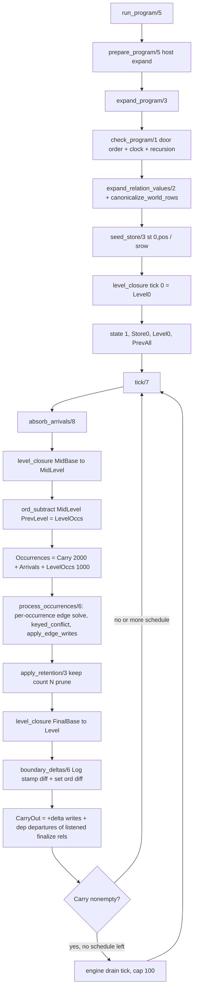

# Slice 9: runtime and temporal semantics

Files: `v6/prolog/conformance/{engine,level_eval,body,ticklog}.pl`,
`v6/prolog/{2_subscribe,1_host_expand}.pl`, fixtures `state_machine.pl`,
`temporal_pipe.pl`, `occurrence_identity.pl`, `seq_wire.pl`,
`23_diverging_recursion.pl`, `24_mutual_recursion.pl`.

## Contents

1. The tick, traced
2. Runtime laws that also execute compile-time rules
3. Predicate report blocks
4. Counts by class
5. Canonical term shapes
6. Hidden state, cuts, globals
7. Smallest extraction boundary
8. First dependency forcing adapt
9. Unresolved questions for V7 rulings

## 1. The tick, traced

One tick = `tick/7` (engine.pl:537), driven by `run_ticks/7` (engine.pl:683)
inside `run_program/5` (engine.pl:618).



Trace on `occurrence_identity.pl:identical_increments_stack_as_log_deltas`
(three `+increment(clicks)` in tick 1, keyed `counter/2`):

1. `absorb_arrivals/8` (engine.pl:383): each Log arrival becomes
   `lrow(st(1,Seq), Row)` with Seq ascending, and mints one
   `occ(st(1,Seq), Row)`. Three identical rows = three occurrences. A Set
   arrival goes through `absorb_set_arrival/5` (engine.pl:431): same row
   already present means `Changed == false` and no occurrence is minted at
   all (`set_rel_identical_arrival_is_one_occurrence` is exactly this). `-Row`
   on a Log rel throws `retract_from_log/1` (engine.pl:402).
2. Mid-tick `level_closure/6` over the arrived store derives MidLevel; the
   `ord_subtract(MidLevel, PrevLevel)` (engine.pl:544) becomes level
   occurrences stamped from Seq 1000.
3. `process_occurrences/6` (engine.pl:449) walks occurrences one at a time.
   For each, it copies each edge rule as ONE term (`rule(Head, Body, Items)`,
   engine.pl:449-454), matches the occurrence against `trigger_items/2`
   (engine.pl:331: bare positive atoms are triggers, `latest/1` is a sample,
   `finalize/1` a departure), and `solve/2`s the body over
   `ctx(Visible, PreState, Tick)`. `pre/1` reads the EVOLVING pre-state
   (engine.pl:535), so occurrence 2's `pre(counter(clicks,0))` reads what
   occurrence 1 wrote: the fold chains 0 -> 1 -> 2 -> 3.
   `check_occurrence_conflicts/3` (engine.pl:485) throws `keyed_conflict/3`
   when one occurrence derives two rows for one key. `apply_edge_writes/6`
   (engine.pl:493) then applies in derivation order: Log head appends a new
   stamp; keyed head replaces (`-old/+new` semantics at the boundary, equal
   row = no-op, engine.pl:505); unkeyed Set head throws
   `edge_into_unkeyed_set/1`.
4. Retention `apply_retention/3` (engine.pl:519) prunes `keep(count(N))`
   stamps at tick end.
5. Second `level_closure` derives the post-write Level; `boundary_deltas/6`
   (engine.pl:580) emits Log deltas as a stamp multiset diff (+Row per new
   stamp, -Row only when retention reclaimed a stamp) and Set/level deltas as
   an ordset difference (removed then added). Intermediate fold states 1 and 2
   are never observable (R2), only `-counter(clicks,0), +counter(clicks,3)`.
6. Carry-out (engine.pl:559-569) keeps only rows that are `+` deltas this
   tick (net-zero and intermediate fold states never re-trigger, R7) plus
   `dep(Row)` departures for rels some edge rule actually binds with
   `finalize/1` (`listened_departure_refs/2`, engine.pl:360). With carry
   remaining and an empty schedule, `run_ticks/7` self-schedules drain ticks
   up to `drain_cap(100)` (engine.pl:93), then throws `drain_overflow/1`.

The fixture receipts for this trace: `state_machine.pl`
(same-tick error-then-fresh chains arms, boundary shows the net no-op),
`temporal_pipe.pl` (each log rel stage lands exactly one tick later; keyed
replace carries into a drain tick), `occurrence_identity.pl` (log/set
occurrence split, arrival-order folds), `seq_wire.pl` (seq/1 = keyed
pre-counter desugar is byte-equal to the surface form), `24_mutual_recursion.pl`
(level closure needs outer rounds), `23_diverging_recursion.pl`
(`diverging_measure_recursion/2` at `level_round_cap(50)`, level_eval.pl:192).

## 2. Runtime laws that also execute compile-time rules

The evaluator and the compiler share one module per law; that sharing is the
mechanism that keeps the doors from forking.

| Law | Runtime site | Compile-time twin |
|---|---|---|
| program shape violations | `check_program/1` (engine.pl:178) reads `first_violation/3` from `0_program_check.pl` | same module, the compiler's gate opens with the same classes (engine_check_order/1) |
| clock violation | `check_program/1` via `3_clock_check.pl:clock_violation/2` | same predicate |
| direct recursion refusal | `recursion_refusal/2` (engine.pl:192), oracle twin of `lower.pl` 5205/5260/5264 | same throw terms both doors |
| stratification | `stratify_level_rules/2` + `relax_strata/3` (level_eval.pl:101,164), `not_stratified` | the compiler's relplan strata assignment |
| diverging measure recursion | `level_round_cap(50)` + `diverging_measure_recursion/2` (level_eval.pl:192-216) | `lower.pl:fixpoint_round_cap(1000)` |
| subscription cone | `2_subscribe.pl:subscribed_rels/4`, computed in `run_program/5` (engine.pl:651) and by the compiler's `program_plan/2` | same shared module (the `1_host_expand.pl` precedent) |
| body read set | `0_body_walk.pl` with per-door `walk_policy/2` in `trigger_items/2`, `body_finalize_ref/2`, `body_latest_ref/2`, `body_pre_ref/2` | `analyze.pl:body_ref_uses/2` reads the same walk |
| aggregate head forms | `classify_head_arg/2` (level_eval.pl:40) dispatches on `compile/registry.pl:surface_for_term/6` | the same registry rows drive the emitted aggregate lowering |
| list column minting/boundary | `mint_heads/4`, `list_boundary_rows/4` (level_eval.pl:223,298) | the emitted `__list_<entity>` view aggregates out of the same member rel |
| host demand/response split | `1_host_expand.pl:expand_probe_rule/5` runs BEFORE the tick loop as a pre-pass | same module is the compiler's host lowering |

## 3. Predicate report blocks

### engine.pl

```prolog
% File: v6/prolog/conformance/engine.pl:537
% Existing comment: "state(Tick, Store, PrevLevel, PrevAll)" + per-clause rulings r7/R2/r4/q5
% Signature: tick(+Prog, +state, +CarryIn, +OutsideArrivals, -state, -CarryOut, -Deltas)
% Called by: run_ticks/7
% Calls: absorb_arrivals/8, level_closure/6, ord_subtract/3, stamp_extra/4,
%        process_occurrences/6, apply_retention/3, boundary_deltas/6,
%        listened_departure_refs/2, dedupe_keep_order/2
% Tests: v6/prolog/conformance/fixtures/*.pl via go.pl run_fixture_checks/2;
%        ticklog.pl byte-diff against tsv2 runtime
% V7 class: oracle
% Parser coupling: none
% Preserved law: occurrences order as carry then arrivals then newly-true
% level rows; edge writes chain through the evolving pre-state; the boundary
% is a multiset on Log stamps and an ordset diff otherwise; carry-out is
% +delta rows and listened finalize departures only.
% DL7 seam: in: prog(Decls, Rules), signed arrival rows; out: next state,
% carry list, per-tick delta list of +Row/-Row.
```

```prolog
% File: v6/prolog/conformance/engine.pl:618
% Existing comment: q5 engine-owned drains; host prep stays a PRE-PASS
% Signature: run_program(+SugaredProg, +Initial, +Schedule, -FinalAll, -DeltaTicks)
% Called by: fixture_expectations_hold/2, ticklog.pl:print_ticklog/3
% Calls: prepare_program/5, expand_program/3, check_program/1,
%        expand_relation_values/2, check_world_shapes/3,
%        canonicalize_world_rows/3, normalize_relation_reference_rows/3,
%        seed_store/3, query_decl/3, subscribed_rels/4, split_rules/4,
%        level_closure/6, run_ticks/7
% Tests: all conformance fixtures; ticklog.pl entry points
% V7 class: oracle
% Parser coupling: none
% Preserved law: load-time normalization (host expansion, relation-value
% rewrite, arrival canonicalization) happens once before any store or Set
% membership sees a second spelling; a malformed world row is a load failure,
% never a half-applied tick.
% DL7 seam: in: surface program + initial rows + per-tick arrival lists;
% out: final visible rows + one delta list per tick.
```

```prolog
% File: v6/prolog/conformance/engine.pl:383
% Existing comment: none (header law 1: +Row into Log appends with stamp,
% +Row into Set is membership add, -Row from Log throws)
% Signature: absorb_arrivals(+Prog, +Tick, +Signed, +Store0, +Seq0, -Store, -Seq, -Occurrences)
% Called by: tick/7
% Calls: rel_ref/2, rel_kind/3, absorb_set_arrival/5, check_parent_chain/3
% Tests: occurrence_identity.pl set/log split fixtures; 20_parent_chain.pl
% V7 class: extract
% Parser coupling: none
% Preserved law: the Set plane absorbs an identical arrival without minting
% an occurrence (the occurrence it would fire does not exist); the Log plane
% mints one stamped occurrence per arrival.
% DL7 seam: in: signed rows; out: store entries + occ(st(Seq), Row) list.
```

```prolog
% File: v6/prolog/conformance/engine.pl:331
% Existing comment: bare positive atoms are trigger sources; latest/1
% samples; finalize/1 is a departure; walk must not descend not/1
% Signature: trigger_items(+Body, -Items)
% Called by: process_occurrences/6 (once per tick per edge rule)
% Calls: 0_body_walk:walk_body/3, trigger_items_/2
% Tests: every edge-rule fixture (door_split_trigger_literal.pl,
% occurrence_identity.pl, state_machine.pl)
% V7 class: adapt
% Parser coupling: term-shape
% Preserved law: trigger classification is a walk policy, not a hand-written
% traversal; items bind into the body copy so solve cannot rejoin over the
% whole store.
% DL7 seam: in: DL7 body cons tree; out: arrival(Atom) | departure(Atom)
% list in walk order.
```

```prolog
% File: v6/prolog/conformance/engine.pl:449
% Existing comment: rule/3 copied as ONE term so items stay bound into the body copy
% Signature: process_occurrences(+Prog, +Tick, +Frozen, +Occurrences, +Store0, -Store, -Written)
% Called by: tick/7
% Calls: trigger_items/2, store_view/4, occurrence_trigger/4, solve/2,
%        eval_head/2, dedupe_keep_order/2, check_occurrence_conflicts/3,
%        apply_edge_writes/6
% Tests: state_machine.pl (chained arms), occurrence_identity.pl (order folds)
% V7 class: oracle
% Parser coupling: none
% Preserved law: each occurrence fires all matching edge rules one at a time
% in occurrence order; two different rows for one key from one occurrence
% throw keyed_conflict; across occurrences the later write is the fold step.
% DL7 seam: in: occurrences + frozen two-view; out: written rows in order.
```

```prolog
% File: v6/prolog/conformance/engine.pl:580
% Existing comment: r7 Log rels one +Row per new stamp / one -Row per
% retention reclaim; everything else a set diff removed then added
% Signature: boundary_deltas(+Prog, +Store0, +Store, +PrevAll, +NextAll, -Deltas)
% Called by: tick/7
% Calls: msort/2, ord_subtract/3, delta_ref_is_set/3
% Tests: occurrence_identity.pl r7 fixtures; state_machine.pl replace deltas
% V7 class: extract
% Parser coupling: none
% Preserved law: a minus on a Log rel is a storage-plane fact (retention
% reclaim only), never an occurrence-plane one.
% DL7 seam: in: two store terms + two visible ordsets; out: ordered delta list.
```

```prolog
% File: v6/prolog/conformance/engine.pl:683
% Existing comment: engine-owned drains (q5), drain cap, final list_boundary_rows render
% Signature: run_ticks(+Prog, +State, +Carry, +Schedule, +Drains, -FinalAll, -DeltaTicks)
% Called by: run_program/5 (self-recursive)
% Calls: tick/7, tick_boundary_deltas/4, drain_cap/1, list_boundary_rows/4
% Tests: temporal_pipe.pl ticks(N) expectations
% V7 class: extract
% Parser coupling: none
% Preserved law: while carry remains the engine schedules empty drain ticks,
% bounded and loud (drain_overflow/1), never a truncated answer.
% DL7 seam: unchanged; schedule + carry in, rendered tick lines out.
```

```prolog
% File: v6/prolog/conformance/engine.pl:178
% Existing comment: door ORDER and exception vocabulary are fixture data
% Signature: check_program(+Prog)
% Called by: run_program/5
% Calls: 0_program_check:first_violation/3, 3_clock_check:clock_violation/2, recursion_refusal/2
% Tests: recursion_throw_pins.pl, 23_diverging_recursion.pl, refusal fixtures
% V7 class: oracle
% Parser coupling: term-shape
% Preserved law: a program violating two classes reports the same single
% class at both doors in the declared order.
% DL7 seam: in: expanded prog(Decls, Rules); out: throw term or accept.
```

```prolog
% File: v6/prolog/conformance/engine.pl:192
% Existing comment: oracle twin of lower.pl's recursion throws (PR #266 class)
% Signature: recursion_refusal(+Prog, -Term)
% Called by: check_program/1
% Calls: self_read_count/3, recursive_head_text_build/2, recursive_head_list_build/2
% Tests: 23_diverging_recursion.pl, recursion_throw_pins.pl
% V7 class: adapt
% Parser coupling: term-shape
% Preserved law: one direct self-read with a built text/list head is refused;
% multiple self-reads get their own unsupported construct.
% DL7 seam: in: DL7 rules; out: named throw term.
```

### level_eval.pl

```prolog
% File: v6/prolog/conformance/level_eval.pl:77
% Existing comment: plain rules to fixpoint; aggregate rules recompute over the result; alternate until stable
% Signature: level_closure(+Decls, +PlainLevel, +AggRules, +Base, +Tick, -Level)
% Called by: tick/7 (twice: mid, post), run_program/5 (seed)
% Calls: stratify_level_rules/2, eval_strata/6
% Tests: 24_mutual_recursion.pl, engine_core.pl, ordered_level_fixpoint.pl
% V7 class: extract
% Parser coupling: none
% Preserved law: strata read complete inputs; a negated or aggregated rel
% sits strictly below its consumer; not_stratified on cycles.
% DL7 seam: in: level rules + base rows; out: derived row set for one tick.
```

```prolog
% File: v6/prolog/conformance/level_eval.pl:101
% Existing comment: S(head) >= S(body rel) positive; strictly greater under not/1 or feeding an aggregate
% Signature: stratify_level_rules(+LevelRules, -Strata)
% Called by: level_closure/6
% Calls: rule_body_constraint/4, relax_strata/4, goal_rel_refs/3
% Tests: fixtures with stratified negation/aggregation
% V7 class: extract
% Parser coupling: none
% Preserved law: stratum relaxation to fixpoint with a loud not_stratified
% throw past the derived-ref-count cap.
% DL7 seam: in: DL7 rules; out: stratum-numbered rule groups.
```

```prolog
% File: v6/prolog/conformance/level_eval.pl:194
% Existing comment: bounded and loud, mirrors engine.pl drain_cap; cap quadratic wall
% Signature: plain_fixpoint(+Plane, +PlainLevel, +Base, +Tick, +Known0, -Level)
% Called by: eval_strata/6
% Calls: rows_index/2, solve/2, eval_head/2, mint_heads/4, level_round_cap/1
% Tests: 23_diverging_recursion.pl, 24_mutual_recursion.pl
% V7 class: extract
% Parser coupling: none
% Preserved law: naive fixpoint until Merged == Known0; a head whose measure
% grows every round throws diverging_measure_recursion/2 at 50 rounds.
% DL7 seam: in: plain level rules + base rows; out: least-model rows.
```

```prolog
% File: v6/prolog/conformance/level_eval.pl:406
% Existing comment: one pass; keysort stable; group_keys ascending like sort/2
% Signature: agg_rule_rows(+Rule, +Visible, +Tick, -Row)
% Called by: eval_strata/6
% Calls: aggregate_head/3, solve/2, eval_expr/2, group_key/3,
%        aggregate_args/3, agg_compute/3
% Tests: 9_ordered_aggregates.pl, json_arm.pl, 9_regexp.pl adjacent
% V7 class: extract
% Parser coupling: none
% Preserved law: grouping by evaluated non-aggregate head columns over the
% body-derivation multiset; empty bag derives nothing; json_object dup key
% throws json_object_dup_key/1.
% DL7 seam: in: aggregate rule + visible rows; out: grouped head rows.
```

```prolog
% File: v6/prolog/conformance/level_eval.pl:223
% Existing comment: canonical order; every new content text minted in sorted order BEFORE the substitution walk
% Signature: mint_heads(+Decls, +Derived, -Heads, -Rows)
% Called by: plain_fixpoint_/7
% Calls: list_mint_id/3, head_list_content_text/4, mint_head/4,
%        list_column_element_types/3
% Tests: 21_list_mint_order.pl, 10_list_elements.pl
% V7 class: extract
% Parser coupling: none
% Preserved law: list(T) head values are content-interned ids; walk order can
% never leak into which id lands where.
% DL7 seam: in: evaluated heads; out: heads with interned ids + entity/member rows.
```

```prolog
% File: v6/prolog/conformance/level_eval.pl:298
% Existing comment: storage keeps the interned id, the boundary crosses ordered member values
% Signature: list_boundary_rows(+Decls, +Rules, +Rows0, -Rows) / list_boundary_deltas/5
% Called by: run_ticks/7 (final pass), tick_boundary_deltas/4
% Calls: list_positions/3, list_boundary_row/4, list_member_values/4
% Tests: 10_list_elements.pl, 13_option_list_columns.pl, 19_list_value_position.pl
% V7 class: extract
% Parser coupling: none
% Preserved law: the id is storage; what crosses the boundary is the ordered
% member values, recursed for nested lists.
% DL7 seam: in: rows/deltas with ids + visible set; out: rendered rows.
```

### body.pl

```prolog
% File: v6/prolog/conformance/body.pl:531
% Existing comment: ctx(Visible, PreState, Tick) section header
% Signature: solve(+Goal, +Ctx)
% Called by: process_occurrences_/7, plain_fixpoint_/7, agg_rule_rows/4 (self-recursive)
% Calls: solve_spliced/2, eval_expr/2, json_decode/2, solve_comparison/1,
%        rows_member/2, pre_seed/2, re_match/2
% Tests: exercised by every fixture; 8_json_flex.pl, expressions.pl
% V7 class: adapt
% Parser coupling: term-shape
% Preserved law: evaluation is the default, goals run left to right;
% latest/1 samples Visible, pre/1 reads the evolving PreState, now/1 binds
% the phantom tick, finalize/1 fails as a read (satisfiable only as trigger).
% DL7 seam: in: DL7 goal + ctx of two row views and a tick; out: bindings.
```

```prolog
% File: v6/prolog/conformance/body.pl:568
% Existing comment: rows_index buckets a STABLE row list by Name/Arity; rows(Index, Growing) for the accumulating half
% Signature: rows_index(+Rows, -Index) / rows_member(+Atom, +IndexOrRows)
% Called by: plain_fixpoint/6, solve/2
% Calls: keysort/2, group_pairs_by_key/2, list_to_assoc/2
% Tests: performance-motivated; all level fixtures
% V7 class: extract
% Parser coupling: none
% Preserved law: an unindexed member/2 makes a k-goal rule O(N^k); solution
% order matches append(Stable, Growing).
% DL7 seam: in: row list; out: Name/Arity-bucketed index.
```

```prolog
% File: v6/prolog/conformance/body.pl:326
% Existing comment: canonical JSON; braces are the one grammar; {} atom both doors
% Signature: json_canon(+Value, -Canon)
% Called by: engine.pl (reexport), eval_expr/2, ticklog.pl, level_eval.pl
% Calls: braces_pairs/2, keysort/2, pairs_keys/2
% Tests: 8_json_flex.pl, json_arm.pl, json_patch_fold.pl
% V7 class: extract
% Parser coupling: term-shape
% Preserved law: objects canonicalize to obj(SortedPairs), dup keys throw,
% the empty object is the ATOM `{}`, json null is `none`.
% DL7 seam: in: braces/json terms; out: obj(SortedPairs) | list | scalar.
```

```prolog
% File: v6/prolog/conformance/body.pl:408
% Existing comment: nondeterminism IS the semantics; each fan-out is one SQL join
% Signature: json_decode(+Value, +Pattern)
% Called by: solve/2 (decode/2)
% Calls: json_capture_type/2, braces_decode/2, descendant_object/2
% Tests: 8_json_flex.pl, merge_family.pl
% V7 class: adapt
% Parser coupling: term-shape
% Preserved law: spread/key-capture/**-descent fan out one solution per
% element/key/descendant; typed captures filter; object patterns are open.
% DL7 seam: in: canonical value + cons-tree pattern; out: bindings via unification.
```

```prolog
% File: v6/prolog/conformance/body.pl:447
% Existing comment: monotone by construction, NON-BACKTRACKABLE global; counter mirrors the emitted entity table autoincrement
% Signature: list_mint_reset/0, list_mint_id/3, list_mint_elements/2
% Called by: level_eval.pl:mint_heads/4, list_mint_elements for boundary
% Calls: nb_setval/2, nb_current/2
% Tests: 21_list_mint_order.pl
% V7 class: adapt
% Parser coupling: none
% Preserved law: first content appearance wins the id; the mint must survive
% findall backtracking.
% DL7 seam: in: content text + elements; out: interned id.
```

### ticklog.pl

```prolog
% File: v6/prolog/conformance/ticklog.pl:65
% Existing comment: JSONL envelope both sides agree on, exact text stated in header
% Signature: print_ticklog(+Prog, +Initial, +Schedule) / emit/1,2, emit_perturbed/1
% Called by: command line (-g emit(...))
% Calls: run_program/5, tick_line/3, value_json/2, json_value_json/2, string_json/2
% Tests: byte-for-byte diff against tsv2 runtime tick loop (grading harness)
% V7 class: oracle
% Parser coupling: none
% Preserved law: one line per tick: rel names ascending, add/del sorted by
% their own JSON text, no spaces, LF endings; escape set matches
% JSON.stringify via a clause-for-clause twin of 0_type_plane.pl:json_escaped_codes/2.
% DL7 seam: in: program + schedule; out: JSONL text.
```

### 2_subscribe.pl

```prolog
% File: v6/prolog/2_subscribe.pl:29
% Existing comment: strict per ruling zero_query_semantics; shared with the reference engine
% Signature: subscribed_rels(+Decls, +Rules, +Queries, -SubscribedRels)
% Called by: engine.pl:run_program/5, compiler program_plan/2
% Calls: cone_fixpoint/4, host_edge/3, body_relation_atoms/4, host_relation_refs/3
% Tests: golden-flex.dl6 cone fixture (2_hosts_wiring.pl), flagship fixtures
% V7 class: extract
% Parser coupling: none
% Preserved law: no query, nothing subscribed; the cone closes over both
% arrows through samplers and negation, plus the demand-response host edge.
% DL7 seam: in: decls + rules + queries; out: sorted Name/Arity list.
```

### 1_host_expand.pl

```prolog
% File: v6/prolog/1_host_expand.pl:45
% Existing comment: probes become ordinary relations; host names are keys; undemanded declaration is an empty relation
% Signature: prepare_program(+Input, -prog(Decls, Rules), -HostPlans, -[], -QueryPlans)
% Called by: engine.pl:run_program/5 (pre-pass), compiler front door
% Calls: program_parts/4, normalize_rule/2, compile_host_decl/3,
%         expand_probe_rules/5, unprobed_host_decls/3, dedupe_terms/2
% Tests: 2_hosts_wiring.pl, shell_stream.pl, temporal_pipe probe fixtures
% V7 class: adapt
% Parser coupling: term-shape
% Preserved law: one host name is one declaration pair __host_demand_/__host_response_; a probe becomes a demand level rule + a response EDB read keyed (Witness, Ordinal).
% DL7 seam: in: DL7 program with host/void decls; out: ordinary relations + host plans.
```

## 4. Counts by class

| class | count | predicates |
|---|---|---|
| extract | 12 | tick/7, absorb_arrivals/8, boundary_deltas/6, run_ticks/7, level_closure/6, stratify_level_rules/2, plain_fixpoint/6, agg_rule_rows/4, mint_heads/4, list_boundary_rows/4 + list_boundary_deltas/5, rows_index/2 + rows_member/2, json_canon/2, subscribed_rels/4 |
| adapt | 7 | trigger_items/2, recursion_refusal/2, solve/2, json_decode/2, list_mint_id/3 group, prepare_program/5 |
| oracle | 3 | run_program/5, process_occurrences/6, check_program/1, ticklog print/emit family |
| drop | 0 | runtime carries no DL6-only surface; surface-only receipts stay in the lab fixtures, not promoted |

Runtime drops nothing: the tick semantics are door-neutral. Surface-coupled
items (probe/4 term shape, `<-`/`<+` ops, `:=`) are adapt, not drop, because
DL7 cons trees replace the term spelling while the laws survive.

## 5. Canonical term shapes entering and leaving the slice

- In: `prog(Decls, Rules)` where Decls is
  `kind(Ref, set|log) | keyed(Ref, Positions) | keep(Ref, count(N)|all) |
  col_type(Ref, Col, Type) | list_column(Ref, Col, list(T)) | sh_decl/7` and
  Rules are `(Head <- Body) | (Head <+ Body)` with Body a Prolog
  conjunction of relation atoms, `latest/1`, `pre/1,2`, `finalize/1`,
  `now/1`, `not/1`, `decode/2`, `json_each/2`, `:= / is` binds, comparisons,
  splice rows (next/combine).
- Store: `srow(Row)` for Set rels; `lrow(st(Tick, Seq), Row)` for Log rels;
  level views computed, never stored.
- Occurrences: `occ(st(Tick, Seq), Row)` | `dep(Row)`.
- Out: `FinalAll` = msorted store rows + level rows (list columns rendered as
  member values via `list_boundary_rows/4`), and `DeltaTicks` = one ordered
  list of `+Row | -Row` per tick, rendered by ticklog.pl as
  `{"tick":N,"deltas":{"rel":{"add":[...],"del":[...]}}}`.

## 6. Hidden state, cuts, globals, module state

- `nb_setval(list_mint, mint(Counter, ByContent, ById))` (body.pl:447): the
  content-interned list dictionary is a non-backtrackable global, reset once
  per `run_program/5` call via `list_mint_reset/0`. Any V7 extraction must
  carry it or the emitted autoincrement parity breaks.
- `:- multifile user:fixture/5` + `:- discontiguous` (engine.pl:90): fixtures
  load as user clauses; `go.pl` collects them.
- Cuts: `absorb_set_arrival/5` (dedup vs keyed-replace dispatch, both cut),
  `charset_codes(space_only, ...)` (nondeterminism guard, body.pl:254),
  `solve/2` clauses cut on wrappers to keep the final relation-atom clause
  last, `json_canon/2` arm ordering.
- No tabling anywhere. Engine stamps (`st(Tick, Seq)`) carry multiplicity
  internally under ruling q1; no fixture reads them.
- Module sharing: engine.pl loads `2_subscribe.pl`, `0_program_check.pl`,
  `0_body_walk.pl`, `0_type_plane.pl` so oracle and compiler run the same
  analyses; splitting a door from these modules forks the cone.

## 7. Smallest self-contained extraction boundary

`body.pl` (solve/2 + json_canon/2 + eval_expr/2 + rows_index/2) plus
`level_eval.pl` and the tick layer in engine.pl, pinned to three shared
modules the compiler already depends on: `0_body_walk.pl` (trigger/read
classification), `0_program_check.pl` (violation classes and order),
`2_subscribe.pl` (cone). ticklog.pl is a separate script seam grading the
whole loop by byte diff.

## 8. First dependency forcing adapt instead of extract

`solve/2` and `trigger_items/2` are fused to the DL6 Prolog term vocabulary:
`ctx(Visible, PreState, Tick)` is a positional 3-tuple, trigger items are
bound into a `copy_term`'d body so the trigger atom cannot rejoin over the
whole store (engine.pl:339-346), and `pre/2` seeding walks head args looking
for the single unbound column (body.pl:587). DL7's cons-tree body spelling
with `?Variable` changes the wrapper registry keys and the walk events, so
these become adapt even though the laws (evolving pre-state, sample-read
non-trigger, departure substitution) are unchanged.

## 9. Unresolved questions requiring V7 language rulings

1. Keep/1 retention: `keep(all)` is an explicit fixture escape for unbounded
   history (engine.pl header law 9). Does DL7 keep keep/2 on Log rels, and is
   the retention-minus a boundary-visible `-Row`?
2. Drain ownership (q5): the engine self-schedules drain ticks with
   `drain_cap(100)`. V7 needs a named cap value and the
   `drain_overflow/1` throw in the language contract.
3. Occurrence identity (q1): stamps are internal but Log multiplicity is
   observable (r7). V7 must state the log/set split as a declared rel kind,
   and whether a Log rel without keep/2 is still an error (q10).
4. Departure triggers (r4): `finalize/1` is unsatisfiable as a read and
   carries only on rels some edge actually binds. Is finalize/1 in DL7, and
   does the engine-owned drain mint departures for unbound retraction deltas
   (today it does not)?
5. Divergence caps: `level_round_cap(50)` vs doors' `fixpoint_round_cap(1000)`
   are sized independently and name different payloads. One DL7 number or two?
6. Same-tick fold chaining via `pre/1` is the scan law (state_machine.pl
   same_tick fixture). V7 must decide whether `pre/1` stays the scan marker or
   a new binder form replaces it under the `:` kernel binder.