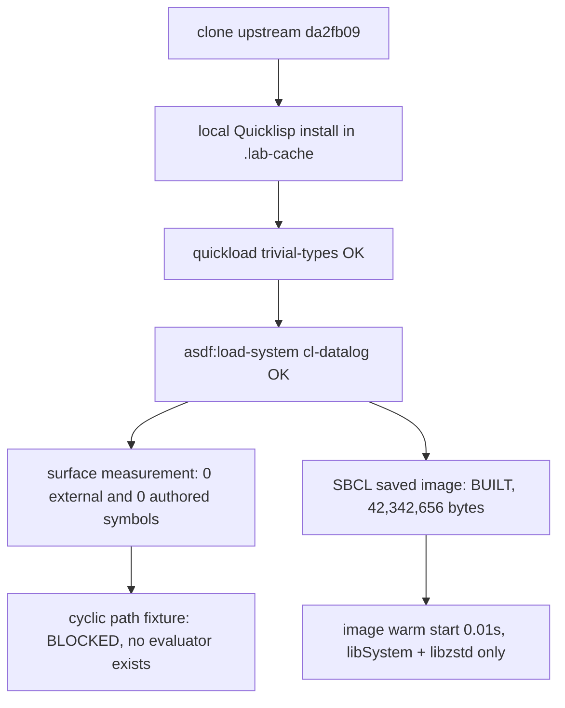

# cl-datalog Lab Results

Commit probed: `da2fb09a8c55cb9c4488358ee5dff4ab49ae473f` (2015-09-03, master HEAD), version 0.0.1, MIT. SBCL 2.6.7 Homebrew arm64, macOS arm64.

## Headline



cl-datalog loads on SBCL 2.6.7 and executes no rules because it supplies none. It is a name and a package declaration: `cl-datalog.lisp` is 5 lines containing only `(in-package :cl-datalog)`, `packages.lisp` defines the package with zero exports, and the entire repo ships no functions, macros, terms, unifier, rule store, or evaluator. Its own test suite (`prove`) asserts only `+`, `*`, `mod` arithmetic. The brief's question resolves to: syntax/data structures are also absent; the project is a stub.

## Commands executed (in order, exact)

```sh
git clone https://github.com/thephoeron/cl-datalog /tmp/cl-datalog-upstream
cd v7/labs/4_cl_datalog/.lab-cache
curl -fL -o quicklisp.lisp https://beta.quicklisp.org/quicklisp.lisp
sbcl --noinform --disable-debugger --load quicklisp.lisp \
  --eval '(quicklisp-quickstart:install :path #P"./.quicklisp/")' --quit
sbcl --noinform --disable-debugger --script ../2_PROBE.lisp
sbcl --noinform --disable-debugger --script ../3_BUILD.lisp
```

Quicklisp dist state at install: `2026-01-01`; `trivial-types` release
`trivial-types-20120407-git`, ASDF version `0.1`, archive MD5
`b14dbe0564dcea33d8f4e852a612d7db`, archive SHA1
`acf9e5a4b0ef99bdcb121cfbc8f07c647c302e57`. It was the only dependency
downloaded and loaded.

## Raw probe output (2_PROBE.lisp)

```text
PROBE library=cl-datalog version=0.0.1 commit=da2fb09a8c55cb9c4488358ee5dff4ab49ae473f
SURFACE external-symbols=0 authored-symbols=0 authored-fbound=0 authored-macros=0 total-accessible=999
EVALUATOR absent: no rule store, fixpoint, or resolution code exists in the library
PATH blocked=no-evaluator: cyclic fixture {edge/2, path/2} not executable
UNIFY blocked=no-evaluator
OCCURS blocked=no-evaluator
UPDATE blocked=no-evaluator
BINARY 42342656
```

The 999 accessible symbols are inherited through `(:use :cl :cl-user :trivial-types)`. Zero symbols are external and zero have `CL-DATALOG` as their home package.

## Measurement (3_BUILD.lisp, SBCL saved image)

| Measurement | Value |
| --- | --- |
| Executable bytes | 42,342,656 |
| Format | Mach-O 64-bit executable arm64 |
| Dynamic dependencies | `/usr/lib/libSystem.B.dylib`, `/opt/homebrew/opt/zstd/lib/libzstd.1.dylib` |
| Startup samples (5) | 0.01, 0.01, 0.01, 0.01, 0.01 s wall |
| Peak RSS | 46,891,008 bytes (~44.7 MiB) |
| Image contents | cl-datalog 0.0.1 + trivial-types, no evaluator |
| Source loading and compilation | available; saved image prints `source-load=T compile=T` |

Measurement commands:

```sh
wc -c .lab-cache/cl-datalog-lab
file .lab-cache/cl-datalog-lab
otool -L .lab-cache/cl-datalog-lab
for lab_run in 1 2 3 4 5; do /usr/bin/time -p .lab-cache/cl-datalog-lab; done
/usr/bin/time -l .lab-cache/cl-datalog-lab
```

The image prints:

```text
PROBE library=cl-datalog version=0.0.1 commit=da2fb09a8c55cb9c4488358ee5dff4ab49ae473f
BUILT image=cl-datalog-lab loaded=(cl-datalog trivial-types) evaluator=absent source-load=T compile=T
```

It exits 0.

## Capability classification (report-contract vocabulary)

| Capability | Result | Note |
| --- | --- | --- |
| nested term unification | absent-from-probe | no unifier exists in the library |
| occurs check | absent-from-probe | no unifier |
| multiple answers | absent-from-probe | no search exists, so no answer order exists to report |
| fair search | absent-from-probe | no search exists, so a starvation probe cannot be expressed through this library |
| cyclic transitive closure | absent-from-probe | fixture not executable; termination mechanism: none, blocker is missing evaluator |
| Datalog fixpoint | absent-from-probe | no rule evaluation code |
| tabling | absent-from-probe | no variant, subsumptive, answer-subsumption, or other call/answer tables |
| constraints | absent-from-probe | no constraint store and no supported domains |
| dynamic facts and retraction | absent-from-probe | no fact store |
| standalone image | built | 42,342,656 bytes; links the empty library |

## Evaluation algorithm identification

From source receipts: no algorithm exists. `git grep`-level inventory of the implementation file is two lines (`in-package` + blank). Bottom-up, top-down, seminaive, and tabling are all absent; nothing executes.

## Final report questions

1. SWI capabilities covered directly by the library: none.
2. Capabilities requiring implementation or another engine: all of them (unification, search, fixpoint, negation, updates).
3. Does recursion over a cycle terminate: unanswerable; the shared fixture was not executed because no evaluator exists.
4. Can it compile into an SBCL executable image: yes; the saved image contains the package declaration and `trivial-types` dependency.
5. Executable 42,342,656 bytes; deps libSystem + libzstd; startup samples 0.01, 0.01, 0.01, 0.01, 0.01 s; peak RSS 46,891,008 bytes.
6. Source files implementing unification/search/evaluation/caching: none exist.
7. Code remaining before DL7 rules could execute: the whole engine. cl-datalog contributes a package name only; every capability would be implemented in the lab adapter or a different library.

## Blockers

Source inspection and package-surface measurement establish that no evaluator
exists. Semantic behavior for the shared fixture was therefore not executed;
those rows are `absent-from-probe` with blocker `no-evaluator`. Implementing an
engine in the lab would measure the adapter instead of cl-datalog and remains
outside this brief.
