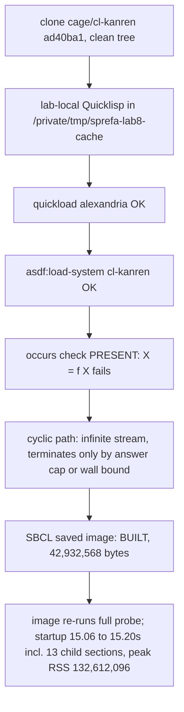

# cl-kanren Lab Results

## Headline



cl-kanren (cage/Codeberg, 899 authored lines) runs on SBCL 2.6.7 with one
dependency (`alexandria`). It is a miniKanren layer over a microKanren core
with an occurs check, interleaved `mplus` streams, and generic-method
unification over lists, vectors, and strings. It ships no fact store, no
tabling, no constraints, no relational arithmetic, and no negation.

## Pointer resolution (brief vs inventory)

The brief's `github.com/copperteal/cl-kanren` is an unrelated GPL-3.0 project
(5 commits, 2025-09, TRS2-lexicon, binary-tree substitutions) sharing only the
name with the inventory's canonical `codeberg.org/cage/cl-kanren` (BSD,
22 commits from 2014-03 to 2023-06, Quicklisp `cl-kanren` release 2024-10-12,
dist 2026-01-01). Full
comparison in `1_SOURCE.md`. Selected upstream: **cage/cl-kanren**; the
copperteal project was not silently substituted in or out.

## Commands executed (in order, exact)

```sh
# external cache (outside Git)
git clone https://codeberg.org/cage/cl-kanren.git \
  /private/tmp/sprefa-lab8-cache/cl-kanren-cage
cd /private/tmp/sprefa-lab8-cache
curl -fsSL -o quicklisp.lisp https://beta.quicklisp.org/quicklisp.lisp
sbcl --no-sysinit --no-userinit --load quicklisp.lisp \
  --eval '(quicklisp-quickstart:install :path #P"/private/tmp/sprefa-lab8-cache/.quicklisp/")' --quit
sbcl --no-sysinit --no-userinit --load .quicklisp/setup.lisp \
  --eval '(ql:quickload :alexandria :silent t)' --quit

# source probe (verified clean pin ad40ba1..., package-absence provenance check)
KANREN_SRC=/private/tmp/sprefa-lab8-cache/cl-kanren-cage \
PROBE_SCRIPT=v7/labs/8_cl_kanren/2_PROBE.lisp \
QL_SETUP=/private/tmp/sprefa-lab8-cache/.quicklisp/setup.lisp \
KANREN_BIN=/private/tmp/sprefa-lab8-cache/cl-kanren-lab-r6 \
sbcl --noinform --disable-debugger --no-sysinit --no-userinit \
  --load /private/tmp/sprefa-lab8-cache/.quicklisp/setup.lisp \
  --script v7/labs/8_cl_kanren/2_PROBE.lisp

# build (output through KANREN_OUT to external path; build suppresses the probe)
KANREN_SRC=/private/tmp/sprefa-lab8-cache/cl-kanren-cage \
QL_SETUP=/private/tmp/sprefa-lab8-cache/.quicklisp/setup.lisp \
KANREN_OUT=/private/tmp/sprefa-lab8-cache/cl-kanren-lab-r6 \
sbcl --noinform --disable-debugger --no-sysinit --no-userinit \
  --script v7/labs/8_cl_kanren/3_BUILD.lisp

# image run (identical receipts to source probe)
KANREN_SRC=/private/tmp/sprefa-lab8-cache/cl-kanren-cage \
PROBE_SCRIPT=v7/labs/8_cl_kanren/2_PROBE.lisp \
QL_SETUP=/private/tmp/sprefa-lab8-cache/.quicklisp/setup.lisp \
KANREN_BIN=/private/tmp/sprefa-lab8-cache/cl-kanren-lab-r6 \
  /private/tmp/sprefa-lab8-cache/cl-kanren-lab-r6

# measurements
wc -c /private/tmp/sprefa-lab8-cache/cl-kanren-lab-r6
shasum -a 256 /private/tmp/sprefa-lab8-cache/cl-kanren-lab-r6
file /private/tmp/sprefa-lab8-cache/cl-kanren-lab-r6
otool -L /private/tmp/sprefa-lab8-cache/cl-kanren-lab-r6
for i in 1 2 3 4 5; do /usr/bin/time -p /private/tmp/sprefa-lab8-cache/cl-kanren-lab-r6 >/dev/null; done
/usr/bin/time -lp /private/tmp/sprefa-lab8-cache/cl-kanren-lab-r6 >/dev/null
```

`--no-sysinit --no-userinit` is required because `~/.sbclrc` preloads another
lab's Quicklisp; this lab never touches that setup. One dependency-install
route (lab-local Quicklisp, dist 2026-01-01, `alexandria` as the only
release pulled).

## Raw probe output (source run)

```text
PROBE library=cl-kanren version=0.1.0 commit=ad40ba1abb909f84f56ec503d225d1968ee82912
SURFACE external-symbols=74 external-fbound=23 external-macros=11 total-accessible=1052
UNIFY ((A B))
OCCURS occurs-check=present result=unification-fails
PATH raw=(B C A D B C A D B C A D B C A D B C A D) sorted=(A B C D) capped=t
PATH-UNBOUNDED timeout:no-termination-without-cap
DUPES raw=(B C B) sorted=(B B C)
ORDER raw=(Z A)
FAIR-STARVE raw=timeout:unproductive-first-branch-starves-after-first-answer
FAIR-PRODUCTIVE answers=(DONE SPIN SPIN SPIN SPIN SPIN SPIN SPIN SPIN SPIN) done-reached=T
APPEND-LHS ((A B))
APPEND-RHS ((_.0 (A B . _.0)))
NEG not-edge(a,z)=T not-edge(a,b)=NIL
CONSTRAINTS absent-from-probe disequality=NIL domains=none
BINARITH absent-from-probe pluso=NIL numero=NIL
UPDATE after-retract=(A B C) after-reassert=(A B C D)
FIXPOINT-ADAPTER from-a=(A B C D)
BINARY 42932568
```

The saved image produced the same stdout. Its additional provenance receipt
on stderr was `library already in verified pinned image; skipping reload`.

Notes on the raw lines:

- UNIFY: `f(x, g(y)) = f(a, g(b))` binds `x=A`, `y=B`. Reification reports
  only the first variable (`reify-state/1st-var`), so both bindings are
  routed through `q`.
- OCCURS: `X = f(X)` fails outright; `occurs-check` runs inside
  `extend-subst` (mu-kanren.lisp:105-108). Exact policy: failure, no cyclic
  structures.
- PATH raw order cycles `(B C A D)` due to conde interleaving; 20 answers
  cover the four reachable nodes with duplicates. The answer cap (run 20)
  is the only termination mechanism.
- DUPES: acyclic two-proof fixture yields `(B C B)`; no deduplication.
- ORDER: raw answer order is clause insertion order `(Z A)`.
- FAIR-STARVE: an unproductive diverging first branch yields exactly one
  interleave slot to the later DONE fact, then starves; run 3 hits the
  5-second wall bound. Productive infinite first branch (spino) interleaves
  DONE among SPIN answers, so productive streams are treated fairly.
- APPEND-RHS: forward generation gives `ys=_.0` free and `zs=(A B . _.0)`;
  backward `xs` recovers `(A B)` from `app(xs, (c d), (a b c d))`.
- NEG: ground-pair negation-as-failure works through the ifte adapter.
- UPDATE: retracting `(c d)` drops D from the reachable set; restoring
  re-adds it. The fact list is re-read at goal application, so updates are
  immediate; there is no table invalidation to worry about (nothing is
  tabled).

## Measurements (3_BUILD.lisp, SBCL saved image)

| Measurement | Value |
| --- | --- |
| Executable bytes | 42,932,568 |
| SHA-256 | `b6d24a321b3ccba51ee74373f7bac46ca0970ddeb8187c31437cec8d16e71aea` |
| Format | Mach-O 64-bit executable arm64 |
| Dynamic dependencies | `/usr/lib/libSystem.B.dylib`, `/opt/homebrew/opt/zstd/lib/libzstd.1.dylib` (Homebrew zstd, non-system) |
| Startup samples (5, full 13-section probe) | 15.06, 15.13, 15.13, 15.20, 15.19 s wall |
| Peak RSS | 132,612,096 bytes (~126.5 MiB) |
| Image contents | cl-kanren 0.1.0 + alexandria, compiled from pinned ad40ba1 |
| Source loading and compilation | available; full SBCL image saved, probe main is the toplevel |
| External runtime files | the executable starts 13 fresh SBCL children; it requires the configured checkout, Quicklisp setup, probe, fixture, and `sbcl` executable |

The 15.06 to 15.20 s samples are dominated by the probe spawning 13 child SBCL
processes (each re-loads the pinned source); this is probe architecture, not
image startup cost. The image prints all receipts identically to the source
run.

## Capability classification (report-contract vocabulary)

| Capability | Result | Detail |
| --- | --- | --- |
| nested term unification | native | `unify-impl` methods recurse over conses and vectors (interface.lisp:49-80) |
| occurs check | native | exact observed policy: `X = f(X)` fails; check inside `extend-subst` (mu-kanren.lisp:95-108) |
| multiple answers | native | lazy `mplus`/`bind` streams; raw order is clause insertion order interleaved by conde (ORDER, PATH raw lines) |
| fair search | native | productive infinite branches interleave with later clauses (FAIR-PRODUCTIVE); an unproductive diverging first branch starves everything after the first interleave slot (FAIR-STARVE, hard wall bound fired) |
| cyclic transitive closure | adapter | the probe adds an answer cap and wall bound because the native proof stream does not terminate (PATH capped, PATH-UNBOUNDED timeout) |
| Datalog fixpoint | adapter | external bottom-up closure over the same fixture reaches {a,b,c,d} from a; no reading of library state needed or possible |
| tabling | absent-from-probe | no variant, subsumptive, answer-subsumption, or other call/answer tables |
| constraints | absent-from-probe | no constraint store; no disequality, `symbolo`, `numbero`, or `absento`; domains: none |
| binary arithmetic | absent-from-probe | no `pluso`/`numero` or any relational arithmetic |
| dynamic facts and retraction | adapter | facts live in a plain Lisp list consulted by `membero`; setf-retract/restore updates answers immediately (UPDATE line) |
| saved executable image | built | 42,932,568 bytes; re-runs the full probe using external checkout, Quicklisp, probe, fixture, and SBCL files |

## Relationship to other miniKanren ports (labs 7, 17, and inventory)

| | cl-kanren (this lab) | reazon-cl (lab 7) | si-kanren (lab 17) |
| --- | --- | --- | --- |
| Base | miniKanren over microKanren core | port of Reazon (Emacs Lisp miniKanren) | microKanren with constraint stores |
| Occurs check | present, fails | present, signals `circular-query` by default | present with store-aware logic |
| Constraints | none | none | disequality, `numbero`, `symbolo`, `absento` |
| License | BSD | GPL-3.0 (inherited) | MIT |
| Quicklisp | yes (2024-10-12 release) | no (source install) | yes (2026-01-01) |

Distinctives vs reazon-cl: BSD license, smaller surface (74 external
symbols), vector support in `equivp`/`unify-impl`/`walk-impl`, generic-method
extension points (`unify-impl`, `walk-impl`, `reify-subst-impl`,
`equivp`) that other ports do not expose. It has no `condi` fair disjunction
despite exporting the name (`condi` is documented as an alias for `conde`),
no `ifte`-based committed choice beyond `conda`/`condu`, and no arithmetic.

## Report questions

1. **SWI capabilities covered directly:** first-order unification with occurs
   check, multiple answers over lazy interleaved streams, reification, and
   relational list/tree relations (`appendo`, `membero`, `listo`).
2. **Capabilities requiring adapters:** cyclic-termination bounds (answer cap
   or wall bound), negation-as-failure (via `ifte` adapter, ground pairs
   only), Datalog fixpoint (external bottom-up loop), dynamic facts (Lisp
   list store), deduplication of duplicate proofs.
3. **Cyclic recursion:** does not terminate on its own; `mplus` provides lazy
   interleaving but no tabling or visited-state completion. Termination observed only
   through the answer cap and the 5-second wall bound.
4. **SBCL image:** built with `save-lisp-and-die`; its toplevel re-runs the
   full probe through 13 external child SBCL processes and propagates child
   failure as exit code 1.
5. **Measurements:** 42,932,568 bytes exactly, SHA-256 above,
   deps libSystem + Homebrew libzstd, startup samples 15.06-15.20 s (full
   13-section child-spawning probe), peak RSS 132,612,096 bytes.
6. **Implementing files:** unification = `mu-kanren.lisp` (`walk`,
   `occurs-check`, `extend-subst`, `unify`, `==`) + `interface.lisp`
   (`unify-impl`, `equivp` methods); search = `mu-kanren.lisp` (`mplus`,
   `bind`, `disj`, `conj`) + `mu-kanren-goodies.lisp (`conde`, `zzz`, `run`,
   `ifte`); relations/caching = `mini-kanren.lisp` (list relations, relation
   constructors); reification = `interface.lisp` (`walk*`, `reify-subst`,
   `reify-name`). No rule evaluation or table caching exists anywhere.
7. **Before DL7 compiler rules could run:** add tabling or a fixpoint engine
   (no termination mechanism for recursive rules), a constraint store, a
   fact/rule store with retraction semantics beyond Lisp lists, relational
   arithmetic, and answer deduplication at the adapter boundary. The generic
   `unify-impl`/`walk-impl` method interfaces are a clean seam for
   term-graph unification if cyclic compiler terms ever need to unify.
