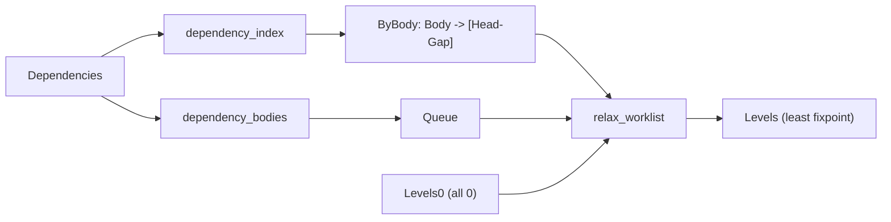

# DL7 indexed stratification worklist

Base SHA `5d37a0a288993a6d58da0e9c42c5a6a47d96f953`. Approved kernel
implementation; algorithm substitution with unchanged stratification semantics.

## Contents

1. [Change](#1-change)
2. [Dataflow](#2-dataflow)
3. [Invariant coverage](#3-invariant-coverage)
4. [Nearest-shadow before/after](#4-nearest-shadow-beforeafter)
5. [2_partial before/after](#5-2_partial-beforeafter)
6. [Call and inference accounting](#6-call-and-inference-accounting)
7. [Exact-output parity](#7-exact-output-parity)
8. [Tests and CI coverage](#8-tests-and-ci-coverage)
9. [Pre-existing failures, not caused by this change](#9-pre-existing-failures-not-caused-by-this-change)
10. [Method and scope](#10-method-and-scope)

## 1. Change

`v7/src/1_libtime/0_evaluator.pl` replaces the repeated full-list relaxation in
`relax_to_fixpoint/3` with a dependency-indexed changed-relation worklist.

Removed:

- `relax_levels/3` (the per-pass full rescan)
- `dependency_requirements/4` (the 292-element `member/2` scan and 76-element
  `memberchk/2` scan per relation per pass)

Added:

```text
dependency_index(+Dependencies,-ByBodyRelation)   assoc Body -> [Head-Gap]
dependency_bodies(+Dependencies,-Queue)           seed: every body relation
relax_worklist(+Queue,+DependencyIndex,+Levels0,-Levels)
  level_index/2, levels_from_index/3, worklist_loop/4, reader_levels/5
```

Index direction follows the relaxation law `level(Head) >= level(Body) + Gap`.
`Levels0` fixes output order; the assoc carries lookup. Output is reconstructed
in input relation order by `levels_from_index/3`, so strata stay deterministic
and independent of worklist scheduling. `library(assoc)` only; no new
collection abstraction, no new kernel relation, no IR/emitter change, no V6
change.

## 2. Dataflow



## 3. Invariant coverage

Nine deterministic tests added beside the existing stratification test in
`v7/test/1_entrypoints.test.pl`. Each pins exact strata/diagnostic terms.

| test | pinned term | result |
| --- | --- | --- |
| `stratification_positive_chain_keeps_one_level` | `a,b,c` all level 0 | pass |
| `stratification_negative_edge_places_head_one_above_body` | `d` 1, `e` 0 | pass |
| `stratification_positive_recursive_scc_terminates_at_one_level` | SCC `p,q` both 1, `s` 0 | pass |
| `stratification_mixed_cycle_keeps_strict_cycle_diagnostic` | `strict_dependency_cycle([left,right])`, no strata | pass |
| `stratification_aggregate_edge_uses_gap_one` | `region_count` 1, `sale` 0 | pass |
| `stratification_index_is_scoped_to_each_rule_set` | A/B/A stable, disjoint relations | pass |
| `stratification_worklist_matches_reference_on_invariant_programs` | new == test-local reference, 5 sets | pass |
| `stratification_worklist_matches_reference_on_nearest_shadow_rules` | new == reference on real rules | pass (0.58 s) |
| `stratification_worklist_matches_reference_on_partial_rules` | new == reference on real rules | pass (1.14 s) |

The reference is the pre-change full-list relaxation copied verbatim into the
test (`reference_relax/3`, `reference_relax_levels/4`). Both real-rule parity
tests finish under the 3 s per-case ceiling, so no saved-term fallback was
needed.

## 4. Nearest-shadow before/after

Untraced bench, fresh process, `v7/bench/0_compiler_performance.pl`.

| metric | before | after | delta |
| --- | ---: | ---: | ---: |
| cold wall_ms | 791 | 546 | -245 |
| cold inferences | 6,388,944 | 3,370,854 | -3,018,090 (-47.2%) |
| warm inferences | 2,148 | 2,148 | 0 |
| compiler rows | 810 | 810 | 0 |
| diagnostics | `[]` | `[]` | 0 |
| cold budget | 16,000,000 | 16,000,000 | within |

Phase summary (untraced, `COMPILE-TRACE`):

| run | source comptime | total |
| --- | ---: | ---: |
| before | 4,714,407 | 6,388,551 |
| after | 2,127,237 | 3,370,461 |

The final source comptime stage falls from `4,714,407` to `2,127,237`
(`-2,587,170`).

## 5. 2_partial before/after

Untraced bench, fresh process.

| metric | before | after | delta |
| --- | ---: | ---: | ---: |
| cold wall_ms | 2,412 | 1,630 | -782 |
| cold inferences | 16,196,538 | 8,013,214 | -8,183,324 (-50.5%) |
| warm inferences | 2,345 | 2,345 | 0 |
| compiler rows | 910 | 910 | 0 |
| closure rounds | 8 | 8 | 0 |
| diagnostics | `[]` | `[]` | 0 |

Phase summary (untraced):

| run | source comptime | total |
| --- | ---: | ---: |
| before | 14,133,739 | 15,908,814 |
| after | 6,423,077 | 7,725,490 |

Both fixtures keep rows, closure rounds, and diagnostics.

## 6. Call and inference accounting

| predicate | before | after |
| --- | ---: | ---: |
| `dependency_requirements/4` calls | 9,636 (whole compile, wrapper; receipt 18 final comptime 8,208) | removed (`grep` over `v7/src` finds no reference) |
| `relax_levels/3` | present | removed |
| `relax_worklist/4` calls | n/a | 12 (whole compile, wrapper), 3,370,901 inferences |
| `relax_to_fixpoint/3` | 131 invocations | unchanged call site, indexed body |

The worklist is invoked once per `stratify_rules` call (macrotime program,
source program, and the checker re-stratifications) rather than once per
relation per pass. Untraced cold inferences are the authoritative figure; the
wrapper total (`3,370,901`) sits within 47 inferences of the untraced bench
(`3,370,854`).

## 7. Exact-output parity

`write_canonical/2` of `rows/1`, `runtime/1`, `diagnostics/1` compared byte for
byte, fresh process, same fixture.

| fixture | sha256 before == after | bytes |
| --- | --- | ---: |
| `7_nearest_shadow.dl7` | `c7d22ab7b22dd4d6b6ca5ff556814608066d48e3` | 296,431 |
| `2_partial.dl7` | `299479f1959cfefecb623226cf987af1c3c35b91` | 388,441 |

Both `cmp` identical. No output or diagnostic difference.

## 8. Tests and CI coverage

| suite | result |
| --- | --- |
| `v7/test/1_entrypoints.test.pl` | 80 cases: 78 pass, 2 pre-existing failures (section 9). Full file exceeds the 20 s shell cap at case 79; cases 79-80 run separately and pass. |
| `v7/test/18_binding_symmetry.test.pl` | 16 pass |
| `v7/test/19_lexical_binding.test.pl` | 10 pass |
| `v7/test/20_compiler_performance.test.pl` | 17 pass |
| nearest-shadow perf gate (bench CLI) | exit 0, within budgets |
| smallest generated-rule test `generated_relations_are_callable_after_declarations_freeze` | pass (0.66 s) |

Coverage change: adds 9 test cases (6 pure stratification invariants, 3
reference-parity). No coverage removed. No performance budget moved or
weakened. The nearest-shadow cold budget stays 16,000,000; measured cold
inference count decreased, so no checkpoint move was needed.

## 9. Pre-existing failures, not caused by this change

Reproduced with the evaluator reverted to base (stashed change), so both predate
this work:

| failure | evidence |
| --- | --- |
| `escaping_partial_bind_generates_a_callable_forwarding_relation` | fails at base and with the change |
| `prolog_and_dl7_emitters_share_the_closed_compiler_view` | fails at base and with the change |
| `2_partial` bench `compiler_row_checkpoint` | bench profile expects 15,562 rows; the fixture compiles to 910 at base and after (`partial_boundaries`/`1_entrypoints` expect 910) |

The `2_partial` checkpoint is a stale bench expectation, unrelated to
stratification; it is left untouched.

## 10. Method and scope

- Untraced bench: `swipl -q -s v7/bench/0_compiler_performance.pl -g main -t
  halt -- <fixture>`, one cold plus one warm compile per process.
- Call counts: `library(prolog_wrap)` wrapper incrementing a dynamic counter
  around the named predicate; inferences from `statistics(inferences, _)`.
- Exact output: `write_canonical/2` capture under
  `/var/folders/.../T/opencode`, `cmp` and `shasum` before/after.
- Every command ran under `timeout 20` or less; one `swipl` process at a time.
- Only `v7/src/1_libtime/0_evaluator.pl`, `v7/test/1_entrypoints.test.pl`, and
  this receipt changed.
