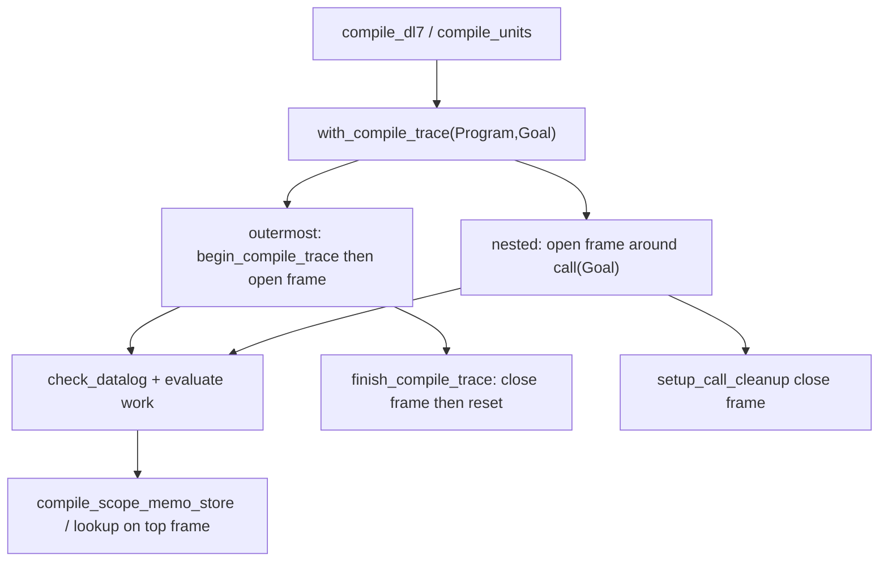

# DL7 compile-scoped stratification memo

Base SHA `af240bb3f4259a3e6115a6fb0dd3d5c56571c2bc`. Approved kernel
implementation; memoization of the pure stratification result with unchanged
strata, diagnostics, ordering, and cleanup.

## Contents

1. [Change](#1-change)
2. [Compile-scope lifecycle](#2-compile-scope-lifecycle)
3. [Cache identity and collision](#3-cache-identity-and-collision)
4. [Nearest-shadow before/after](#4-nearest-shadow-beforeafter)
5. [2_partial before/after](#5-2_partial-beforeafter)
6. [Cache accounting](#6-cache-accounting)
7. [Exact-output parity](#7-exact-output-parity)
8. [Tests and CI coverage](#8-tests-and-ci-coverage)
9. [Pre-existing failures, not caused by this change](#9-pre-existing-failures-not-caused-by-this-change)
10. [Method and scope](#10-method-and-scope)

## 1. Change

`v7/src/1_libtime/0_evaluator.pl` memoizes `stratify_rules_with_dependencies/4`
on the exact checked `Rules` term for one compile scope. The checker
(`check_datalog/4`, `check_resolved_rules/5`) and the evaluator (`evaluate/4`)
each re-stratified the same 120-rule source program before this change.

`v7/src/2_comptime/1b_compiler_tracer.pl` owns the scope-scoped store and the
frame lifetime. It is imported by the evaluator, so no module imports back and
no import cycle is created. The `with_compile_trace/2` `setup_call_cleanup`
boundary, already the only scope spanning the checker and evaluator calls, is
reused; no parallel lifecycle is added.

No new hosted predicate, kernel relation, IR field, emitter change, V6 change,
or budget change.

## 2. Compile-scope lifecycle



Each `with_compile_trace/2` call opens a fresh frame: a monotonically numbered
id pushed on a thread-local stack. Lookup and store read only the top frame, so
a nested compilation cannot read or erase another active compilation's entries,
and popping the inner frame restores the outer frame unchanged. All frame,
entry, and counter state is `thread_local`, so concurrent threads hold disjoint
frames and cannot share entries. The outer begin runs `reset_compile_trace`
first (clearing any frame state) and then opens the frame; the outer finish
closes the frame (retracting that frame's entries and counters) and resets.
`setup_call_cleanup/3` runs the close on success, failure, and exception.

Outside any scope, `stratify_rules_with_dependencies/4` tests
`in_compile_scope/0` and calls the uncached path; it never looks up or stores,
so out-of-scope calls leave no state.

## 3. Cache identity and collision

```text
Key   = stratification(Rules)
Hash  = term_hash(Key)
Value = stratification_result(DerivedStrata, Diagnostics)
store = compile_scope_memo(Frame, Hash, Key, Value)

lookup(Hash, Key, Value) :-
    compile_scope_memo(Frame, Hash, StoredKey, Value),
    StoredKey == Key.
```

The integer `Hash` only selects the bucket through first-argument indexing.
The stored `Key` is retained and compared with `==`, so a forced hash collision
cannot produce a false hit. Differently generated rule sets form a different
`Key` and miss even with overlapping relation names.

## 4. Nearest-shadow before/after

Untraced bench, fresh process, `v7/bench/0_compiler_performance.pl`
(`7_nearest_shadow.dl7`).

| metric | before | after | delta |
| --- | ---: | ---: | ---: |
| cold wall_ms | 542 | 529 | -13 |
| cold inferences | 3,370,854 | 3,133,836 | -237,018 (-7.0%) |
| source comptime inferences | 2,127,237 | 1,896,902 | -230,335 |
| warm inferences | 2,148 | 2,169 | +21 |
| compiler rows | 810 | 810 | 0 |
| diagnostics | `[]` | `[]` | 0 |

Warm output parity holds (bench exit 0). Warm inference budget 5,000; the +21
is frame open/close and reset work on the compilation-cache hit path.

## 5. 2_partial before/after

Untraced cold bench with `DL7_TRACE=collect` for the round count.

| metric | before | after | delta |
| --- | ---: | ---: | ---: |
| cold wall_ms | 1,604 | 1,628 | +24 |
| cold inferences | 8,013,214 | 7,318,113 | -695,101 (-8.7%) |
| source comptime inferences | 6,706,774 | 6,018,356 | -688,418 |
| warm inferences | 2,345 | 2,366 | +21 |
| compiler rows | 910 | 910 | 0 |
| closure rounds | 8 | 8 | 0 |
| diagnostics | `[]` | `[]` | 0 |

## 6. Cache accounting

`library(prolog_wrap)` wrapper counts over one cold compile per fixture. Size
is the number of rules in the exact `Rules` key.

Nearest-shadow:

| rule-set size | hits | misses |
| ---: | ---: | ---: |
| 12 | 3 | 2 |
| 120 | 5 | 2 |

`stratify_rules_with_dependencies/4` calls `12`, unchanged. `relax_worklist/4`
invocations fall from `12` to `4`; the eight hits skip `calc_stratification/4`.

2_partial:

| rule-set size | hits | misses |
| ---: | ---: | ---: |
| 126 | 4 | 2 |
| 127 | 10 | 1 |

`stratify_rules_with_dependencies/4` calls `17`, unchanged. `relax_worklist/4`
invocations fall from `17` to `3`; the fourteen hits skip the relaxation pass.

The identical call counts before and after confirm memoization changes only
whether `calc_stratification/4` runs, not the compiler's control flow.

## 7. Exact-output parity

`write_canonical/2` of `Rows-Runtime-Diagnostics` compared byte for byte,
fresh process, same fixture.

| fixture | sha256 before == after | bytes |
| --- | --- | ---: |
| `7_nearest_shadow.dl7` | `7b6dc5f105d8639e643dd18466bffe9e66aad1f71d1b9308236d4e3c64e54ef7` | 295,527 |
| `2_partial.dl7` | `dc322268e2721ee85a1020725343ed395597b910ab2730b98704e36cccdd6bad` | 385,857 |

Both `cmp` identical. No output, diagnostic, ordering, cleanup, or isolation
difference was observed.

## 8. Tests and CI coverage

Eleven deterministic cases added to `v7/test/1_entrypoints.test.pl` beside the
existing stratification tests, each under 3 s.

| test | pinned result |
| --- | --- |
| `stratification_memo_one_miss_then_hits_for_exact_rules` | 1 miss, 2 hits, 1 entry |
| `stratification_memo_misses_for_different_rules` | 2 misses, exact new strata |
| `stratification_memo_rejects_forced_hash_collision` | forced Hash 0 rejects `KeyB`, 1 miss |
| `stratification_memo_erases_entries_after_success` | scope clear, counters 0 |
| `stratification_memo_erases_entries_after_failure` | scope clear, counters 0 |
| `stratification_memo_erases_entries_after_exception` | scope clear, counters 0 |
| `stratification_memo_nested_scopes_are_isolated` | inner 0 hits/1 miss; outer unchanged then 1 hit |
| `stratification_memo_threads_are_isolated` | parent and child each 0 hits/1 miss |
| `stratification_memo_outside_scope_leaves_no_state` | in-scope first call misses |
| `stratification_memo_matches_pure_output_on_nearest_shadow_rules` | memoized == pure, 1 miss/1 hit |
| `stratification_memo_matches_pure_output_on_partial_rules` | memoized == pure, 1 miss/1 hit |

Commands run, one `swipl` process at a time, each under `timeout 20`:

| suite | result |
| --- | --- |
| 11 new memo cases | 11 pass (max 1.02 s) |
| 10 pre-existing stratification + worklist parity cases | 10 pass |
| smallest generated-rule case `generated_relations_are_callable_after_declarations_freeze` | pass (0.67 s) |
| `v7/test/3_compiler_trace.test.pl` | 3 pass |
| `v7/test/20_compiler_performance.test.pl` | 17 pass |
| `v7/test/18_binding_symmetry.test.pl` | 16 pass |
| `v7/test/19_lexical_binding.test.pl` | 10 pass |
| nearest-shadow perf gate (bench CLI) | exit 0, within budgets |

Coverage change: adds 11 test cases. No coverage removed. No performance budget
moved or weakened. The nearest-shadow cold budget stays 16,000,000 and the warm
budget stays 5,000; measured cold inferences decreased. CI does not enumerate
`1_entrypoints.test.pl`, matching the pre-existing coverage of the receipt 19
stratification tests; no workflow file changed.

## 9. Pre-existing failures, not caused by this change

Reproduced at base and after this change:

| failure | evidence |
| --- | --- |
| `2_partial` bench `compiler_row_checkpoint` | bench profile expects 15,562 rows; the fixture compiles to 910 at base and after (documented in receipt 19). |
| `escaping_partial_bind_generates_a_callable_forwarding_relation` | fails at base and after (documented in receipt 19). |
| `prolog_and_dl7_emitters_share_the_closed_compiler_view` | fails at base and after (documented in receipt 19). |

## 10. Method and scope

- Untraced bench: `swipl -q -s v7/bench/0_compiler_performance.pl -g main -t
  halt -- <fixture>`, one cold plus one warm compile per process.
- Hit/miss and `relax_worklist/4` counts: `library(prolog_wrap)` wrappers around
  `dl7_compiler_tracer:compile_scope_memo_lookup/3`,
  `dl7_evaluator:relax_worklist/4`, and
  `dl7_evaluator:stratify_rules_with_dependencies/4`, with dynamic counters
  reset between fixtures. Before counts were taken with the source change
  stashed.
- Exact output: `write_canonical/2` capture under
  `/var/folders/.../T/opencode/dl7memo`, `cmp` and `shasum` before/after.
- Every command ran under `timeout 20` or less; one `swipl` process at a time.
- Only `v7/src/1_libtime/0_evaluator.pl`,
  `v7/src/2_comptime/1b_compiler_tracer.pl`,
  `v7/test/1_entrypoints.test.pl`, and this receipt changed.
