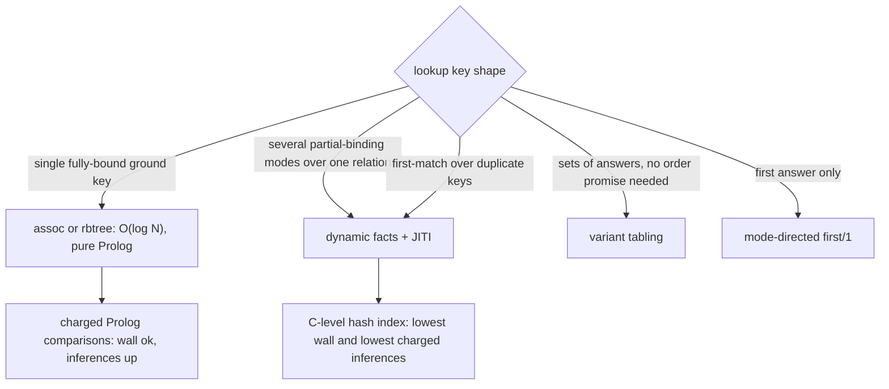

# 45. SWI-Prolog indexed storage lab for DL7 compiler arenas

Date: 2026-09-11. Read-only compiler investigation on branch HEAD
`71c1f8b0ad0d6f4dc7c7afc8a2de51976f2ab084`. SWI-Prolog 10.0.2 arm64-darwin.
No compiler, test, benchmark, workflow, skill, or application file was edited.
No build, commit, push, merge, workflow run, or delegation. Temporary probes
live under `/private/tmp/dl7_lab`. Every command ran one SWI process at a time
under `timeout 20`; every probe finished under 3 s. This receipt answers the
mechanism question behind R42's `compiler_arena` proposal and R43's rejected
origin index. It does not change any compiler behavior. Numbers are in
`45_swi_indexing_storage_lab.json`, which carries the machine-readable copy of
every table here.

## TOC

- [Scope and question](#scope-and-question)
- [Official documentation consulted](#official-documentation-consulted)
- [Dataset and workload](#dataset-and-workload)
- [Mechanism matrix](#mechanism-matrix)
- [JITI evidence](#jiti-evidence)
- [Build once versus rebuild per checker invocation](#build-once-versus-rebuild-per-checker-invocation)
- [Tabling](#tabling)
- [Nearest-shadow replay](#nearest-shadow-replay)
- [Recommendation per collection](#recommendation-per-collection)
- [Stable integer arena IDs](#stable-integer-arena-ids)
- [Smallest implementation slice](#smallest-implementation-slice)
- [Cleanup and memory](#cleanup-and-memory)
- [Measured versus proposed](#measured-versus-proposed)
- [Reproduction](#reproduction)

## Scope and question

R42 proposed one transient `compiler_arena` with position indexes over sorted
arrays. R43 built an `assoc` origin index, preserved output bytes, and rejected
it because charged inferences rose `+30,136`. The open question is which
SWI-native storage and indexing mechanism each compile-lifetime collection
should use, measured rather than assumed, and whether any mechanism removes the
`memberchk/2` scans without raising charged inferences.

The measured collections and their exact accessors:

| Collection | Term shape | Accessor | Observed lookups (nearest-shadow) |
| --- | --- | --- | ---: |
| origin | `origin(edge/3\|goal/2\|rule/1\|seed/1, NodeId)` | `edge_origin/5`, `goal_origin/4`, `rule_origin/3`, `seed_origin/3` | 5,244 |
| reservation | `reservation(Owner, Name, Target, Kind)` | `scoped_reservation/5` | 5,024 |
| pending edge | `pending_edge(Owner, Name, Target, Index)` | `resolve_name/6`, `callable_slot/4` | 5,308 |
| relation | `relation(Ref, Arity, KeySets)` | `relation_stratum/2`, `expression_reserved_callable/4` | 114..134 |
| stratum | `stratum(Relation, Level)` | `relation_level/3`, `relation_stratum/2` | 18,921 |
| evaluator lower rows | `evaluation_lower_index/7` | `evaluation_lower/3` | per `evaluate/4` scope |

All origin, reservation, pending-edge, and stratum accessors are
`memberchk(+Key, +List)` with first-list-match behavior and, for the origin
family, a `none` fallback. `relation_level/3` falls back to level `0`.

## Official documentation consulted

| Mechanism | Official URL |
| --- | --- |
| JITI utilities | https://www.swi-prolog.org/pldoc/man?section=prologjiti |
| `jiti_list/1` | https://www.swi-prolog.org/pldoc/man?predicate=jiti_list/1 |
| `predicate_property/2` | https://www.swi-prolog.org/pldoc/man?predicate=predicate_property/2 |
| `assertz/1`, dynamic predicates | https://www.swi-prolog.org/pldoc/man?predicate=assertz/1 |
| `dynamic/1` | https://www.swi-prolog.org/pldoc/man?predicate=dynamic/1 |
| `mode/1` declaration | https://www.swi-prolog.org/pldoc/man?predicate=mode/1 |
| `compile_predicates/1` | https://www.swi-prolog.org/pldoc/man?predicate=compile_predicates/1 |
| `retractall/1` | https://www.swi-prolog.org/pldoc/man?predicate=retractall/1 |
| `library(assoc)` AVL | https://www.swi-prolog.org/pldoc/man?section=assoc |
| `get_assoc/3` | https://www.swi-prolog.org/pldoc/man?predicate=get_assoc/3 |
| `library(rbtrees)` | https://www.swi-prolog.org/pldoc/man?section=rbtrees |
| `rb_lookup/3` | https://www.swi-prolog.org/pldoc/man?predicate=rb_lookup/3 |
| `library(dicts)` | https://www.swi-prolog.org/pldoc/man?section=dicts |
| `get_dict/3` | https://www.swi-prolog.org/pldoc/man?predicate=get_dict/3 |
| `library(record)` | https://www.swi-prolog.org/pldoc/man?section=record |
| recorded database `recorded/3` | https://www.swi-prolog.org/pldoc/man?predicate=recorded/3 |
| `erase/1` | https://www.swi-prolog.org/pldoc/man?predicate=erase/1 |
| global variables `nb_setval/2` | https://www.swi-prolog.org/pldoc/man?predicate=nb_setval/2 |
| `transaction/1` | https://www.swi-prolog.org/pldoc/man?predicate=transaction/1 |
| tabling chapter | https://www.swi-prolog.org/pldoc/man?section=tabling |
| mode-directed tabling | https://www.swi-prolog.org/pldoc/man?section=tabling-mode-directed |
| variant and subsumptive tabling | https://www.swi-prolog.org/pldoc/man?section=tabling-subsumptive |
| incremental tabling | https://www.swi-prolog.org/pldoc/man?section=tabling-incremental |
| monotonic tabling | https://www.swi-prolog.org/pldoc/man?section=tabling-monotonic |
| `abolish_all_tables/0` | https://www.swi-prolog.org/pldoc/man?predicate=abolish_all_tables/0 |
| `table_statistics/2` | https://www.swi-prolog.org/pldoc/man?predicate=table_statistics/2 |
| `term_hash/2` | https://www.swi-prolog.org/pldoc/man?predicate=term_hash/2 |

Documented claims that matter here:

- `jiti_list/1` lists realised JITI indexes; the `Indexed` column can be a deep
  index `P:L` such as `1/2:2+3`, and `Speedup` is selectivity. `jiti_suggest_modes`
  reports arguments never called instantiated, and `mode/1` suppresses indexing
  on a declared `-` argument.
- `library(assoc)` keys must be ground, `list_to_assoc/2` rejects duplicate
  keys, and fetch/insert are O(log N) AVL. `library(rbtrees)` is the same shape.
- Tabling memoizes answers and is suited to a static world; variant tabling
  makes no ordering guarantee for a generator, and mode-directed `first/1` keeps
  the first answer. Incremental tabling maintains tables over `incremental`
  dynamic predicates by invalidating dependent tables; monotonic tabling
  propagates new answers. Both are for a changing world, which is not the
  compile-lifetime read pattern here.
- The recorded database hashes the first argument; `recorded/3` is
  semi-deterministic only when the reference is given. `retractall/1` does not
  remove recorded terms; `erase/1` does.
- `library(tries)` does not resolve in this install and
  `current_predicate(tries:trie_new/1)` is false. Tries are an internal tabling
  structure with no public library surface here, so they are not a candidate.

## Dataset and workload

Deterministic DL7-shaped data at nearest-shadow cardinalities, ground terms with
first-match duplicate keys inserted before their originals so a last-wins
normalization would fail the checksum:

| Quantity | Value |
| --- | ---: |
| origins (edge/3, goal/2, rule/1) | 1,124 |
| duplicate origin keys | 48 |
| pending edges | 484 |
| reservations | 684 |
| relations | 114..134 |
| strata | 140 (134 required) |
| lookups | 34,497 |
| warmup lookups before timing | 64 |
| `none` results | 0 |
| baseline checksum (`sum term_hash(Result)`) | 75,393,311,983,764 |

Lookup mix, matching R43's attribution: 4,166 edge-origin, 642 goal-origin, 436
rule-origin, 3,560 pending-edge by `(Owner,Name)`, 1,748 pending-edge by
`(Callable,Index)`, 5,024 reservation by `(Owner,Name)`, 18,921 stratum by
relation.

## Mechanism matrix

One fresh process per mechanism, work after a 64-lookup warmup, checksum over
the same workload. `checksum` equal to baseline means first-list-match and
`none` fallback were reproduced exactly.

| Mechanism | Build ms | Build inf | Lookup ms | Lookup inf | Checksum | First-match |
| --- | ---: | ---: | ---: | ---: | --- | --- |
| linear list `memberchk/2` | 1 | 11,707 | 246 | 311,365 | 75,393,311,983,764 | yes |
| dynamic facts + JITI | 2 | 4,875 | 35 | 242,371 | 75,393,311,983,764 | yes |
| `library(assoc)` AVL | 33 | 27,553 | 42 | 345,862 | 75,393,311,983,764 | yes |
| `library(rbtrees)` | 44 | 208,525 | 69 | 1,093,827 | 75,393,311,983,764 | yes |
| dict + integer `term_hash` key + bucket | 50 | 42,040 | 41 | 413,969 | 75,393,311,983,764 | yes |
| recorded database | 1 | 4,875 | 643 | 276,868 | 75,393,311,983,764 | yes |
| variant tabling `once/1` | 2 | 4,875 | 68 | 501,779 | 75,002,755,859,694 | no |
| mode-directed `table ... first/1` | 2 | 4,875 | 54 | 533,370 | 75,393,311,983,764 | yes |
| `library(tries)` | n/a | n/a | n/a | n/a | n/a | unavailable |

Readings:

- `memberchk/2` hides its scan in C. 34,497 lookups scan about 6.3M list cells
  yet charge only 311,365 inferences, because the loop is not charged; wall is
  highest at 246 ms. This is why R43 saw a wall win from `assoc` and an
  inference loss.
- JITI dynamic facts win on both axes: 35 ms wall and 242,371 inferences, the
  lowest of any available mechanism. The index lives in C, so the lookup is
  cheap in wall and in charged inferences.
- `assoc` and `rbtree` are pure Prolog, so every AVL comparison is charged;
  `rbtree` is worst at 1.09M lookups inferences and 208k build inferences.
- A dict needs an atom or integer key; compound DL7 keys need `term_hash` plus an
  exact re-unification bucket, which keeps first-match but adds 414k inferences.
- Recorded database lookup is bucketed but enumerates; 643 ms.
- Variant tabling is the only mechanism that fails the checksum: `once/1` over
  a variant table does not reproduce first-list-match on duplicate keys. The
  documented absence of ordering guarantees is visible. Mode-directed `first/1`
  reproduces the baseline exactly.



## JITI evidence

After warmup, `predicate_property/2` reported realised hash indexes on the
dynamic facts, for example:

- `origin_fact/2`, argument 1 deep index: 256 buckets, 16 collisions, speedup
  156.0; then 512 buckets, 0 collisions, speedup 436.0.
- `edge_fact/4`: an argument 4 index with 512 buckets, 27 collisions, speedup
  484.0, plus a `1+1` position index, speedup 39.0.
- `stratum_fact/2`: 256 buckets, 7 collisions, speedup 111.9.

`jiti_list/1` is the documented inspection predicate for the same data.
`mode/1` is available to suppress indexing on `-` arguments; `compile_predicates/1`
is available if a built store is switched to static, though the store here is
built at runtime.

## Build once versus rebuild per checker invocation

Nine checker invocations model R42's 9 nearest-shadow checker inputs across the
repeated rounds. Reuse builds the store once; rebuild rebuilds before each of the
nine passes. Checksums are stable and identical in every cell.

Reuse, build once then 9 passes (wall ms / charged inferences):

| Mechanism | Build ms | Build inf | Pass ms | Pass inf |
| --- | ---: | ---: | ---: | ---: |
| linear list | 1 | 11,708 | 2,237 | 2,795,190 |
| dynamic facts + JITI | 2 | 4,876 | 303 | 2,174,243 |
| `library(assoc)` | 33 | 27,554 | 366 | 3,105,663 |
| recorded | 1 | 4,876 | 5,878 | 2,484,717 |

Rebuild before each of 9 passes (total wall ms / total charged inferences):

| Mechanism | Total ms | Total inf |
| --- | ---: | ---: |
| linear list | 2,213 | 2,900,562 |
| dynamic facts + JITI | 335 | 2,218,119 |
| `library(assoc)` | 666 | 3,352,393 |
| dict + hash key | 766 | 4,095,714 |
| mode-directed `first/1` | 524 | 4,851,194 |

JITI stays cheapest in both lifetimes. Its rebuild cost is small because 2,432
`assertz/1` calls are C-level (about 3 ms per rebuild); the list scan pays every
pass because the Origins list is re-walked by every checker invocation. The
lifetime finding: build once per compile and reuse, but even a per-invocation
rebuild beats the current linear scan.

## Tabling

| Variant | Preserves first-match | Checksum | Lookup inf | Relevant to compile lifetime |
| --- | --- | --- | ---: | --- |
| variant `:- table p/2` | no | mismatch | 501,779 | no, ordering not guaranteed |
| mode-directed `first/1` | yes | match | 533,370 | no, static data is better as indexed facts |
| incremental tabling | n/a | n/a | n/a | no, tables change only across rounds |
| monotonic tabling | n/a | n/a | n/a | no, this store shrinks per compile, not grows monotonically |

Incremental and monotonic tabling maintain a table as dynamic source predicates
change. The compile-lifetime collections are written once per compile and read;
they do not change under a live table. They are the wrong tool, and the shared
tabling path is already used for `proves/2` where the answers are derived.

## Nearest-shadow replay

Temporary `library(prolog_wrap)` wrappers around `edge_origin/5`,
`goal_origin/4`, and `rule_origin/3`, out of tree, no source edit. Baseline is a
fresh process, cold cache. Output is `write_canonical(Rows)` hashed with
SHA-256.

| Run | Rows | Diagnostics | Wall ms | Inferences | Delta inf | Hash |
| --- | ---: | ---: | ---: | ---: | ---: | --- |
| baseline list | 810 | 0 | 445 | 1,899,632 | 0 | `90f67cb2...a0ba87` |
| JITI wrapper | 810 | 0 | 920 | 1,919,822 | +20,190 | `90f67cb2...a0ba87` |
| assoc wrapper (hash key) | 810 | 0 | 1,476 | 1,938,762 | +39,130 | `90f67cb2...a0ba87` |

The JITI wrapper installs facts once per distinct `Origins` and queries the
realised index. Every wrapper preserves the exact output hash. Wall is higher
for both candidates because `prolog_wrap` adds an interpreter call per lookup
and the index is rebuilt per distinct `Origins` rather than threaded. R43's
threaded candidate is the fair origin-replacement comparison: wall 333.16 ms
against baseline 411.30 ms, but `+30,136` inferences, rejected by the inference
budget gate.

Replay conclusion: a per-call wrapper is not the way to install the index. The
microbench says the mechanism is right; the placement (threaded store built once
at the compile boundary) decides whether the inference budget moves. Rebuilding
or re-wrapping per call reintroduces cost that the threaded design removes.

## Recommendation per collection

| Collection | Recommended mechanism | Signature | Supported modes |
| --- | --- | --- | --- |
| origin | dynamic facts + JITI, built once | `arena_origin(?Kind, ?NodeId)` | `(+,-)` det with `none`; `(-,-)` enumeration |
| reservation | dynamic facts + JITI, recursion kept | `arena_reservation(?OwnerId, ?NameId, ?TargetId, ?KindId)` | `(+Owner,+Name,-Reservation)` det |
| pending edge | dynamic facts + JITI, multi-argument index | `arena_edge(?OwnerId, ?NameId, ?TargetId, ?Index)` | `(+Owner,+Name,-Target)` det; `(+Target,+Index,-Candidate)` det |
| relation | dynamic facts + JITI (assoc also viable for one bound key) | `arena_relation(?RefId, ?Arity, ?KeySets)` | `(+Ref,-Arity,-KeySets)` det |
| stratum | dynamic facts + JITI | `arena_stratum(?Relation, ?Level)` | `(+Relation,-Level)` det, `0` default |
| evaluator lower | keep dynamic index; one arena argument-vector id instead of four `term_hash` positions | `evaluation_lower_index/7` | keep existing nondet modes |

`arena_*` facts are built in source list order with `assertz/1` so the first
solution is the first list match. JITI supplies the mode-specific index after
warmup. `seed_origin/3` has no nearest-shadow calls, so its fact family is built
by the same boundary hook when seeds exist.

## Stable integer arena IDs

Atoms are globally interned, so an atom key already has O(1) identity and needs
no arena id. Ground compound terms are not hash-consed: `owner(...)`,
`ref(...)`, `relation(...)`, and `KeySets` are re-traversed and re-hashed at
every equality test and every JITI index probe. Dense integer arena ids help
there. They give O(1) identity, shrink each stored clause, and turn a JITI
first-argument index into an integer bucket. Structural terms still require
hashing where no arena slot exists, which in practice is the evaluator argument
vector (`index_argument_hashes/5`); keeping the stored full term and unifying
exactly preserves the existing collision-rejection contract.

## Smallest implementation slice

```prolog
% boundary hooks, mirroring open_lower_store/close_lower_store
open_compile_arena  :- ... assertz(arena_stratum(Relation, Level)) ... .
close_compile_arena :- retractall(arena_stratum(_, _)).

% one collection, highest call count (18,921)
arena_stratum(?Relation, ?Level)   % facts; (+Relation,-Level) det
relation_level(Strata_ignored, Relation, Level) :-
    ( arena_stratum(Relation, L) -> Level = L ; Level = 0 ).
```

Wrap the compile-trace boundary with `setup_call_cleanup(open_compile_arena, ...,
close_compile_arena)` so the facts are torn down at the owning boundary. Phase
boundary terms `basement_program/2`, `checked_datalog/4`, and
`generated_program/4` are unchanged. Start with the stratum collection because it
has the most calls and a single key shape, then add origin, pending edge, and
reservation behind the same boundary. Rebuild once per compile, not per checker
invocation.

## Cleanup and memory

| Store | Cleanup | Residue after cleanup |
| --- | --- | --- |
| JITI dynamic facts | `retractall` on the fact predicates | 1,000 clauses to 0 |
| tabled predicates | `abolish_all_tables/0` | 3 tables to 0 |
| recorded database | `erase/1` per reference | `retractall/1` leaves 100 terms |

Max RSS, one process each: list 20,168,704 B; JITI 20,643,840 B; assoc
19,939,328 B; rbtree 23,314,432 B. JITI adds about 0.5 MB over the list because
it duplicates the origins as facts; rbtree adds about 3.3 MB. Neither is a
constraint at these cardinalities.

## Measured versus proposed

Measured: the mechanism matrix, build and lookup cost, JITI index properties,
the reuse and rebuild lifetimes, the tabling checksum behavior, the wrapper
replay hash and inference deltas, cleanup residue, and RSS. Proposed: the
per-collection recommendation, the integer-id argument, and the stratum slice.
Not measured: the inference delta of a threaded stratum arena in the real
compiler, the compile-time cost of assigning arena ids in the lowerer, and
cross-repo fan-out. No kernel, type, binding, phase-boundary, or compiler
semantic change is proposed or required.

## Reproduction

```bash
cd v7
timeout 20 swipl -q -s /private/tmp/dl7_lab/lab.pl -g "lab:main([jiti])" -t halt
timeout 20 swipl -q -s /private/tmp/dl7_lab/lab.pl -s /private/tmp/dl7_lab/lifetime.pl \
    -g "lifetime:run(jiti,9)" -t halt
timeout 20 swipl -q -s /private/tmp/dl7_lab/lab.pl -s /private/tmp/dl7_lab/lifetime.pl \
    -g "lifetime:run_rebuild(jiti,9)" -t halt
timeout 20 swipl -q -s /private/tmp/dl7_lab/replay.pl \
    -g "consult('v7/src/2_comptime/2_compiler.pl'),replay:main" -t halt
timeout 20 swipl -q -s /private/tmp/dl7_lab/replay.pl \
    -g "consult('v7/src/2_comptime/2_compiler.pl'),replay:install_wrappers_jiti,replay:main" -t halt
timeout 20 swipl -q -s /private/tmp/dl7_lab/lab.pl -s /private/tmp/dl7_lab/cleanup.pl \
    -g "cleanup:run" -t halt
```
