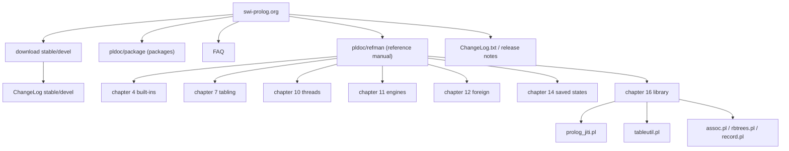
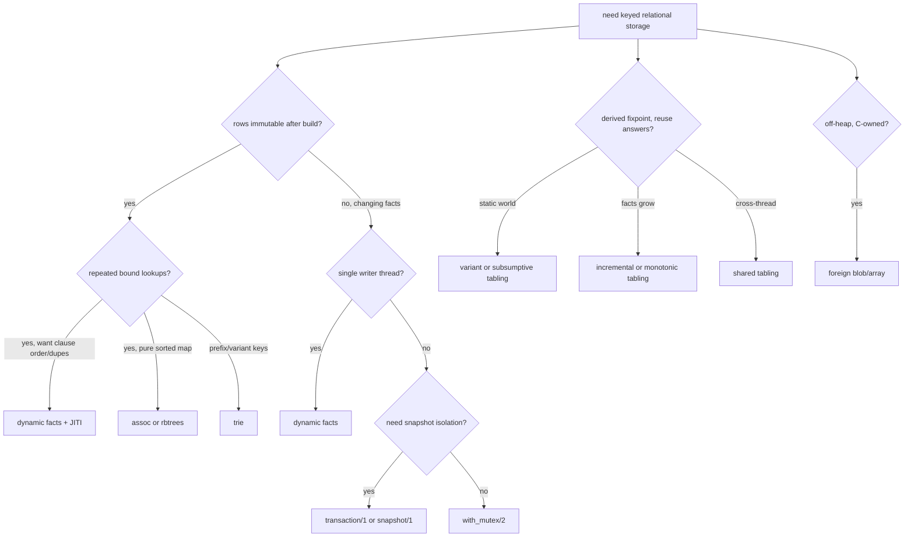

# SWI-Prolog official documentation capability map

Research date: 2026-09-11. Official sources only; see [Source inventory](#18-source-inventory).
Local validation host: SWI-Prolog 10.0.2, arm64-darwin (`swipl --version`).

## Contents

1. [Scope, method, evidence labels](#1-scope-method-evidence-labels)
2. [Version verification](#2-version-verification)
3. [Documentation surface inventory](#3-documentation-surface-inventory)
4. [Execution contracts](#4-execution-contracts)
5. [Clause indexing](#5-clause-indexing)
6. [Dynamic predicates, update view, transactions, clause refs](#6-dynamic-predicates-update-view-transactions-clause-refs)
7. [Database stores](#7-database-stores)
8. [Concurrency: threads, messages, mutexes, engines](#8-concurrency-threads-messages-mutexes-engines)
9. [Attributed variables, coroutining, constraints, DCG](#9-attributed-variables-coroutining-constraints-dcg)
10. [Tabling](#10-tabling)
11. [Memory, stacks, garbage collection](#11-memory-stacks-garbage-collection)
12. [Statistics, profiling, tracing, determinism checks](#12-statistics-profiling-tracing-determinism-checks)
13. [Foreign interface, saved states, compiler flags](#13-foreign-interface-saved-states-compiler-flags)
14. [Per-mechanism contract summary](#14-per-mechanism-contract-summary)
15. [Decision matrix](#15-decision-matrix)
16. [Runnable examples](#16-runnable-examples)
17. [Ambiguities, conflicts, documentation gaps](#17-ambiguities-conflicts-documentation-gaps)
18. [Source inventory](#18-source-inventory)
19. [Skill deltas](#19-skill-deltas)

---

## 1. Scope, method, evidence labels

Coverage: official SWI-Prolog reference manual, package/library pages generated by PlDoc, official release/download pages, and official ChangeLog. Third-party material was not used to establish behavior. No repository or skill file was edited: only this report was written.

Evidence labels used inline:

| Label | Meaning |
| --- | --- |
| documented | Stated in an official manual, library, or release page. |
| measured | Observed on the local validation host (SWI-Prolog 10.0.2 arm64-darwin) on 2026-09-11. |
| inferred | Conclusion drawn from two or more documented statements, not stated as such. |

The parenthetical version/date marker on each citation is the version that served the page at research time: the `pldoc/refman` pages render under the running version, which the site footer reported as 10.1.14; the release pages explicitly name 10.0.2 (stable) and 10.1.14 (development).

---

## 2. Version verification

| Channel | Version | Artifact | Evidence | URL |
| --- | --- | --- | --- | --- |
| Stable | 10.0.2 (binary 10.0.2-1) | source `swipl-10.0.2.tar.gz`; PDF `SWI-Prolog-10.0.2.pdf`; Windows/macOS binaries | documented. Page states "SWI-Prolog 10.0 is the latest stable release"; artifact names carry 10.0.2. | [download/stable](https://www.swi-prolog.org/download/stable) |
| Stable ChangeLog | 10.0.2 | top entry `[Mar 14 2026]`; section 10.0 "Improvements in clause indexing and compilation results in a 10-30% performance improvement" | documented | [ChangeLog?branch=stable](https://www.swi-prolog.org/ChangeLog?branch=stable) |
| Development | 10.1.14 (binary 10.1.14-1) | source `swipl-10.1.14.tar.gz`; PDF `SWI-Prolog-10.1.14.pdf` | documented. Page is the devel download page; artifact names carry 10.1.14. | [download/devel](https://www.swi-prolog.org/download/devel) |
| Development ChangeLog | from 10.1.13 to 10.1.14 | top entry `[Aug 29 2026]` | documented | [ChangeLog?branch=development](https://www.swi-prolog.org/ChangeLog?branch=development) |
| Development Git | `swipl-devel` | `git clone --recurse-submodules https://github.com/SWI-Prolog/swipl-devel.git` | documented | [github.com/SWI-Prolog/swipl-devel](https://github.com/SWI-Prolog/swipl-devel) |

Notes:
- The documentation site itself ran 10.1.14 on 2026-09-11 (footer of every PlDoc page).
- Local validation host is the stable channel, 10.0.2. Examples validated there, so any feature that is development-only is marked inline.
- 10.0 highlights relevant to this report, quoted from the stable download page: native GUI, 64-bit Prolog data on 32-bit platforms, faster WASM, clause-indexing and compilation 10-30% improvement, JSON Schema/RPC. ([download/stable](https://www.swi-prolog.org/download/stable))
- Saved states are machine-independent in format but not cross-word-size: "32-bit compiled code does not run on the 64-bit emulator, nor the other way around." ([section 14.2](https://www.swi-prolog.org/pldoc/man?section=saved-states))
- The Prolog flag `portable_vmi` (default true) targets saved states and `.qlf` files that run on both 32-bit and 64-bit hardware. ([flags](https://www.swi-prolog.org/pldoc/man?section=flags))

---

## 3. Documentation surface inventory

### 3.1 Manual chapters

| # | Chapter | URL | Routing note |
| --- | --- | --- | --- |
| 1 | Introduction | [section=intro](https://www.swi-prolog.org/pldoc/man?section=intro) | Positioning, status/releases, implementation history. |
| 2 | Overview | [section=overview](https://www.swi-prolog.org/pldoc/man?section=overview) | Startup, flags, hooks, syntax, cyclic terms, JITI, system limits. |
| 3 | Initialising and Managing a Project | [section=IDE](https://www.swi-prolog.org/pldoc/man?section=IDE) | Project layout, load, dependencies. |
| 4 | Built-in Predicates | [section=builtin](https://www.swi-prolog.org/pldoc/man?section=builtin) | Core language: unification, control, meta-call, DB, I/O, stats, GC. |
| 5 | SWI-Prolog extensions | [section=extensions](https://www.swi-prolog.org/pldoc/man?section=extensions) | Strings, dicts, SSU, syntax changes. |
| 6 | Modules | [section=modules](https://www.swi-prolog.org/pldoc/man?section=modules) | Module primitives, meta-predicate, dynamic modules. |
| 7 | Tabled execution | [section=tabling](https://www.swi-prolog.org/pldoc/man?section=tabling) | SLG, subsumption, WFS, incremental, monotonic, shared, restraints. |
| 8 | Constraint Logic Programming | [section=clp](https://www.swi-prolog.org/pldoc/man?section=clp) | Attributed variables, coroutining; solver libraries. |
| 9 | CHR | [section=chr](https://www.swi-prolog.org/pldoc/man?section=chr) | Constraint Handling Rules. |
| 10 | Multithreaded applications | [section=threads](https://www.swi-prolog.org/pldoc/man?section=threads) | Threads, queues, blackboard waits, synchronisation. |
| 11 | Prolog engines | [section=engines](https://www.swi-prolog.org/pldoc/man?section=engines) | Interactors, delimited continuations alternative. |
| 12 | Foreign Language Interface | [section=foreign](https://www.swi-prolog.org/pldoc/man?section=foreign) | C API, blobs, embedding, streams. |
| 13 | WASM | [section=wasm-version](https://www.swi-prolog.org/pldoc/man?section=wasm-version) | Browser build. |
| 14 | Deploying applications | [section=runtime](https://www.swi-prolog.org/pldoc/man?section=runtime) | Saved states, resources, obfuscation. |
| 15 | Packs | [section=packs](https://www.swi-prolog.org/pldoc/man?section=packs) | Community add-ons. |
| 16 | The SWI-Prolog library | [section=libpl](https://www.swi-prolog.org/pldoc/man?section=libpl) | Standard libraries. |
| 17 | Hackers corner | [section=hack](https://www.swi-prolog.org/pldoc/man?section=hack) | Internals, `swipl-ld`, build. |
| 18 | Compatibility | [section=dialect](https://www.swi-prolog.org/pldoc/man?section=dialect) | Other Prolog dialects. |
| 19 | Glossary | [section=glossary](https://www.swi-prolog.org/pldoc/man?section=glossary) | Terminology. |
| 20 | License | [section=license](https://www.swi-prolog.org/pldoc/man?section=license) | License and tools. |
| 21 | Summary | [section=summary](https://www.swi-prolog.org/pldoc/man?section=summary) | Full predicate/operator index. |
| 22 | Bibliography | [section=bibliography](https://www.swi-prolog.org/pldoc/man?section=bibliography) | References cited by the manual. |

### 3.2 Chapter 4 sub-sections relevant to execution and performance

| Section | URL | Routing note |
| --- | --- | --- |
| Predicate descriptions, modes, determinism | [section=preddesc](https://www.swi-prolog.org/pldoc/man?section=preddesc), [section=determinism](https://www.swi-prolog.org/pldoc/man?section=determinism) | `det`/`semidet`/`nondet`/`multi` and choicepoint meaning. |
| Loading source | [section=consulting](https://www.swi-prolog.org/pldoc/man?section=consulting) | `load_files/2`, reloading, QLF. |
| QLF quick-load | [section=qlf](https://www.swi-prolog.org/pldoc/man?section=qlf) | Compiled file format and `qcompile`. |
| Type tests | [section=typetest](https://www.swi-prolog.org/pldoc/man?section=typetest) | `var/nonvar/ground/acyclic_term`, etc. |
| Comparison and unification | [section=compare](https://www.swi-prolog.org/pldoc/man?section=compare) | `=/2`, `==/2`, `=@=/2`, `subsumes_term/2`, standard order. |
| Control | [section=control](https://www.swi-prolog.org/pldoc/man?section=control) | `!`, `;/2`, `->/2`, `*->/2`, `\+/1`, `repeat/0`. |
| Meta-call | [section=metacall](https://www.swi-prolog.org/pldoc/man?section=metacall) | `call/[1..]`, `once/1`, `ignore/1`, limits, `setup_call_cleanup/3`. |
| Delimited continuations | [section=delcont](https://www.swi-prolog.org/pldoc/man?section=delcont) | `reset/3`, `shift/1`, `call_delimited`. |
| Exception handling | [section=exception](https://www.swi-prolog.org/pldoc/man?section=exception) | Exception term shape, unwind, urgency. |
| DCG | [section=DCG](https://www.swi-prolog.org/pldoc/man?section=DCG) | `-->`, `phrase/2,3`, `call_dcg/3`. |
| Database | [section=db](https://www.swi-prolog.org/pldoc/man?section=db) | Dynamic predicates, recorded DB, flags, tries. |
| Managing dynamic predicates | [section=dynpreds](https://www.swi-prolog.org/pldoc/man?section=dynpreds) | `asserta/z`, `retract`, `retractall`, `abolish`. |
| Indexing databases | [section=hashterm](https://www.swi-prolog.org/pldoc/man?section=hashterm) | `term_hash/2,4`, `variant_sha1/2`, `variant_hash/2`. |
| Transactions | [section=transactions](https://www.swi-prolog.org/pldoc/man?section=transactions) | `transaction/1,2,3`, `snapshot/1`, `transaction_updates/1`. |
| Recorded database | [section=recdb](https://www.swi-prolog.org/pldoc/man?section=recdb) | `recorda/z`, `recorded`, `erase`, `instance`. |
| Flags | [section=flag](https://www.swi-prolog.org/pldoc/man?section=flag) | `flag/3` global counters; not Prolog flags. |
| Tries | [section=trie](https://www.swi-prolog.org/pldoc/man?section=trie) | `trie_new` through `trie_property`. |
| Declaring properties | [section=declare](https://www.swi-prolog.org/pldoc/man?section=declare) | `dynamic/1,2`, `mode/1`, `compile_predicates/1`, `multifile`, `volatile`. |
| Examining the program | [section=examineprog](https://www.swi-prolog.org/pldoc/man?section=examineprog) | `predicate_property/2`, `clause/2,3`, `clause_property/2`, `nth_clause/3`. |
| Debugging | [section=debugger](https://www.swi-prolog.org/pldoc/man?section=debugger) | Tracer predicates and leashing. |
| Determinism declarations | [section=debug-determinism](https://www.swi-prolog.org/pldoc/man?section=debug-determinism) | `det/1`, `$/0`, `$/1`, `determinism_error`. |
| Runtime statistics | [section=builtin-statistics](https://www.swi-prolog.org/pldoc/man?section=builtin-statistics) | `statistics/2`. |
| Profiling | [section=profile](https://www.swi-prolog.org/pldoc/man?section=profile), [section=prologprofile](https://www.swi-prolog.org/pldoc/man?section=prologprofile) | `profile/1,2`, `profile_data/1`, `show_profile/1`. |
| Memory | [section=memory](https://www.swi-prolog.org/pldoc/man?section=memory), [section=gc](https://www.swi-prolog.org/pldoc/man?section=gc) | GC, stacks, malloc, TCMalloc. |

### 3.3 Overview sub-sections relevant to performance

| Section | URL | Routing note |
| --- | --- | --- |
| Prolog flags | [section=flags](https://www.swi-prolog.org/pldoc/man?section=flags) | `current_prolog_flag/2`, `set_prolog_flag/2`, `create_prolog_flag/3`, `push/pop_prolog_flag`. |
| Hook predicates | [section=hooks](https://www.swi-prolog.org/pldoc/man?section=hooks) | `prolog_trace_interception/4`, `prolog_listen/2`, `message_hook/3`, expansion hooks. |
| Just-in-time clause indexing | [section=jitindex](https://www.swi-prolog.org/pldoc/man?section=jitindex) | Clause-selection algorithm and lifecycle. |
| Deep indexing | [section=deep-indexing](https://www.swi-prolog.org/pldoc/man?section=deep-indexing) | Index inside compound arguments, depth limit 7. |
| Indexing for body code | [section=indexbody](https://www.swi-prolog.org/pldoc/man?section=indexbody) | Head unification moved from body. |
| System limits | [section=limits](https://www.swi-prolog.org/pldoc/man?section=limits) | Stack and memory limits. |
| Command line | [section=cmdline](https://www.swi-prolog.org/pldoc/man?section=cmdline) | `-O`, `-c`, `-o`, `-g`, `-t`, `-x`, `--stack-limit`, `--no-threads`, `--no-signals`, `-Dsource`, `--no-debug`, `--foreign`. |

### 3.4 Tabling sub-sections

| Section | URL |
| --- | --- |
| Overview | [section=tabling](https://www.swi-prolog.org/pldoc/man?section=tabling) |
| Memoizing example | [section=tabling-memoize](https://www.swi-prolog.org/pldoc/man?section=tabling-memoize) |
| Non-termination example | [section=tabling-non-termination](https://www.swi-prolog.org/pldoc/man?section=tabling-non-termination) |
| Mode-directed / answer subsumption | [section=tabling-mode-directed](https://www.swi-prolog.org/pldoc/man?section=tabling-mode-directed) |
| Impure programs | [section=tnotpure](https://www.swi-prolog.org/pldoc/man?section=tnotpure) |
| Variant vs subsumptive | [section=tabling-subsumptive](https://www.swi-prolog.org/pldoc/man?section=tabling-subsumptive) |
| Well Founded Semantics | [section=WFS](https://www.swi-prolog.org/pldoc/man?section=WFS) |
| Incremental | [section=tabling-incremental](https://www.swi-prolog.org/pldoc/man?section=tabling-incremental) |
| Monotonic | [section=tabling-monotonic](https://www.swi-prolog.org/pldoc/man?section=tabling-monotonic) |
| Shared | [section=tabling-shared](https://www.swi-prolog.org/pldoc/man?section=tabling-shared) |
| Constraints | [section=tabling-constraints](https://www.swi-prolog.org/pldoc/man?section=tabling-constraints) |
| Restraints / tripwires | [section=tabling-restraints](https://www.swi-prolog.org/pldoc/man?section=tabling-restraints) |
| Predicate reference | [section=tabling-preds](https://www.swi-prolog.org/pldoc/man?section=tabling-preds) |
| Implementation | [section=tabling-about](https://www.swi-prolog.org/pldoc/man?section=tabling-about) |

### 3.5 Library pages used

| Library | URL | Note |
| --- | --- | --- |
| `library(prolog_jiti)` | [prolog_jiti.pl](https://www.swi-prolog.org/pldoc/doc/_SWI_/library/prolog_jiti.pl), [section=prologjiti](https://www.swi-prolog.org/pldoc/man?section=prologjiti) | `jiti_list/0,1`, `jiti_suggest_modes/0,1`. |
| `library(tableutil)` | [tableutil.pl](https://www.swi-prolog.org/pldoc/doc/_SWI_/library/tableutil.pl), [section=tableutil](https://www.swi-prolog.org/pldoc/man?section=tableutil) | `table_statistics`, `tdump`, `tidg`, `tstat`. |
| `library(prolog_profile)` | [section=prologprofile](https://www.swi-prolog.org/pldoc/man?section=prologprofile) | `profile/1,2`, `show_profile/1`, `profile_data/1`. |
| `library(prolog_wrap)` | [section=statistics](https://www.swi-prolog.org/pldoc/man?section=statistics) | Named in the performance skill; official manual page not located under that anchor during this pass, marked a gap in [section 17](#17-ambiguities-conflicts-documentation-gaps). |
| `library(assoc)` | [assoc.pl](https://www.swi-prolog.org/pldoc/doc/_SWI_/library/assoc.pl) | AVL tree key-value store. |
| `library(rbtrees)` | [rbtrees.pl](https://www.swi-prolog.org/pldoc/doc/_SWI_/library/rbtrees.pl) | Red-black tree key-value store. |
| `library(record)` | [record.pl](https://www.swi-prolog.org/pldoc/doc/_SWI_/library/record.pl) | Named-field accessor generation. |
| `library(dicts)` | [section=dicts](https://www.swi-prolog.org/pldoc/man?section=dicts) | List-of-dict utilities. |
| `library(increval)` | [section=tabling-monotonic](https://www.swi-prolog.org/pldoc/man?section=tabling-monotonic) | `incr_propagate_calls/1`, `incr_invalidate_calls/1`. |
| `library(statistics)` | [section=statistics](https://www.swi-prolog.org/pldoc/man?section=statistics) | Higher-level counters. |
| `library(dif)`, `library(when)`, `library(freeze)` | [section=coroutining](https://www.swi-prolog.org/pldoc/man?section=coroutining) | Autoloaded coroutining. |

### 3.6 Documentation topology


Routing rule: behavior contracts live in the manual; exact predicate signatures with modes live on the same section page or on the generated library page; release timing and version facts live on download/ChangeLog pages.

---

## 4. Execution contracts

### 4.1 Unification

| Predicate | Mode | Contract | Source |
| --- | --- | --- | --- |
| `=/2` | `?Term1, ?Term2` | Unifies. Compiler may move or remove calls; controlled by `occurs_check` and `optimise_unify`. | [compare](https://www.swi-prolog.org/pldoc/man?section=compare) |
| `unify_with_occurs_check/2` | `+Term1, +Term2` | Sound unification; cycle-safe, guards against creating cycles, not against pre-existing cycles. | [compare](https://www.swi-prolog.org/pldoc/man?section=compare) |
| `\=/2` | `@Term1, @Term2` | `\+Term1 = Term2`; unsound for insufficiently instantiated args; use `dif/2`. | [compare](https://www.swi-prolog.org/pldoc/man?section=compare) |
| `==/2`, `\==/2` | `@Term1, @Term2` | Current term identity, no binding. | [compare](https://www.swi-prolog.org/pldoc/man?section=compare) |
| `=@=/2`, `\=@=/2` | `+Term1, +Term2` | Variant test (renaming-equivalent). Cycle-safe; attribute variants tested, constraints not solved. | [compare](https://www.swi-prolog.org/pldoc/man?section=compare) |
| `subsumes_term/2` | `@Generic, @Specific` | One-sided unification; bindings undone; respects constraints. | [compare](https://www.swi-prolog.org/pldoc/man?section=compare) |
| `term_subsumer/3` | `+Special1, +Special2, -General` | Most specific generalisation; cyclic-safe. | [compare](https://www.swi-prolog.org/pldoc/man?section=compare) |
| `unifiable/3` | `@X, @Y, -Unifier` | What-if unification returning `Var=Value` list; attributed vars treated as normal, hooks not run. | [compare](https://www.swi-prolog.org/pldoc/man?section=compare) |
| `?=/2` | `@Term1, @Term2` | Safe syntactic-equality test, defined as `\+ unifiable(X,Y,[_|_])`. | [compare](https://www.swi-prolog.org/pldoc/man?section=compare) |

`occurs_check` flag values: `false` (default, creates rational trees), `true` (as `unify_with_occurs_check/2`), `error` (throws `occurs_check`). Documented as a global behavior change; changing it "may cause libraries to stop functioning properly." ([flags](https://www.swi-prolog.org/pldoc/man?section=flags))

### 4.2 Standard order of terms, identity, hashing

Standard order, documented in [compare](https://www.swi-prolog.org/pldoc/man?section=compare):

```
Variables < Numbers < Strings < Atoms < Compound Terms
```

- Variables sorted by address, which the manual calls "age": older variables precede newer. Unification gives the pair the age of the older variable.
- Attaching an attribute turns an old variable into a new one, which can change `A @< B` ordering. The manual's own example: `T = f(A,B), put_attr(A,name,value), A @< B` fails after the attribute is attached.
- Non-text blobs sit between Strings and Atoms; order between blob types follows registration order, "not guaranteed to be the same in another run."
- Compound terms compare by arity, then functor name, then arguments left to right.
- The standard order "is not well defined on rational trees"; the manual gives the two-equation contradiction.

Hash and variant predicates ([hashterm](https://www.swi-prolog.org/pldoc/man?section=hashterm)):

| Predicate | Contract |
| --- | --- |
| `term_hash(+Term, -HashKey)` is det | Ground term only; unbound output if non-ground. Range `0 .. 2^56-1`. Cycle-safe; all args leading to a cycle share one hash. Varies with endianness; big-integer hashes vary by GMP/LibBF backend. |
| `term_hash(+Term, +Depth, +Range, -HashKey)` is det | Depth 1 = top-level only; depth 2 includes immediate args; depth -1 = unlimited. Range 1..2147483647. |
| `variant_sha1(+Term, -SHA1)` is det | Non-ground allowed; renaming-invariant; 40-hex atom. Throws on cyclic or attributed terms. Endian/word-size dependent. |
| `variant_hash(+Term, -HashKey)` is det | Non-ground and attributed allowed (attributes treated as variables); integer result; throws on cyclic terms. |

The manual recommends the collision pattern explicitly for portable code: index on `term_hash/2` and compare the stored term, because `term_hash/2` leaves the key unbound for non-ground terms. ([hashterm](https://www.swi-prolog.org/pldoc/man?section=hashterm))

### 4.3 Atoms, strings, codes

| Type | Meaning | Source |
| --- | --- | --- |
| atom | Identifier, global interned table, identity comparison. | [section=string](https://www.swi-prolog.org/pldoc/man?section=string) |
| string | Compact Unicode char sequence on the global stack, distinct from lists. | [section=string](https://www.swi-prolog.org/pldoc/man?section=string) |
| code list | List of integer Unicode code points; default for backquotes; needed for DCGs. | [section=string](https://www.swi-prolog.org/pldoc/man?section=string) |
| char list | List of one-char atoms. | [section=string](https://www.swi-prolog.org/pldoc/man?section=string) |

Mapping flags: `double_quotes` (`string` default in v7+; `codes` under `--traditional`) and `back_quotes` (`codes` default; `symbol_char` under `--traditional`). ([section=string](https://www.swi-prolog.org/pldoc/man?section=string))

Conversion predicates ([manipatom](https://www.swi-prolog.org/pldoc/man?section=manipatom), [section=string](https://www.swi-prolog.org/pldoc/man?section=string)): `atom_codes/2`, `atom_chars/2`, `char_code/2`, `number_chars/2`, `number_codes/2`, `atom_number/2`, `name/2` (deprecated), `term_to_atom/2`, `atom_to_term/3` (deprecated), `atom_concat/3`, `atomic_concat/3`, `atomic_list_concat/2,3`, `atom_length/2`, `sub_atom/5`, `sub_atom_icasechk/3`, `atom_string/2`, `number_string/2`, `term_string/2,3`, `string_chars/2`, `string_codes/2`, `string_bytes/3`, `string_concat/3`, `sub_string/5`, `split_string/4`, `read_string/5`, `open_string/2`.

Contract notes: codes must be valid Unicode code points; lone UTF-16 surrogates raise `type_error(character_code, Code)`. Windows range is limited to UCS-2 in the code-list predicates. `number_chars/2` allows leading whitespace, no trailing whitespace, and raises `syntax_error` on a ground proper list that is not a number. ([manipatom](https://www.swi-prolog.org/pldoc/man?section=manipatom))

### 4.4 Control: cut, once, if-then, soft cut

| Construct | Cut scope / semantics | Source |
| --- | --- | --- |
| `!/0` | Discards choice points since entering the predicate; meta-calling is opaque; `;/2`, `->/2`, `*->/2` are transparent. Condition parts of `->/2`, `*->/2` are opaque. | [control](https://www.swi-prolog.org/pldoc/man?section=control) |
| `->/2` | Commits to condition choices; does not remove the clause's own choice point. `(If->Then)` acts as `(If->Then;fail)`. Semantics change when embedded in `;/2`. | [control](https://www.swi-prolog.org/pldoc/man?section=control) |
| `*->/2` | Soft cut. If condition succeeds, `call(Condition),Action`; else `\+ Condition, Else`. Without else, `call(A),B`. Rarely used. | [control](https://www.swi-prolog.org/pldoc/man?section=control) |
| `\+/1` | Negation as failure, compiled as control; variable goal becomes `call/1`, so a cut inside is scoped to that call. | [control](https://www.swi-prolog.org/pldoc/man?section=control) |
| `once/1` | `call(Goal),!`; can usually be replaced by `->/2` with different cut behavior. | [metacall](https://www.swi-prolog.org/pldoc/man?section=metacall) |
| `ignore/1` | Succeeds regardless; defined `Goal,!.` | [metacall](https://www.swi-prolog.org/pldoc/man?section=metacall) |
| `repeat/0` | Infinite choice points; native non-deterministic foreign predicate. | [control](https://www.swi-prolog.org/pldoc/man?section=control) |

### 4.5 Determinism

Declarations from [determinism](https://www.swi-prolog.org/pldoc/man?section=determinism): `det` (exactly once, no choicepoint), `semidet` (at most once, no choicepoint), `nondet` (any number, may leave a choicepoint on the last solution), `multi` (like nondet, at least once), `failure`, `undefined` (WFS third value).

Enforcement ([debug-determinism](https://www.swi-prolog.org/pldoc/man?section=debug-determinism)):

| Item | Contract |
| --- | --- |
| `det(+PredicateIndicators)` directive | Declares `det`. Violation throws `error(determinism_error(Pred, Declared, Observed, property), _)` where `Observed` is `fail` or `nondet`. |
| `$/0` | Cut-like plus "remainder shall succeed deterministically"; violation uses `DeclType=guard`. |
| `$(:Goal)` | Checks determinism of `Goal`; behavior per `determinism_error` flag (`silent` acts as once, `warning` warns and once, `error` raises). `DeclType=goal`. |
| `determinism_error` flag | `error` (default), `warning`, `silent`. |
| `gtrap/1` / `trap/1` | Trap `determinism_error(_,_,_,_)` to stop in the debugger. |

Last-call optimization caveat: if `$/1` wraps the last call, LCO is disabled to keep the error consistent. Use `..., $, Last.` for LCO plus checking. ([debug-determinism](https://www.swi-prolog.org/pldoc/man?section=debug-determinism))

Portable choicepoint test, documented idiom ([metacall](https://www.swi-prolog.org/pldoc/man?section=metacall)): `setup_call_cleanup(true,(X=1;X=2),Det=yes)`; `Det` is unified only when the goal finishes or is pruned. `setup_call_catcher_cleanup/4` additionally unifies a `Catcher` with `exit`, `fail`, `!`, `exception(Exception)`, or `external_exception(Exception)`. ([metacall](https://www.swi-prolog.org/pldoc/man?section=metacall))

### 4.6 Meta-call

| Predicate | Contract | Source |
| --- | --- | --- |
| `call(:Goal)` | Plain variable body acts as `call/1`; SWI generates the same code. Meta-call is slower than a static call because the predicate is looked up at runtime. | [metacall](https://www.swi-prolog.org/pldoc/man?section=metacall) |
| `call(:Goal, +ExtraArg1, ...)` | Appends args; arities 2..8 are real meta-predicates; higher arities compiler-handled but not inspectable. | [metacall](https://www.swi-prolog.org/pldoc/man?section=metacall) |
| `autoload_call/1` | Triggers autoloader even if `autoload` is false; suppresses dependency-checker complaints. | [metacall](https://www.swi-prolog.org/pldoc/man?section=metacall) |
| `apply/2` (deprecated) | Append list to goal args. | [metacall](https://www.swi-prolog.org/pldoc/man?section=metacall) |
| `call_with_depth_limit(+Goal, +Limit, -Result)` | `Result = depth_limit_exceeded` when limit exceeded; may still loop because some built-ins are VM instructions not counted. | [metacall](https://www.swi-prolog.org/pldoc/man?section=metacall) |
| `call_with_inference_limit(+Goal, +Limit, -Result)` | `Result` is `!` (no choicepoint), `true` (choicepoint), or `inference_limit_exceeded`; injects `inference_limit_exceeded` on breach. Foreign/C predicates count as one inference. Calls may nest; inner lower limit honored. | [metacall](https://www.swi-prolog.org/pldoc/man?section=metacall) |
| `setup_call_cleanup(:Setup, :Goal, :Cleanup)` | `Setup` is signal-protected; `Cleanup` runs exactly once on failure, deterministic success, commit, or exception. `Cleanup` choice points are destroyed; cleanup failure ignored. Impossible to implement portably in Prolog. | [metacall](https://www.swi-prolog.org/pldoc/man?section=metacall) |
| `call_cleanup(:Goal, :Cleanup)` | `setup_call_cleanup(true, Goal, Cleanup)`; compatibility only. | [metacall](https://www.swi-prolog.org/pldoc/man?section=metacall) |
| `undo(:Goal)` | Schedules a reverted goal on backtracking; goal copied; cannot call `undo/1` itself (`permission_error`). | [metacall](https://www.swi-prolog.org/pldoc/man?section=metacall) |
| `compile_meta_arguments` flag | `false` (default) compiles control-structure meta-args to a temporary clause; `control` compiles to an auxiliary predicate (faster); `always` even for system predicates. | [flags](https://www.swi-prolog.org/pldoc/man?section=flags) |

### 4.7 Modules

Documented in [modules](https://www.swi-prolog.org/pldoc/man?section=modules). SWI syntax derives from Quintus. Key primitives:

| Primitive | Contract |
| --- | --- |
| `:- module(Name, Exports)` | Defines a module; multiple modules per file and hierarchical names allowed. |
| `use_module/1,2` | Imports listed exports. |
| `meta_predicate/1` | Declares meta-arguments with digit specifiers (`0` goal, `^` closure, integer added args); sets `transparent`. |
| `module_transparent/1` | Makes predicate inherit the calling context module. |
| `default_module/2` | Module inheritance for unresolved predicates. |
| `add_import_module/3`, import modules | Dynamic imports. |
| `user` | Reserved module; top-level context. |
| `create_module/3` | `(New, Parent, Exports)` dynamic module creation. |
| `strip_module/3` | Explicit context control. |

The `dynamic/1,2` options `shared` (default) and `local`/`private` select shared vs thread-local clause lists. ([declare](https://www.swi-prolog.org/pldoc/man?section=declare), [flags](https://www.swi-prolog.org/pldoc/man?section=flags))

---

## 5. Clause indexing

### 5.1 JITI clause-selection order

Documented order for static predicates ([jitindex](https://www.swi-prolog.org/pldoc/man?section=jitindex)):

1. Special purpose code: static, exactly one clause; or static with two clauses, one `[]` and one `[_|_]` in the same argument. Mode `-` on that argument avoids a minor slowdown.
2. Linear scan on the primary index argument: primary is the first argument for which at least one clause has an indexable (nonvar) value. Calls with an instantiated primary argument and fewer than 10 clauses use a linear scan; if deterministic, used directly.
3. Hash lookup: choose an available hash whose argument is instantiated, else assess all instantiated arguments and create the best hash, else search a combination. Candidate search covers the first 254 arguments.
4. List index / deep indexing: a single-argument index containing multiple compound terms with the same name/arity and at least one nonvar argument becomes a list index; a bound compound triggers recursive deep indexing.

Supporting rules:
- Clauses with a variable in an otherwise indexable argument must be linked into all hash buckets. Predicates with more than 10% such clauses for an argument are not indexed on that argument.
- Suitability is `unique indexable values / (standard deviation of duplicate count + 1)`.
- Dynamic predicate indexes are deleted when the clause count doubles since creation or drops below one quarter; recreated on the next call. Indexes of running predicates are added to a "removed index list"; reclaimed by `garbage_collect_clauses/0`.
- Indexing is controlled by `ci_*` flags: `ci_speedup` (default 1.5), `ci_max_var_fraction` (0.1), `ci_min_speedup_ratio` (3.0), `ci_max_lookahead` (100), `ci_min_clauses` (10). ([flags](https://www.swi-prolog.org/pldoc/man?section=flags))

### 5.2 Deep indexing

Documented limits ([deep-indexing](https://www.swi-prolog.org/pldoc/man?section=deep-indexing)):
- Index decisions are per level and independent.
- Only single-argument indexes.
- Maximum depth 7.
- Creation stops once a deterministic choice can be made or no two clauses share name/arity.

DCG note: when the first body term of a rule is a literal, it is compiled into the clause head, so deep indexing applies to the list argument. The manual example shows `det//2` compiled to a 4-argument predicate with the literal in the head. ([deep-indexing](https://www.swi-prolog.org/pldoc/man?section=deep-indexing))

### 5.3 Body-code indexing

Documented ([indexbody](https://www.swi-prolog.org/pldoc/man?section=indexbody)): as of 8.3.21, unifications against head arguments that immediately follow the head in a conjunction are compiled specially. The term moves into the head (enabling indexing); the explicit unification is removed. Constraints:
- Static code only.
- Unifications must immediately follow the head in a conjunction; `true/0` calls are skipped.
- If the head argument is unused, the body unification still moves into the head and the decompiler does not reverse it.
- Enabled regardless of the `optimise` flag, because it affects determinism; harms source-level debugging.

### 5.4 JITI inspection

Documented ([prolog_jiti.pl](https://www.swi-prolog.org/pldoc/doc/_SWI_/library/prolog_jiti.pl), [examineprog](https://www.swi-prolog.org/pldoc/man?section=examineprog)):

- `jiti_list/0` lists all JITI predicates; `jiti_list/1` accepts `Module:Head`, `Module:Name/Arity`, `Module:Name`, or a pattern with variables.
- Columns: Indexed (`A`, `A+B`, `P:L` for deep), `Buckets`, `Speedup`, `Coll`, `Flags` (`L` = list index with deep sub-indexes, `V` = virtual/not materialized).
- `jiti_suggest_modes/0,1` proposes modes from observed calls; `mode/1` `-` arguments are never examined as index candidates.
- `predicate_property(Head, indexed(Indexes))` yields a list of dicts with keys `arguments`, `position`, `buckets`, `list`, `realised`, `size`, `speedup`. Documented as analysis-only; representation may change between versions.
- `statistics(indexes_created, N)` and `statistics(indexes_destroyed, N)` count index tables. ([builtin-statistics](https://www.swi-prolog.org/pldoc/man?section=builtin-statistics))

Measured on 10.0.2 (example in [section 16.1](#161-jiti-inspection)): 200 dynamic clauses produced `arena_edge/4` index `arguments:[1], buckets:256, collisions:37, realised:true, speedup:200.0`; `jiti_list` reported `Speedup 200.0 Coll 37`; process-wide `indexes_created=27`.

### 5.5 Portability advice

Documented ([hashterm](https://www.swi-prolog.org/pldoc/man?section=hashterm), [jitindex](https://www.swi-prolog.org/pldoc/man?section=jitindex)): the portable baseline is indexing on constants and functor name/arity on the first argument. To reach that with arbitrary terms, add a `term_hash/2` or `term_hash/4` column, or reorder arguments. YAP's indexing inspired SWI's enhancements; extended JITI is "not widely supported among Prolog implementations."

---

## 6. Dynamic predicates, update view, transactions, clause refs

### 6.1 Managing dynamic predicates

| Predicate | Mode | Contract | Source |
| --- | --- | --- | --- |
| `abolish(:PI)` | det | Removes all clauses and resets attributes. Works on static unless `iso` is set. Recommended to use `retractall/1` for dynamic. | [dynpreds](https://www.swi-prolog.org/pldoc/man?section=dynpreds) |
| `abolish(+Name,+Arity)` | det | Edinburgh form. | [dynpreds](https://www.swi-prolog.org/pldoc/man?section=dynpreds) |
| `copy_predicate_clauses(:From,:To)` | det | Copies at clause level, no decompile/recompile; `To` must be dynamic or undefined. | [dynpreds](https://www.swi-prolog.org/pldoc/man?section=dynpreds) |
| `retract(+Term)` | nondet | Removes first unifying clause under the logical update view. Concurrent threads get adjusted generations so `once(retract(T))` does not remove the same clause twice; on backtracking multiple threads may re-retract the same clause. | [dynpreds](https://www.swi-prolog.org/pldoc/man?section=dynpreds) |
| `retractall(+Head)` | det | Removes all unifying clauses. If all args are non-sharing variables (`is_most_general_term/1`), removes without inspection. Creates the predicate if undefined. | [dynpreds](https://www.swi-prolog.org/pldoc/man?section=dynpreds) |
| `asserta(+Term)`, `assertz(+Term)` | det | First/last clause. `resource_error(program_space)` if module space limited. | [dynpreds](https://www.swi-prolog.org/pldoc/man?section=dynpreds) |
| `asserta/2`, `assertz/2` | det | Return a clause reference usable with `clause/3` and `erase/1`. | [dynpreds](https://www.swi-prolog.org/pldoc/man?section=dynpreds) |
| `compile_predicates(:PIs)` | det | Freezes dynamic predicates into static. Static code runs faster, notably on SMP, because it needs no synchronisation. | [declare](https://www.swi-prolog.org/pldoc/man?section=declare) |

### 6.2 Update view and clause reclamation

Documented ([dynpreds](https://www.swi-prolog.org/pldoc/man?section=dynpreds), [gc](https://www.swi-prolog.org/pldoc/man?section=gc)):
- SWI adheres to the logical update view. Each database change increments a generation. A goal is tagged with its generation. A clause is visible when its created..erased interval encloses the goal generation.
- Erased clauses are reclaimed by `garbage_collect_clauses/0`, normally run in the `gc` thread together with `garbage_collect_atoms/0`; controlled by the `gc_thread` flag and `set_prolog_gc_thread/1`.
- CGC scans all thread environment stacks for referenced dirty predicates and the access generation, then removes clauses retracted before the oldest access generation from the clause list and secondary indexes.
- CGC triggers: (1) after reloading a source file, (2) when retracted-unreclaimed memory exceeds 12.5% of the program store, (3) when skipping dead clauses becomes too costly.

### 6.3 Transactions and snapshots

Documented ([transactions](https://www.swi-prolog.org/pldoc/man?section=transactions)):

| Predicate | Contract |
| --- | --- |
| `transaction(:Goal)` / `transaction(:Goal, +Options)` | Runs `Goal` as `once/1` in isolation. Other threads see nothing until commit. Failure/exception discards local modifications. Nesting allowed. Max changes per transaction/snapshot = `2**32 - 1`; exceeding raises `representation_error(transaction_generations)`. |
| `transaction(:Goal, :Constraint, +Mutex)` | Commit-phase constraint validation under `Mutex`; supports CAS-style updates. |
| `snapshot(:Goal)` | Like transaction but always discards modifications; gives a frozen consistent view. |
| `current_transaction(-Goal)` | nondet; enumerates nested transactions in the current thread. |
| `transaction_updates(-Updates)` | Yield pending updates as `asserta(Ref)`, `assertz(Ref)`, `erased(Ref)`. |

Ordering: a single active transaction preserves assert order; concurrent transactions that assert on the same predicate commit to the order in which they asserted, not the order of commit. Multiple transactions may retract the same clause; a later commit of an already-performed retract is a no-op. `bulk(true)` accumulates `prolog_listen/2` events to the commit phase (experimental).

Interaction limits: transactions affect only dynamic predicates; static predicates and file loads are globally visible immediately. Incremental table consistency on rollback is handled for local tables; shared tables must not be combined with transactions. `thread_wait/2` does not wake for in-transaction changes. `last_modified_generation` is not updated inside a transaction until commit.

### 6.4 Clause references and cleanup

Documented ([examineprog](https://www.swi-prolog.org/pldoc/man?section=examineprog)):

- `clause(:Head, ?Body)` decompiles; available on static and dynamic unless `iso` or `protect_static_code`. Guarantees semantic equivalence, not textual identity.
- `clause/3` returns a clause reference (a blob, subject to atom GC). After erase, using it raises `existence_error`.
- `nth_clause(?Pred, ?Index, ?Reference)` enumerates by 1-based index.
- `clause_property/2` properties: `file/1`, `line_count/1`, `size/1`, `source/1`, `fact`, `erased`, `predicate/1`, `module/1`. `erased` is queryable after erase while the blob survives.
- `erase/1` removes a clause or recorded term; fails silently if gone; with concurrent erases exactly one succeeds.

Pattern: assert with `assertz/2` to capture refs, erase exactly those refs in unconditional cleanup via `setup_call_cleanup/3`. `calls garbage_collect_clauses/0` to reclaim.

### 6.5 Declarations

Documented ([declare](https://www.swi-prolog.org/pldoc/man?section=declare)): `dynamic/1`, `dynamic/2` options (`incremental(+Bool)`, `abstract(0)`, `thread(+Local)`, `multifile`, `discontiguous`, `volatile`), `mode/1` (`+`, `-`, `?`), `compile_predicates/1`, `multifile/1`, `discontiguous/1`, `public/1`, `non_terminal/1`, `volatile/1`. XSB-style `as/2` options: `incremental`, `opaque`, `abstract(Level)`, `volatile`, `multifile`, `discontiguous`, `shared`, `local`, `private`.

---

## 7. Database stores

### 7.1 Recorded database

Documented ([recdb](https://www.swi-prolog.org/pldoc/man?section=recdb)):

| Predicate | Contract |
| --- | --- |
| `recorda(+Key, +Term, -Reference)` | Key is integer (tagged range), atom, or compound (only name/arity define the key). Inserts at head. |
| `recorda/2`, `recordz/3`, `recordz/2` | `recordz` inserts at tail. |
| `recorded(?Key, ?Value, ?Reference)` | Semi-deterministic if `Reference` given; nondet otherwise. Without key, enumeration is `current_key/1` then `recorded/3`; ordering not guaranteed. |
| `erase(+Reference)` | Removes record or clause; fails silently if gone. |
| `instance(+Reference, -Term)` | Dereferences; unit clauses become `Head :- true`. |

No indexing is documented for the recorded database. Cleanup is manual by reference. Local measured comparison in the performance skill's own history lists recorded storage as slowest for keyed reads; that measurement is from the skill, not this report.

### 7.2 Tries

Documented ([trie](https://www.swi-prolog.org/pldoc/man?section=trie)):

| Predicate | Mode | Contract |
| --- | --- | --- |
| `trie_new(-Trie)` | det | Handle is a blob; subject to atom GC. |
| `trie_destroy(+Trie)` | det | Removes nodes; later access raises `existence_error`. |
| `is_trie(@Trie)` | semidet | Type check. |
| `current_trie(-Trie)` | nondet | Enumerates by filtering all atoms; slow, debug only. |
| `trie_insert(+Trie,+Key)` | det | Fails silently if key present. |
| `trie_insert(+Trie,+Key,+Value)` | det | Fails if same key-value present; `permission_error` if key has a different value. |
| `trie_update(+Trie,+Key,+Value)` | det | Insert or update. |
| `trie_insert(+Trie,+Term,+Value,-Handle)` | det | Returns unsafe pointer-encoded handle. |
| `trie_delete(+Trie,+Key,?Value)` | semidet | Deletes when value unifies. |
| `trie_lookup(+Trie,+Key,-Value)` | semidet | Exact key lookup. |
| `trie_term(+Handle,-Term)` | semidet | Copy of term; undefined if handle stale. |
| `trie_gen(+Trie,?Key)` | nondet | Full scan; unsafe if trie modified during enumeration. |
| `trie_gen(+Trie,?Key,-Value)` | nondet | Full scan, "even if Key is partly known." |
| `trie_gen_compiled(+Trie,?Key)` / `(+Trie,?Key,-Value)` | nondet | Snapshot representation, lazily built; insert/delete invalidates; immune to concurrent modification; faster. |
| `trie_property(?Trie,?Property)` | nondet | `value_count`, `node_count`, `size`, `compiled_size`, `hashed`, `lookup_count`, `gen_call_count`, `wait`, `deadlock` plus answer-trie props `invalidated`, `reevaluated`, `idg_affected_count`, `idg_dependent_count`, `idg_size`. |

Limits: partial thread safety (concurrent inserts allowed; concurrent deletion and concurrent non-deterministic access not supported; do not modify while `trie_gen/3` runs). No cyclic terms. Attributed variables in keys and values supported since 9.3.23. API "should not be considered stable." ([trie](https://www.swi-prolog.org/pldoc/man?section=trie))

### 7.3 Flags and global counters

`flag/3` is a global (non-backtrackable) counter with keys enumerable by `current_flag/1`. ([db](https://www.swi-prolog.org/pldoc/man?section=db), [examineprog](https://www.swi-prolog.org/pldoc/man?section=examineprog))

### 7.4 Key-value libraries

| Store | Ordering/duplicate contract | Source |
| --- | --- | --- |
| `library(assoc)` | AVL tree; keys in standard order; `list_to_assoc/2` rejects duplicate keys (`domain_error(unique_key_pairs,_)`); `ord_list_to_assoc/2` requires strict ascending order. Non-ground key mutation can invalidate the tree. | [assoc.pl](https://www.swi-prolog.org/pldoc/doc/_SWI_/library/assoc.pl) |
| `library(rbtrees)` | Red-black tree `t(Nil,Tree)`; lookup `O(log N)`; `rb_lookup/3` uses `==` for variables; `rb_in/3` leaves a choicepoint even for bound keys. Does not validate key instantiation. | [rbtrees.pl](https://www.swi-prolog.org/pldoc/doc/_SWI_/library/rbtrees.pl) |
| `library(record)` | Compile-time accessor generation from `record(Name(Field:Type=Default))`; generates `Name_Field/2`, `Name_data/3`, `default_Name/1`, `is_Name/1`, `make_Name/2,3`, `set_Field_of_Name/3`, `nb_set_.../2`, etc. Not a store; a record definition expands to predicates. | [record.pl](https://www.swi-prolog.org/pldoc/doc/_SWI_/library/record.pl) |
| Dicts | Built-in tagged map; `library(dicts)` provides list-of-dict utilities `mapdict/2,3,4`, `dicts_same_tag/2`, `dict_size/2`, `dict_keys/2`, `dicts_same_keys/2`, `dicts_to_same_keys/3`, `dict_fill/4`, `dicts_join/3,4`, `dicts_slice/3`, `dicts_to_compounds/4`. | [section=dicts](https://www.swi-prolog.org/pldoc/man?section=dicts) |
| `nb_set` | `library(nb_set)` provides a non-backtrackable set; listed in the library index. | [section=libpl](https://www.swi-prolog.org/pldoc/man?section=libpl) |

Ordering invariant for assoc and rbtrees: both depend on the standard order of terms. The manual warning is identical in both pages: a tree "may produce wrong results" if key ordering changes after insertion; ground keys are safe. ([assoc.pl](https://www.swi-prolog.org/pldoc/doc/_SWI_/library/assoc.pl), [rbtrees.pl](https://www.swi-prolog.org/pldoc/doc/_SWI_/library/rbtrees.pl))

---

## 8. Concurrency: threads, messages, mutexes, engines

### 8.1 Thread model

Documented ([threads](https://www.swi-prolog.org/pldoc/man?section=threads)): threads have their own stacks and share the Prolog heap (predicates, records, flags, global non-backtrackable data). Each Prolog thread runs in a native OS thread. Creation is relatively cheap (the manual cites ~32,000 create/join per second on 2012 hardware for SWI 6.2, a historical figure).

| Predicate | Contract | Source |
| --- | --- | --- |
| `thread_create/3` | Creates a thread; options include `alias`. | [threads](https://www.swi-prolog.org/pldoc/man?section=threads) |
| `thread_join/2`, `thread_detach/1`, `thread_self/1` | Lifecycle. | [threads](https://www.swi-prolog.org/pldoc/man?section=threads) |
| `thread_local/1` directive | Each thread has its own clause list; empty at thread start; implies `dynamic` and `volatile`; reclaimed at thread exit. Not recommended to put clauses in a file. | [threadlocal](https://www.swi-prolog.org/pldoc/man?section=threadlocal) |
| `thread_signal(+ThreadId, :Goal)` | Inject a goal at the first safe opportunity. `sig_atomic/1` protects regions. If `Goal` is an integer it is a signal number (1..32). | [threadcom](https://www.swi-prolog.org/pldoc/man?section=threadcom) |
| `sig_atomic(:Goal)` | Runs as `once/1`, blocks thread and OS signals; used around Setup/Cleanup and file compilation. | [threadcom](https://www.swi-prolog.org/pldoc/man?section=threadcom) |
| `sig_block/1`, `sig_unblock/1`, `sig_pending/1`, `sig_remove/2` | Signal queue control. | [threadcom](https://www.swi-prolog.org/pldoc/man?section=threadcom) |

### 8.2 Message queues

Documented ([threadcom](https://www.swi-prolog.org/pldoc/man?section=threadcom)):

| Predicate | Contract |
| --- | --- |
| `thread_send_message(+QueueOrThreadId, +Term)` | Copy semantics: term copied to receiver, variable bindings lost. Returns immediately unless queue is full (`max_size`). |
| `thread_send_message/3` | Options `deadline`, `timeout`, `signals`. |
| `thread_get_message(?Term)` / `(+Queue, ?Term[, +Options])` | Blocks; unifies and removes the first matching term. Non-unifying messages stay. Times out with `timeout`/`deadline`. Attributed variables execute constraints. |
| `thread_peek_message/1,2` | Never waits, never removes. |
| `message_queue_create/1,2` | Options `alias` (must be destroyed by user) and `max_size`. Anonymous queues are blobs subject to GC. |
| `message_queue_destroy/1` | Permission error for a thread's default queue; waiting threads get `existence_error`. |
| `message_queue_property/2`, `message_queue_set/2` | `alias`, `max_size`, `size`, `waiting`. |

Warning documented for many waiters with partially instantiated `Term`: all waiting threads get a wake-up and race, which "can seriously harm performance with many threads waiting on the same queue." ([threadcom](https://www.swi-prolog.org/pldoc/man?section=threadcom))

### 8.3 Blackboard waits

`thread_wait(:Goal, :Options)` blocks until `Goal` becomes true; `thread_update(:Goal, :Options)` updates and notifies. Options: `deadline`, `timeout`, `retry_every` (default 1s), `signals`, `db(+Bool)`, `wait_preds(+List)` (`+(PI)` assert-only, `-(PI)` retract-only), `modified(-List)`, `module(+Module)`. Raises `permission_error` when called recursively or inside a transaction. ([threadcom](https://www.swi-prolog.org/pldoc/man?section=threadcom))

### 8.4 Mutexes

Documented ([threadsync](https://www.swi-prolog.org/pldoc/man?section=threadsync)):

| Predicate | Contract |
| --- | --- |
| `mutex_create/1,2` | Anonymous or aliased. Anonymous mutexes are subject to atom GC. |
| `mutex_destroy/1` | Delayed destruction if locked. |
| `with_mutex(+MutexId, :Goal)` | Holds mutex; discards Goal choice points as `once/1`; unlocks on success/failure/exception; rethrows after unlock. Also available single-threaded as `once/1`. |
| `mutex_lock/1` | Recursive; auto-creates named mutex. |
| `mutex_trylock/1` | Fails immediately if held. |
| `mutex_unlock/1` | Permission error if not owner. |
| `mutex_unlock_all/0` | Deprecated. |
| `mutex_property/2` | `alias/1`, `status/1`. |

Documented caveat: `with_mutex/2` behaves as `once/1` for the guarded goal, which makes a guarded relation non-nondet. Use `setup_call_cleanup/3` with explicit lock/unlock when nondeterminism is needed, at the risk of deadlock from a left-open choice point. ([threadsync](https://www.swi-prolog.org/pldoc/man?section=threadsync))

### 8.5 Engines

Documented ([engines](https://www.swi-prolog.org/pldoc/man?section=engines), [engine-predicates](https://www.swi-prolog.org/pldoc/man?section=engine-predicates)): an engine is a Prolog VM with its own stacks, not bound to an OS thread. `engine_next/2` attaches it to the calling OS thread until it yields or completes.

| Predicate | Mode | Contract |
| --- | --- | --- |
| `engine_create(+Template, :Goal, ?Engine)` / `(+Template, :Goal, -Engine, +Options)` | det | Options `alias(+Name)` (name space shared with threads and mutexes), `stack(+Bytes)`. |
| `engine_destroy(+Engine)` | det | Blocks if in use; destroying the engine running the call raises `permission_error`. |
| `engine_next(+Engine, -Term)` | det | First call starts the goal; after completion causes backtracking; after yield resumes. |
| `engine_next_reified(+Engine, -Term)` | det | `the(Answer)`, `no`, `throw(Exception)`. |
| `engine_post(+Engine, +Term)` / `(+Engine, +Term, -Reply)` | det | Hand a term to `engine_fetch/1` inside the engine. |
| `engine_yield(+Term)` | det | Called inside engine; forbidden during a C-to-Prolog callback. |
| `engine_fetch(-Term)` | det | Runs inside engine; `existence_error` if no posted term. |
| `engine_self(-Engine)` | det | Handle from inside. |
| `is_engine/1`, `current_engine/1` | semidet/nondet | Inspection. |

Engine resource usage is documented in [section=engine-resources](https://www.swi-prolog.org/pldoc/man?section=engine-resources).

---

## 9. Attributed variables, coroutining, constraints, DCG

### 9.1 Attributed variables

Documented ([attvar](https://www.swi-prolog.org/pldoc/man?section=attvar)). Interface identical to hProlog (Demoen). Hooks run "immediately after a successful unification of the clause-head or successful completion of a foreign language (built-in) predicate."

| Predicate | Mode | Contract |
| --- | --- | --- |
| `put_attr(+Var, +Module, +Value)` | det | Attribute mutable by backtracking; `uninstantiation_error` if Var is not a variable; `type_error` if Module not atom. |
| `get_attr(+Var, +Module, -Value)` | semidet | Fails silently if absent. |
| `del_attr(+Var, +Module)` | det | Removing the last attribute restores a plain variable. |
| `attvar(@Term)` | semidet | True for attributed variables; `var/1` also true. |
| `attr_unify_hook(+AttValue, +VarValue)` | hook | Must be defined in the attribute module. Failure fails unification. Combining two attributed variables uses `put_attr/3` on `VarValue`. |
| `attribute_goals(+Var)//` | hook | Maps residual attributes to declaratively equivalent goals; used by `copy_term/3` and the toplevel. |
| `project_attributes(+QueryVars, +ResidualVars)` | hook | Projects constraints back to query variables. |
| `attr_portray_hook(+AttValue, +Var)` | deprecated | Replaced by `attribute_goals//1`. |
| `copy_term(+Term, -Copy, -Gs)` | det | Copy without attributes plus residual goals; `maplist(call,Gs)` reinstates. |
| `copy_term_nat(+Term, -Copy)` | det | Attributes replaced by fresh variables. |
| `term_attvars(+Term, -AttVars)` | det | All attributed variables, recursively; cycle-safe; `term_attvars(T,[])` is an efficient no-attribute test. |
| `get_attrs/2`, `put_attrs/2`, `del_attrs/1` | special purpose | Whole attribute list access. |

Documented TODO on the manual page: simultaneous unifications such as `[X,Y]=[0,1]` are not processed sequentially, which "makes the implementation of important classes of constraint solvers impossible or at least extremely impractical"; cited to Triska 2016. ([attvar](https://www.swi-prolog.org/pldoc/man?section=attvar))

### 9.2 Coroutining

Documented ([coroutining](https://www.swi-prolog.org/pldoc/man?section=coroutining)):

| Predicate | Contract |
| --- | --- |
| `dif(@A, @B)` | Constraint disequality; succeeds if never unifiable; fails if identical; otherwise delays `?=/2` then `\==`. Cycle-safe. Realized with attributed variables in module `dif`; autoloaded from `library(dif)`. |
| `freeze(+Var, :Goal)` | Delay goal until Var bound; if bound on entry equals `call/1`. Module `freeze`. |
| `frozen(@Term, -Goal)` | All delayed goals on Term, via `copy_term/3`; reports non-freeze delays too. |
| `when(@Condition, :Goal)` | Condition one of `?=(X,Y)`, `nonvar(X)`, `ground(X)`, `,(C1,C2)`, `;(C1,C2)`. Module `when`. |
| `call_residue_vars(:Goal, -Vars)` | Finds residual attributed variables, including unreachable from Goal args. Redone in 7.3.2; overhead proportional to attributed variables on the stack, not full stack scans. |

CLP library domains ([clp](https://www.swi-prolog.org/pldoc/man?section=clp)): CLP(FD) integers ([section=clpfd](https://www.swi-prolog.org/pldoc/man?section=clpfd)), CLP(B) booleans, CLP(Q) rationals, CLP(R) floats. Cut destroys declarative semantics of delayed goals; term-copying operations generally copy constraints and are "to be deprecated" as a rule of thumb; use `copy_term/3` for processing.

### 9.3 DCG

Documented ([DCG](https://www.swi-prolog.org/pldoc/man?section=DCG)):

| Predicate | Contract |
| --- | --- |
| `phrase(:DCGBody, ?List)` | Equivalent to `phrase(DCGBody, List, [])`. |
| `phrase(:DCGBody, ?List, ?Rest)` | Validates `List`/`Rest` are unbound, `[]`, or a list cons; else type error. The tail is not checked for performance. |
| `call_dcg(:DCGBody, ?State0, ?State)` | No list type checking; threads arbitrary state. |

Translation: `expand_term/2` adds two difference-list arguments. Body terms: callable = grammar rule reference; `{...}` = plain Prolog; list = literals. Control constructs `\+`, `->`, `;`, `,`, `!` allowed. A literal as the first body term is moved into the head, enabling deep indexing. Always invoke via `phrase/[2,3]` (portability; the argument-adding compilation is one of several possible). ([DCG](https://www.swi-prolog.org/pldoc/man?section=DCG), [deep-indexing](https://www.swi-prolog.org/pldoc/man?section=deep-indexing))

---

## 10. Tabling

### 10.1 Core model

Documented ([tabling](https://www.swi-prolog.org/pldoc/man?section=tabling)): tabling memoizes answers and avoids left-recursion looping by suspending variant calls and resuming with table answers. Two properties: memoization, and left-recursion termination. Memoized answers are not automatically invalidated unless incremental/monotonic tabling is used. Suited to static entangled rule sets.

`table/1` options ([tabling-preds](https://www.swi-prolog.org/pldoc/man?section=tabling-preds)):

| Option | Meaning |
| --- | --- |
| `variant` | Default; one table per call variant. |
| `subsumptive` | Reuse a more general table when possible. |
| `shared` / `private` | Cross-thread vs per-thread tables. |
| `incremental` | Track incremental dynamic predicate changes via the IDG. |
| `dynamic` | Predicate is dynamic; often used with `incremental`. |

Answer-subsumption mode specifiers ([tabling-mode-directed](https://www.swi-prolog.org/pldoc/man?section=tabling-mode-directed)): `Var`/`+`/`index` (normal tabled argument), `lattice(Pred)` (3-arg aggregate predicate), `po(PI)` (partial order; new answer added iff `call(PI,Old,Answer)`), `-`/`first` (keep first), `last`, `min`, `max`, `sum`. XSB-compatible; YAP `all` / B-Prolog `@` not yet supported.

`tnot(:Goal)` implements tabled negation under WFS; `not_exists(:Goal)` handles non-ground/floundering or non-tabled goals; `tabled_call/1` is its table helper. ([tabling-preds](https://www.swi-prolog.org/pldoc/man?section=tabling-preds))

### 10.2 Variant vs subsumptive

Documented ([tabling-subsumptive](https://www.swi-prolog.org/pldoc/man?section=tabling-subsumptive)): variant tabling creates one table per call variant; a ground workload against an infinite relation can create many one-answer tables. Subsumptive tabling answers a query from a more general table. Activation per table `as subsumptive` or globally `table_subsumptive`. Drawbacks: correct only for pure programs; finding a generic table and extracting matching answers is more expensive; creates more call-graph dependencies, slowing completion.

### 10.3 Well Founded Semantics

Documented ([WFS](https://www.swi-prolog.org/pldoc/man?section=WFS)): only relevant with `tnot/1`. Conditional answers carry delay lists; final completion eliminates positive loops. Residual program predicates: `call_residual_program/2`, `call_delays/2`, `delays_residual_program/2`. `undefined/0` is `:- table undefined/0. undefined :- tnot(undefined).` Toplevel behavior controlled by `toplevel_list_wfs_residual_program`.

### 10.4 Incremental tabling

Documented ([tabling-incremental](https://www.swi-prolog.org/pldoc/man?section=tabling-incremental)): requires the `incremental` property on both the tabled and dynamic predicates. Modifications to an incremental dynamic predicate mark depending tables invalid. Re-evaluation happens on demand, bottom-up, and stops propagating when a table's answer set is unchanged. Invalidation is at table granularity. Same policy as XSB. The manual calls the approach coarse and leaves finer granularity to future versions.

### 10.5 Monotonic tabling

Documented ([tabling-monotonic](https://www.swi-prolog.org/pldoc/man?section=tabling-monotonic)):

- Declared `:- table connected/2 as monotonic.` and `:- dynamic link/2 as monotonic.`
- Propagates asserted consequences without recomputing tables; cannot handle negation.
- `retract/1` on a monotonic dynamic predicate invalidates dependent tables and marks them for incremental update.
- Eager (default) vs lazy (`lazy` option or `table_monotonic` flag). A lazy table may depend on an eager one; an eager dependency on a lazy table is silently converted to lazy.
- `prolog_listen(connected/2, Hook)` tracks `new_answer` events. Hook failures ignored; exceptions propagate.
- External data: a dynamic monotonic predicate wrapping the source, then `incr_propagate_calls/1` / `incr_invalidate_calls/1` from `library(increval)` after external updates.
- `abolish_monotonic_tables/0`. Status: experimental and incomplete; concurrency untested.

### 10.6 Shared tabling

Documented ([tabling-shared](https://www.swi-prolog.org/pldoc/man?section=tabling-shared)): states Complete, Fresh/non-existent (claim ownership), Incomplete (wait unless deadlock). A thread waiting cycle raises `deadlock`, abandons the SCC, and restarts the leader goal. Abolishing an incomplete table marks it for destruction on completion; semantics are preserved. The implementation never reclaims shared tables, only answers. Restrictions: no WFS, no incremental; violations "may cause incorrect results or crashes." `abolish_shared_tables/0`.

### 10.7 Restraints and tripwires

Documented ([tabling-restraints](https://www.swi-prolog.org/pldoc/man?section=tabling-restraints)):

| Restraint | Attribute/flag | Actions |
| --- | --- | --- |
| Subgoal size | `subgoal_abstract(Size)`; `max_table_subgoal_size`; `max_table_subgoal_size_action` = `error` (default), `abstract`, `suspend` | Abstract compound subterms into variables. |
| Answer size | `answer_abstract(Size)`; `max_table_answer_size`; `max_table_answer_size_action` = `error` (default), `fail`, `bounded_rationality`, `suspend` | `bounded_rationality` adds an abstracted undefined answer. |
| Answer count | `max_answers(Count)`; `max_answers_for_subgoal`; `max_answers_for_subgoal_action` = `error` (default), `bounded_rationality`/`complete_soundly`, `suspend` | `bounded_rationality` ignores the triggering answer, prunes choicepoints, adds an empty conditional answer. |

Tripwire flow: call `prolog:tripwire/2`; on failure use the configured action (`warning`, `error` throws `error(resource_error(tripwire(Wire,Context)),_)`, `suspend` enters a break level). `size_abstract_term/3` implements abstraction. `radial_restraint/0` and `answer_count_restraint/0` are `undefined/0`-style predicates. ([tabling-restraints](https://www.swi-prolog.org/pldoc/man?section=tabling-restraints))

### 10.8 Tabling inspection and abolition

| Predicate | Contract | Source |
| --- | --- | --- |
| `current_table(:Variant, -Trie)` | nondet; answer trie for a variant. | [tabling-preds](https://www.swi-prolog.org/pldoc/man?section=tabling-preds) |
| `trie_property/2` | On answer tries: `value_count`, `node_count`, `size`, `compiled_size`, plus incremental props. | [trie](https://www.swi-prolog.org/pldoc/man?section=trie) |
| `table_statistics/1,2`, `table_statistics_by_predicate/1`, `tstat/2,3`, `tdump/1,2`, `tidg/1,2`, `summarize_idg/1` | `library(tableutil)` inspection. | [tableutil.pl](https://www.swi-prolog.org/pldoc/doc/_SWI_/library/tableutil.pl) |
| `abolish_all_tables/0` | Removes private and shared tables; incomplete tables flagged. | [tabling-preds](https://www.swi-prolog.org/pldoc/man?section=tabling-preds) |
| `abolish_private_tables/0`, `abolish_shared_tables/0` | Scope-specific. | [tabling-preds](https://www.swi-prolog.org/pldoc/man?section=tabling-preds) |
| `abolish_table_subgoals(:Subgoal)` | Removes unifying tables plus dependent undefined-answer tables recursively. | [tabling-preds](https://www.swi-prolog.org/pldoc/man?section=tabling-preds) |
| `abolish_module_tables(+Module)` | Per module. | [tabling-preds](https://www.swi-prolog.org/pldoc/man?section=tabling-preds) |
| `abolish_nonincremental_tables/0,1` | Skips incremental tables; option `on_incomplete(skip\|error)`. | [tabling-preds](https://www.swi-prolog.org/pldoc/man?section=tabling-preds) |
| `untable(:Specification)` | Removes tabling instrumentation. | [tabling-preds](https://www.swi-prolog.org/pldoc/man?section=tabling-preds) |

Flags: `table_incremental`, `table_shared`, `table_subsumptive`, `table_space`, `shared_table_space`. ([flags](https://www.swi-prolog.org/pldoc/man?section=flags))

Implementation note ([tabling-about](https://www.swi-prolog.org/pldoc/man?section=tabling-about)): table/1 wraps the original predicate in a renamed `'name tabled'/N`. Delimited continuations suspend variant calls. The manual calls the implementation "merely a first prototype" needing performance, memory, thread sharing, and automatic invalidation work.

Measured on 10.0.2 (example in [section 16.3](#163-tabling-inspection-and-abolition)): `reach(a,d)` produced 1 answer; `table_statistics` reported 2 tables, 4 answers, duplicate ratio 0; `abolish_table_subgoals(reach(_,_))` removed it.

---

## 11. Memory, stacks, garbage collection

Documented ([gc](https://www.swi-prolog.org/pldoc/man?section=gc), [memory](https://www.swi-prolog.org/pldoc/man?section=memory)):

| Predicate/flag | Contract |
| --- | --- |
| `garbage_collect/0` | Global and trail stack GC; `trim_stacks/0` follows. |
| `garbage_collect_atoms/0` | Reclaims unused atoms; on MT, delayed until no thread is GC-ing, so it may return immediately without collecting. |
| `garbage_collect_clauses/0` | Reclaims retracted clauses per the generation/access rule. |
| `set_prolog_gc_thread(+Status)` | `true`, `false`, `stop`; `stop` allows lazy recreation, used by `fork/1`. |
| `trim_stacks/0` | Returns unused stack memory; used by the toplevel after each query. |
| `trim_heap/0` | Calls `MallocExtension_ReleaseFreeMemory()` (tcmalloc) or `malloc_trim()` (ptmalloc); no-op otherwise. |
| `set_prolog_stack(+Stack, +KeyValue)` | `Stack` in `local`, `global`, `trail`. Keys `min_free(+Cells)`, `low(+Cells)`, `factor(+Number)`, `spare(+Cells)`. GC triggers when `used > factor*lastused + low`. |
| `prolog_stack_property/2` | Reads current settings. |
| `stack_limit` flag | Combined stack limit per thread; also `--stack-limit`. |
| `gc` flag | Master on/off; false disables GC and stack shifts. |
| `gc_thread` flag | Run atom/clause GC in the `gc` thread (default true). |
| `agc_margin` flag | Atom count margin (default 10000); 0 disables atom GC. |
| `blob_type_property/2`, `set_blob_type/2` | Per-blob-type budget; only `gc_margin(Units)` settable. |
| `malloc_property/1`, `set_malloc/1`, `thread_idle/2` | TCMalloc control (`tcmalloc.max_total_thread_cache_bytes` writable). |
| `statistics/2` | `global`, `globalused`, `global_shifts`, `local`, `localused`, `local_shifts`, `trail`, `trailused`, `trail_shifts`, `heapused`, `stack`, `shift_time`, `agc`, `cgc`, `clauses`, `codes`, `atoms`, `atom_space`, `indexes_created`, `indexes_destroyed`, `table_space_used`, etc. |

Allocator note: SWI links tcmalloc when available, because atoms and clauses are allocated by the requiring thread but freed by the `gc` thread, which glibc ptmalloc handles poorly. `LD_PRELOAD` can substitute the allocator. ([memory](https://www.swi-prolog.org/pldoc/man?section=memory))

System limits: `max_procedure_arity` is 1024 (documented in flags; `representation_error(max_procedure_arity)` on breach). `max_integer_size` and `max_rational_size` are tripwires; `max_rational_size_action` is `error` or `float`. `table_space` and `shared_table_space` bound tabling. ([flags](https://www.swi-prolog.org/pldoc/man?section=flags), [limits](https://www.swi-prolog.org/pldoc/man?section=limits))

---

## 12. Statistics, profiling, tracing, determinism checks

### 12.1 Runtime statistics

`statistics(+Key, -Value)` documented keys ([builtin-statistics](https://www.swi-prolog.org/pldoc/man?section=builtin-statistics)) include: `agc`, `agc_gained`, `agc_time`, `atoms`, `atom_space`, `cgc`, `cgc_gained`, `cgc_time`, `clauses`, `codes`, `cputime`, `self_cputime`, `process_cputime`, `epoch`, `process_epoch`, `errors`, `functors`, `functor_space`, `global`, `globalused`, `global_shifts`, `heapused`, `inferences`, `self_inferences`, `modules`, `local`, `local_shifts`, `localused`, `table_space_used`, `trail`, `trail_shifts`, `trailused`, `shift_time`, `stack`, `predicates`, `indexes_created`, `indexes_destroyed`, `threads`, `threads_created`, `threads_peak`, `thread_cputime`, `engines`, `engines_created`, `warnings`. Compatibility keys with millisecond semantics: `runtime`, `system_time`, `real_time`, `walltime`, `memory`, `stacks`, `program`, `global_stack`, `local_stack`, `trail`, `garbage_collection`, `stack_shifts`, `atoms`, `atom_garbage_collection`, `clause_garbage_collection`, `core`.

Since 9.1.9, `cputime` and `inferences` include joined child threads; `self_cputime` and `self_inferences` are the calling thread only. ([builtin-statistics](https://www.swi-prolog.org/pldoc/man?section=builtin-statistics))

`statistics/2` inference counting: "An inference is defined as a call or redo on a predicate"; some built-ins compile to VM instructions and are not counted; foreign predicates count as one inference, including potentially expensive ones such as `sort/2`. ([metacall](https://www.swi-prolog.org/pldoc/man?section=metacall))

### 12.2 Execution profiler

Documented ([profile](https://www.swi-prolog.org/pldoc/man?section=profile), [prologprofile](https://www.swi-prolog.org/pldoc/man?section=prologprofile)): hierarchical statistical profiler modeled on gprof. Kernel hooks `profCall`, `profExit`, `profRedo`; recursion detected when the same predicate with the same parent appears higher in the call graph.

| Predicate | Contract |
| --- | --- |
| `profile(:Goal)` / `profile(:Goal, +Options)` | Runs `once(Goal)`. Options `time(cpu\|wall)`, `sample_rate(1..1000)` (default flag `profile_sample_rate`, 200), `ports(true\|false\|classic)` (default flag `profile_ports`, true), `top(N)`, `cumulative(Bool)`. |
| `show_profile(+Options)` | `top(N)`, `cumulative(Bool)`. |
| `profile_data(-Data)` | Dict with `summary` (`samples`, `ticks`, `accounting`, `time`, `nodes`, `sample_period`, `ports`) and `nodes` list of `predicate`, `ticks_self`, `ticks_siblings`, `call`, `redo`, `exit`, `callers`, `callees`. |
| `profile_procedure_data(?Pred, -Data)` | nonedet; per-predicate node data. |

Sampling uses `setitimer`/`SIGPROF` on POSIX and MM-timers on Windows; on unspecified systems the profiler is not provided. Reported fields include `samples`, `sec`, `predicates`, `nodes`, `distortion` (percentage of time building the call tree; samples during tree building are not charged to the tree). ([profile](https://www.swi-prolog.org/pldoc/man?section=profile))

Measured on 10.0.2 (example in [section 16.5](#165-execution-profiling)): `profile(forall(between(1,100000,_), X is 1+1), [time(cpu), top(5)])` reported 3 nodes, `is/2` 100,000 calls and 100.0% self time, `between/3` 1 call plus 99,999 redos.

### 12.3 Tracer and debug hooks

Documented ([debugger](https://www.swi-prolog.org/pldoc/man?section=debugger), [hooks](https://www.swi-prolog.org/pldoc/man?section=hooks)):

| Predicate | Contract |
| --- | --- |
| `trace/0`, `tracing/0`, `notrace/0`, `notrace(:Goal)` | Tracer on/off; `notrace/1` cuts choicepoints of Goal. |
| `debug/0`, `nodebug/0`, `debugging/0` | Debug mode toggles the `debug` flag, disables LCO and aggressive choicepoint pruning. `nodebug/0` does not reset the enlarged `min_free` margin. |
| `spy(+Pred)`, `nospy/1`, `nospyall/0` | Spy points. |
| `leash(?Ports)`, `visible(+Ports)` | Ports: `call`, `redo`, `exit`, `fail`, `unify`; shorthands `all`, `full` (default), `half`. |
| `prolog_trace_interception/4` | Hook for the debugger. |
| `prolog_listen/2` | Hook database changes; used for `new_answer` on monotonic tables. |
| `prolog_exception_hook/5`, `message_hook/3` | Exception/message hooks. |
| `style_check(+Spec)` | `singleton`, `no_effect`, `var_branches`, `discontiguous`, `charset`; scoped to file loading. |
| `unknown/2` | Edinburgh compatibility for the ISO `unknown` flag. |

`debug` flag consequences documented: LCO disabled, conservative choicepoint destruction, "can cause the system to run out of memory on programs that behave correctly if debug mode is off." ([flags](https://www.swi-prolog.org/pldoc/man?section=flags))

### 12.4 Determinism checks

Covered in [section 4.5](#45-determinism). Additional: `determinism_error` flag default `error`; `det/1` and `$`/`$/0` throw `error(determinism_error(Pred,det,Observed,DeclType),_)`; `gtrap/1`/`trap/1` catch them.

---

## 13. Foreign interface, saved states, compiler flags

### 13.1 Foreign Language Interface

Documented ([foreign](https://www.swi-prolog.org/pldoc/man?section=foreign)). Design goals: flexibility and performance. A foreign predicate is a C function with matching arity. Non-deterministic foreign predicates are supported. C can call Prolog, with query and multi-solution interfaces; nesting is unlimited; `main` may be C with Prolog embedded.

Sub-areas: linking (`shlib`, `use_foreign_library/1`), `term_t` and GC interaction, type analysis (`PL_is_*`, `PL_get_*`), term construction, unification, exception helpers, blobs (`PL_blob_t`, atom GC, `blob_type_property/2`), GMP exchange, calling Prolog from C, discarded data, string buffering, modules, signals, queries, foreign predicate registration, hooks, stored foreign data, embedding, `swipl-ld`, foreign streams.

Relevant to storage tuning: blob types can declare a GC budget measured in retained units; `set_blob_type/2` tunes `gc_margin` at runtime. ([gc](https://www.swi-prolog.org/pldoc/man?section=gc), [foreign](https://www.swi-prolog.org/pldoc/man?section=foreign))

### 13.2 Saved states

Documented ([saved-states](https://www.swi-prolog.org/pldoc/man?section=saved-states)):

| Item | Contract |
| --- | --- |
| `swipl -o mystate ... -c file.pl ...` | Creates a state by loading files then calling `qsave_program/2` with options from `--`-style flags. |
| `swipl -x mystate app-arg ...` | Runs a state. |
| `qsave_program(+File, +Options)` | ZIP resource archive. Options include `stack_limit`, `goal`, `toplevel`, `init_file`, `class(runtime\|development)`, `autoload`, `map(File)`, `op(save\|standard)`, `stand_alone`, `emulator(File)`, `foreign(save\|copy\|arch(List))`, `undefined(ignore\|error)`, `obfuscate`, `verbose`. |
| `volatile/1` directive | Excludes listed predicates from the state. |
| `autoload_all/0` | Ensures the state is self-contained; analysis limited to literal goals and meta-predicate integer specifiers, and `Goal = ...` assignments before the meta-call. |
| `initialization/1,2` | Goals to run at state startup; `initialization(Goal, main)` plus a `default` toplevel sets the toplevel to `halt`. |

Limits: foreign context must be restored; blobs for clause refs, records, streams, and threads cannot be saved (warning); blob `save()`/`load()` callbacks make blobs saveable, otherwise they are raw bytes and "probably not portable to a different architecture." 32-bit and 64-bit compiled code are not interchangeable. ([saved-states](https://www.swi-prolog.org/pldoc/man?section=saved-states))

`resource_database` flag points at the attached state; `saved_program`, `bundle`, `executable`, `arch`, `abi_version` describe the running deployment. ([flags](https://www.swi-prolog.org/pldoc/man?section=flags))

### 13.3 Compiler and runtime flags relevant to performance

Documented in [flags](https://www.swi-prolog.org/pldoc/man?section=flags):

| Flag | Default | Effect |
| --- | --- | --- |
| `optimise` | off unless `-O` | Compile arithmetic, remove redundant `true/0`; file-scoped. |
| `optimise_unify` | true | Allow moving/removing explicit `=/2`. |
| `generate_debug_info` | true | Generate traceable code; file-scoped. |
| `last_call_optimisation` | negation of `debug` | Controls LCO. |
| `occurs_check` | false | `false`/`true`/`error`. |
| `compile_meta_arguments` | false | Compile control-structure meta-args. |
| `determinism_error` | error | `error`/`warning`/`silent`. |
| `source` | false | Prefer `.pl` over `.qlf` for debugging. |
| `qcompile` | - | Default for `load_files/2` `qcompile` option. |
| `access_level` | user | `user`/`system`; system exposes internals. |
| `iso` | false | ISO compatibility switches. |
| `bounded` | false | Integer bounds; absence of `bounded` is the big-integer test. |
| `max_integer_size` | unset | Big-integer allocation tripwire. |
| `max_rational_size` / `_action` | unset / error | Rational tripwire; `float` converts. |
| `prefer_rationals` | false | Division/power produce rationals. |
| `ci_speedup` | 1.5 | Minimum JITI hash speedup. |
| `ci_max_var_fraction` | 0.1 | Max variable-clause fraction for indexing an argument. |
| `ci_min_speedup_ratio` | 3.0 | Multi-arg hash threshold. |
| `ci_max_lookahead` | 100 | Clause scan lookahead. |
| `ci_min_clauses` | 10 | Minimum clause count before a hash is considered. |
| `gc` | true | Master GC switch. |
| `gc_thread` | true (MT) | Dedicated `gc` thread. |
| `agc_margin` | 10000 | Atom GC margin. |
| `stack_limit` | - | Per-thread combined stack limit. |
| `table_incremental` / `table_shared` / `table_subsumptive` | false | Tabling defaults. |
| `table_space` / `shared_table_space` | - | Table memory budgets. |
| `max_table_subgoal_size` / `max_table_answer_size` / `max_answers_for_subgoal` | unset | Restraint tripwires (`infinite` clears). |
| `max_table_subgoal_size_action` / `max_table_answer_size_action` / `max_answers_for_subgoal_action` | error | Restraint actions. |
| `toplevel_list_wfs_residual_program` | true | Print WFS residual program. |
| `profile_sample_rate` / `profile_ports` | 200 / true | Profiler defaults. |
| `threads` | true | Thread support (read-only false when not built). |
| `cpu_count` | host | Writable CPU count. |
| `portable_vmi` | true | Portable `.qlf`/state instructions. |
| `protect_static_code` | false | Once true, `clause/2` cannot access static code. |

Command line (`section=cmdline`): `-O` (optimise), `-c` (compile state), `-o` (output), `-g` (goal), `-t` (toplevel), `-x` (state), `--stack-limit`, `--no-threads`, `--no-signals`, `-Dsource`, `--no-debug`, `--foreign`, `--traditional`. ([cmdline](https://www.swi-prolog.org/pldoc/man?section=cmdline))

`create_prolog_flag/3` gained a `local(true)` option that creates a flag only for the calling thread; the default remains global (10.0.2 ChangeLog, [Mar 11 2026] entry). ([ChangeLog?branch=stable](https://www.swi-prolog.org/ChangeLog?branch=stable))

---

## 14. Per-mechanism contract summary

Legend: L = lifecycle, O = ordering/duplicates, C = concurrency, X = cleanup, I = inspection.

| Mechanism | Exact interface | Modes | L | O | C | X | I | Failure mode |
| --- | --- | --- | --- | --- | --- | --- | --- | --- |
| Static clauses + JITI | automatic; `mode/1`, `ci_*` flags | head args | index built on first bound call; dynamic recreated on 2x/quarter | clause order preserved; variable clauses in all buckets | thread-safe reads | none (static) | `jiti_list/1`, `predicate_property(_,indexed(_))`, `statistics(indexes_created)` | no index if >10% variable arg |
| Dynamic facts | `dynamic/1,2`, `asserta/z[/2]`, `retract[/1]`, `retractall/1` | facts/rules | per predicate; JITI retained until 2x/quarter | logical update view; asserta/z order; duplicates allowed | shared clause list or `thread_local` | `retractall`, `erase(Ref)`, `garbage_collect_clauses/0` | `resource_error(program_space)` |
| `assoc` | `empty_assoc/1`, `get_assoc/3`, `put_assoc/4`, `del_assoc/4`, `gen_assoc/3`, `list_to_assoc/2` | `+Key` ground for safety | per value (immutable) | sorted ascending; unique keys on build | immutable, shareable | drop value | `is_assoc/1`, `gen_assoc/3` | wrong result if key order changes |
| `rbtrees` | `rb_empty/1`, `rb_lookup/3`, `rb_insert/4`, `rb_delete_/4`, `rb_in/3`, `rb_visit/2` | `+Key` | per value | `==` equality for vars; `rb_in/3` leaves choicepoint | immutable, shareable | drop value | `is_rbtree/1`, `rb_size/2` | miss if key order changes |
| Dicts / hash buckets | built-in dict; `term_hash/2` for manual buckets | key any term | per value | `==`/`=@=` equality must decide collision | immutable + manual sync | drop value | `dict_size/2`, `dict_keys/2` | hash collision needs exact compare |
| Tries | `trie_new/1`, `trie_insert/3`, `trie_lookup/3`, `trie_gen/2,3`, `trie_destroy/1` | key ground for stable behavior | handle lifecycle; GC by atom GC | `=@=` key identity; `trie_insert` fails silently on duplicate | partial: inserts concurrent, delete/iteration not | `trie_destroy/1` | `trie_property/2`, `current_trie/1` | modify during `trie_gen/3` unsafe; cyclic terms unsupported |
| Recorded DB | `recorda/z/2,3`, `recorded/2,3`, `erase/1`, `instance/2` | any term; key int/atom/compound | manual | insertion head/tail; enumeration order not guaranteed | database-synchronised | `erase(Ref)` | `current_key/1` | no indexing documented |
| Tabling (variant) | `table/1`, `current_table/2`, `abolish_*` | call variant key | table per variant; survives until abolished | answer order not guaranteed; duplicates suppressed | private per thread by default | `abolish_*`, `untable/1` | `table_statistics/2`, `tdump/1`, `tableutil` | non-terminating answer sets exhaust table space |
| Tabling (mode-directed) | `table connection(_,_,lattice(P))` etc. | `+`, `lattice/po/min/max/sum/first/last` | one aggregated table per input pattern | aggregation contract fixed by mode | private | `abolish_*` | `table_statistics/2` | greedy subsumption can change semantics |
| Incremental tabling | `as incremental`, `dynamic/2 incremental(true)` | - | IDG invalidation and on-demand bottom-up re-eval | answer-set compare stops propagation | local tables only with transactions | `abolish_nonincremental_tables` | `tstat(invalidated,_)` | shared+transaction unsupported |
| Monotonic tabling | `as monotonic`, `dynamic _ as monotonic`; `lazy` | - | propagate asserts; retract forces re-eval | answer additions only; no negation | experimental, untested | `abolish_monotonic_tables/0` | `prolog_listen(_,new_answer)` | no negation; experimental |
| Shared tabling | `as shared` | - | global until abolished | completion ownership; waits | deadlock exception on cycle | `abolish_shared_tables/0` | `trie_property(wait/deadlock)` | no WFS, no incremental; misuse may crash |
| Attributed vars | `put_attr/3`, `get_attr/3`, `del_attr/2`, `attr_unify_hook/2`, `attribute_goals//1` | - | backtrackable attribute | hook order on unification | per-thread stacks | backtracking restores | `term_attvars/2`, `copy_term/3` | simultaneous unifications not sequential (documented TODO) |
| Coroutining | `dif/2`, `freeze/2`, `when/2`, `call_residue_vars/2` | - | delayed goals | depends on constraint solver | per-thread | backtracking | `frozen/2`, `residual goals` | floundering residual goals |
| DCG | `-->/2`, `phrase/2,3`, `call_dcg/3` | list/state | per call | difference-list threading | pure | none | `listing/1` shows translation | type error on non-list `phrase` |
| Engines | `engine_create/3,4`, `engine_next/2`, `engine_yield/1`, `engine_post/2`, `engine_fetch/1` | template+goal | handle; `engine_destroy/1` | yield order is call order | detached from OS thread between answers | `engine_destroy/1` | `is_engine/1`, `current_engine/1` | permission error on yield during C callback |
| Thread-local | `thread_local/1` | - | per-thread empty at start | none shared | per thread | auto at thread exit | `predicate_property(thread_local)` | clauses in files invisible to other threads |
| Message queue | `message_queue_create/2`, `thread_send_message/2,3`, `thread_get_message/1,2,3` | term | alias must be destroyed; anonymous GC'd | FIFO queue; non-unifying terms retained | copy semantics, bindings lost | `message_queue_destroy/1` | `message_queue_property/2` | many partial waiters cause thundering herd |
| Mutex | `mutex_create/1,2`, `with_mutex/2`, `mutex_lock/1` | - | alias or blob | recursive | mutual exclusion | `with_mutex` always unlocks | `mutex_property/2` | `with_mutex` prunes nondeterminism |
| Foreign arrays/blobs | `PL_blob_t`, `blob_type_property/2`, `set_blob_type/2` | opaque term | blob GC with budget | identity by blob | type flags `unique`, `text`, `nocopy`, `wchar` | GC or explicit free hook | `blob_type_property/2`, `current_blob/2` | save requires `save()`/`load()` for portability |

---

## 15. Decision matrix

Columns: best fit, ordering/duplicates, concurrency, lifecycle/cleanup, inspection, principal caveat. Rows ordered from simplest to most powerful. This table synthesizes documented contracts; the "choose when" column is inferred.

| Store | Choose when (inferred) | Order / duplicates | Concurrency | Cleanup | Inspect | Caveat |
| --- | --- | --- | --- | --- | --- | --- |
| List + `memberchk/2` | tiny N, per-call build, or one pass | list order; duplicates allowed | immutable if not mutated | drop | manual `length/2` | C-level scan invisible to inference count |
| Dynamic facts + JITI | compile-lifetime keyed rows, repeated bound lookups, want clause order and duplicates | insertion order; duplicates by design; `==`/unification decides hit | shared clause list; `thread_local` for per-thread | `erase(Ref)`/`retractall`, `garbage_collect_clauses/0` | `jiti_list/1`, `predicate_property(indexed)`, `statistics(indexes_created)` | index dropped at 2x/quarter clause change; variable arg fraction >10% disables |
| `library(assoc)` | immutable sorted map, pure Prolog, deterministic enumeration | sorted ascending; unique keys on build | immutable value, safe to share | drop | `gen_assoc/3`, `is_assoc/1` | Prolog-level tree work raises inferences; key mutation invalidates |
| `library(rbtrees)` | immutable sorted map needing `rb_in/3`, ranges, clone | sorted; `==` for variables | immutable value | drop | `rb_visit/2`, `rb_size/2` | `rb_in/3` leaves choicepoint; higher inference cost measured historically |
| Dict / manual hash buckets | O(1) expected lookup, small value, manual lifecycle | key identity via `==`/`=@=`; duplicates must be handled by caller | immutable dict; buckets need external sync | drop value; buckets via retract/erase | `dict_size/2`, `term_hash/2` | hash collision must be rejected by exact compare |
| Tries | prefix/variant keyed mapping, enumeration, interface to tabling | `=@=` variant keys; duplicate insert fails silently | concurrent inserts only; no concurrent delete/iterate | `trie_destroy/1`; atom GC | `trie_property/2`, `trie_gen_compiled/2` | API unstable; cyclic terms unsupported; no partial-key gen optimization |
| Recorded DB | order-preserving bag keyed by int/atom/compound, erase by ref | head/tail insertion; enumeration order not guaranteed | DB-synchronised | `erase(Ref)` | `current_key/1`, `recorded/3` | no documented indexing |
| Tabling (variant) | pure static rule set, answer reuse, left recursion | answer order not guaranteed; duplicates suppressed | private tables per thread; shared on request | `abolish_*`, `untable/1` | `current_table/2`, `table_statistics/2`, `tdump/1` | non-terminating answer sets exhaust memory; one table per call variant |
| Tabling (mode-directed) | input/output pattern with aggregation (shortest, max, sum) | aggregation contract from mode | private | `abolish_*` | `table_statistics/2` | greedy subsumption can change declarative semantics |
| Incremental tabling | dynamic facts plus dependent tables that must stay valid | answer-set compare limits propagation | local tables only, not with transactions | `abolish_*`; tables maintain themselves | `tstat(invalidated/reevaluated)` | coarse table-level invalidation |
| Monotonic tabling | monotonic rules over an incrementally growing fact base | additions only; no negation | experimental, untested | `abolish_monotonic_tables/0` | `prolog_listen(_/_,Hook)` | no negation; experimental |
| Shared tabling | cross-thread answer reuse for the same variants | ownership plus wait; complete table usable | deadlock detection abandons SCC | `abolish_shared_tables/0` | `trie_property(wait/deadlock)` | no WFS/incremental; never reclaims table itself |
| Foreign arrays/blobs | off-heap data, C-owned lifetime, needs speed | identity by blob type | depends on type flags | blob GC budget or explicit free | `blob_type_property/2` | portability of saved blobs needs callbacks |



---

## 16. Runnable examples

All examples below were executed on the validation host (SWI-Prolog 10.0.2 arm64-darwin) on 2026-09-11 and are marked **measured**. They are minimal and self-contained. Copy each block to a `.pl` file and run `swipl -q -g '<module>:run,halt' -t 'halt(1)' file.pl`.

### 16.1 JITI inspection

```prolog
:- module(jiti_demo, []).
:- use_module(library(prolog_jiti)).
:- dynamic arena_edge/4.

run :-
    retractall(arena_edge(_,_,_)),
    forall(between(1,200,I), assertz(arena_edge(I, foo, bar, I))),
    ( arena_edge(150, foo, bar, _V) -> true ; true ),   % warm the index
    jiti_list(arena_edge/4),
    ( predicate_property(arena_edge(_,_,_,_), indexed(Indexes)) ->
        format("indexed: ~q~n", [Indexes])
    ;   writeln(no_index_property)
    ),
    statistics(indexes_created, IC),
    format("indexes_created=~w~n", [IC]).
```

Measured output (abridged): `probe:arena_edge/4 200 clauses, Index 1, Buckets 256, Speedup 200.0, Coll 37`; `indexed: [hash{arguments:[1],buckets:256,collisions:37,list:false,position:[],realised:true,size:13040,speedup:200.0}]`; `indexes_created=27`.

### 16.2 Safe compile-lifetime dynamic arena with clause-reference cleanup

```prolog
:- module(arena_demo, []).
:- dynamic arena_row/2.

%% Arena is built once, used by all readers, and torn down by reference.
with_arena(Rows, Goal) :-
    setup_call_cleanup(
        install_rows(Rows, Refs),
        Goal,
        remove_rows(Refs)).

install_rows(Rows, Refs) :-
    retractall(arena_row(_,_)),
    findall(Ref,
            ( member(K-V, Rows),
              assertz(arena_row(K,V), Ref) ),
            Refs).

remove_rows(Refs) :-
    forall(member(Ref, Refs), erase(Ref)),
    garbage_collect_clauses.

run :-
    Rows = [1-one, 2-two, 3-three],
    with_arena(Rows, (
        findall(K-V, arena_row(K,V), Got),
        format("rows=~w~n", [Got]))).
```

Notes: clause references make cleanup exact even if another producer asserted into the same predicate during the scope. `garbage_collect_clauses/0` reclaims the erased clauses. ([examineprog](https://www.swi-prolog.org/pldoc/man?section=examineprog), [gc](https://www.swi-prolog.org/pldoc/man?section=gc))

### 16.3 Tabling inspection and abolition

```prolog
:- module(table_demo, []).
:- use_module(library(tableutil)).

:- table reach/2 as variant.
edge(a,b). edge(b,c). edge(c,d).
reach(X,Y) :- edge(X,Y).
reach(X,Z) :- reach(X,Y), edge(Y,Z).

run :-
    ( reach(a,d) -> true ; true ),
    ( current_table(reach(a,d), Trie) ->
        trie_property(Trie, value_count(N)),
        format("reach(a,d) answers=~w~n", [N])
    ;   writeln(no_table) ),
    table_statistics,
    abolish_table_subgoals(reach(_,_)),
    ( current_table(reach(a,d), _) -> writeln(still_there) ; writeln(abolished) ).
```

Measured output (abridged): `reach(a,d) answers=1`; table statistics "Number of tables 2", "Number of answers 4", "Duplicate answer ratio 0"; `abolished`.

### 16.4 Clause-reference lifecycle

```prolog
:- module(ref_demo, []).
:- dynamic tmp_fact/1.

run :-
    assertz(tmp_fact(1), Ref),
    clause(tmp_fact(X), true, Ref),
    format("clause=~w~n", [X]),
    erase(Ref),
    ( clause_property(Ref, erased) -> writeln(erased_with_property)
    ; writeln(reclaimed) ).
```

Measured output: `clause=1`; `erased_with_property`. The `erased` property remains queryable while the reference blob survives; after `garbage_collect_clauses/0` and loss of the blob the property is no longer reachable. ([examineprog](https://www.swi-prolog.org/pldoc/man?section=examineprog))

### 16.5 Execution profiling

```prolog
:- module(profile_demo, []).
:- use_module(library(prolog_profile)).

run :-
    profile(forall(between(1,100000,_), X is 1+1), [time(cpu), top(5)]).
```

Measured output (abridged): 3 nodes; `is/2` 100,000 calls + 0 redos, 100.0% self time; `between/3` 1 call + 99,999 redos. ([profile](https://www.swi-prolog.org/pldoc/man?section=profile))

### 16.6 Determinism and choicepoint checks

```prolog
:- module(det_demo, []).
:- det(p/1).
p(1).
p(2).

run :-
    setup_call_cleanup(true, (member(X,[1,2]);X=3), Det=yes),
    format("cleanup Det=~w X=~w~n", [Det,X]),
    ( catch(p(1), E1, (format("p(1): ~q~n",[E1]), fail)) -> writeln(p1_ok) ; true ),
    ( catch(p(X2), E2, (format("p(X): ~q~n",[E2]), fail)) -> writeln(pX_ok) ; true ),
    ( catch(p(a), E3, (format("p(a): ~q~n",[E3]), fail)) -> writeln(pa_ok) ; true ),
    call_with_inference_limit(member(_,[1,2,3]), 1000, R),
    format("inference_limit=~w~n", [R]).
```

Measured output on 10.0.2: `p1_ok`; `p(X)` raised `error(determinism_error(det_demo:p/1,det,nondet,property),context(...))`; `p(a)` raised `error(determinism_error(det_demo:p/1,det,fail,property),context(...))`. `det/1` and `determinism_error` are documented in [debug-determinism](https://www.swi-prolog.org/pldoc/man?section=debug-determinism).

### 16.7 Term-hash collision-safe lookup

```prolog
:- module(hash_demo, []).
:- dynamic bucket/3.

%% Hash selects a bucket; full-term identity decides the hit.
store(Term, Value) :-
    term_hash(Term, H),
    assertz(bucket(H, Term, Value)).

lookup(Term, Value) :-
    term_hash(Term, H),
    bucket(H, Stored, Value),
    Stored == Term.

run :-
    retractall(bucket(_,_,_)),
    Term = f(g(1), h(2)),
    store(Term, payload),
    ( lookup(f(g(1),h(2)), V) -> format("hit V=~w~n", [V]) ; writeln(miss) ).
```

Measured output: `hit V=payload`, hash `687089466`. The `Stored == Term` test is the collision guard required by the documented hash contract. ([hashterm](https://www.swi-prolog.org/pldoc/man?section=hashterm))

---

## 17. Ambiguities, conflicts, documentation gaps

Labeled as findings from comparing official pages. None of these were resolved by third-party material.

| # | Finding | Pages | Type |
| --- | --- | --- | --- |
| 1 | Tabling status conflicts: chapter 7.13 calls the implementation "merely a first prototype" and lists missing thread sharing and automatic invalidation, while 7.7/7.8/7.9 document incremental, monotonic, and shared tabling as implemented. The implementation notes are older than the feature pages. | [tabling-about](https://www.swi-prolog.org/pldoc/man?section=tabling-about) vs [tabling-incremental](https://www.swi-prolog.org/pldoc/man?section=tabling-incremental), [tabling-monotonic](https://www.swi-prolog.org/pldoc/man?section=tabling-monotonic), [tabling-shared](https://www.swi-prolog.org/pldoc/man?section=tabling-shared) | conflicting |
| 2 | `library(prolog_profile)` text says the presentation component "is defined in the library(statistics) library," while the section title is `library(prolog_profile)`. `use_module(library(prolog_profile))` worked on 10.0.2. | [profile](https://www.swi-prolog.org/pldoc/man?section=profile) | ambiguous naming |
| 3 | `library(prolog_wrap)` is referenced by the performance skill but no official manual anchor was located under the library index during this pass. Verify against the generated library index or source. | [libpl](https://www.swi-prolog.org/pldoc/man?section=libpl) | gap |
| 4 | Manual TODO on attributed variables states simultaneous unifications are not sequential, which blocks important constraint solvers. This is a documented limitation of the kernel, not a bug fix. | [attvar](https://www.swi-prolog.org/pldoc/man?section=attvar) | documented limitation |
| 5 | `table_subsumptive`, `table_incremental`, `table_shared` are both flags and `as`-options; the interaction precedence (per-table option vs global flag) is stated for subsumptive but not spelled out for all combinations. | [flags](https://www.swi-prolog.org/pldoc/man?section=flags), [tabling-preds](https://www.swi-prolog.org/pldoc/man?section=tabling-preds), [tabling-subsumptive](https://www.swi-prolog.org/pldoc/man?section=tabling-subsumptive) | inferred precedence |
| 6 | Transaction `bulk(true)` is marked experimental; event ordering under nested transactions is not specified. | [transactions](https://www.swi-prolog.org/pldoc/man?section=transactions) | documented experimental |
| 7 | Monotonic table hook failure handling is documented as "failure of the hook are ignored" and exceptions propagate, with a note the final behavior may change. | [tabling-monotonic](https://www.swi-prolog.org/pldoc/man?section=tabling-monotonic) | documented unstable |
| 8 | Tries: "The API to tries should not be considered stable"; `current_trie/1` is slow; `trie_gen_compiled/2,3` snapshots but insert/delete invalidate. No partial-key generation optimization. | [trie](https://www.swi-prolog.org/pldoc/man?section=trie) | documented unstable |
| 9 | `term_hash/2` endianness and big-integer backend dependence are documented `bug` notes; `variant_sha1/2` is word-size dependent. Hash values are not portable across architectures. | [hashterm](https://www.swi-prolog.org/pldoc/man?section=hashterm) | documented bug |
| 10 | `predicate_property(_,indexed(Indexes))` "should be used for analysis and statistics only. The exact representation of Indexes may change between versions." Parsers must treat it as unstable. | [examineprog](https://www.swi-prolog.org/pldoc/man?section=examineprog) | documented unstable |
| 11 | `is_assoc/1` and `is_rbtree/1` validate structure and ordering but "do not validate that keys are sufficiently instantiated"; a structurally valid tree can still become wrong after key mutation. | [assoc.pl](https://www.swi-prolog.org/pldoc/doc/_SWI_/library/assoc.pl), [rbtrees.pl](https://www.swi-prolog.org/pldoc/doc/_SWI_/library/rbtrees.pl) | documented limitation |
| 12 | `library(record)` predicates "fail if there is an error" rather than throwing, except type checking; callers expecting exceptions will misread failure. | [record.pl](https://www.swi-prolog.org/pldoc/doc/_SWI_/library/record.pl) | contract detail |

No case of duplicated section numbers with different content was found. The `section=dynamic` URL is not a manual anchor and returns a "No manual entry" page; dynamic predicate documentation is under `section=dynpreds`. Similarly `section=indexing` and `section=jiti` are not anchors; the correct anchors are `section=jitindex` and `section=deep-indexing`.

---

## 18. Source inventory

Every URL used. Version/date is as served on 2026-09-11. "Manual" pages rendered under 10.1.14 per the site footer; local examples ran on 10.0.2.

### Release and version sources

| Title | Version/date | URL |
| --- | --- | --- |
| SWI-Prolog downloads stable | 10.0.2 / 10.0.2-1 | https://www.swi-prolog.org/download/stable |
| SWI-Prolog downloads development | 10.1.14 / 10.1.14-1 | https://www.swi-prolog.org/download/devel |
| Stable ChangeLog 10.0.1 to 10.0.2 | top entry Mar 14 2026 | https://www.swi-prolog.org/ChangeLog?branch=stable |
| Development ChangeLog 10.1.13 to 10.1.14 | top entry Aug 29 2026 | https://www.swi-prolog.org/ChangeLog?branch=development |
| Stable manual PDF | 10.0.2 | https://www.swi-prolog.org/download/stable/doc/SWI-Prolog-10.0.2.pdf |
| Development manual PDF | 10.1.14 | https://www.swi-prolog.org/download/devel/doc/SWI-Prolog-10.1.14.pdf |
| swipl-devel GIT | - | https://github.com/SWI-Prolog/swipl-devel |
| FAQ | 2026-09-11 | https://www.swi-prolog.org/FAQ/ |

### Manual and library pages

| Title / section | URL |
| --- | --- |
| Reference manual root | https://www.swi-prolog.org/pldoc/refman/ |
| Introduction | https://www.swi-prolog.org/pldoc/man?section=intro |
| Overview | https://www.swi-prolog.org/pldoc/man?section=overview |
| Initialising and Managing a Project | https://www.swi-prolog.org/pldoc/man?section=IDE |
| Command line | https://www.swi-prolog.org/pldoc/man?section=cmdline |
| Environment Control (flags) | https://www.swi-prolog.org/pldoc/man?section=flags |
| Hook predicates | https://www.swi-prolog.org/pldoc/man?section=hooks |
| Just-in-time clause indexing | https://www.swi-prolog.org/pldoc/man?section=jitindex |
| Deep indexing | https://www.swi-prolog.org/pldoc/man?section=deep-indexing |
| Indexing for body code | https://www.swi-prolog.org/pldoc/man?section=indexbody |
| System limits | https://www.swi-prolog.org/pldoc/man?section=limits |
| Built-in predicates (chapter index) | https://www.swi-prolog.org/pldoc/man?section=builtin |
| Predicate descriptions and determinism | https://www.swi-prolog.org/pldoc/man?section=determinism |
| Loading source files | https://www.swi-prolog.org/pldoc/man?section=consulting |
| QLF quick-load | https://www.swi-prolog.org/pldoc/man?section=qlf |
| Type tests | https://www.swi-prolog.org/pldoc/man?section=typetest |
| Comparison and unification | https://www.swi-prolog.org/pldoc/man?section=compare |
| Control predicates | https://www.swi-prolog.org/pldoc/man?section=control |
| Meta-call predicates | https://www.swi-prolog.org/pldoc/man?section=metacall |
| Delimited continuations | https://www.swi-prolog.org/pldoc/man?section=delcont |
| Exception handling | https://www.swi-prolog.org/pldoc/man?section=exception |
| DCG grammar rules | https://www.swi-prolog.org/pldoc/man?section=DCG |
| Database | https://www.swi-prolog.org/pldoc/man?section=db |
| Managing dynamic predicates | https://www.swi-prolog.org/pldoc/man?section=dynpreds |
| Indexing databases | https://www.swi-prolog.org/pldoc/man?section=hashterm |
| Transactions | https://www.swi-prolog.org/pldoc/man?section=transactions |
| Recorded database | https://www.swi-prolog.org/pldoc/man?section=recdb |
| Flags | https://www.swi-prolog.org/pldoc/man?section=flag |
| Tries | https://www.swi-prolog.org/pldoc/man?section=trie |
| Declaring predicate properties | https://www.swi-prolog.org/pldoc/man?section=declare |
| Examining the program | https://www.swi-prolog.org/pldoc/man?section=examineprog |
| Analysing and constructing atoms | https://www.swi-prolog.org/pldoc/man?section=manipatom |
| String type and double-quoted syntax | https://www.swi-prolog.org/pldoc/man?section=string |
| Debugging and tracing programs | https://www.swi-prolog.org/pldoc/man?section=debugger |
| Debugging and declaring determinism | https://www.swi-prolog.org/pldoc/man?section=debug-determinism |
| Obtaining runtime statistics | https://www.swi-prolog.org/pldoc/man?section=builtin-statistics |
| Execution profiling | https://www.swi-prolog.org/pldoc/man?section=profile |
| library(prolog_profile) | https://www.swi-prolog.org/pldoc/man?section=prologprofile |
| Memory management | https://www.swi-prolog.org/pldoc/man?section=memory |
| Garbage collection | https://www.swi-prolog.org/pldoc/man?section=gc |
| Modules | https://www.swi-prolog.org/pldoc/man?section=modules |
| Tabled execution (chapter) | https://www.swi-prolog.org/pldoc/man?section=tabling |
| Tabling memoize example | https://www.swi-prolog.org/pldoc/man?section=tabling-memoize |
| Tabling non-termination example | https://www.swi-prolog.org/pldoc/man?section=tabling-non-termination |
| Mode-directed tabling | https://www.swi-prolog.org/pldoc/man?section=tabling-mode-directed |
| Tabling for impure programs | https://www.swi-prolog.org/pldoc/man?section=tnotpure |
| Variant and subsumptive tabling | https://www.swi-prolog.org/pldoc/man?section=tabling-subsumptive |
| Well Founded Semantics | https://www.swi-prolog.org/pldoc/man?section=WFS |
| Incremental tabling | https://www.swi-prolog.org/pldoc/man?section=tabling-incremental |
| Monotonic tabling | https://www.swi-prolog.org/pldoc/man?section=tabling-monotonic |
| Shared tabling | https://www.swi-prolog.org/pldoc/man?section=tabling-shared |
| Tabling and constraints | https://www.swi-prolog.org/pldoc/man?section=tabling-constraints |
| Tabling restraints | https://www.swi-prolog.org/pldoc/man?section=tabling-restraints |
| Tabling predicate reference | https://www.swi-prolog.org/pldoc/man?section=tabling-preds |
| About the tabling implementation | https://www.swi-prolog.org/pldoc/man?section=tabling-about |
| Constraint Logic Programming | https://www.swi-prolog.org/pldoc/man?section=clp |
| Attributed variables | https://www.swi-prolog.org/pldoc/man?section=attvar |
| Coroutining | https://www.swi-prolog.org/pldoc/man?section=coroutining |
| CLP(FD) | https://www.swi-prolog.org/pldoc/man?section=clpfd |
| CHR | https://www.swi-prolog.org/pldoc/man?section=chr |
| Multithreaded applications | https://www.swi-prolog.org/pldoc/man?section=threads |
| Thread communication | https://www.swi-prolog.org/pldoc/man?section=threadcom |
| Thread synchronisation | https://www.swi-prolog.org/pldoc/man?section=threadsync |
| Threads and dynamic predicates | https://www.swi-prolog.org/pldoc/man?section=threadlocal |
| Engines | https://www.swi-prolog.org/pldoc/man?section=engines |
| Engine predicate reference | https://www.swi-prolog.org/pldoc/man?section=engine-predicates |
| Engine resource usage | https://www.swi-prolog.org/pldoc/man?section=engine-resources |
| Foreign Language Interface | https://www.swi-prolog.org/pldoc/man?section=foreign |
| WASM | https://www.swi-prolog.org/pldoc/man?section=wasm-version |
| Deploying applications | https://www.swi-prolog.org/pldoc/man?section=runtime |
| Understanding saved states | https://www.swi-prolog.org/pldoc/man?section=saved-states |
| Packs | https://www.swi-prolog.org/pldoc/man?section=packs |
| The SWI-Prolog library | https://www.swi-prolog.org/pldoc/man?section=libpl |
| Hackers corner | https://www.swi-prolog.org/pldoc/man?section=hack |
| Compatibility | https://www.swi-prolog.org/pldoc/man?section=dialect |
| Glossary | https://www.swi-prolog.org/pldoc/man?section=glossary |
| License | https://www.swi-prolog.org/pldoc/man?section=license |
| Summary | https://www.swi-prolog.org/pldoc/man?section=summary |
| library(prolog_jiti) | https://www.swi-prolog.org/pldoc/doc/_SWI_/library/prolog_jiti.pl |
| library(prolog_jiti) section | https://www.swi-prolog.org/pldoc/man?section=prologjiti |
| library(tableutil) | https://www.swi-prolog.org/pldoc/doc/_SWI_/library/tableutil.pl |
| library(tableutil) section | https://www.swi-prolog.org/pldoc/man?section=tableutil |
| library(assoc) | https://www.swi-prolog.org/pldoc/doc/_SWI_/library/assoc.pl |
| library(rbtrees) | https://www.swi-prolog.org/pldoc/doc/_SWI_/library/rbtrees.pl |
| library(record) | https://www.swi-prolog.org/pldoc/doc/_SWI_/library/record.pl |
| Dict utilities | https://www.swi-prolog.org/pldoc/man?section=dicts |
| library(statistics) | https://www.swi-prolog.org/pldoc/man?section=statistics |
| Specific predicates (examples) | https://www.swi-prolog.org/pldoc/man?predicate=table/1, https://www.swi-prolog.org/pldoc/man?predicate=jiti_list/1, https://www.swi-prolog.org/pldoc/man?predicate=profile/2, https://www.swi-prolog.org/pldoc/man?predicate=statistics/2, https://www.swi-prolog.org/pldoc/man?predicate=transaction/1, https://www.swi-prolog.org/pldoc/man?predicate=term_hash/2, https://www.swi-prolog.org/pldoc/man?predicate=variant_sha1/2, https://www.swi-prolog.org/pldoc/man?predicate=trie_new/1, https://www.swi-prolog.org/pldoc/man?predicate=call_with_inference_limit/3, https://www.swi-prolog.org/pldoc/man?predicate=setup_call_cleanup/3, https://www.swi-prolog.org/pldoc/man?predicate=abolish_table_subgoals/1, https://www.swi-prolog.org/pldoc/man?predicate=current_table/2, https://www.swi-prolog.org/pldoc/man?predicate=garbage_collect_clauses/0, https://www.swi-prolog.org/pldoc/man?predicate=compile_predicates/1, https://www.swi-prolog.org/pldoc/man?predicate=qsave_program/2, https://www.swi-prolog.org/pldoc/man?predicate=prolog_trace_interception/4, https://www.swi-prolog.org/pldoc/man?predicate=prolog_listen/2 |

### Pages read in full or in part

Manual sections read: intro index, overview index, builtin index, determinism, compare, control, metacall, DCG, dynpreds, hashterm, transactions, recdb, trie, declare, examineprog, manipatom, string, debugger, debug-determinism, builtin-statistics, profile, memory, gc, modules, tabling chapter and 13 sub-sections (memoize, non-termination, mode-directed, tnotpure, subsumptive, WFS, incremental, monotonic, shared, constraints, restraints, preds, about), clp, attvar, coroutining, threads, threadcom, threadsync, threadlocal, engines, engine-predicates, foreign, runtime, saved-states, flags, hooks, jitindex, deep-indexing, indexbody, summary, cmdline, libpl, dicts. Library pages read: prolog_jiti, tableutil, assoc, rbtrees, record. Release pages read: stable, devel, stable ChangeLog, devel ChangeLog.

---

## 19. Skill deltas

Proposed additions for `swi-prolog-performance-jutsu`. Nothing was edited. These are non-duplicative with the current SKILL.md, `references/indexed-storage.md`, and `references/measured-patterns.md`. The skill already covers measurement posture, worklists, memoization, tabling by variant, and dynamic-fact indexing. The deltas below add official contracts, exact interfaces, lifecycle rules, and inspection commands that the current files do not state.

### 19.1 SKILL.md routing additions

Add a short subsection under "Decision sequence" or after the indexed-storage paragraph:

```markdown
## Official contract anchors

When behavior is ambiguous, read the official page before designing:
- clause selection order and JITI lifecycle: section=jitindex
- deep indexing limits (single-argument, depth 7): section=deep-indexing
- JITI inspection: jiti_list/1, predicate_property(_,indexed(_)), statistics(indexes_created)
- tabling inspection: library(tableutil) tdump/1, tidg/1, table_statistics/2
- transaction and snapshot isolation: section=transactions
- clause-reference cleanup: clause_property(_,erased), garbage_collect_clauses/0
- determinism: det/1, $/0, $/1, determinism_error flag
- bounded work: call_with_inference_limit/3, call_with_depth_limit/3
- tabling tripwires: max_table_* / max_answers_for_subgoal flags
```

Add a routing line: when a fix uses tabling, read `references/tabling-contracts.md`; when a fix uses dynamic arenas or transactions, read `references/arena-lifecycle.md`.

### 19.2 New reference file: `references/tabling-contracts.md`

Content bullets:

- Table declaration options and their exact spelling: `variant`, `subsumptive`, `shared`, `private`, `incremental`, `dynamic`, plus answer-subsumption modes `lattice(Pred)`, `po(PI)`, `min`, `max`, `sum`, `first`/`-`, `last`.
- One table per call variant by default; a ground workload over an infinite relation creates many one-answer tables ([tabling-subsumptive](https://www.swi-prolog.org/pldoc/man?section=tabling-subsumptive)).
- Answer order is not guaranteed; the manual's own annotation records reordered solutions.
- Incremental tabling: requires `incremental` on both table and dynamic predicate; invalidation at table granularity; re-evaluation on demand bottom-up; stops when an answer set is unchanged ([tabling-incremental](https://www.swi-prolog.org/pldoc/man?section=tabling-incremental)).
- Monotonic tabling: `as monotonic`; no negation; eager vs lazy; `prolog_listen(PI, Hook)` for `new_answer`; `incr_propagate_calls/1` / `incr_invalidate_calls/1` for external data; experimental ([tabling-monotonic](https://www.swi-prolog.org/pldoc/man?section=tabling-monotonic)).
- Shared tabling: Complete/Fresh/Incomplete states; deadlock exception abandons the SCC; `abolish_shared_tables/0`; no WFS or incremental; never reclaims the table itself ([tabling-shared](https://www.swi-prolog.org/pldoc/man?section=tabling-shared)).
- Restraints: `subgoal_abstract`, `answer_abstract`, `max_answers`, and the `max_*` / `max_answers_for_subgoal*` flags with actions `error`, `fail`, `abstract`, `bounded_rationality`/`complete_soundly`, `suspend` ([tabling-restraints](https://www.swi-prolog.org/pldoc/man?section=tabling-restraints)).
- Inspection commands: `current_table/2` then `trie_property/2`; `library(tableutil)` `table_statistics/2`, `table_statistics_by_predicate/1`, `tstat/2,3`, `tdump/1,2`, `tidg/1,2`.
- Abolition choice: prefer `abolish_table_subgoals/1` for a specific subgoal, `abolish_private_tables/0` per thread, `abolish_nonincremental_tables/0` when incremental tables must survive.
- Tripwire for table memory: `table_space` raises `resource_error(table_space)` when exceeded.

### 19.3 New reference file: `references/arena-lifecycle.md`

Content bullets:

- Transaction isolation contract: `transaction/1,2,3`, `snapshot/1`, `transaction_updates/1`, commit-phase constraint under mutex; limits 2^32-1 changes; nested allowed; static predicates and file loads bypass isolation ([transactions](https://www.swi-prolog.org/pldoc/man?section=transactions)).
- Clause-reference pattern: `assertz/2` to capture refs, `clause_property(Ref,erased)` to confirm erase, `garbage_collect_clauses/0` to reclaim; CGC triggers at reload, 12.5% retracted memory, or costly dead-skip ([examineprog](https://www.swi-prolog.org/pldoc/man?section=examineprog), [gc](https://www.swi-prolog.org/pldoc/man?section=gc)).
- JITI index lifecycle: dynamic index dropped when clause count doubles or falls below one quarter; recreated on the next bound call; `ci_*` flags tune creation ([jitindex](https://www.swi-prolog.org/pldoc/man?section=jitindex)).
- `compile_predicates/1` freezes a built dynamic arena into static code, removing MT synchronisation cost ([declare](https://www.swi-prolog.org/pldoc/man?section=declare)).
- `thread_local/1` arena: per-thread clause list, empty at thread start, auto-reclaimed at exit, implies `dynamic` and `volatile` ([threadlocal](https://www.swi-prolog.org/pldoc/man?section=threadlocal)).
- `volatile/1` prevents state from being written into a saved state ([saved-states](https://www.swi-prolog.org/pldoc/man?section=saved-states)).
- Cleanup must be unconditional: `setup_call_cleanup/3` with `erase(Ref)` in Cleanup; `erase/1` fails silently if already gone; concurrent erases have exactly one winner ([metacall](https://www.swi-prolog.org/pldoc/man?section=metacall), [examineprog](https://www.swi-prolog.org/pldoc/man?section=examineprog)).
- `snapshot/1` for read-consistent reasoning over multiple dynamic predicates; `with_mutex/2` for related multi-clause updates but note it prunes nondeterminism ([threadsync](https://www.swi-prolog.org/pldoc/man?section=threadsync)).

### 19.4 Additions to `references/indexed-storage.md`

- JITI clause-selection order in full (special cases, primary index argument, hash, deep) with the 10-clause linear-scan threshold and 254-argument candidate cap ([jitindex](https://www.swi-prolog.org/pldoc/man?section=jitindex)).
- Deep indexing limits: single argument, depth 7, per-level decisions ([deep-indexing](https://www.swi-prolog.org/pldoc/man?section=deep-indexing)).
- Body-code indexing: head unifications immediately after the head move into the head for static code; `true/0` skipped; affects determinism and debugging ([indexbody](https://www.swi-prolog.org/pldoc/man?section=indexbody)).
- `mode/1` `-` suppresses JITI candidate examination; `jiti_suggest_modes/1` proposes modes ([prolog_jiti.pl](https://www.swi-prolog.org/pldoc/doc/_SWI_/library/prolog_jiti.pl)).
- `predicate_property(_,indexed(Indexes))` fields and the warning that the representation may change between versions ([examineprog](https://www.swi-prolog.org/pldoc/man?section=examineprog)).
- Hash collision contract: `term_hash/2` is ground-only and architecture-dependent; ground the key and compare stored terms exactly; `variant_sha1/2` is renaming-invariant but rejects cyclic/attributed terms; `variant_hash/2` accepts attributed variables ([hashterm](https://www.swi-prolog.org/pldoc/man?section=hashterm)).
- Trie thread limits: concurrent insert allowed, concurrent delete and iteration not; do not modify during `trie_gen/3`; API unstable; `trie_gen_compiled/2,3` snapshots ([trie](https://www.swi-prolog.org/pldoc/man?section=trie)).
- assoc/rbtree key-mutation warning and the `is_assoc/1` / `is_rbtree/1` instantiations gap ([assoc.pl](https://www.swi-prolog.org/pldoc/doc/_SWI_/library/assoc.pl), [rbtrees.pl](https://www.swi-prolog.org/pldoc/doc/_SWI_/library/rbtrees.pl)).

### 19.5 Additions to `references/measured-patterns.md`

- Determinism check commands: `det/1`, `$`/`$/0`, `determinism_error` flag values, `gtrap(determinism_error(_,_,_,_))`; the portable `setup_call_cleanup(true,(A;B),Det=yes)` idiom ([debug-determinism](https://www.swi-prolog.org/pldoc/man?section=debug-determinism), [metacall](https://www.swi-prolog.org/pldoc/man?section=metacall)).
- Bounded-work probes: `call_with_inference_limit/3` result codes and the caveat that foreign/expensive built-ins count as one inference; `call_with_depth_limit/3` and its VM-instruction blind spot ([metacall](https://www.swi-prolog.org/pldoc/man?section=metacall)).
- Profiler options and counters: `profile/2` `ports(true|false|classic)`, `sample_rate`, `top`, `profile_data/1` nodes, `distortion` ([profile](https://www.swi-prolog.org/pldoc/man?section=profile)).
- Statistics keys for index/GC attribution: `indexes_created`, `indexes_destroyed`, `cgc`, `cgc_gained`, `cgc_time`, `table_space_used`, `shift_time`, and the MT child-thread inclusion rule ([builtin-statistics](https://www.swi-prolog.org/pldoc/man?section=builtin-statistics)).
- The memory comparison table already in `indexed-storage.md` can cite official ordering/duplicate contracts from `assoc.pl`, `rbtrees.pl`, and `trie`; the current table lacks the "ordering/duplicates" column, which the decision matrix in this report supplies.

---

Report ends.
