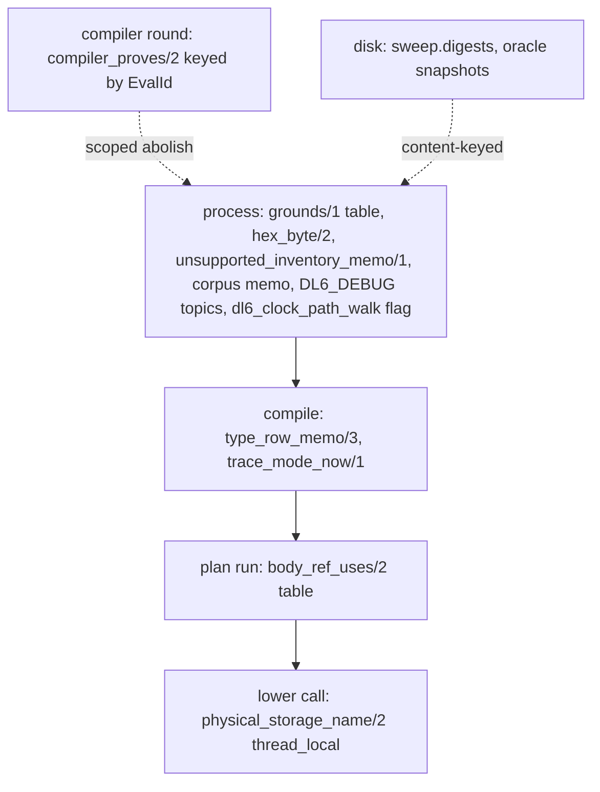

# DL6 SWI-Prolog engineering inventory

Source report for a separate skill-authoring lane. Read-only lane: the only
write is this file. No commit.

## TOC

1. [Scope and method](#scope-and-method)
2. [Coverage ledger](#coverage-ledger)
3. [Mechanism catalog](#mechanism-catalog)
4. [Commit archaeology](#commit-archaeology)
5. [Rejected or failed optimizations](#rejected-or-failed-optimizations)
6. [Decision table](#decision-table)
7. [V7 port map](#v7-port-map)
8. [Candidate skill outline](#candidate-skill-outline)
9. [Unverified](#unverified)

## Scope and method

HEAD `c48960ceeeecff2d7268f398fd6e1c9815c96d4a`, `git status --short` clean at
start. Counts are from Git, not the filesystem:

```text
git ls-files 'v6/prolog/**/*.pl' 'v6/prolog/*.pl' | wc -l   -> 198
git ls-files ... | xargs wc -l | tail -1                    -> 73940 total
```

Classification is by perf-mechanism presence and by directory role, not by
"did I read every line". A file is `read` when opened in this lane and used for a
claim; `test corpus` for unit tests and program fixtures; `generated fixture`
for tracked machine-generated `.pl` (none exist); `irrelevant` for files with no
table, memo, cache, index, trace, statistics, or measured-hot-path mechanism.

## Coverage ledger

| bucket | count | basis |
|---|---:|---|
| read (opened full or targeted section) | 35 | list below |
| test corpus | 96 | `compile/test/**` 34 (5 opened) + `conformance/fixtures/**` 67 |
| generated fixture | 0 | `compile/out/**` is gitignored; no tracked `.pl` is machine-generated |
| irrelevant to runtime/compiler performance | 67 | no mechanism keyword and not a measured hot path |
| **total** | **198** | |

Test corpus is read+unread: 34 under `compile/test/**` and 67 under
`conformance/fixtures/**`; no double count (the 5 opened test files sit inside
the 34). Keyword hits inside fixtures (`temporal_pipe.pl`, `scopes.pl`,
`state_machine.pl`, `ghcacher.pl`) are program vocabulary (cache, state, table as
user rel names), never SWI runtime mechanisms.

### read set (35)

| file | what was taken from it |
|---|---|
| `v6/prolog/src/kernel.pl` | `grounds/1` table |
| `v6/prolog/analyze.pl` | `body_ref_uses/2` table, occurrence scan, `snake_name/2` |
| `v6/prolog/0_compiler_relations.pl` | `compiler_proves/2` table, EvalId scoping |
| `v6/prolog/0_compiler_relations/1_aggregates.pl` | tabled closure strata |
| `v6/prolog/0_generic_expand/4_type_views.pl` | `type_row_memo/3`, `owner_carrier_index/2` |
| `v6/prolog/0_generic_expand/6_type_conformance.pl` | `generic_semantic_id_cache` assoc |
| `v6/prolog/0_generic_expand/5b_type_graph.pl` | table consumer projection |
| `v6/prolog/1_host_expand.pl` | `dedupe_terms/2` ground fast path |
| `v6/prolog/0_generic_expand.pl` | memo export surface |
| `v6/prolog/compile/0_trace.pl` | step ledger, `table_statistics/2`, env mode |
| `v6/prolog/compile_messages.pl` | `DL6_DEBUG` topics, nb checkpoint |
| `v6/prolog/6_profile.pl` | warm-up + `profile/2`, JSONL |
| `v6/prolog/conformance/body.pl` | `rows_index/2` bucketing |
| `v6/prolog/compile/test/plunit_tests.pl` | corpus memo, mutex, `concurrent_maplist` |
| `v6/prolog/compile/test/0_trace.test.pl` | child-swipl isolation |
| `v6/prolog/compile/test/0_graph.test.pl` | inference-count rail |
| `v6/prolog/compile/test/3_clock_check.test.pl` | exponent + ceiling rail, path flag |
| `v6/prolog/compile/test/run_plunit.pl` | `jobs(N)` one-unit-per-worker rule |
| `v6/prolog/compile/parse_dl_dcg.pl` | mark replay, line table |
| `v6/prolog/lower.pl` | storage thread_local, `memoized_relation_value/3`, hot concat |
| `v6/prolog/use_resolve.pl` | `merge_col` assoc index, `short_hash`, `hex_byte` table |
| `v6/prolog/compile.pl` | `measure_phase/3`, `rel_module_hash_index/2`, resets |
| `v6/prolog/sweep.pl` | digest cache, sharding |
| `v6/prolog/sweep_timings.pl` | one-write-per-block timing ledger |
| `v6/prolog/diag.pl` | `diag_stream` / `diag_blame` nb state |
| `v6/prolog/compile/oracle_dump.pl` | snapshot cache, per-fixture budget |
| `v6/prolog/0_unsupported_messages.pl` | `unsupported_inventory_memo/1` |
| `v6/prolog/compile/4_emit_jsonschema.pl` | `jsonschema_row_indexes` nb cache |
| `v6/prolog/3_clock_check.pl` | `dl6_clock_path_walk` prolog flag |
| `v6/prolog/1_expansion.pl` | `reset_type_row_memo` at run head |
| `v6/prolog/0_type_plane.pl` | canonical render (no engine cache) |
| `v6/prolog/ARCH.pl` | task ledger citations |
| `v6/prolog/compile/registry.pl` | route/surface data tables (not caches) |
| `v6/prolog/tools/prolog_lint.pl` | module cluster entry |
| `v6/prolog/dl6c.pl` | driver env reads |

### irrelevant set (68)

Root unread (25): `0_annotation_expand`, `0_anonymous_expand`, `0_ast_expand`,
`0_body_walk`, `0_coalesce_expand`, `0_cst_query`, `0_dot_expand`,
`0_enum_expand`, `0_graph`, `0_match_expand`, `0_negated_guard_expand`,
`0_option_expand`, `0_program_check`, `0_rel_record`, `0_relation_edge_expand`,
`0_relation_pattern`, `0_seq_expand`, `0_type_ids`, `2_subscribe`,
`cpg_edge_vocab`, `emit_rust`, `emit_ts`, `executor_modules`, `print_dl`, `strat`.

`compile/` unread (11): `0_storage_projection`, `1_emit_registry_docs`,
`2_emit_cli_inventory`, `3_emit_trace_schema`, `5_emit_openapi`,
`6_isolated_compiler_dd`, `7_emit_ts_types`, `8_emit_rust_types`,
`9_emit_type_artifact`, `debug_dbg`, `typegen_export`.

`0_generic_expand/` unread (10): `0_expand`, `0a_type_apply_requests`,
`0b_expansion_pipeline`, `1_annotations`, `2_compiler_plane`, `3_enum_templates`,
`5_type_freeze`, `7_generic_instances`,
`8_type_rewrite`, `8a_key_wrappers`.

`0_compiler_relations/` unread (1): `0_goals`. `conformance/` unread (6):
`dd_panel_export`, `engine`, `go`, `level_eval`, `rulings`, `ticklog`.
`compile/scripts/` (8): `0_json_arrival`, `arm_census`, `bop_check`, `dl6_oracle`,
`golden_coverage`, `golden_oracle`, `metamorphic_rename`, `text_door_receipt`.
`src/` unread (2): `checks`, `grader`. `tools/` unread (2): `arch_map`,
`self_map_facts`. `labs/break-hunt/oracle_case` (1), `examples/ghcacher` (1).

## Mechanism catalog

Cache and table lifetimes nest by scope:



Signatures below are the source form. Modes are the call modes actually used,
marked `?` when the predicate is called with a variable that the body can bind.

### M1 table `grounds/1`

| field | value |
|---|---|
| signature | `:- table grounds/1.` `grounds(Feature)` (`+Feature` semidet; `-Feature` enumerable) |
| file:line | `v6/prolog/src/kernel.pl:9`, clauses 42-43 |
| lifetime | process load to exit |
| key / value | ground `Feature` -> `true` |
| create / lookup / invalidate | first call fills; lookup by variant; never abolished |
| determinism | pure function of static `kernel/1` + `sugar/2`; no variable identity |
| payoff | reference closure for the kernel self-check `ARCH.pl:1045` |
| failure when omitted | recomputes the sugar closure per call; negligible at this size |

### M2 table `body_ref_uses/2` plus scoped abolish

| field | value |
|---|---|
| signature | `:- table body_ref_uses/2.` `body_ref_uses(+Body, -Uses)` |
| file:line | `v6/prolog/analyze.pl:109`; reset `analyze.pl:111`; call site `v6/prolog/compile.pl:211` |
| lifetime | one `program_plan/2` call (one compile) |
| key / value | body term `Body` -> `Uses` list of `use(Ref, Args, Sign, Marking)` |
| create | first call inside the run, called as `run_compile_step(plan, reset_body_use_cache, reset_body_use_cache, _)` at `compile.pl:211` |
| lookup | SLG reuse across every re-ask inside the run |
| reset | `abolish_table_subgoals(body_ref_uses(_, _))` at the head of `program_plan/2` |
| determinism | a **variant** answer unifies `Args` back onto the CALLER's variables, so variable identity survives where `findall/3` would copy it (`analyze.pl:107-108`) |
| payoff | plan phase inferences flagship-flow 1,445,026 -> 612,261, golden-flex 1,404,424 -> 644,487; whole compile flagship-flow -33% (commit `1c596cce6`) |
| failure when omitted | O(refs x columns) body re-walks; the seed-witness scan alone was 467k inferences on golden-flex |
| failure when reset wrongly | keyed on body terms, so a table carried past one program answers another program's bodies |

The header comment (`analyze.pl:102-105`) is the load-bearing constraint: this
predicate must never be collected with `findall/3` because that copies the
template and severs `Args` from the body's variables. Tabling is the safe
replacement precisely because variant answers unify through the call.

### M3 table `compiler_proves/2` keyed by EvalId

| field | value |
|---|---|
| signature | `:- table compiler_proves/2.` `compiler_proves(+EvalId, ?Row)` |
| file:line | `v6/prolog/0_compiler_relations.pl:24`; table 457-466; abolish 452; wrapper 438-444 |
| lifetime | one `tabled_compiler_closure/4` call |
| key / value | `EvalId` is a fresh `gensym(compiler_eval_, EvalId)` -> derived compiler-plane `Row` |
| create | `install_compiler_eval/3` asserts `compiler_eval_rule/2`, `compiler_eval_lower/2`, `compiler_eval_seed/2` under that EvalId |
| lookup | SLG closure over positive recursive goals; `not/1` consults only completed `LowerRows` |
| invalidation | `abolish_table_subgoals(compiler_proves(EvalId, _))` scoped to the one EvalId, then retract of the three `compiler_eval_*` families, all inside `setup_call_cleanup/3` |
| determinism | one unique table namespace per compiler round; rules and seeds immutable during closure |
| payoff | makes the canonical type graph (`type__node/3`, `type__edge/6`, `type__path/2`) a tabled closure instead of hand-threaded enumeration |
| failure when omitted | recursive positive compiler relations do not terminate or are hand-unrolled |
| failure when scoped wrong | a global `abolish_all_tables` would drop unrelated tables; scoping to EvalId keeps sibling compiles intact |

### M4 `type_row_memo/3` thread-local hash cache with full-term guard

| field | value |
|---|---|
| signature | `:- thread_local type_row_memo/3.` `normalized_type_rows(+Decls, -Rows)` |
| file:line | `v6/prolog/0_generic_expand/4_type_views.pl:380`; read 385-396; reset 382-383; call 398-403 |
| lifetime | one compile; reset at `v6/prolog/1_expansion.pl:84` (`expand_program_run/4` head) |
| key / value | `variant_sha1(Decls, Hash)` -> `(MemoDecls, MemoRows)` |
| create | on miss, `normalized_type_rows_rebuilt/2` runs `owner_carrier_index/2` once then `normalized_type_rows_cached/2`; `assertz` only when `ground(Rows)` |
| lookup | `type_row_memo(Hash, MemoDecls, MemoRows), MemoDecls =@= Decls` (variant-subsumption equality confirmation, not unification) |
| invalidate / reset | `reset_type_row_memo :- retractall(type_row_memo(_,_,_)).` |
| determinism | only ground row sets are stored, because `assertz/1` would strip variable identity; the `=@=` guard prevents a hash collision from serving a different `Decls` |
| payoff | five rebuilds of a pure function of `Decls` collapse to two, keyed by variant; plan-phase inferences 1,706,629 -> 1,387,597, whole compile 3,144,399 -> 2,826,636 (commit `4ca712a65`) |
| failure when omitted | the same rows rebuilt 5x per expansion (expand_user_templates, freeze_type_rows, both generic pipeline passes, expand_program_run) |
| failure when scoped wrongly | without the `=@=` guard, a `variant_sha1` collision serves the wrong rows; without `ground/1`, a caller's variables are frozen into the store |

### M5 non-backtrackable semantic indexes

The `generic_semantic_id_cache` is an `nb_setval` assoc triple installed for the
duration of one rebuild and deleted after.

| field | value |
|---|---|
| signature | `cache(DeclCache, TypeCache, OwnerCache)` in `nb_setval(generic_semantic_id_cache, ...)` |
| file:line | installed `4_type_views.pl:401`, deleted 403; read `6_type_conformance.pl:196-205`; owner read `4_type_views.pl:184-190` |
| lifetime | one `normalized_type_rows_rebuilt/2` call (`setup_call_cleanup`) |
| key / value | `Kind-Name` -> semantic declaration id, and `OwnerName` -> `carrier(Kind, Specs, Keyed)` |
| create | `owner_carrier_index/2` does four `findall` passes over `Decls` and `list_to_assoc/2` into the third slot |
| lookup | `get_assoc/3`; a miss falls back to the uncached scan; an absent cache (no `nb_current`) falls to uncached |
| invalidate | `nb_delete(generic_semantic_id_cache)` in the cleanup goal |
| determinism | `owner_carrier_index/2` sets `Index = none` when any owner name is non-ground, because `get_assoc/3` cannot reproduce `member/2`'s binding of a non-ground key (`4_type_views.pl:196-197`); the caller then takes the scan |
| payoff | four Decls passes for the whole program instead of four per owner |
| failure when omitted | N owners x four full-`Decls` scans |
| failure when scoped wrongly | `nb_*` values are per-thread and survive failure; a missing `nb_delete` leaks an index past the `Decls` it was built for |

### M6 one-pass occurrence indexing

| field | value |
|---|---|
| signature | `ref_occurrence_args_list(+Rules, +Ref, -Occurrences)`, `collect_ref_occurrences/4`, `rule_ref_occurrences/3`, `body_ref_occs/3` |
| file:line | `v6/prolog/analyze.pl:342-370`; consumer `column_name_at/5` 395-401 |
| lifetime | one `rel_columns/4` call |
| key / value | per-`Ref` list of `Args` tuples in program order (heads before body uses) |
| create | one pass over `Rules`; list-cell accumulation, never `findall` |
| lookup | `member/2` over the collected list, per column position |
| invalidate | none; rebuilt per call |
| determinism | the list keeps `==/2` identity of each `Args`; `findall` would copy and break it (`analyze.pl:327-328`) |
| payoff | killed columns x rules body walks; commit `b2f36b92b` |
| failure when omitted | the seed-witness / column naming path re-walks every rule for every column |

### M7 thread-local storage map

| field | value |
|---|---|
| signature | `:- thread_local physical_storage_name/2.` `with_storage_context(+RelPlans, 0)` |
| file:line | `v6/prolog/lower.pl:217`, 219-231 |
| lifetime | `setup_call_cleanup` around `lower_program/2` and `boot_statements/7` |
| key / value | semantic `Ref` -> physical SQLite storage name |
| create | `maplist(assert_storage_name, Names)` over `RelPlans` |
| lookup | `physical_storage_name(Ref, Name)` deep in SQL helpers that never see `RelPlans` |
| invalidate | `maplist(retract_storage_name, Names)` in the cleanup |
| determinism | thread-local keeps concurrent compiles from sharing one map; direct helper unit tests keep a `Ref -> Name` fallback |
| payoff | lets helpers receive only semantic Refs without threading `RelPlans` through every signature |
| failure when omitted | every SQL helper needs a `RelPlans` parameter |
| failure when scoped wrongly | without cleanup, a second compile inherits stale names; the measured cost is small (672 asserts + retracts = 1.75 ms, report line 258) |

### M8 compile-trace ledger and statistics snapshot

| field | value |
|---|---|
| signature | `dl6_trace_mode(-Mode)`, `run_compile_step(+Phase, +Step, 0, -Measurement)`, `statistics_snapshot(-Stats)`, `write_step_trace(+Name, +PhaseMeasurements)` |
| file:line | `v6/prolog/compile/0_trace.pl:38-46, 168-176, 191-205`; phase summary `v6/prolog/compile.pl:990-1016` |
| lifetime | one compile; `reset_step_trace/0` drains at end |
| key / value | `step_row(Seq, Phase, Step, Measurement)` thread-local, `measurement/12` (wall, cpu, inferences, gc count/bytes/ms, table count/answers/reuses/space/compiled-space) |
| create | `record_step/3` on the traced arm only; `next_seq/1` via `retract`/`assertz` |
| lookup | `collected_steps/1` `findall` then `msort` on `key(-Wall, Seq)` |
| invalidate | `write_step_trace/2` drains in every mode, including `off`, so a later untraced compile cannot inherit rows |
| determinism | `call/1` on BOTH arms, never `once/1`, so a traced compile keeps a choice point and answers the same program as an untraced one (`0_trace.pl:165-167`) |
| payoff | per-phase wall ms + inferences on stderr with zero cost when `DL6_TRACE` unset; one env read per compile via `trace_mode_now/1` memo |
| failure when omitted | no phase attribution; profiler C-builtin charging misleads (see rejected R-profile) |
| failure when scoped wrongly | `trace_mode_now/1` is thread_local; `getenv` is process-global so the test probes run in a child swipl (`0_trace.test.pl:8-9`) |

`table_statistics/2` keys used: `tables`, `answers`, `complete_call` (reuse),
`space`, `compiled_space` (`0_trace.pl:201-205`). This is the one place DL6 reads
SLG table answers/reuse/space.

### M9 print-time `DL6_DEBUG` topics

| field | value |
|---|---|
| signature | `dl6_debug_topic(-Topic, -Text)`, `dl6_debug(+Topic, +Format, +Args)`, `dl6_debugging(+Topic)` |
| file:line | `v6/prolog/compile_messages.pl:33-41, 53-66` |
| lifetime | process |
| key / value | topic atom -> docs text; `dl6_checkpoint(Topic-Format-Args)` in `nb_setval` |
| create | topics registered at load; `nodebug/1` at load keeps `DL6_DEBUG=all` silent about unknown topics |
| lookup | `debugging(dl6(Topic))` |
| invalidate | `dl6_reset_checkpoint/0` sets `nb_setval(dl6_checkpoint, none)` |
| determinism | the checkpoint is recorded whether or not the topic is on, so a failing phase names where it stopped without `DL6_DEBUG` |
| payoff | off-path topic costs one dynamic lookup; a count-guarded call site computes nothing when off |
| failure when omitted | a phase failure with no location |

### M10 corpus memo with mutex and concurrent_maplist

| field | value |
|---|---|
| signature | `corpus_memo(-Fixtures)`, `corpus_memo_fill/0`, `corpus_memo_fixture/2` |
| file:line | `v6/prolog/compile/test/plunit_tests.pl:1888-1919` |
| lifetime | one process (dynamic, not thread_local) |
| key / value | none; `corpus_memo_fixtures(Fixtures)` holds the whole 65-file build |
| create | double-checked inside `with_mutex(sprefa_corpus_memo, corpus_memo_fill)`; build uses `concurrent_maplist(corpus_memo_fixture, Read, Fixtures)` |
| lookup | `corpus_memo_fixtures(Cached)` |
| invalidate | none; process-lifetime |
| determinism | keeps the whole NONDETERMINISTIC solution SEQUENCE in corpus order (351 of 434 fixtures yield >1 plan); `once/1` would drop rows; `corpus_memo_leg/3` reproduces each rail's per-leg `catch/3` cut (lowering leg 1246 rows, audit leg 1266) |
| payoff | four corpus rails over the same 65 files went from six corpus compiles to one |
| failure when omitted | `plunit jobs(N)` runs the same corpus six times concurrently |
| failure when scoped wrongly | a plain dynamic is one clause store shared by every worker (failure-modes 59); the `with_mutex` + double-check is the fix |

### M11 `rows_index/2` fixturing bucketing

| field | value |
|---|---|
| signature | `rows_index(+Rows, -rows_index(Assoc, Rows))`, `rows_member(+Atom, +Index)` |
| file:line | `v6/prolog/conformance/body.pl:568-585` |
| lifetime | one fixpoint evaluation of the reference interpreter |
| key / value | `Name/Arity` -> stable row list; the accumulating `Growing` half stays a plain list |
| create | `findall`, `keysort`, `group_pairs_by_key`, `list_to_assoc` |
| lookup | `get_assoc(Name/Arity, Assoc, Rows)` for ground atoms; `member/2` for a variable atom |
| invalidate | rebuilt per iteration (the Stable half); the Growing half is appended |
| determinism | `keysort/2` stable and the index half enumerated first, so solution order matches the old `append(Stable, Growing)`-fed `member/2` |
| payoff | an unindexed `member/2` makes a k-goal rule O(N^k) over the whole visible set |
| failure when omitted | quadratic-to-exponential interpreter blowup on multi-goal rules |

### M12 one-pass line table and mark replay

| field | value |
|---|---|
| signature | `mark(+S)`, `parse_dl_marked_failure/3`, `build_line_starts/1`, `line_containing/5` |
| file:line | `v6/prolog/compile/parse_dl_dcg.pl:137-147, 183-189, 200-217` |
| lifetime | one `parse_dl_source/5` call |
| key / value | `nb_setval(parse_furthest_remaining, Len)` minimum remaining length; `parse_line_starts` a `line_starts/…` compound |
| create | first pass with marks off; on a throw, `setup_call_cleanup(assertz(parse_marks_on), replay, retractall(parse_marks_on))` |
| lookup | `mark/1` walks only under `parse_marks_on`; `parse_failure/1` reads the minimum |
| invalidate | prepass scratch retracted at every `parse_dl_pass/5` head (150-153); facts are thread_local (`parse_dl_dcg.pl:30`) |
| determinism | replay is exact by construction; error positions pinned by `plunit_tests.pl:8862` |
| payoff | mark/1's `length/2` walked 73M list cells on pokeapi; parse 258 ms -> 56 ms (commit `ba920f52e`); the earlier line-table cut was golden-flex 3,872,680 -> 261,179 parse inferences (commit `53a9e3652`) |
| failure when omitted | O(file x tokens) wall cost hidden from the inference counter |

### M13 digest / content-addressed caches

| cache | file:line | key | value | scope | reset |
|---|---|---|---|---|---|
| sweep fixture compile | `sweep.pl:66, 243-317` | compiler source-closure sha256 + fixture TERM + options | bucket, reason, output hashes | disk `compile/out/sweep.digests` | `SWEEP_FORCE=1`; `retractall(cached_digest/5)` then reload |
| oracle snapshot | `compile/oracle_dump.pl:66-99` | engine digest + program/initial/schedule | snapshot file content hashes | disk `out/*.oracle.jsonl` | re-dump on content mismatch; `ORACLE_FORCE`/`SWEEP_FORCE` |
| unsupported inventory | `0_unsupported_messages.pl:158-169` | none | scanned signature list | process dynamic `unsupported_inventory_memo/1` | `unsupported_inventory_forget/0` |
| JSON-schema row indexes | `compile/4_emit_jsonschema.pl:41-45, 349, 374, 507` | none | `nb_setval(jsonschema_row_indexes, ...)` | one `module_defs/4` call | `nb_delete` in cleanup |
| parse counts | `use_resolve.pl:426-436` | path | count | thread_local `parse_count_fact/2` | `reset_parse_counts/0` |
| `hex_byte/2` | `use_resolve.pl:419-424` | byte 0..255 | two-hex atom | process dynamic, asserted once | none |

### M14 short hash and ground dedupe fast paths

| field | value |
|---|---|
| signature | `short_hash(+Text, -Hash)`, `dedupe_terms(+Terms, -Deduped)`, `merge_col/4` |
| file:line | `use_resolve.pl:406-414`; `1_host_expand.pl:597-607`; `use_resolve.pl:332-370` |
| lifetime | one call |
| key / value | `short_hash`: `sha_hash/3` bytes 0..7 -> 16 hex; `dedupe_terms`: ground positional sort; `merge_col`: `Ref-Column` -> `Path-Type` assoc |
| determinism | all three fall back to the scan when a key term is non-ground, because `member/2`'s unification can bind a non-ground key while `get_assoc`/sort cannot |
| payoff | `short_hash` avoids rendering 32 bytes to hex (13.7 of 15.2 us per `crypto_data_hash/3`); `merge_col` 17 ms on pokeapi (806 lookups over a 1246-entry accumulator); `dedupe_terms` 15.1 ms -> 0.29 ms on 1246 decls |
| failure when omitted | repeated whole-digest rendering and quadratic membership scans |

### M15 prolog flag as a lifecycle switch

| field | value |
|---|---|
| signature | `:- create_prolog_flag(dl6_clock_path_walk, false, [type(boolean), keep(true)]).` `clock_path_walk_enabled/0` |
| file:line | `v6/prolog/3_clock_check.pl:313-314`; test sets it true `compile/test/3_clock_check.test.pl:8-9` |
| lifetime | process, survives load (`keep(true)`) |
| payoff | the expensive clock path walk stays off the compile path while its code and test battery stay live; ruling `clock_path_check_pinned_off` |
| failure when scoped wrongly | the walk cost `rules^4.864` wall on a dependent chain and died with `Stack limit (1.0Gb) exceeded` in production (ARCH `clock_check_path_blowup`, `3_clock_check.test.pl:104-118`) |

### M16 statistics as an inference rail

| field | value |
|---|---|
| pattern | `statistics(inferences, Before), call(Goal), statistics(inferences, After), Count is After - Before` |
| file:line | `compile/test/0_graph.test.pl:206-210`; `compile/test/3_clock_check.test.pl:165-169` |
| budget shape | asymptotics exponent AND absolute ceiling (`3_clock_check.test.pl:130-151`): exponent `=< 1.5`, ceiling `=< 150000` |
| payoff | catches asymptotic regression at any scale (exponent) and constant-factor regression (ceiling); flake-free on a loaded machine because inferences not wall |
| sabotage receipt | delayed-node recompute -> exp 1.89; simple-path under `clock_components/3` -> exp 3.83; shipped 1.11 |

## Commit archaeology

| commit | shape changed | before -> after |
|---|---|---|
| `b2f36b92b` `analyze: index ref occurrences once` | `analyze.pl`: `column_name_at/4` -> `column_name_at/5` driven by `ref_occurrence_args_list/3`; one Rules pass replaces per-column per-rule body walks | kills columns x rules quadratic |
| `1c596cce6` `the plan phase stops re-deriving` | `analyze.pl` `:- table body_ref_uses/2` + `reset_body_use_cache/0`; `program_column_types/8` takes `RefColumns`; caller builds the map once | plan inferences flagship-flow 1,445,026 -> 612,261; golden-flex 1,404,424 -> 644,487; whole compile flagship-flow 2,376,295 -> 1,588,039 |
| `4ca712a65` `generic: memo the type rows one expansion asks for five times` | `4_type_views.pl` `:- thread_local type_row_memo/3` + `reset_type_row_memo/0`; `normalized_type_rows/2` split into memo wrapper + `_rebuilt` | plan 1,706,629 -> 1,387,597; whole compile 3,144,399 -> 2,826,636; grade byte-clean 335 |
| `ad26ed6b7` `expose tabled canonical type graph` | `0_compiler_relations.pl` `:- table compiler_proves/2`, `satisfy_tabled_compiler_body/2`, `tabled_compiler_closure/4` + three `thread_local compiler_eval_*`; EvalId-scoped `abolish_table_subgoals` | SLG closure replaces hand-enumeration for `type__node/3`, `type__edge/6`, `type__path/2` |
| `53a9e3652` `line table replaces the per-statement prefix walk` | `parse_dl_dcg.pl`: one `line_starts` table + `line_containing/5` binary search; `mark` families collapsed | golden-flex parse 3,872,680 -> 261,179 inferences, 923 -> 233 ms; flagship-flow 1,087,151 -> 321,398 |
| `ba920f52e` / `145685905` `pokeapi 955ms -> 625ms` | `parse_dl_dcg.pl` mark replay; `use_resolve.pl` keyed `merge_col/4`; 18 `format(atom(...))` -> `atomic_list_concat/2`; `js_string/2` + `js_template/2` `split_string/4` escape fast path; `analyze.pl` fallback name | total 874 -> 575 ms; inferences 8,315,870 -> 7,260,621; `format/3` calls 73,010 -> 10,190; parse 258 -> 56 ms; byte-identical over 433 fixtures |
| `bd786c6b6` `clock check: skip the component search when no edge can delay` | `3_clock_check.pl` `zero_weight_cycles_only/3` short-circuit | plan phase within +-10% band; gate then reports only the four pre-existing parse regressions |
| `9346b34de` `path enumeration -> offset propagation` | `recurrence_free_clock/6` worklist; one offset per edge; conflict = two offsets at a node | k-curve 51.1 s -> 3.5 ms at k=20; atlas compile 284.8 s@8GB -> 14.7 s at default 1 GB stack; emitted module byte-identical |
| `c05abd655` `compile trace always-on` | `compile.pl` `COMPILE-TRACE` line + shared `measure_phase/3`; `6_profile.pl` JSONL consumes it; compile-speed gate auto-profiles worst regressed program | per-phase wall/inferences; top-15 self-time on regression |
| `7c6bdd48c` `phase the green-all battery` | `tools/green-parallel.sh` phases 31 legs by sensitivity | 254 s -> 177 s, same verdicts; memory-soak and two wall-budget tests stay serial |

Measured microbenchmarks (report lines 190-231): `atomic_list_concat/2` 0.38 us vs
`format(atom(X),'"~w"',[Name])` 1.06 us; `js_string/2` 2.39 -> 0.60 us via
`split_string/4`; `get_assoc/3` 1.8 us keyed lookup; 672 asserts + retracts of a
thread_local = 1.75 ms.

## Rejected or failed optimizations

| id | candidate | why rejected | receipt |
|---|---|---|---|
| R1 | thread the storage map instead of `assertz physical_storage_name/2` | 672 asserts + retracts cost 1.75 ms of a 575 ms compile | report line 241 |
| R2 | mechanical rewrite of all 334 `format(atom(...))` sites in `lower.pl` | a `~w` argument is not always atomic; `[]` raises `type_error(text, [])` | report line 242; `quote_ident/2` keeps a format fallback |
| R3 | two-pointer gap walk to make `mark/1` single-pass | more code and subtler correctness for the same 202 ms; replay is exact by construction | report line 243 |
| R4 | memoize `js_string/2` in an assoc | assoc lookup costs about the fast path end to end | `get_assoc/3` 1.8 us, report line 244 |
| R5 | index `analyze:column_type_at_decl/9`'s `memberchk` | priced 0.36% of one compile, closed unlanded | report line 245 |
| R6 | hoist `column_source_args/5` out of the per-column `findall` | cost 194k MORE on golden-flex because `findall` copies every arg tuple; plan phase has no spot over 40% | commit `1c596cce6` |
| R7 | `emit_ts` `*_entry_line/N` 6,000 remaining `format/3` calls | fenced to another lane; worth ~6 ms | report line 247 |
| R8 | `assertz/1` as a hot target | profiler artifact: `ports(true)` 13.6% vs `ports(false)` 2.4%, unchanged call count | report lines 249-268 |
| R9 | full clock path walk on the compile path | exponential routes (2^k), stack overflow in production; pinned off behind a flag | `3_clock_check.pl:306-314`, ARCH `clock_check_path_blowup` |
| R10 | treat `compile_speed_regression` as the clock checker's fault | exonerated by revert; four parse-phase regressions pre-exist | commit `9346b34de` |

## Decision table

| symptom | first diagnostic | likely cause | DL6 precedent |
|---|---|---|---|
| compile wall much larger than inference count implies | `DL6_TRACE=steps` per-step wall vs inf | a C builtin or list walk not charged to inferences (`length/2`, `format/3`, prefix walk) | mark replay `ba920f52e`; line table `53a9e3652` |
| profiler names a C builtin at top self time | `profile/2` with `ports(false)`; then remove the call and re-time | per-call port overhead on a large call count | report lines 249-268 |
| same pure result recomputed several times per compile | `run_compile_step` step timings | missing memo table + missing reset | `body_ref_uses/2` `1c596cce6`; `type_row_memo/3` `4ca712a65` |
| recursive positive compiler relation does not terminate | check `:- table` on the relation | hand-enumeration instead of SLG closure | `compiler_proves/2` `ad26ed6b7` |
| table gives stale/wrong answers across compiles | check the reset call site | table keyed on program terms survives into another program | `reset_body_use_cache` at `program_plan/2` head (`compile.pl:211`) |
| test run reddens only under `jobs(N)` | inspect shared dynamic predicates | one clause store shared by workers (failure-modes 59) | corpus memo mutex + double-check `plunit_tests.pl:1893` |
| test reddens under parallel load but passes isolated | compare inference counts, not wall | a wall budget in a functional test | `7c6bdd48c` items 1-2 |
| interpreter blows up on multi-goal rules | count visible rows per iteration | unindexed `member/2` over the whole visible set | `rows_index/2` `body.pl:568` |
| keyed lookup silently changes answer order or bindings | check for non-ground key | `get_assoc`/`sort` cannot bind a non-ground key | `merge_col` `unkeyed`, `dedupe_terms` `ground/1`, `owner_carrier_index` `none` |
| traced compile answers a different program than untraced | inspect `once/1` vs `call/1` in the wrapper | trace wrapper cut a choice point | `0_trace.pl:165-167` |
| `DL6_TRACE`/env test flakes beside siblings | move the probe to a child swipl | env and `user_error` are process-global under `jobs(N)` | `0_trace.test.pl:8-9` |
| `assertz` reads hot in the profile but timing disagrees | time the asserts directly | profiler artifact | report R1/R8 |
| clock check cost explodes with parallel routes | measure route count, not chain length | path enumeration is exponential in parallel mid-chain routes | `3_clock_check.test.pl:171-184`; offset propagation `9346b34de` |

## V7 port map

V7 is itself an SWI-Prolog DL7 compiler (`v7/README.md:1-3`) with its own
`COMPILE-TRACE`, `DL7_TRACE=steps|json`, `just compiler-perf`, and inference /
closure-round / compiler-row / warm-cache budgets. Port direct reuse first.

### Direct reuse

| mechanism | V7 target | note |
|---|---|---|
| step ledger + `statistics_snapshot/1` (M8) | V7 compiler trace (`v7/README.md:62-70`) | same shape already promised; reuse `measurement/12` and `table_statistics/2` reads |
| prolog-flag lifecycle switch (M15) | expensive DL7 checks pinned off | `keep(true)` flag brings a checker back in tests |
| inference exponent + ceiling rail (M16) | `just compiler-perf` budgets | V7 already fails three pinned budgets cold (README 72-77) |
| `table p/N` + EvalId-scoped `abolish_table_subgoals` (M3) | DL7 comptime fixpoint closure | one table namespace per fixpoint round |
| thread-local memo + `=@=`/ground guard (M4) | DL7 type-fact row cache | key by variant hash, store only ground |
| non-ground key fallback (M5, M14, M11) | any keyed index over DL7 terms | fall back to `member/2` when a key is non-ground |
| versioned disk digest cache (M13) | DL7 source/extract fact reuse | include extractor version + config in the key (README 26-31) |
| `with_mutex` + double-check + `concurrent_maplist` (M10) | V7 parallel test/corpus runners | shared dynamic store safety |
| child-process isolation for env/global tests (M8 test shape) | V7 trace/env probes | env is process-global |

### Adaptation

| mechanism | adaptation needed |
|---|---|
| `body_ref_uses/2` table (M2) | V7 lowering is a different IR; keep the invariant "never `findall` a body walk that must preserve variable identity", add a reset at the fixpoint head |
| `rows_index/2` (M11) | V7 evaluator relation lookup likely already indexed; port the stable-order argument (`keysort` + stable half first) |
| `type_row_memo/3` (M4) | the five-rebuild shape is DL6-specific; V7 needs its own build-count audit |
| mark replay (M12) | V7 uses a generated Tree-sitter C parser (README 48-60), so the DCG mark mechanism is inapplicable; the line-table and child-pass ideas are not |
| `emit_ts` hot-concat cuts (archaeology) | V7 target is Rust/TS artifacts; reuse the `atomic_list_concat` vs `format` choice only if V7 emits text from Prolog |

### Inapplicable

| mechanism | why |
|---|---|
| `compiler_proves/2` EvalId table (M3) as-is | DL6 compiler-plane relation construction; V7 has a different fixpoint core |
| `physical_storage_name/2` thread_local (M7) | DL6 SQLite lowering seam; V7 storage port is the SQLite IVM emitter |
| DL6 conformance `rows_index/2` (M11) | reference-interpreter-only |
| `dl6_clock_path_walk` flag (M15) | DL6 clock calculus; V7 clock semantics differ |
| corpus memo over `conformance/fixtures` (M10) | DL6 corpus |

## Candidate skill outline

Reusable, non-obvious rules only:

1. A table answer unifies through the call, so `:- table p/2` is the general
   replacement for a repeated body walk that must keep `findall`-unsafe variable
   identity. Add `reset` at the head of the work unit whenever the key is a
   program term, never a global `abolish_all_tables`.
2. Scope `abolish_table_subgoals(p(Key,_))` to a fresh per-round key (gensym /
   EvalId) so one round's table cannot leak into the next.
3. Memo a pure function of a data term by variant hash (`variant_sha1`) plus an
   `=@=` confirmation, and only `assertz` when the value is `ground`. Hash alone
   can collide; a non-ground value loses variable identity under `assertz`.
4. Index an accumulating list only when the key is ground. A non-ground key must
   fall back to `member/2` because `get_assoc`/`sort` cannot bind it. Encode the
   fallback as a sentinel (`unkeyed`, `none`) in one place.
5. Keep `findall`/`bagof` off any scan whose downstream needs `==/2` identity or
   shared variables; accumulate with list cells or recurse.
6. Price a C builtin by removing it and re-timing, never from its profile row.
   `profile/2` with `ports(true)` charges per call, so a high call count on a C
   builtin reads hot whatever it costs. Turn ports off before ranking.
7. Prefer `atomic_list_concat/2` over `format(atom(X), '~w', ...)` on hot leaf
   builders, but keep a `format` fallback: `~w` writes non-atoms (`[]`, lists)
   that `atomic_list_concat/2` rejects.
8. For a guard whose failure path is rare, run the cheap pass without marks and
   replay once on throw. Exact by construction, and it removes O(n) work per
   token from the common path.
9. An inference-count rail is flake-free where a wall rail is not. Pin both an
   asymptotic exponent and an absolute ceiling; the exponent catches scale
   changes, the ceiling catches constants.
10. Under `plunit jobs(N)` one UNIT runs per worker and units interleave. Any
    shared dynamic predicate races; an env var or `user_error` is process-global,
    so probe that path in a child `swipl`.
11. Whole-corpus work belongs to the corpus lifetime: build once behind
    `with_mutex` + double-check, fan the build with `concurrent_maplist`, and
    preserve the full nondeterministic solution sequence (`once/1` silently drops
    rows a consumer walks).
12. A wall budget inside a functional test is a flake source under load; gate on
    a flatness or count property, or run it alone.
13. A per-thread `setup_call_cleanup` around `assertz`/`retract` is a cheap way
    to give deep helpers a context map; confirm the cost by timing before
    threading the map through signatures (DL6 measured 1.75 ms for 672 pairs).
14. On a data-term cache, `variant_sha1` + `=@=` reads cheaper than structural
    equality over large decl lists; call `sha_hash/3` and render only the bytes
    you emit (DL6 renders 8 of 32).
15. A `term_hash`/`variant_sha1` index over terms with unbound variables must be
    disabled for those calls; memoization is safe only when the stored value is
    ground.

## Unverified

- Lines cited from sections of `analyze.pl`, `lower.pl`, `compile.pl`,
  `plunit_tests.pl`, `ARCH.pl` were read as windows, not end to end.
- `compiler_proves/2` SLG mode was read from the source call sites; the exact
  SWI subsumption mode (default variant) was not confirmed by running.
- V7 behavior is taken from `v7/README.md`; no V7 source was executed and no V7
  file was edited.
- `compile/test/**` and `conformance/fixtures/**` were classified by directory
  role, not read file by file; the 29 unread test files were not content-checked.
