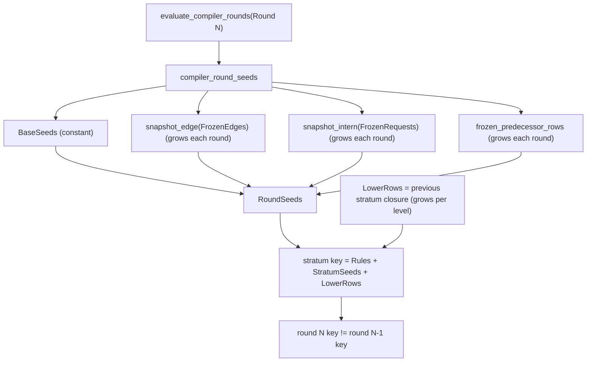

# DL7 stratum memoization: Gate 1 reuse probe

Status: Gate 1 failed. The approved stratum dependency tuple (Rules +
StratumSeeds + LowerRows) has zero exact repeats across compiler rounds on
both required fixtures, so no cache was added. Reproduced patch is uncommitted.
Base sha: `b900b80f2`.

## TOC

1. [Scope and decision](#scope-and-decision)
2. [Reproduced patch](#reproduced-patch)
3. [Signatures and lifetime](#signatures-and-lifetime)
4. [Gate 1 instrument](#gate-1-instrument)
5. [Hit counts](#hit-counts)
6. [Peak entries and term size](#peak-entries-and-term-size)
7. [Why the complete tuple never repeats](#why-the-complete-tuple-never-repeats)
8. [Semantic validation](#semantic-validation)
9. [Performance validation](#performance-validation)
10. [Remaining blocker](#remaining-blocker)
11. [Files](#files)
12. [Hail fields](#hail-fields)

## Scope and decision

Add compile-local memoization for repeated DL7 evaluator strata, keyed on the
complete ground evaluator input, then measure the time-for-space exchange.

Gate 1 (`prove reuse before storage`) instrumented `evaluate/4` to count exact
repeated stratum dependency tuples across all compiler rounds of one compile.
Measured repeats of the approved tuple are zero on `0_nearest_and_chains.dl7`,
`7_nearest_shadow.dl7`, and `2_partial.dl7`. Per the instruction, the receipt
and stop path was taken: no cache was added, no budget changed, no evaluator
state introduced.

| gate | result |
|---|---|
| Gate 1 exact repeats of approved tuple | 0 on all three fixtures |
| Gate 1 repeats of a weaker key (rules only) | present, but unusable (see below) |
| cache added | no |
| evaluator/compiler behavior change | none; probe reverted |

## Reproduced patch

Applied from
`/Users/chrishafley/projects/sprefa/.boop-worktrees/feature/dl7-alias-f41-finish-r1-20260910`
(tracked diff plus three untracked files), commit `b900b80f2`.

```text
 M v7/bench/0_compiler_performance.pl
 M v7/src/0_reader/1_expander.pl
 M v7/src/0_reader/1a_syntax_grapher.pl
 M v7/src/2_comptime/0_lowerer.pl
 M v7/test/19_lexical_binding.test.pl
?? v7/AGENTS.md
?? v7/receipts/7_dl7_alias_performance_finish.md
?? v7/test/fixtures/lexical_binding/7_nearest_shadow.dl7
```

`git diff --check` exits 0.

## Signatures and lifetime

Proposed contracts, never installed because Gate 1 failed:

```prolog
% Active only inside a compiler invocation; absent for bare evaluate/4 callers.
%% stratum_cache_boundary(:Goal) is det.
%   setup_call_cleanup: clear index -> call Goal -> clear index.

%% stratum_dependency(+PlainRules, +StratumSeeds, +LowerRows, -Key) is det.
%   Key = stratum_dependency(PlainRules, StratumSeeds, LowerRows); all ground.

%% cached_stratum_closure(+Key, -CompletedRows) is semidet.
%   Hash index, then Key =@= StoredKey. CompletedRows = successful ground rows.

%% record_stratum_closure(+Key, +CompletedRows) is det.
```

State decision if a cache were added: a growing key-to-rows store threaded by
hand through `evaluate_strata`, `evaluate_compiler_rounds`, and
`evaluate_compiler_program` changes the exported `evaluate/4` or forces a
parallel `evaluate/5`, so explicit threading is not smaller than ambient state.
`thread_local` dynamic facts owned by `setup_call_cleanup/3` at the compiler
boundary, cleared before install and after success/failure/throw, is the
smaller shape and keeps `evaluate/4` byte-identical for outside callers. This
was the intended shape; Gate 1 removed the need for it.

## Gate 1 instrument

Temporary, guarded, and since reverted. Three key families were counted so a
miss could be attributed to a component:

```prolog
probe_stratum(PlainRules, StratumSeeds, LowerRows) :-
    (   stratum_probe_on
    ->  stratum_probe_call(Call),
        probe_key(complete,
                  stratum_dependency(PlainRules, StratumSeeds, LowerRows), Call),
        probe_key(rules_seeds,
                  stratum_rules_seeds(PlainRules, StratumSeeds), Call),
        probe_key(rules_only, stratum_rules(PlainRules), Call)
    ;   true
    ).

probe_key(Family, Key, Call) :-
    term_hash(Key, Hash),
    term_size(Key, Size),
    (   stratum_probe_entry(Family, Hash, Key0, Count0, Calls0),
        Key =@= Key0
    ->  retract(stratum_probe_entry(Family, Hash, Key0, Count0, Calls0)),
        Count is Count0 + 1,
        (   memberchk(Call, Calls0) -> Calls = Calls0 ; Calls = [Call | Calls0] ),
        assertz(stratum_probe_entry(Family, Hash, Key0, Count, Calls))
    ;   assertz(stratum_probe_entry(Family, Hash, Key, 1, [Call]))
    ).
```

The probe was called in the success clause of
`evaluate_stratum_after_aggregates/12`, after `StratumSeeds` is computed and
before `install_evaluation/5`. `probe_begin_evaluate/0` incremented one call
ordinal per `evaluate/4`, so a repeat with two distinct ordinals is cross-call
(a different compiler round). Hash is only an index; `=@=` confirms identity.
`probe_stratum/3` did not run for the aggregate-diagnostics clause, matching
the "successful ground closure only" rule.

Command shape, one cold compile per process:

```text
swipl -q -s probe_stratum.pl -- test/fixtures/2_partial.dl7
```

## Hit counts

One cold compile each, probe on.

| fixture | family | strata evaluated | distinct keys | exact repeats | cross-call repeats |
|---|---|---:|---:|---:|---:|
| `0_nearest_and_chains.dl7` | complete | 15 | 15 | 0 | 0 |
| `0_nearest_and_chains.dl7` | rules_seeds | 15 | 9 | 6 | 6 |
| `0_nearest_and_chains.dl7` | rules_only | 15 | 8 | 7 | 7 |
| `7_nearest_shadow.dl7` | complete | 15 | 15 | 0 | 0 |
| `7_nearest_shadow.dl7` | rules_seeds | 15 | 9 | 6 | 6 |
| `7_nearest_shadow.dl7` | rules_only | 15 | 8 | 7 | 7 |
| `2_partial.dl7` | complete | 50 | 50 | 0 | 0 |
| `2_partial.dl7` | rules_seeds | 50 | 23 | 27 | 10 |
| `2_partial.dl7` | rules_only | 50 | 15 | 35 | 14 |

Useful hits (`complete` family): 0 for every fixture. Gate 1 stops here.

## Peak entries and term size

Entries only grow within a compile, so peak entries equals distinct keys.
`term_size/2` counts cells.

| fixture | peak entries (complete) | max key term size (any family) | complete-family total key term size |
|---|---:|---:|---:|
| `0_nearest_and_chains.dl7` | 15 | 500,642 | 5,898,639 |
| `7_nearest_shadow.dl7` | 15 | 500,642 | 5,924,718 |
| `2_partial.dl7` | 50 | 540,437 | 22,066,793 |

A full `complete` store for `2_partial.dl7` would hold 50 keys totaling about
22.1M cells, roughly 177 MB at 8 bytes per cell, to save zero evaluations.

## Why the complete tuple never repeats



`Rules` (PlainRules) recurs across rounds, which is why `rules_only` repeats
(35 of 50 for `2_partial.dl7`). `StratumSeeds` and `LowerRows` both change every
round: snapshot edges and intern requests accumulate as the fixpoint advances,
and the lower-row snapshot grows with each stratum. Because the approved
dependency array is the complete input, any component change is a miss. The
`rules_only` repeats are not usable: the same rules evaluated against different
seeds and lower rows produce different closures, so a rules-only key would be
unsound under the stated invariants.

## Semantic validation

No cache was added, so before equals after. Validation confirms the reproduced
patch is intact and that the temporary probe did not alter behavior.

| check | command | result |
|---|---|---|
| lexical binding | `run_tests` on `v7/test/19_lexical_binding.test.pl` | 10/10 pass, exit 0 |
| reader focused | `v7/test/0_reader.test.pl` | 12/12 pass |
| syntax focused | `v7/test/1a_syntax_expander.test.pl` | 4/4 pass |
| negation | `dl7_entrypoints:prefix_negation_is_safe_stratified_and_cleanup_scoped` | pass |
| aggregate | `dl7_entrypoints:count_groups_completed_lower_proofs_and_rejects_bad_placement` | pass |
| `git diff --check` | repo root | exit 0 |

Alias cases covered by test 19 with exact rows and diagnostics: direct alias,
chained alias (alias_a, alias_b, chain), nearest shadow, generated callable,
self-cycle, two-cycle, missing name.

Cold compile row counts and diagnostics, fresh process each:

| fixture | rows | diagnostics |
|---|---:|---|
| `0_nearest_and_chains.dl7` | 14,515 | none |
| `2_missing_name.dl7` | 0 | `unresolved_name(field)` at node 5 |
| `3_self_cycle.dl7` | 0 | `unresolved_name('A')` node 5, `unresolved_name(field)` node 9 |
| `4_two_cycle.dl7` | 0 | `unresolved_name('A')` node 5, `unresolved_name('B')` node 9, `unresolved_name(field)` node 13 |
| `5_generated_callable.dl7` | 14,867 | none |
| `6_deferred_alias_measure.dl7` | 14,602 | none |
| `7_nearest_shadow.dl7` | 14,586 | none |

Independent consecutive cold compiles of `7_nearest_shadow.dl7` in separate
processes: `rows=14586 hash=626311307` both times. No state survives a compile.

## Performance validation

`bench/0_compiler_performance.pl` on `test/fixtures/2_partial.dl7`, after the
probe revert:

| metric | value | gate |
|---|---:|---|
| cold inferences | 59,593,733 | under 88,000,000, pass |
| warm inferences | 2,343 | under 50,000, pass |
| compiler rows | 15,542 | checkpoint 15,542, pass |
| closure rounds | 8 | checkpoint 8, pass |
| diagnostics | `[]` cold and warm | pass |
| bench exit | 0 | pass |

The cold inference count is identical to the base plus reproduced patch before
this task, so the Gate 1 probe left no trace. No budget was raised. Exact-input
memoization would save zero evaluations because the hit count is zero; the
`comptime` closure cost is 50 distinct stratum evaluations, not repeated work.

## Remaining blocker

The lexical-fixture cold floor is the stratified comptime closure, not repeated
stratum inputs. Exact-input memoization cannot reduce it. Getting under the 3
second gate needs an evaluation change (incremental or round-keyed reuse, table
scope, or fewer rounds) that changes evaluation semantics. Under the kernel
change rule that requires user approval before implementation, so it was not
attempted.

## Files

Reproduced patch files as listed above, plus the reproduced untracked files.
`v7/src/1_libtime/0_evaluator.pl` was temporarily instrumented for Gate 1 and
reverted with `git checkout --`; it is not a changed file.

New file from this task: `v7/receipts/8_dl7_stratum_memo.md`.

No commit, push, merge, budget increase, or unrelated refactor.

## Hail fields

- status: reproduced alias patch validated; Gate 1 reuse probe measured zero exact repeats of the approved stratum tuple; no cache added; uncommitted
- sha: `b900b80f2` (base; no commit created)
- files: `v7/bench/0_compiler_performance.pl`, `v7/src/0_reader/1_expander.pl`, `v7/src/0_reader/1a_syntax_grapher.pl`, `v7/src/2_comptime/0_lowerer.pl`, `v7/test/19_lexical_binding.test.pl`, `v7/AGENTS.md` (new), `v7/test/fixtures/lexical_binding/7_nearest_shadow.dl7` (new), `v7/receipts/7_dl7_alias_performance_finish.md` (new, reproduced), `v7/receipts/8_dl7_stratum_memo.md` (new)
- signatures: `stratum_dependency(+PlainRules,+StratumSeeds,+LowerRows,-Key)`; `cached_stratum_closure(+Key,-CompletedRows)` semidet, hash then `=@=`; `record_stratum_closure(+Key,+CompletedRows)`; `stratum_cache_boundary(:Goal)` via `setup_call_cleanup/3`. Proposed only; not installed.
- lifetime: one compile invocation; clear at boundary entry and in cleanup; a second independent compile starts empty
- lookup_sequence: `term_hash(Key,Hash)` -> candidates in same hash bucket -> `Key =@= StoredKey` -> return stored ground rows, else run install/collect then store
- hit_counts: complete tuple 0 repeats on `0_nearest_and_chains` (15 evaluated), `7_nearest_shadow` (15), `2_partial` (50); `rules_seeds` 6/6/27 repeats; `rules_only` 7/7/35 repeats
- peak_entries: 15 / 15 / 50 (complete family)
- peak_term_size: max key 540,437 cells (`2_partial`); complete-family total 22,066,793 cells (`2_partial`)
- before_after: no cache, so identical; `2_partial` rows 15,542, rounds 8, diagnostics `[]`, cold 59,593,733 warm 2,343, test 19 10/10
- semantic_validation: test 19 10/10; reader 12/12; syntax 4/4; negation pass; aggregate pass; determinism hash 626311307 twice; `git diff --check` exit 0
- performance_validation: `2_partial` cold 59,593,733 under 88,000,000; warm 2,343 under 50,000; rows 15,542; rounds 8; bench exit 0; no budget change
- remaining_blocker: the lexical cold floor is the stratified comptime closure; exact-input memoization has zero hits because StratumSeeds and LowerRows change each round; going below 3 s needs an evaluation-semantics change requiring approval
- next: either approve an evaluation change (incremental/round-keyed reuse, table scope, or fewer rounds) or accept the floor; Gate 1 cache path is closed
