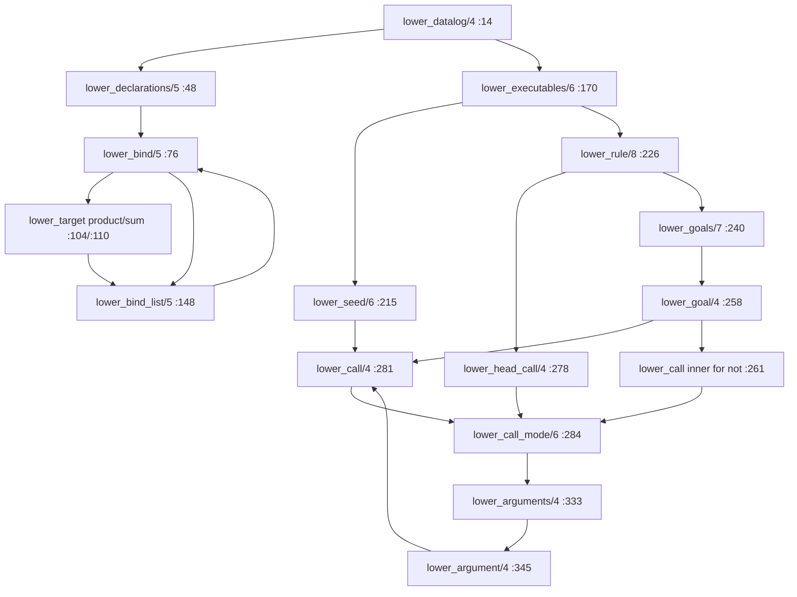

# DL7 expression lowering blast radius

Blast-radius map for `plans/2026-08-30-dl7-relational-expression-flow.md`,
milestones 1 through 8. All paths relative to repo root, all line numbers on
lane commit `0da6fb89e`. Research only; no production edits.

## TOC

1. Current call paths
2. Reservation and name-resolution dependencies
3. Origin tracking and diagnostics
4. Return-edge discovery from canonical `:/4` rows
5. Prelude loading, compiler refreeze, generated rules
6. `partial_request` occurrences
7. Milestone map 1 through 8
8. Tests and verification

## 1. Current call paths

All in `v7/src/2_comptime/0_lowerer.pl` (396 lines, module `dl7_lowerer`).



### Callers per predicate (exhaustive)

- `lower_bind/5` (:76): called at :54 (`lower_declarations/5`, top-level
  declaration pass) and :150 (`lower_bind_list/5`, nested `*` / `+`
  constructor bindings). Both go through `bind_form/4` (:371).
- `lower_target/4` (:104): called only at :78 inside `lower_bind/5`.
- `lower_call_mode/6` (:284): called from `lower_head_call/4` (:279, mode
  `head`) and `lower_call/4` (:281, mode `plain`); `lower_call` is called
  from `lower_seed/6` (:216), `lower_goal/4` for positive goals (:272) and
  the `not/1` inner form (:261). Recurses only through `lower_arguments`.
- `lower_argument/4` (:345): called from `lower_arguments/4` (:335) and
  recursively at :349 (`count/1` head aggregate lowers its inner expression
  as mode `plain`).
- `lower_arguments/4` (:333): only from `lower_call_mode/6` (:293, :305).
- `lower_executables/6` (:170) dispatches bind forms away, then
  `rule_form/4` (:375) -> `lower_rule/7` (:226) or `lower_seed/6` (:215).

### Current shapes

- `lower_target/4` returns `ok(TargetTerm, Kind, Nodes, Edges, Relations,
  Origins, Reservations)`; `TargetTerm` in `target(Owner) | const(Value) |
  name(Owner, Name)`, `Kind` in `product | sum | reference | literal`.
- `lower_argument/4` returns `ok(var(Identity)) | ok(const(Value)) |
  ok(name(Owner, Name)) | ok(aggregate(count, Expr)) | error(diagnostic(...))`.
  Kinds consumed by `call_contains_var/1` (:369), checker
  `resolve_argument/4` (`1_checker.pl`:637-650), and `check_goal/4`
  (`1_checker.pl`:506-531, kernel mode checks for `cons`/`intern`).
- Every parenthesized form in a value position stops at
  `lower_argument/4`:362-363 with `nested_call_argument`; every
  parenthesized bind target stops at `lower_target/4`:122-123 with
  `unsupported_bind_target`. Variable bind targets: :120-121
  `variable_bind_target`. These three diagnostics are the exact seams
  milestones 1-5 replace with `lower_expression/7`.

### Milestone-by-milestone predicate paths

| MS | Entry path | Blocking diagnostic |
|----|-----------|---------------------|
| 1  | `lower_target` value arms (:116-119), `lower_argument` value arms (:359-361) | new carrier, `unresolved` rejection case |
| 2  | new: read `return` edge from callable declaration | `missing_return_edge`, `multiple_return_edges` (new) |
| 3  | `lower_target` fallback :122 (bind RHS) | `unsupported_bind_target` |
| 4  | `lower_argument` :362 (argument position) | `nested_call_argument` |
| 5  | same lowerer reused for head/body positions: `lower_head_call` :278, `lower_goal` :271 | `nested_call_argument` in heads (test :488-494 `nested_head_receipt` changes) |
| 6  | prelude `0_types.dl7`:104-108 and fixture `2_partial.dl7`:16-32 | `partial_request` deleted |
| 7  | `lower_call_mode/6` full-arity path :288-313 unchanged; new reverse query test only | none |
| 8  | `1_checker.pl` `resolve_call/5` (:605) + key sets from `relation(_, _, KeySets)` | new `ambiguous_expression_mode` diagnostic |

## 2. Reservation and name-resolution dependencies

Reservation table (shape `reservation(Owner, Name, TargetTerm, Kind)`):

- Produced only at `finish_bind/6` (:85-94), i.e. one row per top-level or
  constructor-nested bind, during declaration pass 1/2.
- Consumed only by `lower_call_mode/6` (:288, :300): the reservation decides
  product-relation call vs `not_relation(Name)` vs kernel relation vs
  `undeclared_relation(Name)`. This is the arity source for expression
  lowering (decision 8).

Name resolution (`1_checker.pl`):

- `resolve_name/6` (:273): local owner edge -> parent-owner edge -> module
  kernel names -> module primitives (`int`, `text`, `any`, `type`,
  :290-293). Used by both `resolve_edges/6` (:253) and `resolve_call/5`
  (:605) / `resolve_argument/4` (:637).
- Bind target kinds flow through `resolve_target/5` (:264):
  `target(Owner)` -> `ref(Target)`, `const(Value)` unchanged, `name(Owner,
  Name)` recursive.
- Dependency: expression lowering must produce targets that survive
  `resolve_target`; the milestone-3 bind `(Partial User)` resolves its
  source name through the returned type identity, so the lowered value in
  the bind target slot must be a `ref(application(...))`-shaped row or a
  fresh variable resolved by a generated `:/4` rule.

## 3. Origin tracking and diagnostics

Origin rows minted in the lowerer (all with `reader_node` NodeIds from the
embedder):

- `origin(node(Owner), NodeId)` and `origin(relation(Target), NodeId)` and
  `origin(edge(Owner, Name, Index), BindNodeId)` at `finish_bind/6` +
  `bind_origins/7` (:92-102).
- `origin(seed(Index), NodeId)` at :221, `origin(rule(Index), NodeId)` at
  :234, `origin(goal(RuleIndex, GoalIndex), NodeId)` at :251.

Consumers in `1_checker.pl`:

- `edge_origin/5` (:711), `seed_origin/4` (:716), `rule_origin/4` (:721),
  `goal_origin/5` (:726) locate diagnostics; `cycle_origin/4` (:178) and
  `aggregate_cycle_origin/4` (:189) map stratification failures back to
  `reader_node` positions. Fallback is `none`.
- Hoisting generated goals (milestones 3-5) must mint a goal origin per
  hoisted goal or diagnostics fall back to `none`; generated bind rules
  (decision 7) carry no authored origin, matching the existing `none`
  convention in `check_resolved_rules/5` (:55).
- Diagnostic shape: `diagnostic(Phase, NodeId, Reason)`; phases in use:
  `lower`, `check`, `stratify`, `compile`, `assemble`, `evaluate`.

## 4. Return-edge discovery from canonical `:/4` rows

- Canonical row shape `':'(Owner, Name, Target, Index)`; kernel relation
  `kernel_relation(':', 4)` (`0_lowerer.pl`:385), key sets
  `[[0, 1], [0, 3]]` (`1_checker.pl`:302).
- Authored binds become `pending_edge(Owner, Name, Target, Index)` then
  `':'(Owner, Name, Resolved, Index)` at `resolve_edges/6` (:252-261).
- Existing `return` columns today: only kernel declaration edges in
  `kernel_graph/2` for `nil` (:364), `cons` (:367), `intern` (:370),
  `intern_snapshot` (:373). Userland constructors already declare `(: return
  type)` columns for `Partial`/`Option` (prelude :2-8), `Pick` (:23),
  `Exclude` (:52), `HistoryV1` (:57).
- Milestone 2 reads exactly one `':'(CallableOwner, return, _, _)` row from
  the callable's declaration; `Index` gives the return position. Full calls
  bypass this (decision 1). Expression mode 9 confirms determinism with the
  relation's key sets (decision 9): for `Partial`, keys `[[0]]`-equivalent
  supplied-position set must appear in `relation(_, _, KeySets)`.

## 5. Prelude loading, compiler refreeze, generated rules

- Prelude path resolution: `type_prelude_path/1` (`2_compiler.pl`:36-42);
  prelude and program text concatenated (`compile_dl7/4` :24-34), so the
  prelude shares the module owner and reservation table with the program.
  Milestone 6 edits `v7/prelude/0_types.dl7`:104-108 (first `Partial` rule
  drops the `partial_request` body goal).
- Compiler rounds: `evaluate_compiler_rounds/11` (`2_compiler.pl`:145).
  Generated colon edges freeze via `colon_rows/2` (:288) and re-enter as
  `edge_snapshot/4` rows (`compiler_round_seeds/4` :244, `snapshot_edge/2`
  :255); intern requests via `intern_rows/2` (:279) and
  `snapshot_intern/2` (:258). Stability check `continue_after_assembly`
  (:194-227), round limit `compiler_round_limit(16)` (:242).
- Generated rules: `assemble_generated_program/5`
  (`1a_generated_program_assembler.pl`:14) reads public carrier rows
  `def/2`, `head/2`, `head_arg/4`, `body/4`, `body_arg/5`; generated rule
  arguments may be `var(generated(RuleId, Name))` (:308-312). Decision 7's
  generated bind rule (head `:/4`, body = hoisted goals) reuses this
  assembler path; generated-variable naming must avoid colliding with the
  fresh return variables.
- `HistoryV1` (prelude :267-303) is the existing proof that one relation
  emits both shape rows and executable generated rules; the bind-rule path
  is the same shape with head relation `kernel(':')`.
- Runtime merge: `finish_key_validation` (`2_compiler.pl`:108-133)
  appends generated relations/rules and swaps in generated depends/strata.

## 6. Every occurrence of `partial_request`

| File:line | Content |
|---|---|
| `v7/prelude/0_types.dl7:105` | body goal `(partial_request ?Source)` in the first `Partial/2` rule |
| `v7/test/fixtures/2_partial.dl7:16` | declaration `(: partial_request (* (: source type)))` |
| `v7/test/fixtures/2_partial.dl7:19` | seed fact `(partial_request User)` |
| `v7/test/fixtures/2_partial.dl7:25` | body goal in `selected_request` rule |
| `plans/2026-08-30-dl7-relational-expression-flow.md:28,128,219,235` | plan prose and todo markers |
| `v7/tasks/16_EXPRESSION_BLAST_RADIUS.GLM53F.BRIEF.md:17` | this brief |

Milestone 6 deletes the three code occurrences; the plan and brief mentions
are documentation only. Deleting the fixture rows changes the compiler row
count asserted at `1_entrypoints.test.pl:78` (`805`) and the runtime
counts at :85 (`counts(88, 136, 42, 96, 50, 90, 42)`).

## 7. Milestone map 1 through 8 (expected changed files)

| MS | Expected changed files |
|---|---|
| 1 | `v7/src/2_comptime/0_lowerer.pl`; new cases in `v7/test/1_entrypoints.test.pl` |
| 2 | `0_lowerer.pl` (return-edge read + 2 diagnostics); `v7/test/1_entrypoints.test.pl` |
| 3 | `0_lowerer.pl` (bind-RHS call path); prelude `(Partial User)` drive; `1_entrypoints.test.pl` (`userland_type_operators_chain_across_compiler_rounds` :59) |
| 4 | `0_lowerer.pl` (argument-position call path); `1_entrypoints.test.pl` |
| 5 | `0_lowerer.pl` (head/body uniformity, goal hoisting); `1_checker.pl` safety interplay; `nested_head_receipt` :488; `1_entrypoints.test.pl` |
| 6 | `v7/prelude/0_types.dl7`, `v7/test/fixtures/2_partial.dl7`, `1_entrypoints.test.pl` (count/wording) |
| 7 | `v7/test/fixtures/2_partial.dl7` (one reverse query), `1_entrypoints.test.pl` |
| 8 | `v7/src/2_comptime/1_checker.pl` (key-set mode check, positioned diagnostic), `1_entrypoints.test.pl` |

No reader, evaluator, or assembler file changes are expected for milestones
1-8; `2_compiler.pl` is touched only if generated bind rules need a new
transport row (decision 7 forbids one).

## 8. Tests and verification

- Consolidated V7 PLUnit file: `v7/test/1_entrypoints.test.pl`
  (`begin_tests(dl7_entrypoints)`), currently 11 tests.
- Reader tests: `v7/test/0_reader.test.pl` (`dl7_reader_foundation`), 4 tests.
- Key existing assertions in scope:
  - `nested_call_argument`: `1_entrypoints.test.pl:430`
    (`nested_head_receipt`, source :488-494); design note
    `v7/design/3_DATALOG_EXTENSIONS.REVIEW.md:70`.
  - `unsupported_bind_target`: emitted at `0_lowerer.pl`:123; asserted
    nowhere today.
  - `partial_request` behavior: `type_operator_snapshot/2`
    (`1_entrypoints.test.pl`:606-657) and `named_owner/3` lookups of
    `selected_request`/`excluded_request`.
  - Hard-coded counts that shift with milestone 6: `805` (:78), runtime
    `counts(88, 136, 42, 96, 50, 90, 42)` (:85).
- Smallest focused command:

  ```
  swipl -q -g "load_files(['v7/test/1_entrypoints.test.pl'],[silent(true)]),run_tests(dl7_entrypoints),halt" -s v7/test/1_entrypoints.test.pl
  ```

  Practical form used in progress notes:

  ```
  swipl -q -g "load_files(['v7/test/0_reader.test.pl'],[silent(true)]),run_tests,halt"
  ```

- Current counts: 11 (`dl7_entrypoints`) + 4 (`dl7_reader_foundation`)
  = 15 total; focused entrypoint run is 11 tests.
- Full gates before integration commits: complete V7 SWI (both test files)
  and the Tree-sitter corpus; record counts and wall time in
  `v7/tasks/00_PROGRESS.md`.
