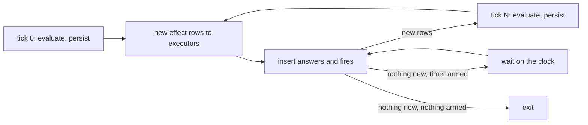

# dl8

DL7, compiled in Rust. The filesystem is the pipe: every `src/_<n>_name/`
folder is one operator, in order. Tests live in `tests/` only; oracle
fixtures in `oracle/`.

| folder | status |
|---|---|
| `_0_read` | `read_dl7/5` port over a character stream, 89 oracle fixtures |
| `_1_macrotime` | reify, `<+` expansion waves over `_6_eval`, materialize, 29 oracle cases |
| `_2_lower` | `0_lowerer.pl` and both graph stores, 19 committed of 62 checked lowerings |
| `_3_check` | `1_checker.pl` port, 19 committed of 75 checked calls, 25 diagnostic functors classified |
| `_4_comptime` | the two nested compiler fixpoints, `2_compiler.pl:700-1591`; `_7_sources.rs` is the live refreeze, `Replay` the oracle one; `_0_load` ports the filesystem, TSI and source-fact loaders, 51 committed of 57 cases |
| `_5_reify` | `0_logical_program_reifier.pl`, `0a_logical_program_grapher.pl`, `1_artifact_emitter.pl`; 57 committed of 88 checked calls |
| `_6_eval` | stratified semi-naive evaluator, parity with v7 `evaluate/4` |
| `_8_driver` | the call in order, `2_compiler.pl:75-700`; `lib.rs::compile` is the chain, 16 committed of 46 whole-pipeline cases |

`prelude/` and `macrotime/` are byte-identical copies of `v7/prelude` and
`v7/macrotime` at `f5018ad23`, compiled into the binary with `include_str!`, so
nothing under `v7/` is read at runtime.

```bash
cargo test                      # oracle parity through the real binary
cargo run -- compile ../v7/test/fixtures/2_partial.dl7
cargo run -- compile oracle/compile/sources/test/fixtures/modules/0_accounts.dl7 \
  oracle/compile/sources/test/fixtures/modules/1_consumer.dl7 \
  --project oracle/compile/sources/test/fixtures/modules
cargo run -- eval oracle/eval/0_transitive.json --trace
```

Refreeze an oracle fixture (needs swipl and the v7 tree):

```bash
cd oracle/eval && swipl dump_eval.pl -- 0_transitive.pl 0_transitive.json
cd ../../.. && swipl v8/oracle/eval/dump_compile.pl -- v7/test/fixtures/2_partial.dl7 v8/oracle/eval/c2_partial
cd v8/oracle/read && V7_DIR=/Users/chrishafley/projects/sprefa/v7 swipl dump_read.pl --
V7_DIR=$PWD/v7 bash v8/oracle/macrotime/refreeze.sh
V7_DIR=v7 bash v8/oracle/lower/freeze.sh
bash v8/oracle/check/freeze.sh            # pins REV=f5018ad23
V7_DIR=v7 bash v8/oracle/load/freeze.sh
bash v8/oracle/reify/freeze.sh
bash v8/oracle/compile/freeze.sh          # pins REV=f5018ad23, all 46 cases
bash v8/oracle/compile/verify.sh          # dl8 over every case, committed or not
```

## The extract binary

`tests/_16_extract_tsi.rs` drives `sprefa-extract`, which lives in
`hafley-rs/crates/sprefa-extract`, over `fixtures/extract/corpus` and feeds the
resulting TSI JSONL to `dl8 compile --tsi`. The test looks for the binary in
this order:

| order | where | note |
|---|---|---|
| 1 | `$SPREFA_EXTRACT_BIN` | an absolute path; a miss is an error, never a fallthrough |
| 2 | `$CARGO_TARGET_DIR/debug/extract` | a lane sets this, and then neither target directory fills |
| 3 | `<sprefa root>/hafley-rs/target/debug/extract` | `hafley-rs` is a gitignored sibling link the lane setup makes; the crate was a workspace member until hafley-rs excluded it |
| 4 | `<sprefa root>/hafley-rs/crates/sprefa-extract/target/debug/extract` | where an excluded crate builds |
| 5 | `cargo build --features cli --bin extract --manifest-path <sprefa root>/hafley-rs/crates/sprefa-extract/Cargo.toml` | run once, capped at 60 s |

```bash
ln -s /Users/chrishafley/projects/hafley-rs hafley-rs   # from the sprefa root
cargo test --test _16_extract_tsi -- --nocapture         # prints the row counts
```

`--family tsi` is not a spelling: `tsi` is the envelope `--witness` wraps a run
in, and the relation rows the loader reads come from `--family type`. More than
one path in one run needs `--resolve`. The `scip_indexes_the_typescript_corpus`
case stands down with a printed reason when `scip-typescript` is not on PATH.

## OpenAPI documents

`dl8 compile <file.dl7> --project <root> --openapi <doc.json>` loads an OpenAPI
3.x JSON document before lowering. `src/_4_comptime/_0_load/_9_openapi.rs`
writes the document as TSI wire rows, so `install_tsi_graph` installs the
schemas unchanged under the owner `module(tsi(openapi, [<doc path as given>]))`.
The flag repeats; every document shares that one owner.

| OpenAPI | graph |
|---|---|
| `components.schemas.X` object | `product` node, `tsi.name` `X`, one edge per property in map order |
| property absent from `required` | the edge targets a sum of `value` and `null` |
| `nullable: true`, `type: [T, "null"]` | the same sum; a property both unrequired and nullable wraps once |
| `enum` of strings | `sum` node, one edge per value to a node named `X::value` |
| `oneOf` / `anyOf` | `sum` node, one edge per branch, labelled by the `discriminator.mapping` tag, else the ref name |
| `type: array` | `application(Array, [Items])`, one named `Array` head |
| `string`, `boolean`, `number`, `null` | prelude classes `string`, `boolean`, `number`, `null` |
| `integer` | `i64`, or `i32` under `format: int32`; `number` takes `f32`/`f64` under `float`/`double` |
| named schema that is a `$ref`, primitive or array | no node; a `$ref` to it lands on its target |
| `$ref` with no target | `openapi_unresolved_ref(Pointer)` |
| one schema name in two documents | `openapi_duplicate_schema(Name)` |
| `allOf`, `not`, a multi-type `type` | `openapi_unmapped_schema(Keyword, Pointer)` |
| `paths./p.<method>` | `openapi.route(Path, Method, OperationId, RequestType, ResponseType)`; no body or no `2XX` content is `void` |
| path and operation `parameters` | `openapi.param(OperationId, Name, In, Type, Required)`; an operation parameter replaces a path one with the same name and `in` |

Key-absent stays unspellable: the unrequired property and the nullable one land
on one sum. `openapi.route` and `openapi.param` are not TSI registry relations,
so `install_openapi_graph` seeds them on the owner's basement after the TSI
install. `fixtures/openapi/todo.dl7` joins `openapi.route` with `Conforms`;
`tests/_21_openapi.rs` pins the rows.

## dl8 run

`dl8 run <compile.json> --serve timer,fetch_json [--db <file>] [--max-ticks N]`
runs a program as a process. The loop lives in `src/_9_runtime/_2_reconcile.rs`,
the executors in `src/_9_runtime/_3_executors/`.



| served name | cadence | row it writes | declare |
|---|---|---|---|
| `timer` | Continuing | `(timer PeriodMs Tick)`, ticks from 1 per period; a late fire is skipped, never replayed | `(: timer (* (: period_ms int) (: tick int)))` |
| `fetch_json` | Once | `(fetch_json Url Body)`, Body the raw 2xx JSON text | `(: fetch_json (* (: url text) (: body text)))` |
| `fetch_json` | Once | `(fetch_json_error Url Status Message)` on non-2xx, a non-JSON body, or transport failure (Status 0); 10 s request timeout | `(: fetch_json_error (* (: url text) (: status int) (: message text)))`, required |

| rule | where it shows |
|---|---|
| each effect row reaches its executor once per process | `Reconciler.effects_seen` |
| on a reloaded db, a Once application with a matching data row is answered; an error row is not, so a restart retries it | `data_row_exists` |
| a timer reloaded from the db numbers past its stored ticks | `Timer::first_tick` |
| a served name with no executor exits 1 with `served_relation_no_executor` | `executors_for` |
| stdout is the closure plus `ticks` and, with `--db`, `insert_statements` | `run_cli` in `src/bin/dl8.rs` |

```bash
cargo run -- compile fixtures/reconcile/0_timer.dl7 > /tmp/timer.json
cargo run -- run /tmp/timer.json --serve timer --max-ticks 3
cargo test --test _17_reconcile      # real binary, real clock, local HTTP listener
```

## Logs

Every phase emits one `dl8::phase` event with its name, measured milliseconds,
row count and diagnostic count. Tracing goes to stderr; stdout stays the oracle.

```bash
RUST_LOG=dl8=debug dl8 compile f.dl7      # phase events, wave/round trace, io reads
HAFLEY_LOG_FORMAT=json dl8 compile f.dl7  # one JSON object per event
dl8 compile f.dl7 --trace                 # wave and round lines, RUST_LOG unset
```

`RUST_LOG` picks the filter when set; `--trace` raises the default to
`dl8=debug` when it is not. `HAFLEY_LOG_FORMAT=human|json` picks the encoding.

Design: `plans/v8/2026-09-12-v8-eval-api.md`. Buy-vs-build:
`plans/v8/2026-09-12-v8-buy-vs-build.md`.
