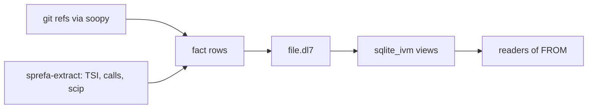

# dl8

dl8 keeps facts about code fresh and lets you ask questions across all of it with rules. Facts come in as rows: git refs from soopy, symbols and calls from sprefa-extract, JSON from an HTTP call. Rules join the rows. When a row changes, every rule that read it runs again. The store is SQLite.

Each section on this page is one program and the rows it prints. The program is a fixture in the tree; the output is what `dl8 eval` printed for it.



## Facts and a rule

A relation is declared with `:`. A fact is the relation applied to values. A rule is `<-`: the head holds when every goal in the body holds. `Reach` reads itself, so it closes over `Edge`.

```dl7
; fixture: v8/fixtures/sqlite_emit/1_transitive.dl7
(: Edge (* (: from text) (: to text)))

(Edge "a" "b")

(Edge "b" "c")

(Edge "c" "d")

(Edge "d" "b")

(Edge "x" "y")

(: Reach (* (: from text) (: to text)))

(<- (Reach ?From ?To)
    (Edge ?From ?To))

(<- (Reach ?From ?To)
    (Reach ?From ?Middle)
    (Edge ?Middle ?To))
```

```
$ bash book/show.sh eval fixtures/sqlite_emit/1_transitive.dl7
(Edge "a" "b")
(Edge "b" "c")
(Edge "c" "d")
(Edge "d" "b")
(Edge "x" "y")
(Reach "a" "b")
(Reach "a" "c")
(Reach "a" "d")
(Reach "b" "b")
(Reach "b" "c")
(Reach "b" "d")
(Reach "c" "b")
(Reach "c" "c")
(Reach "c" "d")
(Reach "d" "b")
(Reach "d" "c")
(Reach "d" "d")
(Reach "x" "y")
```

The cycle `b c d b` terminates because a relation is a set: a row that already exists is not new, and the evaluator stops when a round adds no row. [Facts and rules](3_rules.md) traces the rounds.

## An aggregate

`sum` in a head position folds the matching rows, grouped by the other head variables.

```dl7
; fixture: v8/fixtures/aggregates/2_grouped.dl7
(: Score (* (: player text) (: points int)))

(Score "ann" 3)

(Score "ann" 4)

(Score "bob" 10)

(: PlayerTotal (* (: player text) (: sum int)))

(<- (PlayerTotal ?Player (sum ?Points))
    (Score ?Player ?Points))
```

```
$ bash book/show.sh eval fixtures/aggregates/2_grouped.dl7
(Score "ann" 3)
(Score "ann" 4)
(Score "bob" 10)
(PlayerTotal "ann" 7)
(PlayerTotal "bob" 10)
```

[Aggregates and fold](7_aggregate.md) shows the same fold written as a rule.

## A relation the outside world answers

`fetch_json` is declared like any relation. Nothing in the program marks it. The runner is told to serve it, and the evaluator writes an `effect` row for every application of it a rule asked about. An executor answers effect rows with data rows; until then, a rule over `effect` can say what is loading.

```dl7
; fixture: v8/fixtures/host_effect/3_loading.dl7
; Loading is an ordinary rule over effect; the pattern opens with
; intern_snapshot then cons, the way Partial reads back in the prelude.
(: fetch_json
   (* (: url text)
      (: body text)))

(: Watch (* (: url text)))

(Watch "https://a")

(Watch "https://b")

(: Body
   (* (: url text)
      (: body text)))

(<- (Body ?Url ?Body)
    (Watch ?Url)
    (fetch_json ?Url ?Body))

(: Loading (* (: url text)))

(<- (Loading ?Url)
    (effect fetch_json ?App)
    (intern_snapshot fetch_json ?Args ?App)
    (cons ?Url ?_ ?Args))
```

```
$ bash book/show.sh eval fixtures/host_effect/3_loading.dl7 --serve fetch_json
(effect fetch_json ref(application(fetch_json, ["https://a" none])))
(effect fetch_json ref(application(fetch_json, ["https://b" none])))
(Watch "https://a")
(Watch "https://b")
(Loading "https://a")
(Loading "https://b")
```

No `Body` row yet: `eval` runs the rules once and has no executor. `dl8 run --serve fetch_json` adds the HTTP executor and the loop that feeds its answers back in. [Effects](10_effects.md) and [Executors](11_executors.md) cover both halves.

## Where to go next

- [Running dl8](1_run.md): the verbs `compile`, `eval`, `run`, `emit`, and the store.
- [Declarations](2_declare.md): products, sums, the `return` column.
- [Modules and the prelude](modules/0_a_module_is_a_file.md): how names resolve, what the prelude declares.
- [Hosting](hosting/0_the_seam.md): what it takes to serve a relation from git, HTTP, or a process.
- [Not built yet](16_not_built.md): retraction, `pre`, `latest`, and the rest, each with the plan it sits in.
