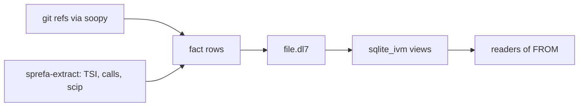

# What dl8 is for

## What

dl8 is the `.dl7` language compiled and run by one Rust binary, `v8/src/bin/dl8.rs`.
The goal: code facts from git, ast-grep, scip and TSI, joined across repositories, kept fresh as refs move.
The target is FROM as an Observable, with `sqlite_ivm` as the seam between rules and live SQL views (`plans/v8/2026-09-15-v8-book.brief.md` section 5).

## Why

The application target, as `v7/README.md:14-22` states it: soopy observes a watched ref moving, file facts are retracted and added, rules maintain cross-repository results in SQLite IVM, and effects dispatch after commit.
`plans/v8/2026-09-13-v8-tour.md` section 1 records the port of that compiler to Rust; section 10 lists what the port left out.

## When to use

Use it when:

- facts come from a repository and a rule joins them across repositories: [Demos](15_demos.md)
- a derived relation must stay a live SQL view: [The SQLite emitter](13_sqlite.md)

Do not use it when:

- a fact must be retracted when its source moves: [Not built yet](16_not_built.md)
- the program needs a shell host: no executor runs a shell, [Executors](11_executors.md)

## Example

The org watcher in `v8/fixtures/hosts/org.dl7` is the smallest program with the shape in the What diagram; [Demos](15_demos.md) runs it.

## What proves it

| claim | path | command |
|---|---|---|
| the application target | `v7/README.md:14-22` | `sed -n 14,22p v7/README.md` |
| the Rust port and its phases | `plans/v8/2026-09-13-v8-tour.md` section 1, `v8/README.md` first table | `sed -n 7,16p v8/README.md` |
| `sqlite_ivm` maintains views inside the source transaction | `sqlite_ivm/README.md:1-10` | `sed -n 1,10p sqlite_ivm/README.md` |
