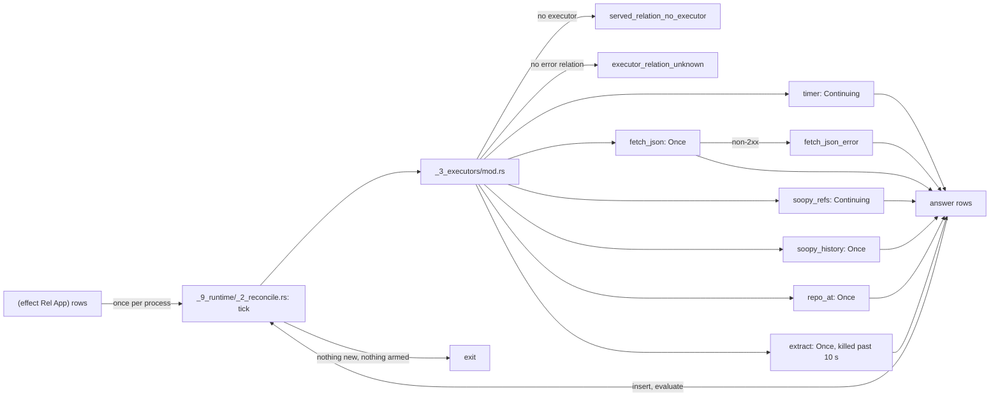

# Executors

## What



`dl8 run <compile.json> --serve <names>` runs ticks: tick 0 evaluates the program; each later tick hands new `effect` rows to the executor of their relation, inserts the answers, evaluates, and persists with `--db` (`src/_9_runtime/_2_reconcile.rs:1-2`, `v8/README.md:71-86`).
Each served name maps to one Rust executor (`src/_9_runtime/_3_executors/mod.rs:45-106`). A name with no executor is `served_relation_no_executor`; a missing companion error relation is `executor_relation_unknown`; both exit 1 before tick 0.
Cadence `Once` answers an application once; `Continuing` arms on an application and then writes rows on its own clock (`_2_reconcile.rs:12-18`).
Each `effect` row reaches its executor once per process (`_2_reconcile.rs:44-47`). The run ends when a tick adds nothing and no executor is armed, or at `--max-ticks`.

| served name | columns | cadence | answers | error relation | source |
|---|---|---|---|---|---|
| `timer` | `period_ms int, tick int` | Continuing | one row per fire, ticks from 1; a late fire is skipped | none | `_3_executors/timer.rs` |
| `fetch_json` | `url text, body text` | Once | the 2xx JSON body | `fetch_json_error url text, status int, message text`; status 0 on transport failure | `_3_executors/fetch_json.rs` |
| `soopy_refs` | `root text, name text, sha text` | Continuing | every ref plus `HEAD` at arming, then each moved or added ref | `soopy_refs_error root text, message text` | `_3_executors/soopy_refs.rs` |
| `soopy_history` | `root text, sha text, parent text` | Once | one row per parent edge reachable from `sha`, or `HEAD` when unbound | `soopy_history_error root text, message text` | `_3_executors/soopy_history.rs` |
| `repo_at` | `root text, sha text, path text, blob text` | Once | one row per tracked file at the revision | `repo_at_error root text, sha text, message text` | `_3_executors/repo_at.rs` |
| `extract` | `root text, family text, kind text, payload text` | Once | one `extract --family <family> --resolve` run, one row per JSONL record; past 10 s the run is killed | `extract_error root text, family text, message text` | `_3_executors/extract.rs` |

Rows from `v8/README.md:115-122`.

## Why

`v8/README.md:108-113`: git runs only inside `soopy`, a path dependency, and `extract` is the `sprefa-extract` binary.
The roster is a closed `match` in Rust; any other served name is the `served_relation_no_executor` stop at construction (`_3_executors/mod.rs:100`). No written v8 decision gives the reason.

## When to use

Use it when:

- rows arrive on a clock: `timer`, `fixtures/reconcile/0_timer.dl7`
- one HTTP JSON body per url: `fetch_json`, `fixtures/reconcile/1_fetch.dl7`
- refs of a repository, live: `soopy_refs`, `fixtures/hosts/0_refs.dl7`
- the commit graph: `soopy_history`, `fixtures/hosts/1_history.dl7`
- the files at a revision: `repo_at`, `fixtures/hosts/2_repo_at.dl7`
- code facts: `extract`, `fixtures/hosts/3_extract.dl7`

Do not use it when:

- a removed ref must retract its row: a removed ref writes nothing (`v8/README.md:126`)
- a commit time is needed: `soopy_history` carries none (`v8/README.md:127`)
- a field of an extract record is needed as a column: `payload` stays one text term (`v8/README.md:128`)

## Example

A timer (the program is in [Running dl8](1_run.md)), then a name with no executor:

```console
$ bash book/show.sh run fixtures/reconcile/0_timer.dl7 --serve timer --max-ticks 2
(effect timer ref(application(timer, [1 none])))
(timer 1 1)
(timer 1 2)
(Fired 1)
(Fired 2)
(FiredCount 1)
(FiredCount 2)
ticks 2
exit 0
```

```console
$ bash book/show.sh run fixtures/reconcile/0_timer.dl7 --serve Fired
diagnostic served_relation_no_executor(Fired)
exit 1
```

`fetch_json` without its error relation, then with it and a url that is not one:

```console
$ bash book/show.sh run fixtures/host_effect/0_pending.dl7 --serve fetch_json
diagnostic executor_relation_unknown(fetch_json_error)
exit 1
```

```dl7
; fixture: v8/fixtures/reconcile/1_fetch.dl7
; One url, fetched once; an answer lands as a row the reader joins like a fact.
(: fetch_json
   (* (: url text)
      (: body text)))

(: fetch_json_error
   (* (: url text)
      (: status int)
      (: message text)))

(: Watch (* (: url text)))

(Watch "__URL__")

(: Body
   (* (: url text)
      (: body text)))

(<- (Body ?Url ?Body)
    (Watch ?Url)
    (fetch_json ?Url ?Body))

(: Failed
   (* (: url text)
      (: status int)))

(<- (Failed ?Url ?Status)
    (Watch ?Url)
    (fetch_json_error ?Url ?Status ?Message))
```

```console
$ bash book/show.sh run fixtures/reconcile/1_fetch.dl7 --serve fetch_json
(effect fetch_json ref(application(fetch_json, ["__URL__" none])))
(fetch_json_error "__URL__" 0 "bad uri: __URL__ is missing scheme")
(Watch "__URL__")
(Failed "__URL__" 0)
ticks 1
exit 0
```

`soopy_history` and `repo_at` over a two-commit repository made on the spot:

```dl7
; fixture: v8/fixtures/hosts/1_history.dl7
; Every parent edge reachable from HEAD.
(: soopy_history
   (* (: root text)
      (: sha text)
      (: parent text)))

(: soopy_history_error
   (* (: root text)
      (: message text)))

(: Watch (* (: root text)))

(Watch "__ROOT__")

(: Edge
   (* (: sha text)
      (: parent text)))

(<- (Edge ?Sha ?Parent)
    (Watch ?Root)
    (soopy_history ?Root ?Sha ?Parent))

(: Failed (* (: message text)))

(<- (Failed ?Message)
    (Watch ?Root)
    (soopy_history_error ?Root ?Message))
```

```console
$ d=$(mktemp -d) && export GIT_AUTHOR_NAME=dl8 GIT_AUTHOR_EMAIL=dl8@example.invalid GIT_COMMITTER_NAME=dl8 GIT_COMMITTER_EMAIL=dl8@example.invalid GIT_AUTHOR_DATE="1700000000 +0000" GIT_COMMITTER_DATE="1700000000 +0000" && git -C $d init -q -b main && echo one > $d/a.txt && git -C $d add a.txt && git -C $d commit -q -m a && echo two > $d/b.txt && git -C $d add b.txt && git -C $d commit -q -m b && sed "s|__ROOT__|$d|" fixtures/hosts/1_history.dl7 > $d/history.dl7 && sed -e "s|__ROOT__|$d|" -e "s|__SHA__|$(git -C $d rev-parse HEAD)|" fixtures/hosts/2_repo_at.dl7 > $d/repo_at.dl7 && bash book/show.sh run $d/history.dl7 --serve soopy_history | grep '^(Edge \|^(Failed \|^ticks\|^exit' && bash book/show.sh run $d/repo_at.dl7 --serve repo_at | grep '^(File \|^ticks\|^exit'
(Edge "e11e71ad03bcedad1d840052fac86d369363baab" "1bd4c43e7380496d43b8c78be3cb324f0a1aec7f")
ticks 1
exit 0
(File "a.txt" "5626abf0f72e58d7a153368ba57db4c673c0e171")
(File "b.txt" "f719efd430d52bcfc8566a43b2eb655688d38871")
ticks 1
exit 0
```

`extract` with no binary answers one error row per family:

```dl7
; fixture: v8/fixtures/hosts/3_extract.dl7
; Three extract families over one root; each record is a row.
(: extract
   (* (: root text)
      (: family text)
      (: kind text)
      (: payload text)))

(: extract_error
   (* (: root text)
      (: family text)
      (: message text)))

(: Want
   (* (: root text)
      (: family text)))

(Want "__ROOT__" "type")

(Want "__ROOT__" "call")

(Want "__ROOT__" "diet_scip")

(: Fact
   (* (: family text)
      (: kind text)
      (: payload text)))

(<- (Fact ?Family ?Kind ?Payload)
    (Want ?Root ?Family)
    (extract ?Root ?Family ?Kind ?Payload))

(: Failed
   (* (: family text)
      (: message text)))

(<- (Failed ?Family ?Message)
    (Want ?Root ?Family)
    (extract_error ?Root ?Family ?Message))
```

```console
$ SPREFA_EXTRACT_BIN=/nonexistent/extract bash book/show.sh run fixtures/hosts/3_extract.dl7 --serve extract | grep '^(Failed \|^ticks\|^exit'
(Failed "call" "SPREFA_EXTRACT_BIN names /nonexistent/extract, which does not exist")
(Failed "diet_scip" "SPREFA_EXTRACT_BIN names /nonexistent/extract, which does not exist")
(Failed "type" "SPREFA_EXTRACT_BIN names /nonexistent/extract, which does not exist")
ticks 1
exit 0
```

## What proves it

| claim | path | command |
|---|---|---|
| timer fires, count reads every fire, numbering continues past a db | `tests/_17_reconcile.rs:161-201` | `cargo test --test _17_reconcile` |
| fetch body, non-2xx, non-JSON, closed port | `tests/_17_reconcile.rs:203-267` | `cargo test --test _17_reconcile` |
| no executor, no error relation | `tests/_17_reconcile.rs:291-326` | `cargo test --test _17_reconcile` |
| refs snapshot then moved ref; history; files per revision; missing repository | `tests/_20_hosts.rs:228-345` | `cargo test --test _20_hosts` |
| extract rows per family over the corpus, and with no binary | `tests/_20_hosts.rs:407-466` | `cargo test --test _20_hosts` |
| the roster in code | `src/_9_runtime/_3_executors/mod.rs:61-100` | `sed -n 61,100p src/_9_runtime/_3_executors/mod.rs` |
