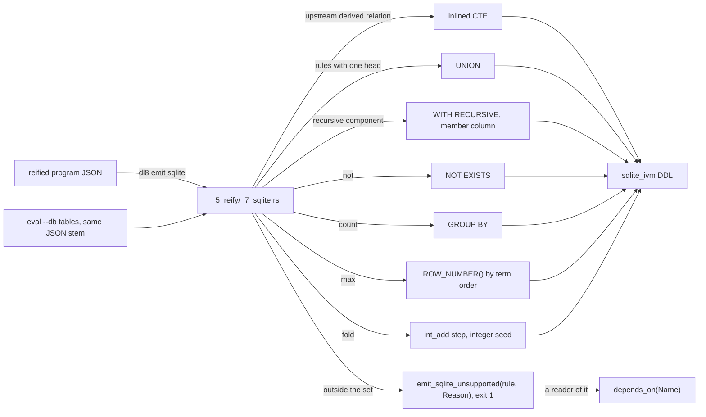

# The SQLite emitter

## What



`dl8 emit sqlite <compile.json>` prints one `CREATE VIRTUAL TABLE ... USING sqlite_ivm('<SELECT>')` per derived relation, in dependency order, over the tables `dl8 eval --db` writes under the same JSON stem (`src/bin/dl8.rs:65-69`, `:207-261`, `src/_5_reify/_7_sqlite.rs:57-60`).
`sqlite_ivm` reads ordinary tables only, so every upstream derived relation is inlined as a CTE (`_7_sqlite.rs:1-2`).
Several rules for one head are `UNION`; a recursive component is one `WITH RECURSIVE` CTE, and mutual recursion shares it through a `member` column; a negative goal is `NOT EXISTS`; `count` is `GROUP BY`; `max` ranks by the term order with `ROW_NUMBER()` (the SQL keywords per view in the example).
A `fold` lowers only when its step is kernel `int_add` with an integer seed (`_7_sqlite.rs:851-872`).
A rule outside that set gets `emit_sqlite_unsupported(rule(Relation, Ordinal), Reason)`, exit 1; a rule reading a failed relation gets `depends_on` (`_7_sqlite.rs:38-55`, `:106-114`, `:210-252`).

| reason (`_7_sqlite.rs:38-55`, `:216-251`) | fixture that shows it |
|---|---|
| a kernel name, e.g. `nil` | `fixtures/sqlite_emit/4_outside.dl7:34-37` |
| `mixed_column(Position)` | `fixtures/sqlite_emit/4_outside.dl7:20-27` |
| `nonlinear_recursion` | `fixtures/sqlite_emit/4_outside.dl7:12-14` |
| `depends_on(Name)` | `fixtures/sqlite_emit/4_outside.dl7:29-32` |
| `fold(Step)`, `unbound(Variable)` | `fixtures/fold/1_program_step.dl7`, `fixtures/fold/2_order_matters.dl7` |
| `relation(Name)`, `unstored_relation(Name)`, `constant(Term)`, `malformed_aggregate`, `recursion_without_anchor`, `seeded_rule_head`, `unnamed_relation`, `no_source` | no fixture; not shown |

`plans/v8/2026-09-13-v8-tour.md` section 10 lists the sqlite emitter as not built; `dl8 emit sqlite` exists (`src/bin/dl8.rs:65-69`). The code wins.

## Why

`plans/v8/2026-09-14-v8-sqlite-emitter.brief.md:15`: each derived relation becomes a view `sqlite_ivm` maintains over the store's row tables, and anything outside its grammar is a named diagnostic naming the rule.
`sqlite_ivm/README.md:1-5`: source INSERT, UPDATE and DELETE maintain the views inside the source transaction.

## When to use

Use it when:

- a union or filter must stay live in SQL: `fixtures/sqlite_emit/0_union_filter.dl7`
- linear or mutual recursion: `fixtures/sqlite_emit/1_transitive.dl7`, `2_mutual.dl7`
- negation, count or max over a recursive relation: `fixtures/sqlite_emit/3_consumers.dl7`

Do not use it when:

- recursion reads its own head twice in one body: `nonlinear_recursion`, `fixtures/sqlite_emit/4_outside.dl7:12-14`
- a fold step is a program relation: `fold(Doubling)`, `fixtures/fold/1_program_step.dl7`
- a body reads `nil`: `fixtures/sqlite_emit/4_outside.dl7:34-37`

## Example

```console
$ d=$(mktemp -d) && $DL8 compile fixtures/sqlite_emit/1_transitive.dl7 > $d/1_transitive.json && $DL8 emit sqlite $d/1_transitive.json | jq -r '.views[] | .ddl'
CREATE VIRTUAL TABLE "1_transitive.Reach_v2" USING sqlite_ivm('WITH RECURSIVE "Reach_r2"("member", "c0", "c1") AS (SELECT 0, t0."c0_term", t0."c1_term" FROM "1_transitive.Edge_a2" AS t0 WHERE 1 UNION SELECT 0, t0."c0", t1."c1_term" FROM "Reach_r2" AS t0 JOIN "1_transitive.Edge_a2" AS t1 ON (t0."c1" = t1."c0_term") WHERE t0."member" = 0), "Reach_v2"("c0_term", "c1_term") AS (SELECT "c0", "c1" FROM "Reach_r2" WHERE "member" = 0) SELECT "c0_term", "c1_term" FROM "Reach_v2"')
```

Every view of a program with negation, count and max over recursion:

```dl7
; fixture: v8/fixtures/sqlite_emit/3_consumers.dl7
(: Node (* (: name text)))

(Node "a")

(Node "b")

(Node "c")

(Node "d")

(: Edge (* (: from text) (: to text)))

(Edge "a" "b")

(Edge "b" "c")

(Edge "d" "a")

(: Reach (* (: from text) (: to text)))

(<- (Reach ?From ?To)
    (Edge ?From ?To))

(<- (Reach ?From ?To)
    (Reach ?From ?Middle)
    (Edge ?Middle ?To))

(: Unreached (* (: name text)))

(<- (Unreached ?Name)
    (Node ?Name)
    (not (Reach "a" ?Name)))

(: OutDegree (* (: from text) (: count int)))

(<- (OutDegree ?From (count ?To))
    (Reach ?From ?To))

(: Farthest (* (: from text) (: to text)))

(<- (Farthest ?From (max ?To))
    (Reach ?From ?To))
```

```console
$ d=$(mktemp -d) && $DL8 compile fixtures/sqlite_emit/3_consumers.dl7 > $d/3_consumers.json && $DL8 emit sqlite $d/3_consumers.json | jq -r '.views[] | "\(.relation) stratum \(.stratum): \([.ddl | match("UNION|WITH RECURSIVE|NOT EXISTS|GROUP BY|ROW_NUMBER"; "g").string] | unique | join(", "))"'
Reach stratum 0: UNION, WITH RECURSIVE
Farthest stratum 1: ROW_NUMBER, UNION, WITH RECURSIVE
OutDegree stratum 1: GROUP BY, UNION, WITH RECURSIVE
Unreached stratum 1: NOT EXISTS, UNION, WITH RECURSIVE
```

```console
$ bash book/show.sh emit fixtures/sqlite_emit/3_consumers.dl7 sqlite
view Reach stratum 0
view Farthest stratum 1
view OutDegree stratum 1
view Unreached stratum 1
exit 0
```

Four rules outside the set:

```dl7
; fixture: v8/fixtures/sqlite_emit/4_outside.dl7
(: Edge (* (: from text) (: to text)))

(Edge "a" "b")

(Edge "b" "c")

(: Path (* (: from text) (: to text)))

(<- (Path ?From ?To)
    (Edge ?From ?To))

(<- (Path ?From ?To)
    (Path ?From ?Middle)
    (Path ?Middle ?To))

(: Input (* (: value int)))

(Input 1)

(: Level (* (: value int)))

(<- (Level ?Value)
    (Input ?Value))

(<- (Level ?Next)
    (Input ?Value)
    (int_add ?Value 1 ?Next))

(: Uses (* (: value int)))

(<- (Uses ?Value)
    (Level ?Value))

(: Empty (* (: list any)))

(<- (Empty ?List)
    (nil ?List))
```

```console
$ bash book/show.sh emit fixtures/sqlite_emit/4_outside.dl7 sqlite
diagnostic emit_sqlite_unsupported(rule(Empty, 0), nil)
diagnostic emit_sqlite_unsupported(rule(Level, 0), mixed_column(0))
diagnostic emit_sqlite_unsupported(rule(Path, 1), nonlinear_recursion)
diagnostic emit_sqlite_unsupported(rule(Uses, 0), depends_on(Level))
exit 1
```

## What proves it

| claim | path | command |
|---|---|---|
| each view equals the closure, and again after one seed is deleted through SQL | `tests/_18_sqlite_emit.rs:1-16` | `cargo test --test _18_sqlite_emit` (needs the `sqlite_ivm` extension, `_18_sqlite_emit.rs:13-15`) |
| the diagnostics of every fixture outside the set | `fixtures/sqlite_emit/expected_diagnostics.json` | `cargo test --test _18_sqlite_emit` |
| every unsupported reason | `src/_5_reify/_7_sqlite.rs:38-55` | `sed -n 38,55p src/_5_reify/_7_sqlite.rs` |
| the recursion and consumer grammar `sqlite_ivm` accepts | `sqlite_ivm/README.md` "Supported query shapes" | `grep -n Recursion sqlite_ivm/README.md` |
