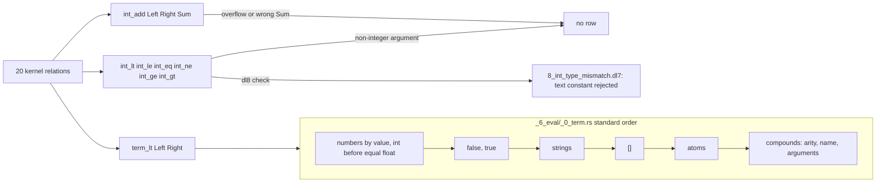

# Comparison and arithmetic

## What



`int_lt int_le int_eq int_ne int_ge int_gt` hold when both arguments are integers in that relation; a non-integer argument gives no row (`src/_6_eval/_4_kernel.rs:96-103`, `:188-192`).
`(int_add Left Right Sum)` binds `Sum` to `Left + Right`; an overflowing sum has no row, and a bound wrong sum fails (`_4_kernel.rs:200-214`).
`(term_lt Left Right)` holds when `Left` precedes `Right` in the standard term order (`_4_kernel.rs:194-199`).
The order: numbers by value, an int before an equal float, then `false`, `true`, then strings, then `[]`, then atoms, then compounds by arity, name, arguments (`src/_6_eval/_0_term.rs:171-219`).
The checker needs both sides of a comparison bound and rejects a non-integer constant there (`src/_3_check/_4_mode.rs:132-153`, `:181-186`); a variable bound to text passes the checker and yields no row.
The checker has no mode clause for `int_add` or `term_lt`; they fall to the default that binds every variable (`_4_mode.rs:218-221`).

## Why

`plans/v8/2026-09-13-v8-tour.md` section 5: `int_lt .. int_gt` replaced the Peano `before/3` closure rejected in v7.
`term_lt` answers Chris's "lets keep them somehow programmable", as the design review cites it (`plans/v8/2026-09-14-v8-design-review.fable.md:49`).

## When to use

Use it when:

- a filter on an integer column: `int_gt`, `fixtures/sqlite_emit/0_union_filter.dl7:34-36`
- a computed column: `int_add`, `fixtures/literals/2_int_add.dl7:9-11`
- an order over any kind, or a top-k by negation: `term_lt`, `fixtures/term_lt/1_top.dl7`

Do not use it when:

- a side is unbound when the goal runs: `underconstrained_kernel_goal`, `oracle/check/cases/7_under_int_lt.dl7`
- a side is a text constant: `kernel_argument_type_mismatch`, `oracle/check/cases/8_int_type_mismatch.dl7`
- the job is a group minimum or maximum: [Aggregates and fold](7_aggregate.md)

## Example

```dl7
; fixture: v8/fixtures/literals/2_int_add.dl7
(: Input (* (: value int)))

(Input 7)

(Input 35)

(: Plus (* (: value int)))

(<- (Plus ?Sum)
    (Input ?Value)
    (int_add ?Value 100 ?Sum))
```

```console
$ bash book/show.sh eval fixtures/literals/2_int_add.dl7
(Input 7)
(Input 35)
(Plus 107)
(Plus 135)
exit 0
```

The kind order across a float, an int, a bool and a string:

```dl7
; fixture: v8/fixtures/term_lt/0_mixed_kinds.dl7
(: Item (* (: value any)))

(Item 3)

(Item "apple")

(Item true)

(Item 1.5)

(: Below (* (: left any) (: right any)))

(<- (Below ?Left ?Right)
    (Item ?Left)
    (Item ?Right)
    (term_lt ?Left ?Right))
```

```console
$ bash book/show.sh eval fixtures/term_lt/0_mixed_kinds.dl7
(Item 1.5)
(Item 3)
(Item true)
(Item "apple")
(Below 1.5 3)
(Below 1.5 true)
(Below 1.5 "apple")
(Below 3 true)
(Below 3 "apple")
(Below true "apple")
exit 0
```

Every comparison, a negated one, and a text value at `int_lt` (`text_never` has no row):

```console
$ bash book/show.sh eval oracle/eval/5_int_compare.json
(ge_two 2)
(ge_two 3)
(le_two 1)
(le_two 2)
(less 1 2)
(less 1 3)
(less 2 3)
(ne_two 1)
(ne_two 3)
(not_less 1 1)
(not_less 2 1)
(not_less 2 2)
(not_less 3 1)
(not_less 3 2)
(not_less 3 3)
(num 1)
(num 2)
(num 3)
(same 1)
(same 2)
(same 3)
(word x)
exit 0
```

A text constant at `int_lt`:

```dl7
; fixture: v8/oracle/check/cases/8_int_type_mismatch.dl7
; diagnostic: kernel_argument_type_mismatch
(: point
   (* (: x int)))

(: reader
   (* (: seen int)))

(<- (reader ?Value)
    (point ?Value)
    (int_lt ?Value "three"))
```

```console
$ bash book/show.sh compile oracle/check/cases/8_int_type_mismatch.dl7
diagnostic diagnostic(check, none, kernel_argument_type_mismatch(int_lt, 1, int, "three"))
exit 1
```

## What proves it

| claim | path | command |
|---|---|---|
| `int_add` over literals | `fixtures/literals/2_int_add.expected.json` | `cargo test --test _10_literals` |
| mixed-kind order | `fixtures/term_lt/0_mixed_kinds.expected.json` | `cargo test --test _12_term_lt` |
| the order over atoms, strings, lists and compounds | `oracle/eval/13_deep_terms_order.pl` | `bash book/show.sh eval oracle/eval/13_deep_terms_order.json` |
| comparison complements and text at `int_lt` | `oracle/eval/5_int_compare.pl` | `cargo test --test _0_eval_oracle` |
| a text constant is rejected | `oracle/check/cases/8_int_type_mismatch.dl7` | `cargo test --test _4_check_oracle` |
| `int_gt` and `int_add` lower to SQL | `fixtures/sqlite_emit/0_union_filter.dl7` | `cargo test --test _18_sqlite_emit` |
