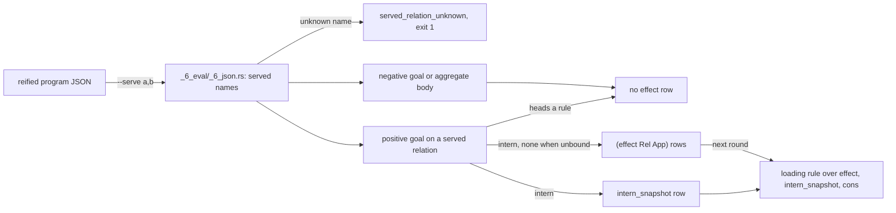

# Effects

An effect row records that a program asked the outside world to settle a relation. The evaluator writes the row while it evaluates, and an ordinary rule reads it back. The row turns a goal the program cannot satisfy from its own tables into data the program can act on (`src/_6_eval/_5_evaluate.rs:244-249`).

This chapter explains when the evaluator writes that row, what the row carries, and how a rule turns it into a loading query. Before the diagram, three terms need definitions: the served set, the application term, and the two goals that never produce a row.

## What

A program can declare a relation and give it no rows. A goal on that relation then has nothing to match, so the evaluator records the call instead of failing, and the served set decides which relations receive that treatment.

The served set is a runtime input rather than a property of the program. `--serve a,b` on `dl8 eval` or `dl8 run` names the relations the outside settles, resolved against the program's declared names (`src/_6_eval/_6_json.rs:345-366`, `src/bin/dl8.rs:318-323`). An unknown name is `served_relation_unknown` and exit 1. Without the flag the served set is empty.

The application term is the call record, and it is what a reading rule opens to recover the original arguments. `Application` is the `intern` of the relation over the goal's arguments in position order, with the atom `none` at each unbound position (`src/_6_eval/_5_evaluate.rs:263-276`).

Evaluation starts from the reified program JSON that `dl8 compile` prints and `dl8 eval` reads (`tests/_14_host_effect.rs:1-5`). A goal is positive when it must hold, negative when it must not, and an aggregate body collects rows instead of demanding a match (`src/_6_eval/_5_evaluate.rs:175-180`). A served relation heads a rule when the program gives it one, and such a goal is answered by the rule rather than by the outside.

The diagram traces one pass of evaluation, from the served names to the effect rows that feed the next round.



*Learning objective (Understand): explain, from the diagram, when the evaluator writes an effect row and what that row carries.*

Every evaluation of a positive goal on a served relation that heads no rule writes one row `(effect Relation Application)`, whether or not a data row matched (`src/_6_eval/_5_evaluate.rs:244-249`, `:261-262`). The same row is written to `intern_snapshot`, so a rule can open it (`:272-273`, `:826-829`).

Two kinds of goal stay silent. Negative goals and aggregate bodies write no `effect` row (`src/_6_eval/_5_evaluate.rs:175-180`, `:147-149`).

`effect` itself is a kernel relation. It has arity 2 and keys `[0,1]` (`src/_3_check/_5_kernel.rs:29`, `:56`). A goal on `effect` reads the round's new rows the same way a current-stratum goal does (`src/_6_eval/_5_evaluate.rs:341-360`).

Loading is then an ordinary rule over `effect`, `intern_snapshot` and `cons`, and a served goal with nothing bound is a source.

The rules above settle five earlier disagreements between the design briefs and the code. In each row the code wins.

| plan | code | winner |
|---|---|---|
| `plans/v8/2026-09-14-v8-effect-demand.brief.md:24`: a row only when no row matched | `_5_evaluate.rs:261-262`: every evaluation; the brief's own amendment at `:79` agrees | code |
| `effect-demand.brief.md:79`: every goal on a served relation | `_5_evaluate.rs:246`: not when the served relation heads a rule | code |
| `plans/v8/2026-09-14-v8-store.PLAN.md:906`: `(effect ?Host ?Key ?Rule)` | `_3_check/_5_kernel.rs:29`: arity 2 | code |
| `effect-demand.brief.md:25`: `effect` never enters `KERNEL_RELATIONS` | `_3_check/_5_kernel.rs:29`: it is there; amendment `:84` agrees | code |
| `src/bin/dl8.rs:73` help: "a miss on one writes an `effect` row" | `_5_evaluate.rs:261-262` | code |

## Why

The served set lives on the command line, not in the program. Chris, 2026-09-14: any relation is settable from outside; nothing in the program marks a relation as hosted; the outside says what it serves, and loading, failed and ready are ordinary rules (`plans/v8/2026-09-14-v8-effect-demand.brief.md:11`).

Amendment 3, same day: the row is live interest, and its argument list reads back with `intern_snapshot` then `cons` the way `Partial` does (`effect-demand.brief.md:76-81`).

## When to use

Use it when:

- a relation's rows come from a process outside the program: `--serve`, `fixtures/host_effect/0_pending.dl7`
- a program shows what is in flight: a loading rule, `fixtures/host_effect/3_loading.dl7`
- a stream with no request arguments: a source, `fixtures/host_effect/2_source.dl7`

Do not use it when:

- the served relation also heads a rule: no `effect` row is written, `_5_evaluate.rs:246`
- interest should end when the reading rule stops: rows are never retracted, [Not built yet](16_not_built.md)
- the program only runs `dl8 eval`: nobody answers the row, use `dl8 run`, [Executors](11_executors.md)

## Example

The first fixture serves `fetch_json` and supplies one settled row. The `Body` rule reads `Watch` and `fetch_json`, so the settled row reaches it and the miss does not.

`v8/fixtures/host_effect/1_settled.dl7`:

```dl7
; A settled row feeds the reader like any fact; the miss stays for the other url.
(: fetch_json
   (* (: url text)
      (: body text)))

(: Watch (* (: url text)))

(Watch "https://a")

(Watch "https://b")

(fetch_json "https://a" "hello")

(: Body
   (* (: url text)
      (: body text)))

(<- (Body ?Url ?Body)
    (Watch ?Url)
    (fetch_json ?Url ?Body))
```

```console
$ bash book/show.sh eval fixtures/host_effect/1_settled.dl7 --serve fetch_json
(effect fetch_json ref(application(fetch_json, ["https://a" none])))
(effect fetch_json ref(application(fetch_json, ["https://b" none])))
(fetch_json "https://a" "hello")
(Watch "https://a")
(Watch "https://b")
(Body "https://a" "hello")
exit 0
```

Both goals were evaluated, so both have an `effect` row; the fixture's comment says "the miss stays for the other url", which was the first design (`effect-demand.brief.md:47`) before amendment 3.

A rule opens the application with `intern_snapshot` and `cons`. `v8/fixtures/host_effect/3_loading.dl7:21-26`:

```dl7
(: Loading (* (: url text)))

(<- (Loading ?Url)
    (effect fetch_json ?App)
    (intern_snapshot fetch_json ?Args ?App)
    (cons ?Url ?_ ?Args))
```

```console
$ bash book/show.sh eval fixtures/host_effect/3_loading.dl7 --serve fetch_json
(effect fetch_json ref(application(fetch_json, ["https://a" none])))
(effect fetch_json ref(application(fetch_json, ["https://b" none])))
(Watch "https://a")
(Watch "https://b")
(Loading "https://a")
(Loading "https://b")
exit 0
```

A goal with nothing bound makes the whole pattern free, so the served relation becomes a stream. `v8/fixtures/host_effect/2_source.dl7`:

```dl7
; Nothing is bound, so the whole pattern is free: a source.
(: tick (* (: at int)))

(: Seen (* (: at int)))

(<- (Seen ?At)
    (tick ?At))
```

```console
$ bash book/show.sh eval fixtures/host_effect/2_source.dl7 --serve tick
(effect tick ref(application(tick, [none])))
exit 0
```

```console
$ bash book/show.sh eval fixtures/host_effect/2_source.dl7
exit 0
```

A name the program does not declare:

```console
$ bash book/show.sh eval fixtures/host_effect/0_pending.dl7 --serve fetch_jsonn
diagnostic served_relation_unknown(fetch_jsonn)
exit 1
```

## What proves it

| claim | path | command |
|---|---|---|
| pending, settled, source, loading, unserved | `fixtures/host_effect/*.expected.json`, `tests/_14_host_effect.rs:17-24` | `cargo test --test _14_host_effect` |
| an unknown served name | `tests/_14_host_effect.rs:123` | `cargo test --test _14_host_effect serving_a_name_the_program_does_not_declare_is_a_diagnostic` |
| every declared relation reaches `program.names` | `tests/_14_host_effect.rs:142` | `cargo test --test _14_host_effect every_declared_relation_reaches_the_names_table` |
| the effect branch | `src/_6_eval/_5_evaluate.rs:244-276` | `sed -n 244,276p src/_6_eval/_5_evaluate.rs` |

## Key takeaways

- The served set is a runtime input. `--serve` names the relations the outside settles, an unknown name is a diagnostic, and an absent flag leaves the set empty.
- The evaluator writes one `(effect Relation Application)` row on every evaluation of a served goal that heads no rule, hit or miss.
- The application term is the relation interned over its positional arguments, with `none` at each unbound position, and the same row lands in `intern_snapshot`.
- Negative goals and aggregate bodies write no `effect` row.
- `effect` is a kernel relation of arity 2, and a rule reads it with `intern_snapshot` and `cons` like any other round data.
