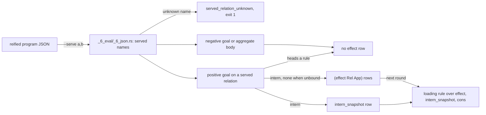

# Effects

A dl8 program can name relations whose rows come from outside the program instead of from its own rules. The `effect` relation records each request the program makes on such a relation, so the outside process can see what is in flight and settle it. This chapter explains when dl8 writes an `effect` row, what the row contains, and how a rule reads it back.

## What the `--serve` flag names

The `--serve a,b` flag on `dl8 eval` or `dl8 run` takes a comma-separated list of relation names. Each name must match a relation the program declares; dl8 resolves the name against the program's declared names and marks the relation as served (`src/_6_eval/_6_json.rs:345-366`). A name the program does not declare is the diagnostic `served_relation_unknown`, and the run exits with code 1 (`src/bin/dl8.rs:318-323`). Without the flag, the served set is empty and dl8 writes no `effect` rows (`plans/v8/2026-09-14-v8-effect-demand.brief.md:23`).

## When dl8 writes an effect row

Three conditions produce one `effect` row (`src/_6_eval/_5_evaluate.rs:244-249`):

- the goal is a positive goal,
- the goal's relation is in the served set,
- no rule in the program heads that relation (`src/_6_eval/_5_evaluate.rs:246`).

The row is written on every evaluation of such a goal, whether or not a data row matched (`src/_6_eval/_5_evaluate.rs:261-262`). A hit and a miss both record interest.

Two kinds of goals never write an `effect` row:

- negative goals, which return before the effect branch runs (`src/_6_eval/_5_evaluate.rs:175-180`);
- goals inside aggregate bodies, which run in a tables-only mode with no effects (`src/_6_eval/_5_evaluate.rs:147-149`).

#### Diagram: How a served goal becomes an effect row

Learning objective: explain the path from a served goal to an `effect` row and to the rules that read it (Bloom level: Understand, verb: explain).



The diagram names three terms the prose above has defined: the served set, the `effect` row, and the loading rule defined below.

## What the row contains

The row is a pair `(effect Relation Application)`:

- `Relation` is the served relation.
- `Application` is the `intern` of the relation applied to the goal's arguments in position order, with the atom `none` at each unbound position (`src/_6_eval/_5_evaluate.rs:263-276`).

The same interned row is written to `intern_snapshot` (`src/_6_eval/_5_evaluate.rs:272-273`, `:826-829`), so a rule can open the argument list the way it opens a `Partial`.

`effect` itself is a kernel relation with arity 2 and keys `[0, 1]` (`src/_3_check/_5_kernel.rs:29`, `:56`). A goal on `effect` reads the round's new rows the way a current-stratum goal does, because neither relation the branch writes heads a rule and their rows arrive inside a round (`src/_6_eval/_5_evaluate.rs:341-360`).

## Reading a row with a loading rule

Loading is an ordinary rule over `effect`, `intern_snapshot` and `cons`. A served goal with nothing bound is a source: the whole pattern is free, and the row still records the interest.

## Where the plan and the code disagree

Five points in the planning documents conflict with the code that shipped. The prose above already defined both sides of each disagreement; the table compares them.

| plan | code | winner |
|---|---|---|
| `plans/v8/2026-09-14-v8-effect-demand.brief.md:24`: a row only when no row matched | `_5_evaluate.rs:261-262`: every evaluation; the brief's own amendment at `:79` agrees | code |
| `effect-demand.brief.md:79`: every goal on a served relation | `_5_evaluate.rs:246`: not when the served relation heads a rule | code |
| `plans/v8/2026-09-14-v8-store.PLAN.md:906`: `(effect ?Host ?Key ?Rule)` | `_3_check/_5_kernel.rs:29`: arity 2 | code |
| `effect-demand.brief.md:25`: `effect` never enters `KERNEL_RELATIONS` | `_3_check/_5_kernel.rs:29`: it is there; amendment `:84` agrees | code |
| `src/bin/dl8.rs:73` help: "a miss on one writes an `effect` row" | `_5_evaluate.rs:261-262` | code |

## Why

Chris, 2026-09-14: any relation is settable from outside; nothing in the program marks a relation as hosted; the outside says what it serves, and loading, failed and ready are ordinary rules (`plans/v8/2026-09-14-v8-effect-demand.brief.md:11`).
Amendment 3, same day: the row is live interest, and its argument list reads back with `intern_snapshot` then `cons` the way `Partial` does (`effect-demand.brief.md:76-81`).

## When to use

Use it when:

- a relation's rows come from a process outside the program: `--serve`, `fixtures/host_effect/0_pending.dl7`
- a program shows what is in flight: a loading rule, `fixtures/host_effect/3_loading.dl7`
- a stream with no request arguments: a source, `fixtures/host_effect/2_source.dl7`

Do not use it when:

- the served relation also heads a rule: no `effect` row is written, `_5_evaluate.rs:246`
- interest should end when the reading rule stops: rows are never retracted, [Not built yet](../../../../../16_not_built.md)
- the program only runs `dl8 eval`: nobody answers the row, use `dl8 run`, [Executors](../../../../../11_executors.md)

## Example

The next three programs are the `host_effect` fixtures under `v8/fixtures/`. Each dl7 block is a copy of its fixture file.

A settled row feeds the reader like any fact; the miss stays for the other url. Fixture: `v8/fixtures/host_effect/1_settled.dl7`.

```dl7
; fixture: v8/fixtures/host_effect/1_settled.dl7
; A settled row feeds the reader like any fact; the miss stays for the other url.
(: fetch_json
   (* (: url text)
      (: body text)))

(: Watch (* (: url text)))

(Watch "https://a")

(Watch "https://b")

(fetch_json "https://a" "hello")

(: Body
   (* (: url text)
      (: body text)))

(<- (Body ?Url ?Body)
    (Watch ?Url)
    (fetch_json ?Url ?Body))
```

```console
$ bash book/show.sh eval fixtures/host_effect/1_settled.dl7 --serve fetch_json
(effect fetch_json ref(application(fetch_json, ["https://a" none])))
(effect fetch_json ref(application(fetch_json, ["https://b" none])))
(fetch_json "https://a" "hello")
(Watch "https://a")
(Watch "https://b")
(Body "https://a" "hello")
exit 0
```

Both goals were evaluated, so both have an `effect` row; the fixture's comment says "the miss stays for the other url", which was the first design (`effect-demand.brief.md:47`) before amendment 3.

A loading rule reads the argument list back through `intern_snapshot` and `cons`. Fixture: `v8/fixtures/host_effect/3_loading.dl7`, lines 21-26.

```dl7
; fixture: v8/fixtures/host_effect/3_loading.dl7:21-26
(: Loading (* (: url text)))

(<- (Loading ?Url)
    (effect fetch_json ?App)
    (intern_snapshot fetch_json ?Args ?App)
    (cons ?Url ?_ ?Args))
```

```console
$ bash book/show.sh eval fixtures/host_effect/3_loading.dl7 --serve fetch_json
(effect fetch_json ref(application(fetch_json, ["https://a" none])))
(effect fetch_json ref(application(fetch_json, ["https://b" none])))
(Watch "https://a")
(Watch "https://b")
(Loading "https://a")
(Loading "https://b")
exit 0
```

A source: nothing is bound, so the whole pattern is free. Fixture: `v8/fixtures/host_effect/2_source.dl7`.

```dl7
; fixture: v8/fixtures/host_effect/2_source.dl7
; Nothing is bound, so the whole pattern is free: a source.
(: tick (* (: at int)))

(: Seen (* (: at int)))

(<- (Seen ?At)
    (tick ?At))
```

```console
$ bash book/show.sh eval fixtures/host_effect/2_source.dl7 --serve tick
(effect tick ref(application(tick, [none])))
exit 0
```

The same program with nothing served writes no `effect` row:

```console
$ bash book/show.sh eval fixtures/host_effect/2_source.dl7
exit 0
```

A name the program does not declare is a diagnostic:

```console
$ bash book/show.sh eval fixtures/host_effect/0_pending.dl7 --serve fetch_jsonn
diagnostic served_relation_unknown(fetch_jsonn)
exit 1
```

## Key takeaways

- `--serve` names the relations the outside settles; an unknown name stops the run with `served_relation_unknown` and exit 1.
- Every evaluation of a positive goal on a served relation that heads no rule writes one `(effect Relation Application)` row, hit or miss.
- `Application` interns the goal's arguments in position order with `none` at unbound positions, and the same row lands in `intern_snapshot`.
- Negative goals and aggregate bodies write nothing; a served goal that heads a rule writes nothing.
- A loading rule over `effect`, `intern_snapshot` and `cons` turns the row back into named arguments.

## What proves it

| claim | path | command |
|---|---|---|
| pending, settled, source, loading, unserved | `fixtures/host_effect/*.expected.json`, `tests/_14_host_effect.rs:17-24` | `cargo test --test _14_host_effect` |
| an unknown served name | `tests/_14_host_effect.rs:123` | `cargo test --test _14_host_effect serving_a_name_the_program_does_not_declare_is_a_diagnostic` |
| every declared relation reaches `program.names` | `tests/_14_host_effect.rs:142` | `cargo test --test _14_host_effect every_declared_relation_reaches_the_names_table` |
| the effect branch | `src/_6_eval/_5_evaluate.rs:244-276` | `sed -n 244,276p src/_6_eval/_5_evaluate.rs` |
