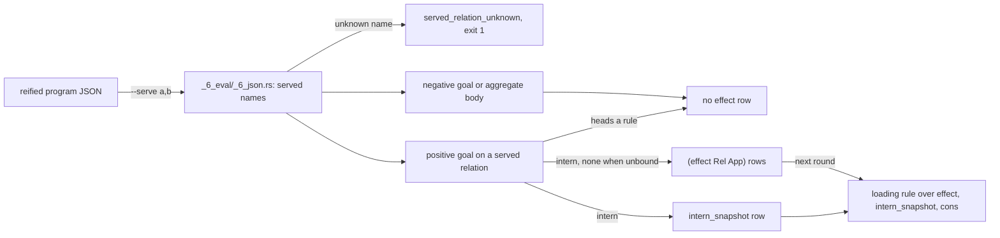

# Effects

Some relations get their rows from a process outside the program. The `effect` kernel relation records every evaluation of a goal on such a relation, and a rule reads that record to act on the goal pattern.

## What an Effect Row Is



The diagram traces one evaluation round: `--serve` decides which relations the outside settles, the goal polarity and rule heads decide whether an `effect` row exists, and the next round's rules read the rows through `intern_snapshot` and `cons`.

## Serving a Relation From Outside

`--serve a,b` on `dl8 eval` or `dl8 run` names the relations the outside settles. Each name resolves against the program's declared names. An unknown name produces the diagnostic `served_relation_unknown` and exit 1. Without the flag, the served set is empty (`src/_6_eval/_6_json.rs:345-366`, `src/bin/dl8.rs:318-323`).

## How the Evaluator Writes the Row

- Every evaluation of a positive goal on a served relation that heads no rule writes one row `(effect Relation Application)`, whether or not a data row matched (`src/_6_eval/_5_evaluate.rs:244-249`, `:261-262`).
- `Application` is the `intern` of the relation over the goal's arguments in position order, with the atom `none` at each unbound position. The evaluator writes the same row to `intern_snapshot`, so a rule can open it (`_5_evaluate.rs:263-276`; `:272-273`, `:826-829`).
- Negative goals and aggregate bodies write no `effect` row (`_5_evaluate.rs:175-180`, `:147-149`).
- `effect` is a kernel relation, arity 2, keys `[0,1]` (`src/_3_check/_5_kernel.rs:29`, `:56`). A goal on `effect` reads the round's new rows the way a current-stratum goal does (`_5_evaluate.rs:341-360`).
- Loading is an ordinary rule over `effect`, `intern_snapshot` and `cons`. A served goal with nothing bound is a source.

## Plan Versus Code

Two plans preceded the built behavior. The table shows each disagreement and the code that settled it.

| plan | code | winner |
|---|---|---|
| `plans/v8/2026-09-14-v8-effect-demand.brief.md:24`: a row only when no row matched | `_5_evaluate.rs:261-262`: every evaluation; the brief's own amendment at `:79` agrees | code |
| `effect-demand.brief.md:79`: every goal on a served relation | `_5_evaluate.rs:246`: not when the served relation heads a rule | code |
| `plans/v8/2026-09-14-v8-store.PLAN.md:906`: `(effect ?Host ?Key ?Rule)` | `_3_check/_5_kernel.rs:29`: arity 2 | code |
| `effect-demand.brief.md:25`: `effect` never enters `KERNEL_RELATIONS` | `_3_check/_5_kernel.rs:29`: it is there; amendment `:84` agrees | code |
| `src/bin/dl8.rs:73` help: "a miss on one writes an `effect` row" | `_5_evaluate.rs:261-262` | code |

## Design Decisions

The design record says any relation is settable from outside; nothing in the program marks a relation as hosted. The outside says what it serves, and loading, failed and ready are ordinary rules (Chris, 2026-09-14, `plans/v8/2026-09-14-v8-effect-demand.brief.md:11`).

Amendment 3, same day: the row is live interest, and its argument list reads back with `intern_snapshot` then `cons` the way `Partial` does (`effect-demand.brief.md:76-81`).

## Deciding When to Use Effects

Use `effect` when:

- A relation's rows come from a process outside the program: `--serve`, `fixtures/host_effect/0_pending.dl7`
- A program shows what is in flight with a loading rule: `fixtures/host_effect/3_loading.dl7`
- A relation has a stream with no request arguments, a source: `fixtures/host_effect/2_source.dl7`

Do not use `effect` when:

- The served relation also heads a rule; no `effect` row is written, `_5_evaluate.rs:246`
- Interest should end when the reading rule stops; rows are never retracted, see [Not built yet](16_not_built.md)
- The program only runs `dl8 eval`; nobody answers the row, use `dl8 run`, see [Executors](11_executors.md)

## Examples

Each example runs the real binary through `book/show.sh`. The `dl7` programs are verbatim copies of the fixtures.

### A settled row and a miss

Fixture: `v8/fixtures/host_effect/1_settled.dl7`

```dl7
; fixture: v8/fixtures/host_effect/1_settled.dl7
; A settled row feeds the reader like any fact; the miss stays for the other url.
(: fetch_json
   (* (: url text)
      (: body text)))

(: Watch (* (: url text)))

(Watch "https://a")

(Watch "https://b")

(fetch_json "https://a" "hello")

(: Body
   (* (: url text)
      (: body text)))

(<- (Body ?Url ?Body)
    (Watch ?Url)
    (fetch_json ?Url ?Body))
```

```console
$ bash book/show.sh eval fixtures/host_effect/1_settled.dl7 --serve fetch_json
(effect fetch_json ref(application(fetch_json, ["https://a" none])))
(effect fetch_json ref(application(fetch_json, ["https://b" none])))
(fetch_json "https://a" "hello")
(Watch "https://a")
(Watch "https://b")
(Body "https://a" "hello")
exit 0
```

Both goals were evaluated, so both have an `effect` row. The fixture's comment says "the miss stays for the other url", which was the first design (`effect-demand.brief.md:47`) before amendment 3.

### Loading as a rule

Fixture: `v8/fixtures/host_effect/3_loading.dl7:21-26`

```dl7
; fixture: v8/fixtures/host_effect/3_loading.dl7:21-26
(: Loading (* (: url text)))

(<- (Loading ?Url)
    (effect fetch_json ?App)
    (intern_snapshot fetch_json ?Args ?App)
    (cons ?Url ?_ ?Args))
```

```console
$ bash book/show.sh eval fixtures/host_effect/3_loading.dl7 --serve fetch_json
(effect fetch_json ref(application(fetch_json, ["https://a" none])))
(effect fetch_json ref(application(fetch_json, ["https://b" none])))
(Watch "https://a")
(Watch "https://b")
(Loading "https://a")
(Loading "https://b")
exit 0
```

### A source, and the same program with nothing served

Fixture: `v8/fixtures/host_effect/2_source.dl7`

```dl7
; fixture: v8/fixtures/host_effect/2_source.dl7
; Nothing is bound, so the whole pattern is free: a source.
(: tick (* (: at int)))

(: Seen (* (: at int)))

(<- (Seen ?At)
    (tick ?At))
```

```console
$ bash book/show.sh eval fixtures/host_effect/2_source.dl7 --serve tick
(effect tick ref(application(tick, [none])))
exit 0
```

```console
$ bash book/show.sh eval fixtures/host_effect/2_source.dl7
exit 0
```

### A name the program does not declare

```console
$ bash book/show.sh eval fixtures/host_effect/0_pending.dl7 --serve fetch_jsonn
diagnostic served_relation_unknown(fetch_jsonn)
exit 1
```

## What Proves It

The table lists the claims, the files that pin them, and the commands that run.

| claim | path | command |
|---|---|---|
| pending, settled, source, loading, unserved | `fixtures/host_effect/*.expected.json`, `tests/_14_host_effect.rs:17-24` | `cargo test --test _14_host_effect` |
| an unknown served name | `tests/_14_host_effect.rs:123` | `cargo test --test _14_host_effect serving_a_name_the_program_does_not_declare_is_a_diagnostic` |
| every declared relation reaches `program.names` | `tests/_14_host_effect.rs:142` | `cargo test --test _14_host_effect every_declared_relation_reaches_the_names_table` |
| the effect branch | `src/_6_eval/_5_evaluate.rs:244-276` | `sed -n 244,276p src/_6_eval/_5_evaluate.rs` |
