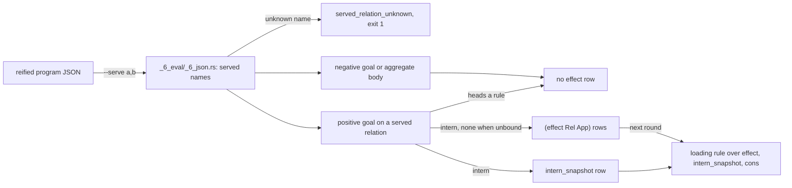

# Effects

## Overview

An effect row marks live interest in a relation that an outside process settles. A program names the relations it wants answered with `--serve`; the evaluator writes an effect row for each goal on one of those relations, and a rule reads the row back to see what is in flight (`src/_6_eval/_5_evaluate.rs:261-262`). This page explains what writes an effect row, how a rule opens one, and when the pattern applies.

## Background

A dl8 program declares relation names. The outside chooses which of them it settles with `--serve a,b` on `dl8 eval` or `dl8 run`. The driver resolves each name against the program's declared names; an unknown name is the diagnostic `served_relation_unknown` and exit 1 (`src/_6_eval/_6_json.rs:345-366`, `src/bin/dl8.rs:318-323`). Without the flag the served set is empty.

The served set is a runtime input. Any relation is settable from outside, nothing in the program marks a relation as hosted, and the outside says what it serves. Loading, failed, and ready are ordinary rules (`plans/v8/2026-09-14-v8-effect-demand.brief.md:11`).

## How it works

The two inputs to the branch are the served set and the shape of the goal.



`effect` is a kernel relation of arity 2 with keys `[0,1]` (`src/_3_check/_5_kernel.rs:29`, `:56`). The evaluator writes one row `(effect Relation Application)` on every evaluation of a positive goal on a served relation that heads no rule, whether or not a stored row matched (`src/_6_eval/_5_evaluate.rs:244-249`, `:261-262`).

`Application` is the `intern` of the relation over the goal's arguments in position order, with the atom `none` at each unbound position (`_5_evaluate.rs:263-276`). The evaluator writes the same row to `intern_snapshot`, so a rule can open it (`:272-273`, `:826-829`). Negative goals and aggregate bodies write no `effect` row (`:175-180`, `:147-149`).

A goal on `effect` reads the round's new rows like a current-stratum goal (`_5_evaluate.rs:341-360`). Loading is an ordinary rule over `effect`, `intern_snapshot`, and `cons`. A served goal with nothing bound is a source.

## Design decisions

The first design notes disagreed with the code on five points. For each, the code states the behavior the fixtures exercise.

| plan | code | winner |
|---|---|---|
| `plans/v8/2026-09-14-v8-effect-demand.brief.md:24`: a row only when no row matched | `_5_evaluate.rs:261-262`: every evaluation; the brief's own amendment at `:79` agrees | code |
| `effect-demand.brief.md:79`: every goal on a served relation | `_5_evaluate.rs:246`: not when the served relation heads a rule | code |
| `plans/v8/2026-09-14-v8-store.PLAN.md:906`: `(effect ?Host ?Key ?Rule)` | `_3_check/_5_kernel.rs:29`: arity 2 | code |
| `effect-demand.brief.md:25`: `effect` never enters `KERNEL_RELATIONS` | `_3_check/_5_kernel.rs:29`: it is there; amendment `:84` agrees | code |
| `src/bin/dl8.rs:73` help: "a miss on one writes an `effect` row" | `_5_evaluate.rs:261-262` | code |

## Tradeoffs

Use it when:

- a relation's rows come from a process outside the program: `--serve`, `fixtures/host_effect/0_pending.dl7`
- a program shows what is in flight: a loading rule, `fixtures/host_effect/3_loading.dl7`
- a stream has no request arguments: a source, `fixtures/host_effect/2_source.dl7`

Do not use it when:

- the served relation also heads a rule: no `effect` row is written (`_5_evaluate.rs:246`)
- interest should end when the reading rule stops: rows are never retracted ([Not built yet](16_not_built.md))
- the program only runs `dl8 eval`: nobody answers the row; use `dl8 run` ([Executors](11_executors.md))

## Example

### A settled row

`v8/fixtures/host_effect/1_settled.dl7`:

```dl7
; A settled row feeds the reader like any fact; the miss stays for the other url.
(: fetch_json
   (* (: url text)
      (: body text)))

(: Watch (* (: url text)))

(Watch "https://a")

(Watch "https://b")

(fetch_json "https://a" "hello")

(: Body
   (* (: url text)
      (: body text)))

(<- (Body ?Url ?Body)
    (Watch ?Url)
    (fetch_json ?Url ?Body))
```

```console
$ bash book/show.sh eval fixtures/host_effect/1_settled.dl7 --serve fetch_json
(effect fetch_json ref(application(fetch_json, ["https://a" none])))
(effect fetch_json ref(application(fetch_json, ["https://b" none])))
(fetch_json "https://a" "hello")
(Watch "https://a")
(Watch "https://b")
(Body "https://a" "hello")
exit 0
```

Both goals were evaluated, so both have an `effect` row. The fixture comment calls the miss on `https://b` one that "stays"; that was the first design (`effect-demand.brief.md:47`), before amendment 3 made the row live interest.

### Loading as a rule

`v8/fixtures/host_effect/3_loading.dl7`:

```dl7
; Loading is an ordinary rule over effect; the pattern opens with
; intern_snapshot then cons, the way Partial reads back in the prelude.
(: fetch_json
   (* (: url text)
      (: body text)))

(: Watch (* (: url text)))

(Watch "https://a")

(Watch "https://b")

(: Body
   (* (: url text)
      (: body text)))

(<- (Body ?Url ?Body)
    (Watch ?Url)
    (fetch_json ?Url ?Body))

(: Loading (* (: url text)))

(<- (Loading ?Url)
    (effect fetch_json ?App)
    (intern_snapshot fetch_json ?Args ?App)
    (cons ?Url ?_ ?Args))
```

```console
$ bash book/show.sh eval fixtures/host_effect/3_loading.dl7 --serve fetch_json
(effect fetch_json ref(application(fetch_json, ["https://a" none])))
(effect fetch_json ref(application(fetch_json, ["https://b" none])))
(Watch "https://a")
(Watch "https://b")
(Loading "https://a")
(Loading "https://b")
exit 0
```

The loading rule reads each effect row, opens the interned application with `intern_snapshot`, and takes the bound argument with `cons`, the way `Partial` reads back (`effect-demand.brief.md:76-81`).

### A source

`v8/fixtures/host_effect/2_source.dl7`:

```dl7
; Nothing is bound, so the whole pattern is free: a source.
(: tick (* (: at int)))

(: Seen (* (: at int)))

(<- (Seen ?At)
    (tick ?At))
```

```console
$ bash book/show.sh eval fixtures/host_effect/2_source.dl7 --serve tick
(effect tick ref(application(tick, [none])))
exit 0
```

```console
$ bash book/show.sh eval fixtures/host_effect/2_source.dl7
exit 0
```

The goal `(tick ?At)` binds nothing when it is evaluated, so the whole pattern is free and the served goal acts as a source; the application holds the single atom `none`. Without `--serve`, no effect row is written.

### An unknown name

```console
$ bash book/show.sh eval fixtures/host_effect/0_pending.dl7 --serve fetch_jsonn
diagnostic served_relation_unknown(fetch_jsonn)
exit 1
```

`fetch_jsonn` is not a declared relation. The driver reports `served_relation_unknown` and exits 1 before evaluation (`src/_6_eval/_6_json.rs:345-366`, `src/bin/dl8.rs:318-323`).

## What proves it

| claim | path | command |
|---|---|---|
| pending, settled, source, loading, unserved | `fixtures/host_effect/*.expected.json`, `tests/_14_host_effect.rs:17-24` | `cargo test --test _14_host_effect` |
| an unknown served name | `tests/_14_host_effect.rs:123` | `cargo test --test _14_host_effect serving_a_name_the_program_does_not_declare_is_a_diagnostic` |
| every declared relation reaches `program.names` | `tests/_14_host_effect.rs:142` | `cargo test --test _14_host_effect every_declared_relation_reaches_the_names_table` |
| the effect branch | `src/_6_eval/_5_evaluate.rs:244-276` | `sed -n 244,276p src/_6_eval/_5_evaluate.rs` |

## Related

- [Executors](11_executors.md): `dl8 run` hands effect rows to a process and inserts the answers.
- [Not built yet](16_not_built.md): effect retraction and the pending and settled tables.
