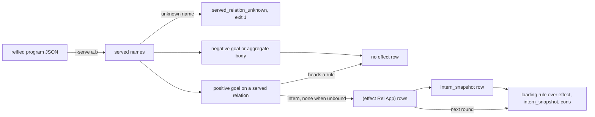

# Effects

A relation whose rows come from outside the program writes an `effect` row on every evaluation of a goal over it (`src/_6_eval/_5_evaluate.rs:244-249`, `:261-262`). The row is live interest, not a failure report. It names the relation and the application the outside is asked to settle. Ordinary rules read the row back, so a program states its own loading, ready and failed states without a hosting annotation in the source (`plans/v8/2026-09-14-v8-effect-demand.brief.md:11`, `:79`).



## Serving a relation

`--serve a,b` on `dl8 eval` or `dl8 run` lists the relations the outside settles (`src/bin/dl8.rs:318-323`, `:351`). Each name resolves against the program's declared names, the module-level `:/4` binds of `root_graph` that `dl8 compile` prints as `program.names` (`tests/_14_host_effect.rs:9-11`, `:142-153`). A name the program does not declare is the diagnostic `served_relation_unknown` and exit 1 (`src/_6_eval/_6_json.rs:353-366`, `src/bin/dl8.rs:318-323`). Without the flag the served set is empty, so no `effect` row is written (`src/_6_eval/_6_json.rs:345-352`, `tests/_14_host_effect.rs:6-8`).

## What the row holds

Every evaluation of a positive goal on a served relation that heads no rule writes one row `(effect Relation Application)`, whether or not a data row matched (`src/_6_eval/_5_evaluate.rs:244-249`, `:261-262`).

`Application` is the `intern` of the relation over the goal's arguments in position order, with the atom `none` at each unbound position (`src/_6_eval/_5_evaluate.rs:263-276`). The same row is written to `intern_snapshot`, which is what lets a rule open the application (`:272-273`, `:826-829`).

## Which goals write no row

Three cases leave the served relation without an `effect` row:

| case | why | code |
|---|---|---|
| the served relation also heads a rule | the rule supplies rows, so the goal is not outside interest | `src/_6_eval/_5_evaluate.rs:246` |
| a negative goal | negation reads stored rows only | `:175-180` |
| an aggregate body | aggregate mode matches stored rows only, no effects | `:147-149` |

## Reading effect rows in a rule

`effect` is a kernel relation of arity 2 with keys `[0,1]` (`src/_3_check/_5_kernel.rs:29`, `:56`). A goal on `effect` reads the round's new rows like a current-stratum goal, so a rule can act on the row in the same evaluation that wrote it (`src/_6_eval/_5_evaluate.rs:341-360`).

Loading is an ordinary rule over `effect`, `intern_snapshot` and `cons`. A served goal with nothing bound is a source: one row, with `none` in every position.

## When a served relation earns an effect row

Use it when:

- a relation's rows come from a process outside the program: `--serve`, fixture `host_effect/0_pending.dl7`
- a program shows what is in flight: a loading rule, fixture `host_effect/3_loading.dl7`
- a stream has no request arguments: a source, fixture `host_effect/2_source.dl7`

Do not use it when:

- the served relation also heads a rule: no `effect` row is written (`src/_6_eval/_5_evaluate.rs:246`)
- interest must end when the reading rule stops: rows are never retracted, [Not built yet](../../../../16_not_built.md)
- the program only runs `dl8 eval`: nothing answers the row, use `dl8 run`, [Executors](../../../../11_executors.md)

## Example: a settled row feeds the reader

Fixture `v8/fixtures/host_effect/1_settled.dl7`:

```dl7
; A settled row feeds the reader like any fact; the miss stays for the other url.
(: fetch_json
   (* (: url text)
      (: body text)))

(: Watch (* (: url text)))

(Watch "https://a")

(Watch "https://b")

(fetch_json "https://a" "hello")

(: Body
   (* (: url text)
      (: body text)))

(<- (Body ?Url ?Body)
    (Watch ?Url)
    (fetch_json ?Url ?Body))
```

```console
$ bash book/show.sh eval fixtures/host_effect/1_settled.dl7 --serve fetch_json
(effect fetch_json ref(application(fetch_json, ["https://a" none])))
(effect fetch_json ref(application(fetch_json, ["https://b" none])))
(fetch_json "https://a" "hello")
(Watch "https://a")
(Watch "https://b")
(Body "https://a" "hello")
exit 0
```

Both goals were evaluated, so both have an `effect` row. The fixture's comment, "the miss stays for the other url", describes the first design (`plans/v8/2026-09-14-v8-effect-demand.brief.md:47`) before amendment 3 made the row live interest (`:76-81`).

Fixture `v8/fixtures/host_effect/3_loading.dl7` adds a loading rule over the same program:

```dl7
; Loading is an ordinary rule over effect; the pattern opens with
; intern_snapshot then cons, the way Partial reads back in the prelude.
(: fetch_json
   (* (: url text)
      (: body text)))

(: Watch (* (: url text)))

(Watch "https://a")

(Watch "https://b")

(: Body
   (* (: url text)
      (: body text)))

(<- (Body ?Url ?Body)
    (Watch ?Url)
    (fetch_json ?Url ?Body))

(: Loading (* (: url text)))

(<- (Loading ?Url)
    (effect fetch_json ?App)
    (intern_snapshot fetch_json ?Args ?App)
    (cons ?Url ?_ ?Args))
```

```console
$ bash book/show.sh eval fixtures/host_effect/3_loading.dl7 --serve fetch_json
(effect fetch_json ref(application(fetch_json, ["https://a" none])))
(effect fetch_json ref(application(fetch_json, ["https://b" none])))
(Watch "https://a")
(Watch "https://b")
(Loading "https://a")
(Loading "https://b")
exit 0
```

## Example: a source, and nothing served

Fixture `v8/fixtures/host_effect/2_source.dl7`:

```dl7
; Nothing is bound, so the whole pattern is free: a source.
(: tick (* (: at int)))

(: Seen (* (: at int)))

(<- (Seen ?At)
    (tick ?At))
```

```console
$ bash book/show.sh eval fixtures/host_effect/2_source.dl7 --serve tick
(effect tick ref(application(tick, [none])))
exit 0
```

The same program with no `--serve` writes no `effect` row and no `Seen` row:

```console
$ bash book/show.sh eval fixtures/host_effect/2_source.dl7
exit 0
```

## Example: a name the program does not declare

```console
$ bash book/show.sh eval fixtures/host_effect/0_pending.dl7 --serve fetch_jsonn
diagnostic served_relation_unknown(fetch_jsonn)
exit 1
```

## Where plan and code disagree

| plan | code | winner |
|---|---|---|
| `plans/v8/2026-09-14-v8-effect-demand.brief.md:24`: a row only when no row matched | `src/_6_eval/_5_evaluate.rs:261-262`: every evaluation; the brief's own amendment at `:79` agrees | code |
| `effect-demand.brief.md:79`: every goal on a served relation | `src/_6_eval/_5_evaluate.rs:246`: not when the served relation heads a rule | code |
| `plans/v8/2026-09-14-v8-store.PLAN.md:906`: `(effect ?Host ?Key ?Rule)` | `src/_3_check/_5_kernel.rs:29`: arity 2 | code |
| `effect-demand.brief.md:25`: `effect` never enters `KERNEL_RELATIONS` | `src/_3_check/_5_kernel.rs:29`: it is there; amendment `:84` agrees | code |
| `src/bin/dl8.rs:73` help: "a miss on one writes an `effect` row" | `src/_6_eval/_5_evaluate.rs:261-262` | code |

## Design history

Chris, 2026-09-14: any relation is settable from outside; nothing in the program marks a relation as hosted. The outside says what it serves, and loading, failed and ready are ordinary rules (`plans/v8/2026-09-14-v8-effect-demand.brief.md:11`).

Amendment 3, same day: the row is live interest, and its argument list reads back with `intern_snapshot` then `cons` the way `Partial` does (`plans/v8/2026-09-14-v8-effect-demand.brief.md:76-81`).

## What proves it

| claim | path | command |
|---|---|---|
| pending, settled, source, loading, unserved | `fixtures/host_effect/*.expected.json`, `tests/_14_host_effect.rs:17-24` | `cargo test --test _14_host_effect` |
| an unknown served name | `tests/_14_host_effect.rs:123` | `cargo test --test _14_host_effect serving_a_name_the_program_does_not_declare_is_a_diagnostic` |
| every declared relation reaches `program.names` | `tests/_14_host_effect.rs:142` | `cargo test --test _14_host_effect every_declared_relation_reaches_the_names_table` |
| the effect branch | `src/_6_eval/_5_evaluate.rs:244-276` | `sed -n 244,276p src/_6_eval/_5_evaluate.rs` |
